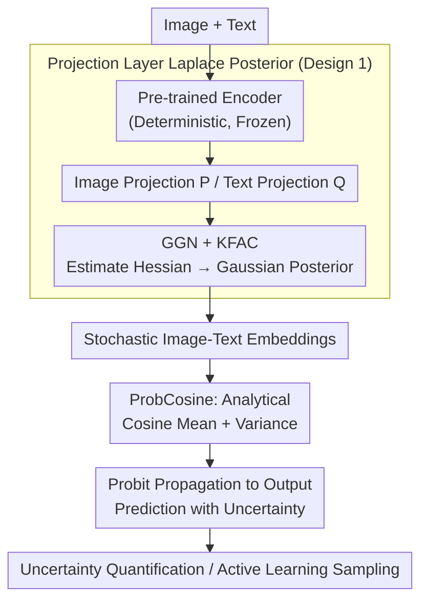

# Post-hoc Probabilistic Vision-Language Models

**Conference**: ICLR 2026  
**arXiv**: [2412.06014](https://arxiv.org/abs/2412.06014)  
**Code**: Available (Project page)  
**Area**: Multimodal VLM / Uncertainty Quantification  
**Keywords**: Vision-Language Models, Uncertainty Quantification, Bayesian Inference, Laplace Approximation, Active Learning

## TL;DR

A training-free post-hoc uncertainty estimation method is proposed, applying Laplace approximation to the final layers of VLMs such as CLIP/SigLIP. By analytically deriving the uncertainty of cosine similarity, it achieves performance significantly superior to baselines in uncertainty quantification and active learning.

## Background & Motivation

- **Background**: Vision-language models (VLMs), such as CLIP and SigLIP, have achieved great success in zero-shot classification, retrieval, and generation tasks. Their core operation involves mapping images and text into a shared latent space and evaluating the match using **cosine similarity**.

- **Limitations of Prior Work**: Such deterministic mappings only output a point estimate, failing to express uncertainty over concepts. When models are deployed to downstream tasks, the domain shift between training and target domains makes predictions unreliable. The model remains unaware of its own "uncertainty"—out-of-distribution (OOD) and ambiguous samples still yield seemingly confident embeddings, making it impossible to distinguish between "certainly correct" and "random guessing." In safety-critical scenarios like medical diagnosis or autonomous driving, the lack of reliable uncertainty signals is critical.

- **Key Challenge**: Existing uncertainty methods are impractical for large-scale VLMs. Temperature calibration only corrects confidence and fails to capture epistemic uncertainty; Monte Carlo Dropout and ensembles require multiple forward passes; training probabilistic VLMs from scratch or fine-tuning adapters requires changing architectures and retraining. Since models like CLIP are trained on billions of image-text pairs, any retraining cost is prohibitively high.

- **Core Idea**: Is it possible to "attach" a post-hoc Bayesian approximation to an off-the-shelf VLM without changing any parameters, thereby analytically measuring the uncertainty of cosine similarity? This is the **Key Insight** of BayesVLM.

## Method

### Overall Architecture

BayesVLM treats a pre-trained CLIP/SigLIP as a black box and only "attaches" a Bayesian approximation to its **two linear projection layers**—the image projection $P$ and text projection $Q$ (the final layers immediately following the image/text encoders that project features into the shared space). Specifically: the feature extractors are kept entirely deterministic/frozen, while the Laplace approximation treats $P$ and $Q$ as Gaussian distributions centered around the pre-trained values. Consequently, image and text embeddings become random variables. The mean and variance of the cosine similarity are then analytically derived via **ProbCosine**. Finally, this distribution is propagated to the output to obtain predictions with uncertainty. The entire process requires no parameter changes to the original model, involving only a lightweight calibration based on Hessian estimation.

### Key Designs

**1. Laplace Posterior on Two Projection Layers: Compressing Bayesian costs to P and Q**

To enable the model to express uncertainty, weights must be represented as a distribution rather than a fixed value. However, applying Laplace approximation to the entire VLM would cause the Hessian scale to explode. BayesVLM chooses to keep the massive feature extractor deterministic and treats only the image projection $P$ and text projection $Q$ as stochastic. Using Laplace approximation for second-order expansion around the pre-trained values yields a Gaussian posterior $p(\theta \mid D) \approx \mathcal{N}(\theta^*, \Sigma)$. Here $\theta^*$ is taken directly from pre-trained weights (equivalent to MAP), and the covariance comes from the inverse Hessian. To make the Hessian computable, the paper uses Generalised Gauss-Newton (GGN) approximation—where the Jacobian of linear projection layers has a closed-form solution—combined with Kronecker factorization (KFAC). This represents the Hessian as the Kronecker product of two small matrices, preserving richer posterior structure than diagonal approximation while being much cheaper than a full matrix. Choosing projection layers concentrates uncertainty on the most critical step while remaining computationally affordable for downstream adaptation.

**2. ProbCosine: Analytical derivation of cosine similarity mean and variance without sampling**

The VLM score is the cosine similarity $s = \frac{f_I \cdot f_T}{\lVert f_I \rVert \lVert f_T \rVert}$ of image and text embeddings. Once $P$ and $Q$ become Gaussian random variables, embeddings $f_I, f_T$ and $s$ also become random variables. The most direct approach is Monte Carlo—sampling projection weights repeatedly for forward passes—but this is expensive and introduces sampling noise. The paper proposes ProbCosine: given Gaussian approximations of embedding dimensions (diagonal covariance), it analytically derives the expectation and variance of the cosine similarity distribution. A single forward pass yields uncertainty, saving computation and avoiding estimation noise.

**3. Post-hoc Probit Output Propagation: Plug-and-play classification uncertainty**

The method is post-hoc—no fine-tuning or architecture changes are required. Only a one-time calibration on small data is needed to estimate KFAC factors for the Hessian. Post-calibration model parameters remain identical to original weights, so classification/retrieval performance is preserved. The final step propagates the Gaussian distribution of cosine similarity to the output: using probit approximation on the softmax/classification probabilities yields calibrated uncertainty for predicted classes. This "zero-parameter-modification + analytical propagation" allows it to be directly applied to CLIP or SigLIP without retraining costs.

### Loss & Training

The method introduces no training loss. The calibration phase uses GGN + KFAC on a small dataset to estimate the Kronecker factors of the projection layer Hessian. During inference, a single forward pass generates embeddings, followed by ProbCosine to analytically calculate the mean and variance of cosine similarity, and finally probit approximation for output uncertainty.

## Key Experimental Results

### Main Results

The effectiveness is verified in two primary application scenarios:

**Uncertainty Quantification**

| Setting | Metric | BayesVLM | Deterministic Baseline | Gain |
|------|------|---------|----------|------|
| ID Data | Calibration Error (ECE) | Significantly Improved | Overconfident | Better Calibration |
| OOD Detection | AUROC | Marked Increase | No Uncertainty | OOD Recognition |
| Domain Shift | Reliability | More Robust | Performance Drop | Reliable Signals |

**Active Learning**

| Dataset | Metric | BayesVLM | Random Sampling | Other Baselines |
|--------|------|---------|---------|---------|
| Downstream Tasks | Sample Efficiency | **Highest** | Baseline | Moderate |
| Limited Budget | Accuracy | **Optimal** | Poor | Sub-optimal |

### Ablation Study

| Configuration | Key Metrics | Description |
|------|---------|------|
| Layers Processed | Uncertainty Quality | Good results achieved with only final 1-2 layers |
| Fisher Approx | Calibration Quality | Diagonal is sufficient; KFAC performs better |
| VLM Backbones | Generality | Effective on both CLIP and SigLIP |

### Key Findings

- **Well-Calibrated**: The uncertainty estimates provided by BayesVLM show high calibration—the model is indeed more likely to be wrong when it reports low confidence.
- **Interpreability**: Uncertainty estimates are intuitively interpretable—ambiguous or OOD samples receive higher uncertainty scores.
- **Efficient Active Learning**: Uncertainty-based sample selection significantly outperforms random sampling, proving valuable under labeling budget constraints.
- **Preserved Performance**: As a post-hoc method, it does not modify parameters or degrade original classification/retrieval performance.
- **Computationally Efficient**: Analytical derivation avoids Monte Carlo sampling, resulting in minimal inference overhead.

## Highlights & Insights

- **Precise Problem Selection**: VLM uncertainty estimation is an overlooked but crucial problem, especially for safety-critical applications.
- **Simple Design**: No retraining, no architecture changes, and no heavy extra computation—truly "plug-and-play."
- **Theoretical-Practical Balance**: Leverages the solid theoretical foundation of Laplace approximation while ensuring computational efficiency through analytical derivation.
- **Probabilistic Cosine Similarity**: Transforming deterministic cosine similarity into a stochastic variable is an elegant theoretical contribution.
- **Diverse Applications**: Demonstrates value in both uncertainty quantification and active learning scenarios.

## Limitations & Future Work

- **Approximation Quality**: Laplace approximation assumes a Gaussian posterior, which might be inaccurate in high-dimensional spaces.
- **Last Layers Only**: Ignoring uncertainty propagation in deeper VLM layers might underestimate total uncertainty.
- **Fisher Computation**: For extremely large models, even diagonal approximation may incur some computational overhead.
- **Evaluation Benchmarks**: Lack of unified standards for uncertainty estimation leads to potential performance variance across datasets.
- **Task Scope**: Applicability to generative VLMs (e.g., LLaVA, GPT-4V) has not yet been verified.
- **Autoregressive Architectures**: The method suits dual-encoder architectures like CLIP; extensions for autoregressive VLMs are needed.

## Related Work & Insights

- **CLIP** (Radford et al., 2021): The representative deterministic VLM and primary application target.
- **SigLIP** (Zhai et al., 2023): Improved CLIP using Sigmoid loss, also compatible with this method.
- **Laplace Approximation**: A classic Bayesian approximation regaining attention (Laplace Redux, Daxberger et al., 2021).
- **Monte Carlo Dropout** (Gal & Ghahramani, 2016): Approximates Bayesian inference via Dropout but requires multiple forward passes.
- **Probabilistic Embeddings** (Kirchhof et al., 2023): Models embeddings as distributions but requires retraining.
- **Active Learning** (Settles, 2009): Uncertainty-based selection is a classic strategy.

**Insight**: Post-hoc methods are a pragmatic path for introducing Bayesian uncertainty into large-scale pre-trained models. This approach can be generalized to other pre-trained models (e.g., LLMs, audio models). Probabilistic cosine similarity may lead to new uncertainty-aware retrieval and matching algorithms.

## Rating

- Novelty: ⭐⭐⭐⭐ — While Laplace approximation is established, the analytical derivation for VLM cosine similarity is a new contribution.
- Experimental Thoroughness: ⭐⭐⭐⭐ — Validated across UQ and active learning with multiple VLM backbones.
- Writing Quality: ⭐⭐⭐⭐ — Clear theoretical derivation and concise methodology.
- Value: ⭐⭐⭐⭐ — Addresses practical needs in VLM deployment with broad prospects for safety-critical applications.

<!-- RELATED:START -->

## Related Papers

- [\[CVPR 2026\] Bias Is a Subspace, Not a Coordinate: A Geometric Rethinking of Post-hoc Debiasing in Vision-Language Models](../../CVPR2026/multimodal_vlm/bias_is_a_subspace_not_a_coordinate_a_geometric_rethinking_of_post-hoc_debiasing.md)
- [\[ICLR 2026\] Revisiting Multimodal Positional Encoding in Vision-Language Models](revisiting_multimodal_positional_encoding_in_visionlanguage_models.md)
- [\[ICLR 2026\] Visual Jigsaw Post-Training Improves MLLMs](visual_jigsaw_post-training_improves_mllms.md)
- [\[ICLR 2026\] Pay Less Attention to Function Words for Free Robustness of Vision-Language Models](pay_less_attention_to_function_words_for_free_robustness_of_vision-language_mode.md)
- [\[ICLR 2026\] Flatness-Guided Test-Time Adaptation for Vision-Language Models](flatness_guided_test-time_adaptation_for_vision-language_models.md)

<!-- RELATED:END -->
