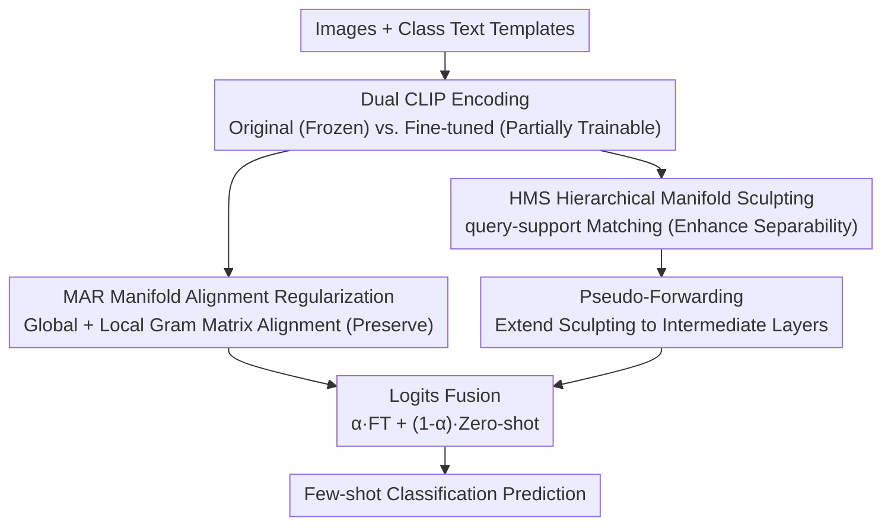

# Preserve and Sculpt: Manifold-Aligned Fine-tuning of Vision-Language Models for Few-Shot Learning

**Conference**: ICLR 2026  
**OpenReview**: [https://openreview.net/forum?id=ZGJJF1e2u0](https://openreview.net/forum?id=ZGJJF1e2u0)  
**Code**: https://github.com/kaderxon/MPS-Tuning  
**Area**: Multimodal VLM  
**Keywords**: CLIP, Few-shot Fine-tuning, Semantic Manifold, Gromov-Wasserstein, Contrastive Learning

## TL;DR
This paper treats the CLIP feature space as a "semantic manifold." During few-shot fine-tuning, it constrains the intrinsic geometry of the manifold using Gram matrix alignment to prevent destruction (Preserve) while simultaneously enhancing separability by pulling intra-class samples closer and pushing inter-class samples apart via multimodal query-support matching (Sculpt). This approach improves the few-shot classification SOTA by approximately 1-2.5 percentage points across 11 datasets.

## Background & Motivation

**Background**: Vision-Language Models (VLMs) like CLIP are pre-trained on large-scale image-text pairs using contrastive learning, creating a joint embedding space where image and text semantics are aligned—e.g., image representations of a "cat" fall near the "feline" text representation and far from "truck." To transfer this zero-shot power to downstream few-shot classification, two main paths exist: Parameter-Efficient Fine-tuning (PEFT), such as prompt-based CoOp or adapter-based CLIP-Adapter, which limits trainable parameters to suppress overfitting; and consistency constraints, such as PromptSRC, which force features/logits of each sample to remain consistent before and after fine-tuning.

**Limitations of Prior Work**: Both paths regularize image data as **isolated points**. PEFT indirectly limits modifications by freezing most parameters, which restricts flexibility and suppresses learning capacity. Consistency constraints focus only on the representation of individual samples. Both ignore the **overall geometric structure** of the data distribution—the relative relationships between samples.

**Key Challenge**: In few-shot scenarios, standard fine-tuning is highly prone to "semantic structure collapse"—limited samples lead to catastrophic forgetting of pre-trained representations, causing a sharp degradation in generalization. The root cause is that existing regularizations are either too restrictive (impeding the learning of new knowledge) or focus only on single points (failing to manage global manifold geometry), making it impossible to simultaneously "preserve the pre-trained geometric prior" and "enhance discriminative power for downstream tasks."

**Key Insight**: The authors no longer view features as discrete points but treat the entire feature distribution as a continuous **semantic manifold**. The manifold geometry learned by pre-trained CLIP encodes rich prior knowledge; as long as the intrinsic geometry of this manifold is not destroyed during fine-tuning, the prior knowledge is preserved. The natural tool for measuring the difference in geometric structure between two metric spaces is the Gromov-Wasserstein (GW) distance, which compares internal pairwise distance relationships rather than specific coordinates, making it naturally invariant to isometric transformations (rotation, translation, or re-labeling).

**Core Idea**: A dual approach of "Preserve + Sculpt" is proposed. Preserve: Constrain the GW distance of the manifold before and after fine-tuning. Since GW is NP-hard, the authors prove that the $L_p$ norm of the Gram matrix difference is a solvable upper bound of the GW distance, transforming it into an efficient regularization term. Sculpt: Actively enhance inter-class separability of the manifold via multimodal query-support matching, extending this to intermediate layers for further refinement.

## Method

### Overall Architecture

MPS-Tuning (Manifold-Preserving and Sculpting Tuning) optimizes two objectives simultaneously during CLIP fine-tuning. Inputs are images and class text templates ("a photo of a [CLASS]"), passing through a vision encoder $E_V$ (partially trainable) and a frozen text encoder $E_T$. During fine-tuning, one "Original CLIP" is frozen as a reference, while one "Fine-tuned CLIP" is updated. Two main branches collaborate: **Manifold Alignment Regularization (MAR)** aligns the Gram matrices of both models at the batch and token levels to "pin" the manifold geometry (Preserve); **Hierarchical Manifold Sculpting (HMS)** performs contrastive matching between image queries and image-text support sets to actively pull intra-class samples closer and push inter-class samples apart (Sculpt), extending this from the output layer to intermediate layers via **Pseudo-Forwarding**. Final predictions are a weighted fusion of fine-tuned and zero-shot outputs.

### Key Designs

**1. Manifold Alignment Regularization (MAR): Approximating the GW Distance Upper Bound via Gram Matrix Difference**

The challenge is that directly constraining the GW distance between manifolds before and after fine-tuning is theoretically ideal but requires solving a non-convex quadratic program reducible to an NP-hard quadratic assignment problem. The authors' key step is **fixed coupling**: since the same sample in the original and fine-tuned models has a natural one-to-one correspondence, the coupling matrix $\pi$ to be optimized in GW is fixed to this natural correspondence. Consequently, the NP-hard optimization collapses into a closed-form upper bound. The paper provides a theorem stating that Gram matrix alignment under the $L_p$ norm is an approximate upper bound for the $p$-th order GW distance. MAR performs alignment at two scales. **Global Topology Alignment** preserves relative relationships between samples: for $N$ normalized [CLS] features in a batch, original and fine-tuned Gram matrices $S_{ij} = \langle z_i, z_j \rangle$ and $S'_{ij} = \langle z'_i, z'_j \rangle$ are calculated, with loss:

$$\mathcal{L}^{global}_{MAR}=\frac{1}{N^2}\sum_{i=1}^{N}\sum_{j=1}^{N}|S_{ij}-S'_{ij}|_1$$

**Local Geometry Alignment** preserves the internal structure of a single sample: for the $i$-th sample, its [CLS] token and $M$ patch tokens are collected to align intra-sample $(M+1) \times (M+1)$ Gram matrices, with loss:

$$\mathcal{L}^{local}_{MAR}=\frac{1}{N}\sum_{i=1}^{N}\left(\frac{1}{(M+1)^2}\sum_{k=0}^{M}\sum_{l=0}^{M}|S^{intra}_{i,kl}-S'^{intra}_{i,kl}|_1\right)$$

The total loss is $\mathcal{L}_{MAR} = \mathcal{L}^{global}_{MAR} + \mathcal{L}^{local}_{MAR}$. Unlike PromptSRC, which forces individual sample features to remain stagnant, MAR constrains the relationship matrices **between** samples and **between** tokens—allowing points to translate or rotate as long as relative geometry is maintained. This marks the first introduction of GW distance theory into VLM fine-tuning.

**2. Hierarchical Manifold Sculpting (HMS): Actively Enhancing Inter-class Separability**

Preserving shape alone might "freeze" the manifold, preventing the learning of downstream discriminative knowledge. HMS models this as a query-support matching task: let normalized image features $Q=\{q_1, \dots, q_N\}$ be queries, and frozen text embeddings $T=\{t_1, \dots, t_K\}$ combined with images form the support set $S=Q \cup T$. Positive samples are defined by class identity—image-text and image-image pairs of the same class are positive matches. To counter the scarcity of visual positive samples in few-shot batches, two views are generated per image via data augmentation. The sculpting loss performs contrastive learning for each query and its positives:

$$\mathcal{L}^{query}_{sculpt}(q,S)=-\frac{1}{|P_q|}\sum_{s\in P_q}\log\frac{\exp(\langle q,s\rangle)/\tau'}{\sum_{s'\in S\setminus q}\exp(\langle q,s'\rangle)/\tau'}$$

where $P_q$ is the set of positive samples for query $q$. The batch loss is $\mathcal{L}_{sculpt}(Q,S) = \mathbb{E}_{q \in Q}[\mathcal{L}^{query}_{sculpt}(q, S)]$. The key difference from standard contrastive fine-tuning is that it operates under the "Preserve" constraint of MAR, ensuring that while intra-class samples are clustered and inter-class samples are separated, the overall manifold geometry is not disrupted.

**3. Pseudo-Forward: Extending Sculpting to Intermediate Layers**

Sculpting only at the final output layer is insufficient. The authors aim to refine intermediate features, but these features $z'^{(l)}$ are semantically incompatible with text embeddings. Pseudo-Forwarding **skips all subsequent attention modules** and retains only necessary layer-wise transformations (FFN and value projections) to "fast-forward" intermediate features into the final output space:

$$\hat{z}'^{(l)}=\text{FFN}^{(L)}\circ V^{(L)}_{Proj}\circ\dots\circ\text{FFN}^{(l+1)}\circ V^{(l+1)}_{Proj}(z'^{(l)})$$

These projection layers share parameters with the backbone, incurring almost no extra overhead. Mapped intermediate features can then align with text embeddings for sculpting. The total HMS loss aggregates sculpting from the output layer and specified intermediate layers:

$$\mathcal{L}_{HMS}=\mathcal{L}_{sculpt}(\hat{Q},\hat{S})+\sum_{l\in L_{blocks}}\mathcal{L}_{sculpt}(Q^{(l)},S^{(l)})$$

Experiments show that applying HMS to the last two layers (output + second-to-last) yields the best results.

**4. Zero-shot-FT Logits Fusion: Retaining Robust Predictions**

To further hedge against few-shot overfitting, the final logits during training and inference are a weighted sum of fine-tuned and original zero-shot outputs:

$$logits=\alpha\cdot logits_{ft}+(1-\alpha)\cdot logits_{zs}$$

The parameter $\alpha$ (set to 0.3 in experiments) controls the balance, favoring conservative zero-shot outputs. This serves as an additional safeguard alongside MAR/HMS.

### Loss & Training

The total loss combines cross-entropy with the two regularization terms: $\mathcal{L}=\mathcal{L}_{CE}+\lambda_1\mathcal{L}_{MAR}+\lambda_2\mathcal{L}_{HMS}$. The backbone is CLIP ViT-B/16, trained on $K$-shot ($K=1,2,4,8,16$) settings and evaluated on full test sets. Using an SGD optimizer with cosine learning rate decay, the model is trained for 50 epochs, with a linear warm-up from 1e-5 to 0.002 in the first epoch. Hyperparameters are $\lambda_1=0.5, \lambda_2=0.1, \alpha=0.3$. Due to the strong knowledge retention of MAR, the authors can **directly fine-tune partial model weights** (rather than just adapters/prompts) without overfitting, significantly increasing learning capacity.

## Key Experimental Results

### Main Results

Average gains in few-shot classification across 11 datasets (relative to the strongest baseline):

| Setting | Gain relative to strongest baseline | Note |
|------|------|------|
| 1-shot | +0.88% | Advantage evident even with minimal samples |
| 4-shot | +1.27% | Gap widens as samples increase |
| 16-shot | +2.51% | Learning capacity advantage is most significant |

ImageNet Domain Generalization (Train on ImageNet, test on variants):

| Method | Source (ImageNet) | -Sketch | -V2 | Avg |
|------|------|------|------|------|
| CLIP (Zero-shot) | 66.73 | 46.15 | 60.83 | 57.90 |
| PromptSRC | 73.17 | 49.10 | 65.70 | 62.66 |
| AMU-Tuning | 74.93 | 50.37 | 65.42 | 63.57 |
| TAC | 73.67 | 48.93 | 66.23 | 62.94 |
| **Ours (MPS-Tuning)** | **75.60** | 50.10 | **67.53** | **64.41** |

Ours achieves the best performance on the Source and ImageNet-V2, with an Avg 0.84 points higher than the runner-up AMU-Tuning.

### Ablation Study

Contribution of components (16-shot, Avg11 refers to the mean across 11 datasets):

| Configuration | ImageNet | Cars | SUN397 | Avg11 |
|------|------|------|------|------|
| $\mathcal{L}_{CE}$ only | 72.93 | 90.00 | 76.30 | 85.41 |
| + $\mathcal{L}_{MAR}$ | 75.30 | 90.80 | 78.07 | 86.44 |
| + $\mathcal{L}_{HMS}$ | 74.77 | 90.77 | 77.80 | 86.20 |
| Full (CE+MAR+HMS) | **75.60** | **91.13** | **78.47** | **86.85** |

Internal ablation of MAR (16-shot Avg11): None 86.20 → Global only 86.57 → Local only 86.67 → Global+Local 86.85, demonstrating that both global and local components are essential.

### Key Findings

- **MAR contributes more significantly**: Adding MAR alone increases Avg11 from 85.41 to 86.44 (+1.03), while HMS alone reaches 86.20 (+0.79), indicating that "preserving manifold geometry" is the primary source of gain. Their combination yields 86.85, showing synergistic effects.
- **MAR outweighs point-wise consistency**: In comparisons with various consistency constraints, MAR (Global+Local) outperforms feature-based cos/$\ell_1$/$\ell_2$ and logit-based KL across 1/4/16-shot Avg11, validating that "constraining relationship matrices" is more effective than "constraining individual points."
- **Gains scale with sample size**: The improvement grows from +0.88% at 1-shot to +2.51% at 16-shot, suggesting that MPS's robust knowledge retention allows for direct fine-tuning of backbone weights to exploit more data without overfitting.
- **Comparable efficiency**: On SUN397, training speed is 95.65 FPS and inference is 535 FPS, which is on par with TCP and TextRefiner, indicating no significant overhead.

## Highlights & Insights

- **Simplifying NP-hard GW distance into an optimizable Gram matrix difference**: By "fixing natural coupling" to freeze the coupling matrix, the authors derive a GW upper bound. This retains the theoretical essence of comparing intrinsic geometry while remaining computationally feasible—the most ingenious step in the paper.
- **"Preserve + Sculpt" as complementary forces**: Preservation (MAR) prevents forgetting, while Sculpting (HMS) promotes discrimination. One pulls back while the other pushes forward, successfully navigating the trade-off in high-collapse few-shot scenarios.
- **Pseudo-Forwarding enables intermediate layer alignment**: By skipping attention and using FFN/value projections to fast-forward intermediate features, the model applies contrastive supervision to deep layers at minimal cost. This trick is transferable to other multi-layer multimodal alignment tasks.
- **Gram matrix as a "Relationship Fingerprint"**: Constraining the inner product matrix between samples/tokens instead of individual points is naturally invariant to isometric transformations, providing a clean, reusable regularization paradigm for preserving pre-trained geometry.

## Limitations & Future Work

- The paper uses a **fixed coupling upper bound approximation** of the GW distance; while theoretical appendices discuss the tightness of this bound, there is a lack of empirical quantitative analysis regarding its approximation quality in various scenarios.
- Hyperparameters ($\lambda_1, \lambda_2, \alpha$, and HMS layers) are fixed values tuned on specific datasets; the necessity for re-searching or sensitivity when crossing domains is not extensively analyzed.
- Sculpting relies on data augmentation to supplement visual positive samples. In extreme 1-shot cases, positive samples remain scarce, which is why HMS gains are smaller than MAR. Improving "sculpting" with minimal samples remains an open area.
- The method is validated using CLIP ViT-B/16. Its portability to larger models or non-contrastive VLMs (e.g., generative VLMs) is not addressed.

## Related Work & Insights

- **vs. PEFT (CoOp / CLIP-Adapter / Tip-Adapter)**: These rely on freezing most parameters to suppress overfitting at the cost of learning capacity. This paper uses explicit manifold geometry regularization instead of "parameter count limits," allowing for direct backbone fine-tuning with higher flexibility and performance ceilings.
- **vs. Consistency Constraints (PromptSRC)**: PromptSRC uses feature-level $\ell_1$ and logit-level KL to force individual samples to stay unchanged, which is a **point-wise** constraint. The proposed approach constrains Gram relationship matrices, representing a **geometric/relational** constraint, which consistently performs better.
- **vs. Classic GW Distance Usage**: GW is traditionally used for graph matching or domain adaptation where metric space structures must be compared, but it is difficult to optimize due to its NP-hard nature. This paper applies the "fixed coupling for upper bound" strategy to VLM fine-tuning, offering a theoretically grounded and engineering-ready template for "preserving pre-trained geometry during migration."

## Rating
- Novelty: ⭐⭐⭐⭐⭐ First introduction of GW distance to VLM fine-tuning via a simplified Gram alignment regularization; both theory and method are novel.
- Experimental Thoroughness: ⭐⭐⭐⭐ 11 datasets + domain generalization + multiple ablations, though HMS gain and approximation tightness analysis in extreme few-shot cases could be deeper.
- Writing Quality: ⭐⭐⭐⭐ Clear narrative of "Preserve + Sculpt," with theorems and proof sketches provided.
- Value: ⭐⭐⭐⭐⭐ Provides a reusable "matrix-based geometric relationship constraint" paradigm for few-shot VLM migration with comparable efficiency.

<!-- RELATED:START -->

## Related Papers

- [\[ICLR 2026\] Exploring Cross-Modal Flows for Few-Shot Learning](exploring_cross-modal_flows_for_few-shot_learning.md)
- [\[ICLR 2026\] pFedMMA: Personalized Federated Fine-Tuning with Multi-Modal Adapter for Vision-Language Models](pfedmma_personalized_federated_fine-tuning_with_multi-modal_adapter_for_vision-l.md)
- [\[ICLR 2026\] Memory-Free Continual Learning with Null Space Adaptation for Zero-Shot Vision-Language Models](memory-free_continual_learning_with_null_space_adaptation_for_zero-shot_vision-l.md)
- [\[ICCV 2025\] Interpretable Zero-Shot Learning with Locally-Aligned Vision-Language Model](../../ICCV2025/multimodal_vlm/interpretable_zero-shot_learning_with_locally-aligned_vision-language_model.md)
- [\[ICLR 2026\] Enhanced Continual Learning of Vision-Language Models with Model Fusion](enhanced_continual_learning_of_vision-language_models_with_model_fusion.md)

<!-- RELATED:END -->
