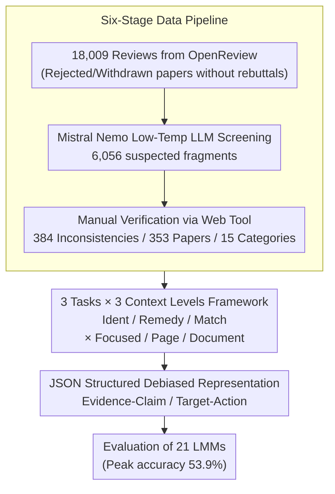

# PRISMM-Bench: A Benchmark of Peer-Review Grounded Multimodal Inconsistencies

**Conference**: ICLR 2026  
**arXiv**: [2510.16505](https://arxiv.org/abs/2510.16505)  
**Code**: [Project Page](https://da-luggas.github.io/prismm-bench/)  
**Area**: Multimodal Evaluation / Scientific Documents  
**Keywords**: Multimodal Consistency, Peer Review, Scientific Papers, LMM Benchmark, JSON Debiasing

## TL;DR

Ours constructs PRISMM-Bench, the first scientific paper multimodal inconsistency benchmark grounded in real-world reviewer annotations. By mining 384 cross-modal inconsistencies from 18,009 ICLR open reviews, it designs Identifier/Remedy/Matching tasks and proposes a JSON-structured debiased answer representation. Evaluation of 21 top-tier LMMs shows a peak performance of only 53.9%, systematically exposing severe deficiencies in current models regarding cross-modal reasoning in scientific documents.

## Background & Motivation

**Background**: Large Multimodal Models (LMMs) are increasingly utilized for scientific research assistance, such as chart interpretation, paper summarization, and error detection. However, the core question remains: Can LMMs truly understand and reason through the complex multimodal structures—spanning text, figures, and formulas—found in scientific papers?

**Limitations of Prior Work**:
- Existing document QA benchmarks (DocVQA, ChartQA, etc.) isolate single modalities, neglecting the cross-modal dependencies between text, figures, and formulas.
- Synthetic datasets (e.g., MMIR) inject manual errors, which are often too obvious and fail to represent the subtle, domain-knowledge-driven inconsistencies found in the real world.
- Multiple-choice evaluations suffer from severe language bias; models can achieve accuracies far exceeding random guessing by looking at options alone without context (e.g., Gemini 2.5 Flash reaching 57.6% without context).

**Key Challenge**: There is a need for a benchmark that is both "authentic" and "systematic" to evaluate cross-modal reasoning. However, real inconsistencies are scarce, scattered, and costly to verify, while evaluations themselves are often contaminated by linguistic shortcuts.

**Goal**: (1) How to systematically collect authentic cross-modal inconsistencies? (2) How to design fair and unbiased evaluation tasks?

**Key Insight**: Utilize open peer reviews. Inconsistencies flagged by reviewers in real papers serve as both expert-level annotations and naturally occurring, unpredictable real-world errors.

**Core Idea**: Reviewers' critical comments provide the best test questions for multimodal reasoning.

## Method

### Overall Architecture

PRISMM-Bench is not synthesized but "mined" from real peer reviews. The pipeline involves three stages: first, crawling 18,009 reviews from ICLR 2024/2025 via OpenReview, followed by coarse screening using a Large Language Model (LLM) and manual verification to extract 384 reviewer-flagged inconsistencies. These are then formatted into three difficulty-tiered multiple-choice tasks with three levels of context granularity. Finally, a JSON-structured answer representation is used to eliminate linguistic shortcuts, ensuring a fair evaluation. The three steps correspond to the key designs below: data mining, task structuring, and answer debiasing.

### Key Designs

**1. Six-Stage Data Pipeline: Transforming Reviewer Negatives into Verifiable Annotations**

Authentic cross-modal inconsistencies are rare and verified at a high cost. Ours uses a six-stage refinement. Stage one scrapes 18,009 reviews from ICLR 2024/2025, specifically targeting rejected/withdrawn papers without rebuttals to ensure inconsistencies were not subsequently fixed. Stage two uses Mistral Nemo with low temperature to filter 6,056 fragments potentially mentioning inconsistencies. Stage three involves manual verification via a customized Web tool to annotate inconsistency types, involved modalities, and location metadata. This "machine screening + human annotation" design makes rare expert annotations scalable and avoids the "obvious error" pitfall of synthetic data.

**2. 3 Tasks × 3 Context Levels Evaluative Framework: Covering the Spectrum from "Detection" to "Remedy"**

To capture various levels of scientific document understanding, ours designs three 4-choice tasks with increasing difficulty. Inconsistency Identification (Ident, 384 questions) asks "what is inconsistent" given paper context; Inconsistency Remedy (Remedy, 384 questions) asks "what action is needed to fix it," requiring deeper reasoning; Pair Matching (Match, 192 questions) provides a visual element and asks to identify its conflicting counterpart from four options. Each task is evaluated at three granularities—Focused (key fragments), Page (144 DPI full page), and Document (entire paper stitched into 5 images)—transitioning from "noise-free" to "highly distracted."

**3. JSON Structured Debiased Answer Representation: Eliminating Language Shortcuts via Uniform Structure**

LMMs often outperform random guessing by exploiting stylistic cues in options (e.g., Gemini 2.5 Flash at 57.6% without context). Ours rewrites natural language answers into structured JSON: Ident uses an **Evidence–Claim** format, and Remedy uses a **Target–Action** format. This preserves semantic elements while erasing stylistic variance. To quantify reliance on visual evidence, the Visual Dependence Ratio is defined as:

$$R = \frac{Acc_{\text{with\_context}} - Acc_{\text{without\_context}}}{1 - Acc_{\text{without\_context}}}$$

A higher $R$ indicates the model relies more on visual context than guessing. After debiasing, human $R$ reaches 69.0%, while the best model reaches only 53.5%, revealing that model "visual reasoning" is often a façade for language shortcuts.

## Key Experimental Results

### Main Results: Benchmark of 21 LMMs (Accuracy %)

| Model | Params | Ident-Focused | Remedy-Focused | Match | Ident-Page | Ident-Doc | Average |
|------|:---:|:---:|:---:|:---:|:---:|:---:|:---:|
| Gemma 3 4B | 4B | 27.9 | 29.9 | 39.6 | 25.0 | 26.6 | 27.8 |
| InternVL3.5 8B (R) | 8B | 49.5 | 35.9 | 45.8 | 38.3 | 36.7 | 37.7 |
| Ovis2 34B | 34B | 50.0 | 41.1 | 37.0 | 40.6 | 33.3 | 38.7 |
| GLM 4.5V 106B (R) | 106B | 51.8 | 43.2 | 52.1 | 45.8 | 40.9 | 42.6 |
| GPT-5 minimal (R) | — | 53.6 | 43.5 | 63.0 | 47.1 | 40.9 | 44.0 |
| Gemini 2.5 Pro (R) | — | 65.9 | 61.2 | 66.7 | 54.7 | 39.8 | 52.8 |
| **GPT-5 high (R)** | — | **63.8** | **54.4** | **70.3** | **58.1** | **46.9** | **53.9** |

### Ablation Study: Impact of Disabling CoT (Ident-Focused)

| Model | Reasoning On | Reasoning Off | Decrease |
|------|:---:|:---:|:---:|
| GLM 4.5V 106B | 51.8% | 43.2% | -16.6% |
| InternVL3.5 8B | 49.5% | 40.6% | -18.0% |
| InternVL3.5 38B | 54.4% | 40.4% | **-25.7%** |

### Ablation Study: JSON Debiasing Effects (User Study Subset)

| Model | NL w/o Context | JSON w/o Context | Visual Dep. R(NL) | Visual Dep. R(JSON) |
|------|:---:|:---:|:---:|:---:|
| InternVL3.5 38B | 53.7% | **25.3%** | 22.5 | 38.1 |
| Gemini 2.5 Pro | 70.1% | **37.3%** | 43.8 | 45.2 |
| Human | **27.5%** | — | **69.0** | — |

### Key Findings

- Even the strongest model, GPT-5 (high), achieves only 53.9%, showing a massive gap toward becoming a reliable scientific assistant.
- Performance drops consistently from Focused → Page → Document, indicating long-document interference is a critical bottleneck.
- Remedy scores are systematically lower than Ident, suggesting "remedying" requires deeper reasoning than "detection."
- Chain-of-Thought (CoT) reasoning boosts performance by 5-14 percentage points on average.
- 17% of ICLR 2025 submissions contain at least one reviewer-flagged inconsistency, highlighting the ubiquity of the problem.
- High-resolution specialized models (VILA HD 4K, InternLM XC 2.5) show no significant advantage in extended contexts.

## Highlights & Insights

- **Data Philosophy of "Reviewer Negatives as Test Sets"**: Rather than injecting artificial errors, the benchmark leverages issues naturally discovered by experts, ensuring maximum ecological validity and alignment with real-world applications.
- **Elegance of JSON Debiasing**: Ours migrates "de-anonymization/stylistic homogenization" concepts from NLP safety to multimodal evaluation. Uniform structured representations eliminate stylistic shortcuts, solving a systemic issue in MCQ evaluations.
- **"Sustainable Live Benchmark"**: The pipeline can be applied to new conference data to continuously generate samples, fundamentally avoiding data contamination.
- **Scale vs. Architecture**: Gemma 3 12B outperformed many 70B+ models in the Match task (63.5%), suggesting architectural design is more vital than raw parameter count for specific reasoning.

## Limitations & Future Work

- Limited to AI (ICLR 2024/2025); inconsistencies in fields like Chemistry or Biology may have different characteristics.
- Sampling bias toward rejected papers; persistent inconsistencies in accepted papers were not evaluated.
- The 384-sample size is limited, reducing statistical power for fine-grained analysis by sub-category.
- The evaluation focuses on identifying inconsistencies at known locations rather than autonomously searching through entire papers.

## Related Work & Insights

- **vs. MMIR (Yan et al., 2025)**: MMIR uses synthetic injections, which are scalable but less authentic. Ours uses real annotations, which are harder to collect but offer higher ecological validity; the two are complementary.
- **vs. QASA/SciDQA**: QASA is text-only; SciDQA has limited visual elements. PRISMM-Bench is unique in its "authentic source + multimodal" dual dimension.
- **Insight**: Future work could scale to arXiv preprints and more conferences to build a large-scale cross-domain version. Integrating with automated review tools could create a closed-loop system for proactive inconsistency discovery.

## Rating

⭐⭐⭐⭐⭐ (5/5)

Overall Assessment: Pioneer work establishing a benchmark based on real reviewer-flagged inconsistencies combined with JSON debiasing. The comprehensive evaluation of 21 models across three tasks and three contexts—along with a sustainable pipeline—makes it a landmark contribution to scientific AI and multimodal evaluation.

<!-- RELATED:START -->

## Related Papers

- [\[CVPR 2025\] UPME: An Unsupervised Peer Review Framework for Multimodal Large Language Model Evaluation](../../CVPR2025/multimodal_vlm/upme_an_unsupervised_peer_review_framework_for_multimodal_large_language_model_e.md)
- [\[ICML 2026\] Does AI Reviewer See the Full Picture? Attacking and Defending Multimodal Peer Review](../../ICML2026/multimodal_vlm/does_ai_reviewer_see_the_full_picture_attacking_and_defending_multimodal_peer_re.md)
- [\[ICLR 2026\] MMSI-Bench: A Benchmark for Multi-Image Spatial Intelligence](mmsi-bench_a_benchmark_for_multi-image_spatial_intelligence.md)
- [\[ICLR 2026\] SpatialViz-Bench: A Cognitive Science-Driven Benchmark for Diagnosing the Spatial Visualization Capabilities of MLLMs](spatialviz-bench_a_cognitively-grounded_benchmark_for_diagnosing_spatial_visuali.md)
- [\[ICLR 2026\] RAVENEA: A Benchmark for Multimodal Retrieval-Augmented Visual Culture Understanding](ravenea_a_benchmark_for_multimodal_retrieval-augmented_visual_culture_understand.md)

<!-- RELATED:END -->
