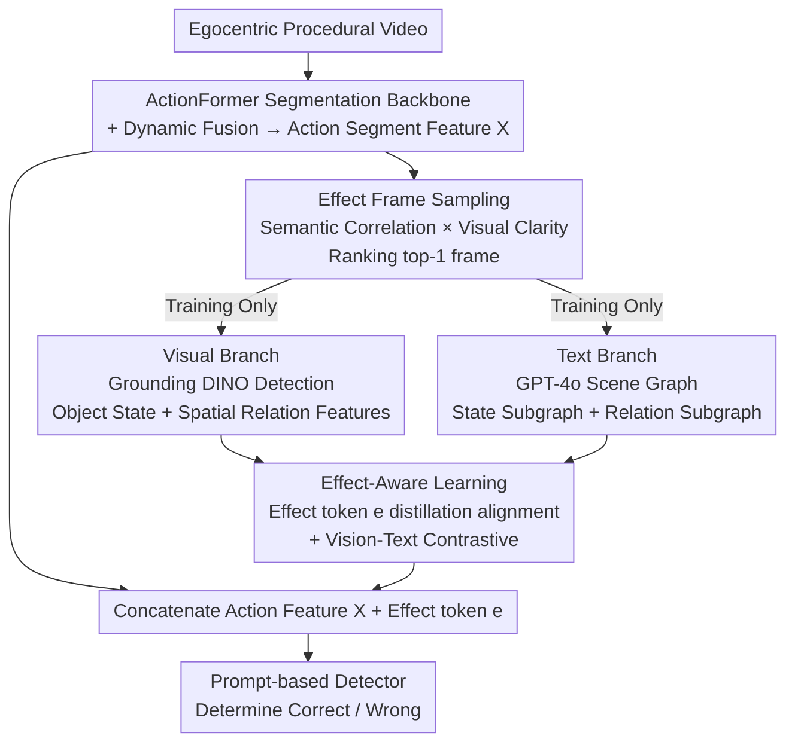

# Procedural Mistake Detection via Action Effect Modeling

**Conference**: ICLR 2026  
**arXiv**: [2512.03474](https://arxiv.org/abs/2512.03474)  
**Code**: [https://wenliangguo.github.io/Mistake_Detection](https://wenliangguo.github.io/Mistake_Detection) (Project Page)  
**Area**: Multimodal VLM  
**Keywords**: Procedural mistake detection, action effect modeling, first-person video, scene graphs, multimodal supervision

## TL;DR
This paper proposes a dual-branch multimodal supervised action effect modeling framework. It combines a visual branch (extracting object states and spatial relationship features) with a text branch (utilizing GPT-4o generated scene graphs) to distill external supervision signals into learnable effect tokens, achieving SOTA mistake detection performance in egocentric procedural videos.

## Background & Motivation

**Background**: Procedural mistake detection aims to identify whether an operator correctly executes steps from first-person videos (e.g., checking if the correct seasoning was added during cooking). Existing methods primarily focus on the action execution process ("how-to-do") but overlook the execution effect ("what-happened-after").

**Limitations of Prior Work**: Modeling only the action process fails to distinguish cases where "the correct action was performed but the result was wrong." For instance, the physical execution of "flipping food" may look identical, but the outcome is incorrect if the food is burnt.

**Key Challenge**: The correctness of an action depends on its outcome, which is manifested in changes to object states and spatial relationships after the action is completed. This requires understanding "before-after" causality.

**Goal**: How to effectively model action effects (object state changes + spatial relationship changes) to enhance mistake detection?

**Key Insight**: Extract object state and spatial relationship information from "effect frames" (key frames after action completion) and learn effect representations through a dual-path multimodal supervision of vision and text.

**Core Idea**: Select effect frames that best reflect the action outcome, extract visual and textual representations of object states and spatial relationships, and distill these into learnable effect tokens via alignment learning.

## Method

### Overall Architecture
The work addresses mistakes where the "action is correct but the result is wrong"—errors that cannot be distinguished by process alone and require observing final states and relative positions. The framework uses ActionFormer as a temporal backbone for action segmentation and integrates an Action Effect Modeling (AEM) module. From each action segment, it selects one effect frame that most accurately reflects the "post-action" state. Information is then extracted through two paths: the visual path captures object states and spatial layouts, while the text path utilizes GPT-4o to generate structured scene graphs. These are distilled into a learnable "effect token," which is concatenated with action features for the prompt-based detector. Notably, heavy external models like GPT-4o and Grounding DINO are only used as supervision during training; the inference phase uses only the learned effect tokens, incurring no extra overhead.

### Key Designs

**1. Effect Frame Sampling: Selecting the frame that best illustrates the "result"**

Since mistakes are reflected in outcomes, selecting the right frame to extract effect features is critical. While a naive approach would take the last frame of a segment, that frame is often motion-blurred or precedes the actual result. The proposed method ranks frames based on two metrics: semantic correlation (similarity between action segment features and GPT-4o generated effect descriptions) and visual clarity (measured by the Laplacian operator to avoid blur). This sampling strategy improves AUC by 3.2 compared to using the last frame (70.6 vs 73.8).

**2. Visual Branch: Decomposing "Effect" into Object States and Spatial Relationships**

Action effects consist of two dimensions: changes in appearance/state (e.g., food being burnt) and changes in relative positions (e.g., seasoning poured into a pot). The visual branch follows this decomposition: the state path uses Grounding DINO for object detection and extracts RoI features ($F_s$), while the relation path encodes spatial coordinates ($F_r$). Ablation studies show that spatial relationship features (72.6 AUC) contribute more to mistake detection than object state features (69.9 AUC).

**3. Text Branch: GPT-4o Scene Graphs for Structured Semantics**

Visual features often lack explicit "subject-relation-object" structures. The text branch uses GPT-4o to generate a scene graph $G=(V,E)$ from the effect frame. This graph is decomposed into state and relation subgraphs, encoded by a GNN and pooled into text-side features $t_s$ and $t_r$. This provides structured semantics that complement visual features, raising AUC from 68.4 to 71.7.

**4. Effect-Aware Learning: Distilling Dual-Path Supervision into Learnable Tokens**

To avoid the high inference cost of GPT-4o and Grounding DINO, a learnable effect token $e$ is introduced. During training, $e$ is aligned with visual and text features via L2 distillation; simultaneously, contrastive learning is used to align visual and textual representations in a shared space. At inference, only the learned token $e$ is concatenated with action features, adding zero additional overhead.

### Loss & Training
The total loss is defined as: $L = L_{seg} + L_{eff} + L_{CL} + L_{det}$. These items correspond to action segmentation (temporal localization), effect alignment (L2 distillation of tokens), vision-text contrastive alignment, and the contrastive loss for mistake detection.

## Key Experimental Results

### Main Results (EgoPER Dataset)

| Method | AUC | EDA |
|------|-----|-----|
| HF2-VAD | 59.9 | 27.1 |
| EgoPED | 62.0 | 57.0 |
| AMNAR | 68.5 | 64.4 |
| **Ours** | **73.8** | **66.7** |

### Ablation Study

| Component | AUC | EDA |
|------|-----|-----|
| Baseline (No AEM) | 67.6 | 65.6 |
| + Visual Supervision | 68.4 | 66.1 |
| + Text Supervision | 69.4 | 66.3 |
| + Visual + Text (No Alignment) | 71.7 | 66.4 |
| **+ Aligned Visual + Text** | **73.8** | **66.7** |

### Key Findings
- AUC improves by 5.3 points compared to the previous SOTA (AMNAR).
- The effect frame sampling strategy improves AUC by 3.2 compared to the naive last-frame baseline.
- Spatial relationship features (72.6 AUC) prove more critical than object state features (69.9 AUC).
- Vision-text alignment provides an additional 2.1 AUC gain over simple fusion (71.7 -> 73.8).
- Utilizing an open-source MLLM (Qwen3-VL) for scene graph generation achieves a performance (73.3) close to GPT-4o (73.8).

## Highlights & Insights
- **Action Effect Modeling**: Shifting the focus of mistake detection from "how an action is performed" to "the correctness of the action's result" is a powerful and insightful perspective.
- **Distillation Design**: Leveraging GPT-4o and Grounding DINO for supervision during training while bypassing them during inference ensures efficiency. The effect token acts as a bridge for knowledge distillation.
- **State vs. Relation Decomposition**: Decomposing action effects into object states and spatial relationships provides a methodology transferable to broader causal reasoning tasks.

## Limitations & Future Work
- The framework assumes effects are immediately visible after an action, which may not hold for delayed effects (e.g., slow cooking).
- The cost of generating scene graphs with GPT-4o is high during the training data preparation phase.
- Validation is limited to kitchen scenarios; generalization to complex industrial operations remains unproven.
- The quality of the visual branch is directly dependent on the detection accuracy of Grounding DINO.

## Related Work & Insights
- **vs. AMNAR**: Previous SOTA using an anomaly detection paradigm; this work explicitly models action effects for better interpretability.
- **vs. EgoPED**: An earlier method that does not model effects; this work significantly outperforms it.
- **vs. ActionFormer**: Used as the backbone; this work extends it with the AEM module.

## Rating
- Novelty: ⭐⭐⭐⭐⭐ The perspective of action effect modeling is highly novel and convincing.
- Experimental Thoroughness: ⭐⭐⭐⭐ Extensive ablations on two datasets, though limited primarily to kitchen environments.
- Writing Quality: ⭐⭐⭐⭐ Clear derivations and an elegant probabilistic framework.
- Value: ⭐⭐⭐⭐ Provides a new methodology for procedural video understanding.

<!-- RELATED:START -->

## Related Papers

- [\[ICLR 2026\] Capacity-Aware Inference: Mitigating the Straggler Effect in Mixture of Experts](capacity-aware_inference_mitigating_the_straggler_effect_in_mixture_of_experts.md)
- [\[ICLR 2026\] On Discriminative vs. Generative Classifiers: Rethinking MLLMs for Action Understanding](on_discriminative_vs_generative_classifiers_rethinking_mllms_for_action_understa.md)
- [\[ICLR 2026\] Unified Vision-Language Modeling via Concept Space Alignment](unified_vision-language_modeling_via_concept_space_alignment.md)
- [\[ICLR 2026\] VideoChat-Flash: Hierarchical Compression for Long-Context Video Modeling](videochat-flash_hierarchical_compression_for_long-context_video_modeling.md)
- [\[ICLR 2026\] Revisiting Confidence Calibration for Misclassification Detection in VLMs](revisiting_confidence_calibration_for_misclassification_detection_in_vlms.md)

<!-- RELATED:END -->
