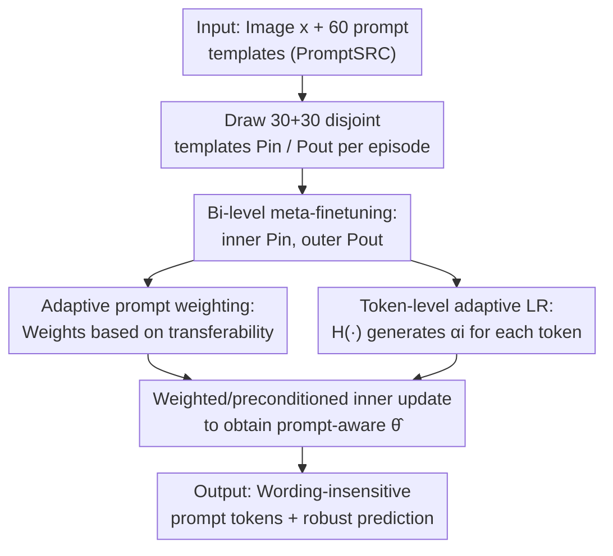

# Prompt-Robust Vision-Language Models via Meta-Finetuning

**Conference**: ICLR 2026  
**OpenReview**: [https://openreview.net/forum?id=3wZ6IIwPJq](https://openreview.net/forum?id=3wZ6IIwPJq)  
**Code**: To be confirmed (Authors state code will be open-sourced)  
**Area**: Multimodal VLM  
**Keywords**: Prompt robustness, Meta-learning, Bi-level loop, Prompt weighting, Token-level learning rate

## TL;DR
Addressing the fragility where CLIP-like vision-language models exhibit significant performance fluctuations with different prompt wordings, this paper proposes Promise. It treats various semantically equivalent prompt templates as "tasks" within a meta-learning framework. By employing an inner-outer bi-level loop, adaptive prompt weighting, and token-level learning rates, the model learns a set of prompt tokens insensitive to wording. It reduces prompt sensitivity while enhancing generalization across 15 benchmarks (achieving a +1.13 gain in the harmonic mean for base-to-new on 11 datasets).

## Background & Motivation
**Background**: Vision-language models (VLMs) like CLIP and ALIGN have achieved strong zero-shot capabilities through large-scale image-text alignment. A common usage involves inserting classes into manual templates (e.g., "a photo of a [CLASS]") and calculating similarity between text and image features for classification. Subsequent prompt learning methods (CoOp, CoCoOp, MaPLe, PromptSRC, MMRL, etc.) replaced manual templates with learnable tokens to further improve downstream adaptation.

**Limitations of Prior Work**: These models are highly sensitive to prompt wording. For the same image, simply changing a template to an equivalent version (e.g., "a photo of" $\rightarrow$ "itap of the" $\rightarrow$ "a bad photo of a") causes significant shifts in prediction confidence and accuracy. As shown in Figure 1, CLIP and MaPLe exhibit high volatility and low overall confidence across five prompt variations. This instability makes VLMs unreliable for real-world deployment.

**Key Challenge**: Existing prompt learning methods (whether learning full templates or tokens) are **bound to a fixed set of prompt templates** during training and inference. They optimize for specific wordings and thus lack robustness when phrasing changes. While existing meta-learning prompt tuning (GRAM, MetaPrompt, ProMetaR) introduces meta-learning, it targets **cross-task/cross-domain** generalization while still assuming fixed prompt templates, failing to address "intra-task robustness across different wordings."

**Goal**: To build prompt-robust VLMs where predictions remain stable across diverse prompt wordings for the same task, shifting the research focus from "task/domain-level generalization" to "intra-task prompt robustness."

**Key Insight**: The authors observe that semantically equivalent prompt templates for the same dataset can be treated as distinct "tasks" in a meta-learning sense. By **actively simulating prompt distribution shifts** during training—adapting tokens on one set of templates in the inner loop and validating generalization on a **disjoint** set in the outer loop—the model is forced to learn wording-invariant token representations.

**Core Idea**: Utilize bi-level meta-finetuning that treats prompt templates as tasks, combined with adaptive prompt weighting and token-level learning rates. This transforms a globally shared SGD initialization into a "prompt-aware" initialization, allowing a single-step inner update to simultaneously reduce outer-loop risk and compress cross-prompt sensitivity.

## Method

### Overall Architecture
Promise is a meta-finetuning strategy that can be applied to existing prompt learners (MaPLe, IVLP, MMRL, etc.). It maintains their architecture but replaces the original optimization process with a bi-level loop. Given a dataset, it utilizes 60 manual templates provided by PromptSRC. In each episode, 30 templates are randomly sampled for inner-loop adaptation ($P_{in}$), and 30 disjoint templates are used for outer-loop generalization validation ($P_{out}$). The inner loop performs a gradient step for each template to obtain adapted parameters $\hat\theta$. The outer loop calculates the loss of $\hat\theta$ on the disjoint templates to update the shared meta-parameters $\theta$. Within this MAML/Reptile-style framework, the authors insert two modules: Adaptive Prompt Weighting (assigning higher weights to more transferable templates) and Token-level Learning Rate (using a small network to generate specific LRs for each token). These three components work together to learn wording-invariant and highly generalizable token representations. Theoretically, it is proven that this "weighted and preconditioned" inner update reduces outer empirical risk and shrinks cross-prompt sensitivity.

### Key Designs

**1. Bi-level Meta-Finetuning: Treating Prompt Templates as "Tasks"**

This design directly addresses the root cause: "binding to fixed templates leads to failure when wording changes." The authors ensure the inner and outer template sets are disjoint ($P_{in} \cap P_{out} = \varnothing$). "Tasks" in this meta-learning context correspond to different natural language phrasings within the same dataset and label space, rather than different datasets. The inner loop adapts token embeddings $e_i$ for each $T_i \in P_{in}$: $\hat\theta = \theta - \alpha \sum_{T_i \in P_{in}} \nabla_\theta L_{in}(f(e_i, x), y)$. The outer loop updates meta-parameters on the disjoint $P_{out}$: $\theta = \theta - \beta \sum_{T_j \in P_{out}} \nabla_{\hat\theta} L_{out}(f(e_j, x), y)$. This explicitly encodes "adapting on one set of wordings and validating stability on unseen wordings" into the training objective. It is inspired by MAML but addresses MAML's inability to distinguish template quality. Iteratively, it uses a first-order Reptile approximation with 3 inner iterations to avoid second-order gradients.

**2. Adaptive Prompt Weighting: Higher Influence for Transferable Templates**

Different prompt templates have naturally varying transferability. Treating them equally allows "noisy templates" to degrade adaptation. The authors assign a learnable weight $w_i$ to each inner template $T_i$ to scale its loss. The inner update becomes $\hat\theta = \theta - \alpha \sum_{T_i \in P_{in}} w_i \nabla_\theta L_{in}(f(e_i, x), y)$, where weights are optimized in the outer loop. To control variance, weights are constrained to a probability simplex $\Delta^{N-1} = \{w \ge 0, \sum_i w_i = 1\}$ using entropy mirror mapping with temperature $\tau$. High $\tau$ spreads weight to stabilize gradients, while low $\tau$ concentrates weight on high-utility templates to reduce variance. Optional entropy regularization $\lambda H(\tilde w)$ prevents collapse, retaining high-utility templates and pruning noisy ones.

**3. Token-level Adaptive Learning Rate: Fine-grained Step Size per Token Importance**

Even with the right templates, a uniform LR for all tokens in a prompt is too coarse. Inspired by MetaSGD, the authors extend this to a **data-driven, token-level** version. A 3-layer MLP $H(\cdot)$ takes features of each template extracted by the text encoder and outputs a specific LR $\alpha_i = H(e_i)$ for each learnable token $e_i$. The inner update is refined to $\hat\theta = \theta - \alpha_i \sum_{T_i \in P_{in}} w_i \nabla_\theta L_{in}(f(e_i, x), y)$. Since $\alpha_i$ is generated from the token's own semantic context, the model adopts different step sizes based on "importance." The parameters of $H(\cdot)$ are optimized in the outer loop alongside $\theta$. Theoretically, $w$ provides "variance reduction" and the diagonal LR matrix $P = \mathrm{diag}(\alpha_1, \dots, \alpha_d)$ acts as a "preconditioner," directing the inner update toward generalization on $P_{out}$.

### Loss & Training
Both inner and outer loops use classification loss (adapting prompt tokens on CLIP-ViT-B/16). Configuration: prompt depth of 9, vision and language prompt lengths of 2 each, 10 epochs, batch size 8, learning rate 0.0035, SGD, single A6000. When using ImageNet-1K as the source model, prompt depth is set to 3 for 5 epochs. Theorems 4.1/4.2 prove that this weighted/preconditioned update reduces outer risk $\hat R_{P_{out}}$ and shrinks cross-prompt sensitivity $S(\theta) = \mathrm{Var}_{T}[f_\theta(x; T)]$.

## Key Experimental Results

### Main Results
Covering 15 datasets including base-to-new generalization, cross-dataset transfer, and domain generalization. The table below shows the average across 11 datasets for base-to-new (H is the harmonic mean):

| Method | Base | Novel | H |
| :--- | :--- | :--- | :--- |
| CLIP | 69.34 | 74.22 | 71.70 |
| CoCoOp | 80.47 | 71.69 | 75.83 |
| PromptSRC | 84.26 | 76.10 | 79.97 |
| DePT | 85.19 | 76.17 | 80.43 |
| ProMetaR | 84.39 | 76.93 | 80.49 |
| HPT++ | 84.13 | 77.99 | 80.95 |
| MMRL (Prev. SOTA) | 85.68 | 77.16 | 81.20 |
| **Promise (Ours)** | **86.14 (+0.46)** | **78.84 (+0.85)** | **82.33 (+1.13)** |

Promise acts as a training strategy that can be stacked on different backbones for consistent gains (Table 1):

| Backbone | Base | Novel | H |
| :--- | :--- | :--- | :--- |
| IVLP | 82.51 | 73.35 | 77.66 |
| + Promise | 83.26 | 75.44 (**+2.09**) | 79.16 |
| MaPLe | 82.28 | 75.14 | 78.55 |
| + Promise | 83.57 | 77.26 (**+2.12**) | 80.29 |
| MMRL | 85.68 | 77.16 | 81.20 |
| + Promise | 86.14 | 78.84 (**+1.68**) | 82.33 |

Gains mainly come from novel classes, indicating Promise enhances generalization rather than over-fitting base classes.

### Ablation Study

| Config | Backbone | Base | Novel | H | Note |
| :--- | :--- | :--- | :--- | :--- | :--- |
| w/o Adaptive Weighting | MaPLe | 82.93 | 75.87 | 79.24 | Removed weighting |
| w/ Adaptive Weighting | MaPLe | 83.57 | 77.26 | 80.29 | novel +1.39 |
| w/o Adaptive Weighting | MMRL | 85.97 | 77.53 | 81.53 | Removed weighting |
| w/ Adaptive Weighting | MMRL | 86.14 | 78.84 | 82.33 | novel +1.31 |

Token-level LR (Table 3) outperforms fixed LRs and task-level LRs (MetaSGD) on both base and novel classes.

### Key Findings
- **Theoretical-Empirical Alignment**: On a representative subset, the ratio of "inner updates successfully reducing outer $P_{out}$ loss" increased from ~**61%** (without weighting/preconditioning) to ~**78%** with the full Promise method, validating Theorem 4.1.
- **Dual Module Contribution**: Both adaptive weighting and token-level LR contribute to novel class generalization independently and complementarily.
- **Robustness**: When switching templates on UCF101 and Caltech101, other methods show high variance, while Promise maintains high and stable accuracy (Figure 3).

## Highlights & Insights
- **Modeling Wording as a Distribution**: The most significant insight is no longer treating prompts as fixed inputs, but defining "equivalent phrasings" as a meta-learning task distribution.
- **Plug-and-Play Strategy**: Promise does not alter backbone architectures; it only replaces the optimization process, making it easily transferable to new prompt learners.
- **Theory-Driven Design**: The generalization bound points explicitly toward minimizing $\hat R_{P_{out}}(\hat\theta)$ and $\mathrm{Tr}(P\Sigma_w P)$, translating mathematical concepts into concrete optimization objectives.

## Limitations & Future Work
- **Dependency on Template Libraries**: The method relies on the 60 templates from PromptSRC; if the library is biased, the learned invariance may be limited.
- **Dataset-Specific Degradation**: A drop of 2.86 on OxfordPets' novel classes suggests that forcing prompt invariance might conflict with class discriminability in certain fine-grained scenarios.
- **Theoretical Assumptions**: Assumptions like L-smoothness and gradient alignment are only approximations for large CLIP networks.
- **Training Overhead**: Bi-level loops and MLP inference for LRs increase training costs compared to standard prompt tuning.

## Related Work & Insights
- **vs CoOp / CoCoOp**: Those methods bind to fixed templates and overfit; Promise meta-learns tokens invariant to phrasings.
- **vs MaPLe / PromptSRC / MMRL**: These are stronger backbones; Promise effectively stacks on top of them as an orthogonal enhancement.
- **vs GRAM / ProMetaR**: While these use meta-learning for cross-task/domain generalization, Promise is the first to redefine "tasks" as intra-task prompt wordings.
- **vs MAML / MetaSGD**: Promise adapts these concepts specifically for VLM prompt robustness by using adaptive weighting and data-driven token-level preconditioning.

## Rating
- Novelty: ⭐⭐⭐⭐ Treats prompt wording as a distribution for intra-task robustness.
- Experimental Thoroughness: ⭐⭐⭐⭐ 15 datasets with comprehensive ablations and theoretical verification.
- Writing Quality: ⭐⭐⭐⭐ Clear motivation and structure.
- Value: ⭐⭐⭐⭐ Plug-and-play strategy with practical significance for VLM reliability.

<!-- RELATED:START -->

## Related Papers

- [\[ICLR 2026\] Meta-Adaptive Prompt Distillation for Few-Shot Visual Question Answering](meta-adaptive_prompt_distillation_for_few-shot_visual_question_answering.md)
- [\[CVPR 2026\] The Geometry of Robustness: Optimizing Loss Landscape Curvature and Feature Manifold Alignment for Robust Finetuning of Vision-Language Models](../../CVPR2026/multimodal_vlm/the_geometry_of_robustness_optimizing_loss_landscape_curvature_and_feature_manif.md)
- [\[ICLR 2026\] A-TPT: Angular Diversity Calibration Properties for Test-Time Prompt Tuning of Vision-Language Models](a-tpt_angular_diversity_calibration_properties_for_test-time_prompt_tuning_of_vi.md)
- [\[ICLR 2026\] Revisit Visual Prompt Tuning: The Expressiveness of Prompt Experts](revisit_visual_prompt_tuning_the_expressiveness_of_prompt_experts.md)
- [\[CVPR 2026\] Towards Calibrating Prompt Tuning of Vision-Language Models](../../CVPR2026/multimodal_vlm/towards_calibrating_prompt_tuning_of_vision-language_models.md)

<!-- RELATED:END -->
