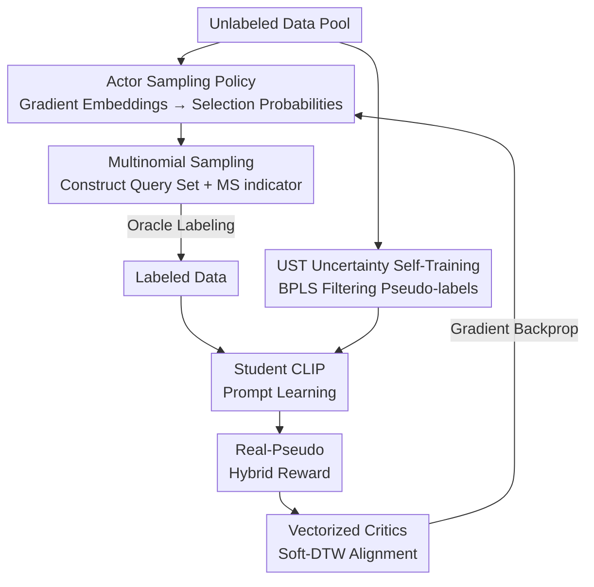

# PSP: Prompt-Guided Self-Training Sampling Policy for Active Prompt Learning

**Conference**: ICLR 2026  
**OpenReview**: [https://openreview.net/forum?id=7D7VLU9227](https://openreview.net/forum?id=7D7VLU9227)  
**Code**: To be confirmed  
**Area**: Multimodal VLM  
**Keywords**: Active Prompt Learning, CLIP, Soft Actor-Critic, Self-Training, Pseudo-labeling

## TL;DR
PSP models the "sample selection" process as a reinforcement learning problem. It utilizes Soft Actor-Critic (SAC) with a "real-pseudo hybrid reward" derived from prompt learning feedback to optimize the sampling policy end-to-end. Simultaneously, it leverages a teacher CLIP model to assign reliable pseudo-labels to unselected samples, ensuring selected samples effectively serve the optimization of prompt templates. This approach improves average accuracy across seven downstream datasets from 74.36% to 76.87%.

## Background & Motivation
**Background**: Using Vision-Language Models (VLMs) like CLIP for downstream adaptation primarily relies on prompt learning (e.g., CoOp), which freezes the image/text encoders and learns a small set of trainable context vectors as templates. However, high-quality training still requires labeled data, which is costly. Consequently, Active Prompt Learning (APL) has emerged, using active learning to select the "most informative" samples under a limited budget, represented by the PCB framework by Bang et al.

**Limitations of Prior Work**: PCB applies traditional sampling algorithms (Entropy, Coreset, BADGE) mechanically and uses a Balance Sampler to favor samples whose pseudo-labels belong to under-represented classes in the labeled set. This approach has two major flaws: first, **sampling and prompt learning are decoupled into two independent stages**, where sampling criteria lack an explicit link to whether a sample actually helps the prompt template learn better; second, **complementary information within unselected unlabeled samples is completely wasted**.

**Key Challenge**: Traditional "informativeness" criteria (high entropy, wide coverage) are static properties of the data, which are disconnected from the dynamic training signal of "what the prompt template has learned and what it lacks." Conventional sampling rules cannot feed specific prompt optimization goals back into the selection process.

**Goal**: (1) Enable explicit guidance of sampling via prompt learning feedback to ensure selected samples benefit template optimization; (2) utilize complementary information from unselected samples.

**Key Insight**: RL-based sampling can naturally model "sample selection" as policy optimization, iteratively refining the policy using cumulative rewards. This allows the quality of prompt learning to be designed as a reward signal. However, existing RL sampling methods (AOL, PAL for binary decisions; DRAL/MedSelect for paired data) are unsuitable for APL. Therefore, the authors introduce Soft Actor-Critic (SAC), which is robust to hyperparameters and excels in continuous action spaces.

**Core Idea**: A SAC-based sampling policy (VSSP) is driven by a reward derived from prompt learning results to select samples end-to-end, while a teacher CLIP generates reliable pseudo-labels for unselected samples through self-training (UST). This closes the loop between the previously isolated "sampling" and "prompt learning" stages.

## Method

### Overall Architecture
PSP is a teacher-student self-training framework. Each round $t$ follows a complete closed loop of "sampling — labeling/pseudo-labeling — prompt learning — reward calculation — policy update." It consists of two core components: **VSSP (Vectorized Soft Actor-Critic Sampling Policy)**, which manages sample selection and policy updates via prompt feedback, and **UST (Uncertainty Augmented Self-Training)**, which converts unselected samples into reliable pseudo-labels for training.

The data flow within a round is as follows: The Actor maps gradient embeddings of $n_t^u$ unlabeled samples to actions $a_t$ (probabilities of selection). Multinomial Sampling generates a query set for Oracle labeling. Simultaneously, UST uses the teacher CLIP from the previous round to generate and filter pseudo-labels for the remaining samples. Both labeled and pseudo-labeled data are fed into the student CLIP for prompt learning (cross-entropy loss). After training, a real-pseudo hybrid reward $r_t$ is calculated from the learned prompt and image features. This reward, along with the next state $s_{t+1}$, is stored in a replay buffer. Vectorized critics then estimate Q-values to update the Actor via gradient backpropagation.

### Key Designs

**1. Multinomial Sampling & MS indicator: Quantifying sampling strategy quality**

The Actor outputs a selection probability $a_t \in \mathbb{R}^{n_t^u}$ for each unlabeled sample. To construct the query set, samples are drawn from this distribution. Instead of a simple Top-K approach, PSP uses Multinomial Sampling: the sampling result $G=\{g_1,\dots,g_{n_t^u}\}$ follows a multinomial distribution, where $g_i$ is the number of times $x_i^u$ is selected, satisfying $n_s=\sum_i g_i$. This introduces randomness, ensuring a more uniform distribution of selected samples.

The "reliability" of this sampling scheme is quantified by an MS indicator: $\log(p_m(g)) = \log\frac{n_s!}{g_1!\cdots g_{n_t^u}!} + \sum_{i=1}^{n_t^u} g_i \log a_i$. A larger $\log(p_m(g))$ indicates the current sample matches the Actor's probability distribution $a_t$. This scalar is integrated into the reward formula (Design 3), allowing the quality of the sampling scheme to guide Actor and Critic updates.

**2. UST & BPLS: Converting discarded samples into reliable pseudo-labels**

To utilize unselected samples, UST uses a frozen teacher CLIP $F_t$ from the previous round. For stability, $L=5$ data augmentations are performed per sample. The averaged logits $z_i^{avg}$ are used to generate the pseudo-label $\hat y_i^u$.

To handle noise, the Balanced Pseudo-Label Selective (BPLS) module applies "dual-threshold filtering": reliability is measured by confidence $g_i^c=\mathrm{confidence}(z_i^{avg})$, and uncertainty is measured by the standard deviation of confidence across augmentations $g_i^u=\mathrm{std}\{\mathrm{confidence}(z_i^l)\}$. Samples are retained only if they exceed the confidence threshold $\tau_c$ and fall below the uncertainty threshold $\tau_u$. Finally, missing classes are filled with high-confidence samples to ensure class balance.

**3. Prompt-guided State & Real-Pseudo Hybrid Reward: Linking feedback to sampling**

This is the core of the paper. The **State** $s_t \in \mathbb{R}^{n_t^u \times M_g}$ consists of gradient embeddings of $n_t^u$ unlabeled samples, which incorporate prompt information. Specifically, $s_t^i = f_V^{t,i}\cdot[1-\cos(F_T^t(p_c), f_V^{t,i})]$ if the predicted class matches, and $-f_V^{t,i}\cdot\cos(F_T^t(p_c), f_V^{t,i})$ otherwise. This state captures how the current prompt classifies each sample.

The **Reward** is calculated after prompt learning: $r(s_t,a_t)=\log(p_m(g))\cdot(\bar r_s + \beta \bar r_p)$. The individual sample reward $r_k^i = \max_c \cos(F_T^s(p_c), F_V^s(x_i^k)) - \cos(F_T^s(p_{y_i^k}), F_V^s(x_i^k))$ measures the gap between the top class score and the ground truth score. Since $\log(p_m(g))$ is always negative and $\bar r_s, \bar r_p$ are positive, **maximizing total reward is equivalent to minimizing the prediction gap**.

**4. Vectorized Critics & Soft-DTW: Fine-grained valuation and shape alignment**

In APL, sample selection is an independent decision for each sample. Standard SAC uses scalar values, which cannot distinguish individual contributions. PSP adopts **Vectorized V-Critics and Q-Critics**, estimating $V_\psi(s_t)\in\mathbb{R}^{n_t^u}$ and $Q_\theta(s_t,a_t)\in\mathbb{R}^{n_t^u}$ for each sample.

As the unlabeled pool shrinks each round ($n_{t+1}^u = n_t^u - n_s$), the state is **shape-variable**, causing dimension mismatch for Bellman residual calculation. PSP uses **Soft-DTW (Soft Dynamic Time Warping)** to align $Q_\theta$ and $\hat Q$. Soft-DTW is differentiable and preserves the relative order and structural relationships of samples, avoiding info loss from simple padding.

### Loss & Training
The student CLIP uses cross-entropy loss $\mathcal{L}_{ce}$. Text prompts follow the format $p_c=[c]_1[c]_2\dots[c]_M[\mathrm{cls}_c]$ with GPT-3 generated descriptions. VSSP optimizes: V-Critic via squared residual $J_V(\psi)$, Q-Critic via Soft-DTW aligned Bellman residual $J_Q(\theta)$, and Actor via entropy-regularized policy objective $J_\pi(\phi)$. Training consists of $R=8$ rounds. $\beta=0.7$, $\tau=0.1$, $\gamma=0.9$.

## Key Experimental Results

### Main Results
Using ViT-B/32 on seven downstream datasets:

| Method | DTD | Oxford Pets | EuroSAT | Stanford Cars | Aircraft | Average Acc |
|------|-----|------|------|------|------|------|
| CLIP (Zero-Shot) | 44.5 | 87.0 | 49.4 | 59.4 | 21.2 | 59.44 |
| Random | 58.77 | 78.30 | 77.62 | 65.96 | 30.69 | 70.54 |
| ALFA-Mix | 61.28 | 83.13 | 82.39 | 71.04 | 27.83 | 74.01 |
| BADGE + PCB (AS) | 62.33 | 83.16 | 81.50 | 70.70 | 32.27 | 74.36 |
| **PSP (Ours)** | **65.66** | **86.57** | **85.43** | **73.84** | **36.42** | **76.87** |
| Fully Labeled Data | 74.7 | 89.3 | 94.5 | 80.8 | 43.4 | 82.14 |

Ours outperforms PCB (AS) by 2.51% average accuracy. Significant gains are observed on fine-grained tasks like Aircraft (+4.15%).

### Ablation Study
Averaged across DTD, Pets, EuroSAT, and Aircraft:

| Configuration | DTD | Oxford Pets | EuroSAT | Aircraft | Average |
|------|-----|------|------|------|------|
| Full PSP | 65.66 | 86.57 | 85.43 | 36.42 | 68.52 |
| w/o VSSP | 64.36 | 85.91 | 84.63 | 34.14 | 67.26 |
| w/o UST | 63.77 | 85.55 | 83.97 | 32.40 | 66.42 |

Removing VSSP leads to a 1.26% drop, while removing UST leads to a 2.10% drop. UST contributes more to overall performance. Soft-DTW outperformed PAD and VAE by 1.83% and 0.83% respectively.

### Key Findings
- UST is the primary performance driver (2.10% vs. 1.26% for VSSP), highlighting the value of mining unselected samples in low-budget APL.
- Vectorized critics are essential for VSSP; switching to standard scalar SAC significantly degrades performance.
- The negative sign of the MS indicator is crucial: it bridges the gap between maximizing reward and minimizing prediction error.

## Highlights & Insights
- **Closed-loop via rewards**: The method elegantly maps "prompt learning success" to an RL reward, shifting sampling from static criteria (entropy) to dynamic criteria that serve the current optimization goal.
- **Handling shape-variable states**: Utilizing Soft-DTW for alignment in RL when the action space dimension changes over time is a robust engineering choice that could be applied to other RL-based selection tasks.
- **Balance in UST**: The BPLS module combines confidence, uncertainty, and class balancing, providing a reusable template for reliable pseudo-labeling.

## Limitations & Future Work
- Computational overhead: VSSP introduces SAC, vectorized critics, and Soft-DTW, which increases complexity compared to plug-and-play samplers like PCB.
- Dependency on teacher CLIP: In tasks where zero-shot CLIP is extremely poor, pseudo-label noise may accumulate early on.
- Scope: Evaluation is limited to classification tasks and the ViT-B/32 backbone; performance on dense prediction tasks or larger backbones remains untested.

## Related Work & Insights
- **vs. PCB**: PCB ignores unselected data and uses decoupled stages. Ours creates a closed loop and utilizes unselected samples for a +2.51% gain.
- **vs. Traditional RL Sampling**: Previous methods often rely on binary decisions or paired data. Ours uses SAC's continuous action space to output probabilities for an entire pool.
- **vs. Classic Criteria**: Unlike fixed rules (Entropy/Coreset), VSSP is learnable and adapts to the specific optimization objective of the prompt.

## Rating
- Novelty: ⭐⭐⭐⭐ Closed-loop reward design and Soft-DTW for variable states are highly specific and well-motivated.
- Experimental Thoroughness: ⭐⭐⭐⭐ Solid main results and ablations, though lacking computational cost analysis and varied backbones.
- Writing Quality: ⭐⭐⭐ Clear logic, but dense notation and reliance on appendices for details may hinder initial understanding.
- Value: ⭐⭐⭐⭐ Provides a feasible paradigm for sample selection and prompt learning integration in low-budget VLM adaptation.

<!-- RELATED:START -->

## Related Papers

- [\[ICLR 2026\] Revisit Visual Prompt Tuning: The Expressiveness of Prompt Experts](revisit_visual_prompt_tuning_the_expressiveness_of_prompt_experts.md)
- [\[AAAI 2026\] Multi-Agent VLMs Guided Self-Training with PNU Loss for Low-Resource Offensive Content Detection](../../AAAI2026/multimodal_vlm/multi-agent_vlms_guided_self-training_with_pnu_loss_for_low-resource_offensive_c.md)
- [\[CVPR 2026\] Controllable Federated Prompt Learning at Test Time](../../CVPR2026/multimodal_vlm/controllable_federated_prompt_learning_at_test_time.md)
- [\[AAAI 2026\] SAGE: Spuriousness-Aware Guided Prompt Exploration for Mitigating Multimodal Bias](../../AAAI2026/multimodal_vlm/sage_spuriousness-aware_guided_prompt_exploration_for_mitigating_multimodal_bias.md)
- [\[ICLR 2026\] PI-CCA: Prompt-Invariant CCA Certificates for Replay-Free Continual Multimodal Learning](pi-cca_prompt-invariant_cca_certificates_for_replay-free_continual_multimodal_le.md)

<!-- RELATED:END -->
