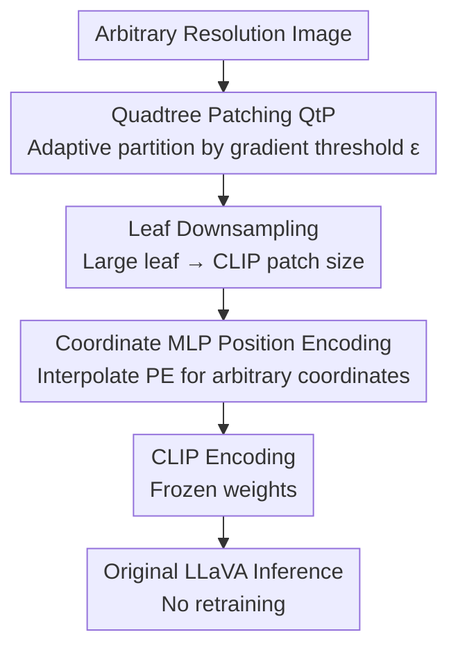

# QLIP: A Dynamic Quadtree Vision Prior Enhances MLLM Performance Without Retraining

**Conference**: ICLR 2026  
**OpenReview**: [https://openreview.net/forum?id=DSq3r8PjpQ](https://openreview.net/forum?id=DSq3r8PjpQ)  
**Code**: https://github.com/KyroChi/qlip  
**Area**: Multimodal VLM  
**Keywords**: CLIP Vision Encoder, Quadtree Patching, Content-aware Patch, Position Encoding Interpolation, Training-free

## TL;DR
This paper identifies two major defects in CLIP vision encoders: "mesoscopic bias" and "interpolation bias." It proposes QLIP—a "drop-in" modification that replaces uniform grid patching with content-adaptive quadtree patching and uses a small MLP to re-interpolate position encodings. Without **retraining the vision encoder or the LLM**, it improves LLaVA-1.5 performance on the fine-grained VQA benchmark V* by up to 13.6%.

## Background & Motivation
**Background**: Multimodal Large Language Models (MLLMs), represented by LLaVA, generally use CLIP vision encoders to divide images into a fixed number of visual tokens, which are then projected into a semantic space shared with text for downstream LLMs. The CLIP vision tower has become the de facto standard foundational component for MLLMs.

**Limitations of Prior Work**: CLIP encoders suffer from two widely criticized flaws: they only accept inputs at fixed resolutions and fail to generate sufficiently separated embeddings for similar but distinct images. Consequently, MLLMs perform poorly on "fine-grained visual question answering" and often fail to answer details about small objects. Existing improvements often assume "CLIP itself is wrong" and replace the encoder, but replacing the encoder typically requires retraining the entire MLLM pipeline, which is prohibitively expensive for many scenarios.

**Key Challenge**: The authors propose a different assessment—the failure is **not** because CLIP's representation capability is insufficient, but because the "quality of tokens fed to the LLM is poor." Existing work shows that if the "correct" tokens are fed to the original LLaVA, its VQA capability actually far exceeds the current state. In other words, the model has the capability but lacks high-quality input signals.

**Goal**: To improve both coarse-grained and fine-grained visual understanding **without retraining** the vision encoder or LLM weights. The authors decompose the problem into two specific biases to tackle:

**Key Insight**: The authors attribute CLIP's failure to two inductive priors implicit during training. **Mesoscopic bias** stems from Uniform Grid Patching (UGP): CLIP is trained on fixed-scale images, causing downstream models to treat "grid units at a specific image scale" as the fundamental unit of semantics—if the same elephant is scaled to a non-mesoscopic size, CLIP fails to recognize it. **Interpolation bias** comes from absolute position encodings learned at fixed resolutions: if the resolution changes by even a few pixels, CLIP's semantic recognition drops significantly, and it cannot natively process high-resolution images.

**Core Idea**: Use "content-aware quadtree patching" to replace uniform grids and eliminate mesoscopic bias—letting semantically similar regions (rather than fixed grids) become the fundamental semantic units. Then, train a small MLP to interpolate fixed position encodings to arbitrary coordinates, eliminating interpolation bias. Both are lightweight, plug-and-play modifications that require no LLM training.

## Method

### Overall Architecture
QLIP (a portmanteau of "quadtree" + "CLIP") is a modification at the input end of the CLIP encoder. The entire modification occurs **before encoding**, making it completely transparent to the downstream LLaVA. The workflow is: Input an arbitrary resolution image → Use Quadtree Patching (QtP) to adaptively partition the image into a variable number of leaf patches based on content (merging sparse information areas and preserving fine-grained details in dense areas) → Downsample leaf patches larger than the CLIP patch size back to standard patch size → Send these patches along with their true normalized coordinates into CLIP. Patch embeddings are calculated as usual, but **position encodings are provided by the trained coordinate MLP** (instead of looking up a fixed 24×24 table) → The resulting token sequence is fed directly into the original LLaVA without any retraining. The two modules each target one bias: QtP addresses mesoscopic bias, and the coordinate MLP addresses interpolation bias.

### Key Designs

**1. Quadtree Content-aware Patching (QtP): Using Semantics Instead of Fixed Grids as Patch Units**

Addressing mesoscopic bias: Information distribution in natural images is non-uniform; many pixels do not contribute to semantics (which is why compression like JPEG works). The authors use a 24-level hierarchical quadtree structure to adaptively select tokens—the root node is the whole image, each layer divides the image into four, down to leaf nodes which are single patches. Then, pruning is performed based on a criterion, and the remaining leaves are sub-images satisfying a "maximal condition." Leaves larger than the CLIP patch size are downsampled back to the mesoscopic scale, while small but important details are essentially "upsampled" to the scale CLIP expects. This compresses large semantically irrelevant areas into few tokens, while critical details gain sufficient resolution.

The pruning criterion is the "maximum of the average gradient on the patch": If a sub-image $I$ cannot be further subdivided or satisfies $D(I) := \max_{x,y}(|\partial_x I| + |\partial_y I|) < \varepsilon$, it becomes a leaf node, where $\varepsilon$ is a pre-selected selection constant. A larger $\varepsilon$ results in more aggressive pruning and fewer tokens. Intuitively, regions with high gradients (edges, textures, small objects) have high information density and should be preserved, while flat regions can be merged. The authors also use "random pruning" as an ablation control to verify that gains come from gradient signals rather than simple token reduction.

**2. Coordinate MLP Position Encoding Interpolation: Letting CLIP Natively Accept Arbitrary Resolutions**

Addressing interpolation bias: CLIP is trained at 336×336, partitioned into 24×24=576 patches of 14×14, each with a fixed position embedding $E_{ij}\in\mathbb{R}^{1024}$. The original mapping is only defined at these discrete grid points $M(-1+\frac{2i}{23}, -1+\frac{2j}{23})=E_{ij}$. The patch coordinates generated by QtP are continuous and irregular, making it impossible to query this fixed table. The authors use a small MLP to extend the mapping $M$ to the entire $[-1,1]^2$ square domain, providing position encodings for any coordinate and natively supporting arbitrary resolutions. The MLP input first passes through 48-dimensional Fourier features to enhance coordinate expressiveness.

The key to training this MLP is the "CLS token invariance" hypothesis: For the same image, the CLIP [CLS] embedding of the native resolution version and the 336×336 version should be approximately identical. Thus, $L_{[CLS]} := \|E_{[cls]}(G) - E_{[cls]}(P)\|_{L2}$ should be small ($G$ is standard UGP, $P$ is the new patching). However, this alone is insufficient—when a transformer pooling generates [CLS], as long as the sum of position encodings is conserved, [CLS] remains unchanged, which is too loose a constraint. Because downstream MLLMs also use per-patch spatial information, the authors add a residual L1 error to force the MLP to align with original CLIP position encodings on the standard 24×24 grid: $R(M,E)=\frac{1}{576}\sum_{i=1}^{24}\sum_{j=1}^{24}\big|M(-1+\frac{2i}{23},-1+\frac{2j}{23})-E_{ij}\big|$. The final loss is $\text{Loss}=L_{[CLS]}+\vartheta R$, with $\vartheta=1$ in experiments. L1 is used over L2 because the target residual must be compressed below $5\times10^{-7}$, for which L1 is more suitable.

**3. An Adjustable Knob ε for Coarse/Fine-grained Tasks: Gear-shifting Without Retraining**

The QtP pruning intensity $\varepsilon$ is the only knob that needs tuning per task; the MLP can be reused after being trained once. Performance has a **non-monotonic** relationship with $\varepsilon$ and image size: the authors suggest $\varepsilon>0$ for fine-grained tasks (more pruning, more focused signal) and $\varepsilon\approx0$ for general VQA (closer to baseline behavior). This allows the same set of weights to shift gears between different tasks—setting $\varepsilon=0$ with 336×336 images almost reproduces the CLIP baseline, and any loss beyond this can be attributed to the approximation error of the MLP interpolation. This explains why QLIP can achieve massive gains on fine-grained tasks while "hardly dropping points" on general benchmarks.

### Loss & Training
Only the coordinate MLP is trained, with costs far lower than retraining an MLLM: 11 hours on 4 NVIDIA L40S, running 100 epochs on Imagenette (a small 10-class subset of ImageNet, ~10k images), optimized with Adam, batch size 14. The authors argue that the choice of dataset is irrelevant because the mapping $M$ is independent of image content. The MLP uses 4 hidden layers + 48-dimensional Fourier features, with $\vartheta=1$. Images are kept at native resolution or a shortest side of 560 (whichever is smaller).

## Key Experimental Results

### Main Results
Integrating QLIP into LLaVA-1.5 7B / 13B and comparing against original LLaVA (reporting the best score from a hyperparameter sweep for each benchmark):

| Model | V* | MM-Bench | POPE F1 | CV-Bench | Sci-QA | MME | RW-QA |
|------|----|----------|---------|----------|--------|-----|-------|
| LLaVA-1.5-7B | 42.4 | 62.5 | 74.4 | 39.9 | 64.0 | 1207 | 49.0 |
| + QLIP | **53.4** (+11.0) | 59.7 (−2.8) | **79.6** (+5.2) | 40.2 | 63.5 | 1241 (+34) | 47.3 |
| LLaVA-1.5-13B | 45.0 | 67.4 | 82.4 | 61.6 | 67.8 | 1390 | 48.0 |
| + QLIP | **58.6** (+13.6) | 67.9 | **83.6** (+1.2) | 60.7 | 67.9 | 1388 | 49.4 |

V* is a vision-centric benchmark focusing on fine-grained details requiring full-resolution images, where QLIP shows the most significant improvement (+13.6% on 13B) and outperforms the previous CLIP-based LLaVA SOTA (S2 by Shi et al. 2024) by +3.1%. POPE F1 (measuring hallucination) also increased by 5.2, indicating that reducing token counts can lower hallucinations. MM-Bench, CV-Bench, Sci-QA, MME, and RealWorld-QA remain largely comparable.

Comparison with other fine-grained grounding methods (V* sub-items):

| Model | V*-Att | V*-Rel | V* Overall | POPE F1 |
|------|--------|--------|-----------|---------|
| QLIP-7B | 50.4 | 60.5 | 53.4 | 79.6 |
| S2-7B (Requires pre-train + IT) | 51.3 | 61.8 | 55.5 | - |
| QLIP-13B | 53.9 | 65.8 | 58.6 | 83.6 |
| S2-13B | 50.4 | 63.2 | 55.5 | - |
| SEAL-7B (Requires encoder swap + retraining) | 74.8 | 76.3 | 75.4 | 82.4 |

Notably: QLIP even outperforms SEAL, which is heavily optimized for fine-grained VQA, on POPE; while S2 requires pre-training and instruction tuning, and SEAL requires complete encoder replacement followed by pre-training, QLIP never moves LLM weights.

### Ablation Study

| Configuration | Key Finding | Description |
|------|---------|------|
| MLP Interpolate vs Bicubic/Bilinear | Bicubic and Bilinear even fell below baseline on V* | MLP interpolation is necessary for generalizing to arbitrary resolutions |
| Gradient Selection vs Random Pruning | Gradient selection significantly leads at the same token budget | Gains come from semantic signals rather than simple token reduction |
| MLP Only (No QtP) | Already allows the model to use all tokens from raw images, significantly narrowing the gap | Proves "high-quality input is missing" rather than model capability |

### Key Findings
- **"Capability is sufficient, high-quality input is missing" is empirically proven**: MLP interpolation alone (without pruning) significantly recovers V* performance, suggesting that CLIP+LLaVA has sufficient capacity, with the bottleneck being input signal quality.
- **Fewer tokens can be better**: In the green region of Figure 6, QLIP achieves **higher** accuracy using **fewer** visual tokens than the baseline—the authors claim this is the first practical realization of "fewer tokens, higher performance."
- **13B sensitivity to Aspect Ratio / [CLS]**: The optimal configuration for 13B across 3 benchmarks was cropping to 336×336 squares with $\varepsilon<0.1$; performance drops correlated with [CLS] cosine similarity changes. 7B is more robust to unseen image sizes.
- **POPE peak at small images + high ε**: Hallucination is lowest at shortest side 224 and $\varepsilon=0.7$ (approximately <50% baseline tokens).
- **Cost of specializing in fine-grained**: When tuned for V* fine-grained tasks, 7B regresses on MM-Bench and RealWorld-QA—the method is intentionally specialized for fine-grained, revealing model potential rather than replacing retraining.

## Highlights & Insights
- **Redefining failure attribution**: Re-framing "fine-grained VQA failure" from "CLIP representation is bad" to "token quality is bad" is the most critical "Aha!" moment, directly leading to the lightweight "no encoder change, only input change" route.
- **Quantifiable metrics for both biases**: Mesoscopic bias is measured by [CLS] cosine similarity after removing position encoding $C^z_{N\to336}$, and interpolation bias is defined by the gradient over the coordinate field $\|\nabla_{PCS}(E_1,E_2)\|_2$, turning "metaphysical flaws" into measurable and comparable quantities.
- **Drop-in philosophy**: Accessible with binary lines of code and only training a small MLP independent of image content, this "minimal-invasive" modification can be migrated to any vision encoder still using absolute position encoding and fixed resolutions.
- **Combining classic structures**: Reusing classic quadtrees and gradient criteria from image processing for MLLM patching translates the intuition of "why JPEG works" into a token allocation strategy that is elegant and interpretable.

## Limitations & Future Work
- The authors admit the method is **intentionally specialized for fine-grained tasks**; when tuned for fine-grained modes, it sacrifices coarse-grained tasks dependent on global/[CLS] information (e.g., 7B regressions on MM-Bench).
- **Direct integration is difficult** with newer encoders like InternVL and Qwen-VL (which have built-in token reduction, multi-resolution training, and relative/rotary position encodings), leaving adaptation to these as future work.
- 13B sensitivity to image aspect ratio and [CLS] shift means optimal configurations require per-benchmark sweeps of $\varepsilon$ and image size, indicating non-zero tuning costs.
- Compared to heavily optimized schemes like SEAL, a significant gap remains in V* Overall (58.6 vs 75.4); the method's value is in "revealing potential without training" rather than "chasing SOTA."

## Related Work & Insights
- **vs S2 (Shi et al. 2024)**: The most similar work, also freezes CLIP but feeds multi-scale tokens to the LLM and requires pre-training + instruction tuning; QLIP keeps LLM weights static and outperforms S2 by +3.1% on V*.
- **vs SEAL (Wu & Xie 2024)**: Completely replaces the vision encoder and requires full retraining; QLIP achieves better POPE scores and requires zero retraining.
- **vs Token Pruning/Merging (Cao/Chen/Hu/Sun et al.)**: Those methods prune tokens **after encoding**, typically trading accuracy for efficiency and requiring retraining for alignment; QLIP improves signal quality during the patching stage **before encoding**, making it orthogonal or even a replacement part for those CLIP-based systems.

## Rating
- Novelty: ⭐⭐⭐⭐⭐ Re-framing failure as "token quality" and implementing it via two lightweight, training-free modules is a novel perspective and solution.
- Experimental Thoroughness: ⭐⭐⭐⭐ Covers 7 benchmarks, two sizes, and sweeps for ε and image size; ablation separates "gradient selection" from "token reduction"; however, lacks comparison with newer encoders and absolute SOTA remains distant.
- Writing Quality: ⭐⭐⭐⭐ Bias definitions are clear, and motivations proceed logically; some symbolic notation is theoretical, and some quantitative metrics require checking the original text for precise definitions.
- Value: ⭐⭐⭐⭐⭐ High practical value for many MLLMs still using CLIP, allowing fine-grained VQA gains and reduced hallucinations with minimal code and no retraining.

<!-- RELATED:START -->

## Related Papers

- [\[ICLR 2026\] Why Reinforcement Fine-Tuning Preserves Prior Knowledge Better: A Data Perspective](why_reinforcement_fine-tuning_enables_mllms_preserve_prior_knowledge_better_a_da.md)
- [\[CVPR 2025\] MLLM-as-a-Judge for Image Safety without Human Labeling](../../CVPR2025/multimodal_vlm/mllm-as-a-judge_for_image_safety_without_human_labeling.md)
- [\[ICLR 2026\] SpatialViz-Bench：一个认知科学驱动、用于诊断 MLLM 空间可视化能力的基准](spatialviz-bench_a_cognitively-grounded_benchmark_for_diagnosing_spatial_visuali.md)
- [\[ICLR 2026\] Uni-DPO: A Unified Paradigm for Dynamic Preference Optimization of LLMs](uni-dpo_a_unified_paradigm_for_dynamic_preference_optimization_of_llms.md)
- [\[ICLR 2026\] TableDART: Dynamic Adaptive Multi-Modal Routing for Table Understanding](tabledart_dynamic_adaptive_multi-modal_routing_for_table_understanding.md)

<!-- RELATED:END -->
