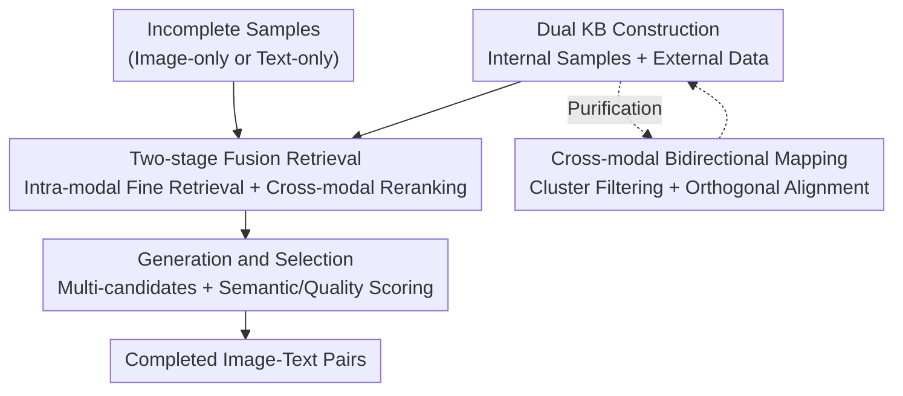

# RAG4DMC: Retrieval-Augmented Generation for Data-Level Modality Completion

**Conference**: ICLR 2026  
**OpenReview**: [https://openreview.net/forum?id=6LA7KDjNsy](https://openreview.net/forum?id=6LA7KDjNsy)  
**Code**: To be confirmed  
**Area**: Multimodal VLM / Retrieval-Augmented Generation  
**Keywords**: Missing Modality Completion, Retrieval-Augmented Generation, Dual Knowledge Base, Cross-modal Alignment, Image-Text Retrieval

## TL;DR
RAG4DMC introduces Retrieval-Augmented Generation (RAG) to "data-level missing modality completion" for the first time. By constructing a dual knowledge base from "internal complete samples + external public datasets," the method applies cross-modal mapping, cluster filtering, and orthogonal alignment for purification. It utilizes two-stage multimodal fusion retrieval to retrieve the most relevant examples, guiding a generative model to produce and select the best candidate to fill missing images or text. This leads to a maximal improvement of +5.0 in training downstream image-text retrieval and image captioning tasks on the completed data.

## Background & Motivation
**Background**: In practical acquisition, multimodal datasets often suffer from "missing modalities"—sensor failures, high labeling costs, or data corruption result in samples with only images or only text. To utilize these incomplete samples, **Missing Modality Completion (MMC)** has emerged to infer or reconstruct the missing modality from existing observations. A natural approach is to use pre-trained generative models (e.g., Diffusion models, LMMs) to conditionally generate the missing parts.

**Limitations of Prior Work**: Directly applying pre-trained generative models to "domain-specific" data often yields poor results because they are not adapted to the specific domain. Fine-tuning faces three hurdles: (i) complete samples are inherently scarce, leading to overfitting and loss of generalization; (ii) many powerful generative models only offer inference APIs and cannot be fine-tuned; (iii) fine-tuning large models is costly and resource-intensive. Existing data-level completion methods (Knowledge Bridger, GTI-MM, DiCMoR) generally suffer from hallucinations, poor generalization on rare samples, and high resource consumption.

**Key Challenge**: To generate "domain-faithful" missing modalities, one needs both in-domain knowledge (yet internal complete samples are too sparse to cover diverse cases) and external large-scale public data (yet external data is noisy and has a domain shift from the target domain, which can be counterproductive if mixed directly).

**Goal**: To introduce the RAG paradigm into MMC, two sub-problems must be addressed: (i) how to construct an effective knowledge base from available multimodal data; (ii) how to design a retrieval strategy such that retrieved contexts best enhance the generation of missing modalities.

**Key Insight**: The authors observe that RAG in NLP mitigates hallucinations by "retreiving real examples for grounding." Providing real image-text pairs as "reference answers" to generative models should make completions more faithful. However, the difficulty lies in the fact that cross-modal retrieval is hindered by the "modality gap" (even with joint encoders like CLIP, paired embeddings occupy different subspaces), and internal data is too sparse while external data is noisy.

**Core Idea**: Construct an "internal + external" dual knowledge base with triple purification (cross-modal mapping + cluster filtering + orthogonal alignment). Use a two-stage fusion retrieval process ("intra-modal fine retrieval" followed by "cross-modal reranking") to retrieve examples. Finally, generate multiple candidates and select the best based on semantic consistency—grounding the generation with retrieved real examples to complete missing modalities at the raw data level rather than the latent feature level.

## Method

### Overall Architecture
RAG4DMC processes a multimodal dataset $D=\{(x^I_t, x^T_t)\}_{t=1}^N$, where many samples only observe either the image $x^I$ or text $x^T$. The goal is to let a pre-trained generative model $G$ complete missing modalities using a dual knowledge base: $\hat{x}=G(x, R(x; K_{int}\cup K_{ext}))$, where $R(\cdot)$ denotes the retrieval process. The pipeline consists of three main stages: **constructing a purified dual knowledge base** → **two-stage fusion retrieval for incomplete samples** → **multi-candidate generation and selection**.

The three contribution modules are detailed below.

### Key Designs

**1. Purified Dual Knowledge Base: Internal for Domain Knowledge, External for Coverage**

To address the core contradiction of "sparse internal samples vs. noisy external samples," RAG4DMC forms the internal base $K_{int}=\{(x^I_i,x^T_i)\}_{i=1}^{N_c}$ from complete pairs in the target dataset and an external base $K_{ext}=\{(x^I_m,x^T_m)\}_{m=1}^M$ from public datasets like CC3M / LAION. While the internal base provides domain-specific information and the external base provides coverage, merging them introduces three problems: intra-dataset modality embedding misalignment, external noise/irrelevance, and domain shift. The paper proposes three purification techniques.

The first is **cross-modal bidirectional mapping**: using fixed pre-trained encoders $E_I, E_T$ to extract embeddings, then training a lightweight shared-parameter MLP to learn bidirectional mappings $f_{I\to T}, f_{T\to I}$. The objective is to make the mapped embedding of one modality proximal to the other:
$$L_{map}=\frac{1}{|P_{int}|}\sum_{(x^I_i,x^T_i)\in P_{int}}\big(\|f_{I\to T}(z^I_i)-z^T_i\|_2^2+\|f_{T\to I}(z^T_i)-z^I_i\|_2^2\big)$$
This allows incomplete samples to "create" pseudo-embeddings for the missing modality to use for retrieval, trained only on internal pairs (as external data is subsequently aligned). The second is **cluster filtering**: K-means is applied to both internal and external embeddings to obtain centroids $\mu$. Each external centroid is matched to the nearest internal centroid. Using "centroid-level similarity $s_{cent}$" and "instance-level similarity $s_{inst}$" with thresholds $\tau_{cent},\tau_{inst}$, entire irrelevant clusters and then outlier instances within retained clusters are pruned, improving efficiency and noise reduction. The third is **cross-domain alignment**: inspired by MUSE, CSLS is used to find Mutually Nearest Neighbors (MNN) between internal and external sources. Then, the orthogonal Procrustes problem $W^*=\arg\min_{W\in O(d)}\|Z_{int}-Z_{ext}W\|_F^2$ is solved (via SVD closed-form solution), iteratively updating MNN until $\|W^{(r)}-W^{(r-1)}\|_F<\epsilon$, rotating external embeddings into the internal semantic space. Together, these result in a semantically consistent multimodal knowledge base storing "raw data + aligned image-text embeddings."

**2. Two-Stage Multimodal Fusion Retrieval: Intra-modal Fine Retrieval for Accuracy, Cross-modal Reranking for Alignment**

To address the "modality gap" in cross-modal retrieval, the authors avoid direct cross-modal retrieval (e.g., using text to retrieve images) and design a two-stage fusion instead. Taking "image-only samples" as an example: the query image embedding $z^I_j$ is extracted, and a pseudo-text embedding $\hat{z}^T_j=f_{I\to T}(z^I_j)$ is generated. **Stage 1: Intra-modal top-k fine retrieval**—only the image-to-image similarity $s_{img}(r)=\cos(z^I_j, z^I_r)$ is compared to obtain a candidate set $A$ of $k$ neighbors. This is because intra-modal similarity is more discriminative and unaffected by the modality gap. **Stage 2: Cross-modal reranking**—candidates in $A$ are reordered using a fusion score:
$$sim_{fuse}(r)=\alpha\cos(z^I_j, z^I_r)+(1-\alpha)\cos(\hat{z}^T_j, z^T_r)$$
This essentially preserves the original image similarity while introducing cross-modal cues (pseudo-text vs. real text). The sample with the highest fusion score is selected, and its text $x^T_{r^\star}$ serves as the example. This maintains the precision of intra-modal retrieval while correcting semantic alignment via cross-modal information. Finally, the example is formatted into a prompt $P$ ("Please write two captions of the image. Caption 1: ...") and fed into the generator $\tilde{x}^T=G_{I2T}(x^I_j, P)$. The process for text-only samples is symmetric.

**3. Multi-candidate Generation + Selection: Converting Diversity into Utility**

To prevent "degenerate or unfaithful single-pass generation," RAG4DMC lets modality-specific generators ($G_{I2T}$ for image-to-text, $G_{T2I}$ for text-to-image) produce $n$ candidates to increase diversity and reduce risk. A selection mechanism then picks the most faithful and coherent one. For image-to-text, each candidate text is evaluated on "semantic alignment" and "language quality":
$$s_T(\tilde{x}^T)=\lambda_1\cdot\cos(E_T(\tilde{x}^T), \hat{z}^T)+\lambda_2\cdot\text{BLEU}(\tilde{x}^T)$$
where $\hat{z}^T$ is the pseudo-text embedding derived from the input image, and BLEU measures n-gram overlap with the retrieved example $x^T_{r^\star}$. For text-to-image, semantic similarity is combined with the no-reference image quality metric NIQE (lower is better): $s_I(\tilde{x}^I)=\lambda_1\cos(E_I(\tilde{x}^I),\hat{z}^I)-\lambda_2\text{NIQE}(\tilde{x}^I)$. The candidate with the highest score is the final completion. Experiments show performance improves as $n$ increases ($n=1$ to $n=10$, Avg R@1 rises from 47.1 to 48.1), proving that the selection mechanism effectively filters diversity into real gains.

### Loss & Training
Only the cross-modal mapping MLP requires training ($L_{map}$ loss, trained only on internal complete pairs). The encoders $E_I, E_T$ are fixed, and the generators (BLIP2 for text, Stable Diffusion XL 1.0 for images) are used with pre-trained weights without fine-tuning—avoiding the issues of "few complete samples, restricted APIs, and high costs." Hyperparameters include clustering thresholds $\tau_{cent},\tau_{inst}$, retrieval count $k$, candidate count $n$, and fusion weight $\alpha$; the main experiment sets $k=10$. For downstream evaluation, a CLIP model is trained on the completed data (AdamW, lr 1e-4, 20 epochs) for retrieval, and LLaVA is fine-tuned (LoRA, lr 2e-5, 2 epochs) for image captioning.

## Key Experimental Results

### Main Results
On general domain (MSCOCO, Flickr30K) and domain-specific (remote sensing RSICD) datasets, downstream models are trained on completed data to measure image-text retrieval (R@1/R@5) and image captioning (CIDEr/BERTScore). Main results on MSCOCO at 70% missing rate:

| Method | I2T R@1 | T2I R@1 | CIDEr | BERTScore |
|------|---------|---------|-------|-----------|
| Complete (Upper Bound) | 48.9 | 49.6 | 127.9 | 92.6 |
| Drop-Incomplete | 35.4 | 35.1 | 109.2 | 92.1 |
| Direct Generation | 41.4 | 43.9 | 112.2 | 92.2 |
| Knowledge Bridger | 42.5 | 44.5 | 112.2 | 92.2 |
| Vanilla-RAG | 44.9 | 44.6 | 113.4 | 92.3 |
| KFA-RAG | 45.9 | 46.4 | 115.8 | 92.3 |
| **RAG4DMC** | **46.6** | **47.5** | **117.2** | **92.5** |

On Flickr30K, RAG4DMC (I2T R@1 = 52.9, CIDEr = 70.4) nearly reaches the Complete upper bound (53.2 / 71.2). The paper reports up to +5.0 Avg R@1 in retrieval and +5.0 CIDEr in captioning compared to direct generation.

### Ablation Study
The authors used a series of progressive RAG variants to decompose the contribution of each module (MSCOCO, 70% missing rate):

| Configuration | Avg R@1 | Description |
|------|---------|------|
| Vanilla-RAG | ~44.8 | Retrieval grounding brings +2.2 Avg R@1 (vs Drop-Incomplete) |
| Combined-RAG | ~44.7 | Mixed internal/external without purification; noise and domain shift negate gains. |
| KFA-RAG | ~46.2 | Purification (Filtering + Alignment) adds +1.5 Avg R@1, CIDEr 113.0→115.8. |
| **RAG4DMC** | **47.1** | Fusion retrieval yields further gains, approaching oracle upper bound. |

### Key Findings
- **External data must be purified before use**: Combined-RAG barely improved over Vanilla-RAG, and on RSICD, CIDEr even dropped by 1.3% because noise disrupted language consistency. Only with filtering and alignment (KFA-RAG) did performance recover, confirming purification is a prerequisite for external data utility.
- **Fusion retrieval is critical for domain-specific data**: On RSICD (Remote Sensing), CLIP was not trained on remote sensing data, leading to a larger modality gap. Standard RAG variants (Vanilla/Combined/KFA) dropped to R@1 of 4.8–5.3, lower than non-retrieval methods. RAG4DMC’s fusion retrieval pulled performance back to 8.7, demonstrating the value of intra-modal fine retrieval.
- **Gains increase with higher missing rates**: At a 70% missing rate, RAG4DMC outperforms Vanilla-RAG by +2.3 Avg R@1; the more data is missing, the more retrieval grounding helps.
- **Optimal values for $n$ and $k$**: Performance scales with $n$ (effective selection). For $k$, performance rises up to $k=10$ then slightly drops at $k=15$ (introduction of irrelevant examples). Threshold $\tau$ is stable between 0.6–0.8, showing good robustness.

## Highlights & Insights
- **Shifting RAG from "Feature Approximation" to "Data-Level Reconstruction"**: While related work like MissRAG retrieves prototype representations to approximate missing "features" during inference, RAG4DMC is the first RAG method to truly generate missing modalities at the raw data level. It produces real image-text pairs reusable for any downstream task, rather than transient latent features.
- **"Intra-modal Fine Retrieval + Cross-modal Reranking" bypasses the modality gap**: Instead of suffering from the modality gap in direct cross-modal retrieval, using high-discriminative intra-modal similarity to define a candidate pool followed by pseudo-embedding reranking is a clever workaround. This two-stage logic is transferable to any cross-modal retrieval task.
- **Evaluating quality via "Downstream Utility"**: Measuring gains in CLIP/LLaVA training rather than pixel/token similarity is more indicative of the true purpose of completion, avoiding the subjectivity of generation quality metrics.
- **No fine-tuning of large generative models**: Training only a lightweight mapping MLP while freezing encoders and generators makes the method compatible with "inference-only" API constraints.

## Limitations & Future Work
- **Limited to Image-Text Modalities**: The framework is demonstrated on image-text pairs; its effectiveness in scenarios with audio, video, sensors, or more than two modalities remains unverified.
- **Dependence on External Dataset Availability and Relevance**: While purification handles noise, if the external base is extremely different from the target domain (e.g., specialized RSICD), the available knowledge is thin, and the gain ceiling is limited by external coverage.
- **Inference Cost of Multi-candidate Generation**: Performance improves with $n$, but generating and scoring multiple candidates per incomplete sample increases inference overhead linearly. The total cost of completing large datasets is not fully discussed.
- **Heuristic Scoring for Selection**: Metrics like BLEU, NIQE, and cosine similarity weights ($\lambda_1, \lambda_2$) require tuning. Whether weights need adjustment for different domains or if a stronger semantic discriminator could be used warrants further exploration.

## Related Work & Insights
- **vs. Non-completion methods (fusion / missing-indicator)**: These predict directly from observed modalities without explicit completion. They are simple but do not produce reusable samples. RAG4DMC generates data that is task-agnostic.
- **vs. Feature-level completion (MMIN / SMIL / MissRAG)**: These "imagine" missing features in a shared latent space. RAG4DMC reconstructs real modalities in data space, offering higher fidelity and reusability.
- **vs. Data-level completion (Knowledge Bridger / GTI-MM / DiCMoR)**: These also complete at the data level but rely on structured priors or normalizing flows, suffering from hallucinations or rare sample issues. RAG4DMC uses real-example retrieval for grounding.
- **vs. Multimodal RAG (for captioning / VQA)**: Existing multimodal RAG uses retrieval to assist downstream answer generation. RAG4DMC changes the RAG objective to "completing the training data itself" with specialized dual-base purification.

## Rating
- Novelty: ⭐⭐⭐⭐⭐ First data-level RAG for MMC; the combination of dual-base purification and two-stage fusion retrieval is solid.
- Experimental Thoroughness: ⭐⭐⭐⭐ Covers general/domain-specific datasets, multiple missing rates, and hyperparameter sensitivity. Ablations effectively decompose contributions, though limited to image-text.
- Writing Quality: ⭐⭐⭐⭐ Clear mapping between motivation, challenge, and method. Formulas are complete; some purification details are relegated to the appendix.
- Value: ⭐⭐⭐⭐ Directly addresses the practical pain point of missing modalities in multimodal datasets. Completed products are reusable and tuning-free for large models, making it deployment-friendly.

<!-- RELATED:START -->

No related papers identified.

<!-- RELATED:END -->

## Related Papers

- [\[ICLR 2026\] RAVENEA: A Benchmark for Multimodal Retrieval-Augmented Visual Culture Understanding](ravenea_a_benchmark_for_multimodal_retrieval-augmented_visual_culture_understand.md)
- [\[NeurIPS 2025\] Windsock is Dancing: Adaptive Multimodal Retrieval-Augmented Generation](../../NeurIPS2025/multimodal_vlm/windsock_is_dancing_adaptive_multimodal_retrieval-augmented_generation.md)
- [\[CVPR 2026\] RobustVisRAG: Causality-Aware Vision-Based Retrieval-Augmented Generation under Visual Degradations](../../CVPR2026/multimodal_vlm/robustvisrag_causality-aware_vision-based_retrieval-augmented_generation_under_v.md)
- [\[ACL 2026\] Utility-Oriented Visual Evidence Selection for Multimodal Retrieval-Augmented Generation](../../ACL2026/multimodal_vlm/utility-oriented_visual_evidence_selection_for_multimodal_retrieval-augmented_ge.md)
- [\[AAAI 2026\] Knowledge Completes the Vision: A Multimodal Entity-aware Retrieval-Augmented Generation Framework for News Image Captioning](../../AAAI2026/multimodal_vlm/knowledge_completes_the_vision_a_multimodal_entity-aware_retrieval-augmented_gen.md)

<!-- RELATED:END -->
