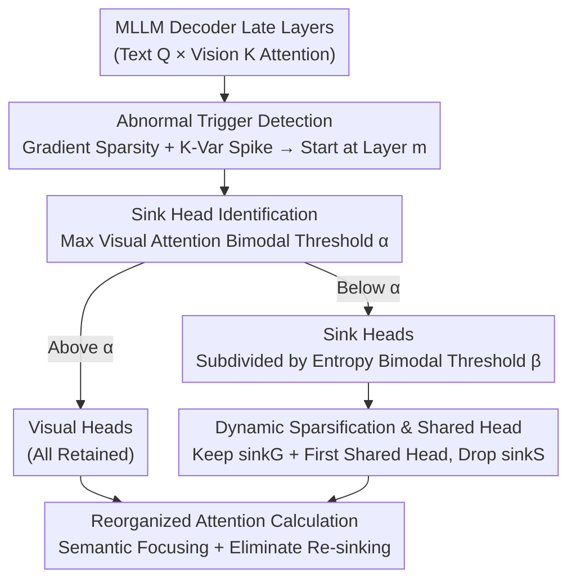

# RAR: Reversing Visual Attention Re-Sinking for Unlocking Potential in Multimodal Large Language Models

**Conference**: ICLR 2026  
**OpenReview**: [https://openreview.net/forum?id=xTbFeDhdRG](https://openreview.net/forum?id=xTbFeDhdRG)  
**Code**: To be confirmed  
**Area**: Multimodal VLM  
**Keywords**: MLLM, Visual Attention, Attention Sink, Sub-optimal Output Layer, Parameter-free Sparsification

## TL;DR
This paper discovers that the final layers of MLLMs are often inferior to intermediate layers ("sub-optimal output layers") and traces the root cause to "visual attention re-sinking." Text-only supervision causes visual token attention gradients to become sparse, forcing late-stage attention to retreat to low-semantic background tokens. The proposed parameter-free SADS framework retains all visual heads and minimal sink heads (including one shared head) during inference, outperforming standard SFT on 20 benchmarks with a 10.3% speedup.

## Background & Motivation
**Background**: MLLMs generally employ a "vision encoder + connector + LLM decoder" architecture, aligning image features into text embeddings for autoregressive generation. Recent studies consistently find a counter-intuitive phenomenon: whether in the vision encoder or the MLLM decoder, **intermediate layer representations/accuracy often exceed those of the final output layer**, suggesting that model parameter capacity is not fully activated.

**Limitations of Prior Work**: Previous works mostly remained at the "phenomenon level"—either using intermediate features for fusion to mitigate hallucinations or performing post-hoc fixes. **Few have deeply investigated "why the output layer is sub-optimal,"** let alone addressed the root cause via the training mechanism.

**Key Challenge**: The critical difference between MLLMs and pure LLMs is the necessity of fusing vision and language. However, **existing training paradigms use supervision signals that are entirely textual, lacking direct supervision for visual signals**. Consequently, gradients for visual tokens can only be backpropagated via the attention mechanism from text losses, limiting learning ability and causing the overall gradient distribution to become increasingly sparse during training.

**Key Insight**: The authors decompose visual attention into two dimensions: ① total attention allocated to images, and ② the distribution of visual attention across vision tokens. Experiments show the total amount remains stable across layers; the issue lies in the **distribution**. Early layers focus on low-information backgrounds, intermediate layers shift to semantic salient regions, and late layers retreat back to the background. This late-stage retreat is termed "visual attention re-sinking." A training-agnostic intervention (reallocating attention weights from sink tokens in the last 5 layers to semantically relevant vision tokens) yields a 0.74% accuracy gain on VQAvg, verifying it as the primary cause of sub-optimal output layers.

**Core Idea**: Since the problem is late layers "looking at backgrounds when they should look at the image," the authors propose **dynamically retaining all "visual heads" that target semantic regions in late layers while sparsifying "sink heads" that sink attention into isolated meaningless tokens**, keeping only a few sink heads for global/contextual information. This eliminates re-sinking and activates the potential of the output layer.

## Method

### Overall Architecture
The core of the RAR method is the **SADS (Sink Attention Dynamic Sparsification) framework**, a parameter-free, architecture-agnostic attention sparsification module. It operates only on the **late layers** of the decoder: SADS is triggered when a layer exhibits sparse attention gradients and an abnormal spike in Key matrix variance (signals of re-sinking). Once activated, three steps are performed for multi-head attention: first, heads are categorized into **visual heads** and **sink heads** using the bimodal distribution of "maximum visual attention"; second, sink heads are further divided into **sinkG heads** (global context) and **sinkS heads** (sub-optimal/redundant) based on the bimodal distribution of "non-visual token cross-attention entropy"; finally, attention is recomputed using only "all visual heads + retained sinkG heads + one designated shared head," discarding sinkS heads. This refocused semantic attention eliminates re-sinking and accelerates inference by reducing redundant computations.

### Key Designs

**1. Abnormal Trigger Detection: Targeting only late layers where "re-sinking" occurs**
Applying sparsification across all layers would disrupt established modal alignment in early layers. Analysis shows re-sinking has a distinct "fingerprint": attention gradients in late layers become sparse around 2,000 steps, and the number of sink heads increases around 3,000 steps. Simultaneously, the Key matrix variance of sink heads follows a trajectory of "early decline → middle plateau → late surge." High-variance keys capture higher attention weights (in $\frac{Q_t K_v^\top}{\sqrt{d_k}}$, larger key variance leads to larger weights). SADS uses the layer $m$ where K-variance fluctuations and gradient sparsity appear (e.g., layer 20 for Qwen2.5-VL-3B, layer 15 for InternVL2-2B) as the starting point.

**2. Sink Head Identification: Parameter-free thresholding via bimodal Gaussian "valleys"**
To categorize heads correctly without manual tuning or extra parameters, the authors analyze the maximum visual attention of 1,600 heads in late layers, finding a clear **bimodal distribution**: visual heads cluster at high values, and sink heads at low values. This is modeled using a Gaussian Mixture Model (GMM, EM fitting) $p(x)=\sum_{k=1}^{2}\pi_k \mathcal{N}(x\mid \mu_k,\sigma_k^2)$. The valley $\alpha=\arg\min_x p(x)$ serves as the threshold. Within sink heads, a similar logic is applied: sub-matrices for non-visual tokens $A_{sub}=A[:,I]$ are row-normalized to find the mean distribution $p_j=\frac{1}{L_q}\sum_{i=1}^{L_q}A_{sub}[i,j]$, and entropy is calculated as $H=-\sum_{j\in I}p_j\log p_j$. Entropy also follows a bimodal distribution; the valley $\beta$ separates high-entropy **sinkG** (uniform attention, global context) from low-entropy **sinkS** (attention concentrated on individual low-semantic tokens). These adaptive thresholds make the process robust to noise.

**3. Dynamic Sparsification and Shared Head: Preserving vision and essential sinks**
After identification, SADS **retains all visual heads** and high-entropy sinkG heads, while **discarding sinkS heads**—the culprits behind poor modal fusion and text-prior dominance. The **first head is designated as a shared sink head** to ensure stability and capture necessary global information. Ablation studies (Table 1) confirm this strategy: removing sinkS heads improves performance (39.5→43.8), while adding one sinkS head drops it to 43.0. During fine-tuning, this sparsification **forces the model to prioritize visual features** instead of linguistic shortcuts, reducing hallucinations and improving visual grounding.

### Loss & Training
SADS introduces no new parameters or changes to training objectives. Hyperparameters are consistent with SFT and base models. Training data consists of ~670k samples from RefCOCO, Dcube, VG, GQA, OCR-VQA, Text-VQA, and CLEVER, covering five task categories. The "training strategy" uses SADS as an attention constraint during fine-tuning to correct the "sub-optimal output layer" into a monotonically improving one.

## Key Experimental Results

### Main Results
Across five base models (Qwen2.5-VL-3B/7B/32B, InternVL2-2B, LLaVA-1.5-7B) and 20 benchmarks, RAR (SFT with SADS) consistently outperforms base and standard SFT. Representative results for Qwen2.5-VL-3B:

| Task / Dataset | Metric | Base | +SFT | +Ours(RAR) |
|--------|------|------|------|------|
| General VQA / VQAv2 | Acc | 76.7 | 77.9 | **79.7** |
| General VQA / GQA | Acc | 60.4 | 62.0 | **64.2** |
| General VQA / MMStar | Acc | 53.0 | 53.7 | **55.4** |
| OCR / TextVQA | Acc | 78.7 | 79.0 | **80.4** |
| Grounding / OVDEval | Acc | 39.5 | 39.9 | **43.8** |
| Grounding / RefCOCO/+/g | Acc | 84.2 | 84.6 | **86.8** |
| Vision-Centric / MMVP | Acc | 50.4 | 52.1 | **54.9** |
| Hallucination / CHAIR↓ | ↓ | 35.6 | 35.4 | **32.6** |
| Hallucination / POPE↑ | ↑ | 86.1 | 86.4 | **87.4** |

Notably, on **Out-of-Distribution (OOD)** benchmarks like LISA, OVDEval, and CVBench, SFT gains are minimal while RAR shows significant improvement. In hallucination tasks, SFT sometimes performs worse than the base model (language prior bias), whereas RAR consistently mitigates it.

### Ablation Study
Table 1 (OVDEval, Qwen2.5-VL-3B) verifies the role of different heads:

| Configuration | Accuracy(%) | Description |
|------|---------|------|
| Qwen2.5-VL-3B | 39.5 | Base |
| w/o sinkS head | **43.8** | Removing sinkS heads yields the highest gain |
| w/ 1 sinkS head | 43.0 | Adding one sinkS head decreases performance |
| w/o 1 sinkG head | 43.2 | Removing one sinkG head decreases performance |
| w/o 1 vision head | 42.6 | Removing one vision head causes significant drop |

Inference efficiency (Table 4, Qwen2.5-VL-3B): latency is 1.332 (base) / 1.332 (SFT) / **1.195** (Ours), achieving a **10.3% speedup** alongside accuracy improvements.

### Key Findings
- **sinkS heads are pure burdens**: Removing them increases accuracy, whereas visual, sinkG, and shared heads are indispensable for balancing semantic focus and global context.
- **Sub-optimal layers corrected**: While base/SFT accuracy declines in late layers, RAR accuracy increases monotonically. Attention heatmaps shift from "retreating to background" to "focusing on semantics."
- **SFT exacerbates gradient sparsity**: Iterative training increases gradient sparsity in late layers. RAR mitigates this, explaining why SADS scales better with data compared to SFT.

## Highlights & Insights
- **From Symptom to Mechanism**: This is the first work to systematically attribute "sub-optimal output layers" to the causal chain of "text-only supervision → visual gradient sparsity → visual attention re-sinking."
- **Parameter-free + Architecture-agnostic + Speedup**: The method introduces no learnable parameters and uses adaptive bimodal GMMs for head partitioning. It is "plug-and-play" for various models (Qwen, InternVL, LLaVA) and provides a rare win-win of accuracy and speed.
- **Transferable Discriminative Logic**: Using "bimodal Gaussian valley as a dynamic threshold" is a transferable approach for pruning, KV-cache compression, or interpretability scenarios needing to distinguish redundant heads.

## Limitations & Future Work
- The starting layer $m$ is determined empirically based on K-variance and gradient sparsity; it is not yet fully automatic for models with less obvious re-sinking signals.
- The method relies on the empirical observation of bimodal distributions. The robustness of GMM thresholds may be tested if distributions shift in different models or tasks.
- Evaluation focused on perception, grounding, and hallucinations. The impact of sparsifying sink heads on long-range context in complex multi-step reasoning remains to be validated.
- The shared head is fixed as the "first head" based on stability heuristics; learning which head to share might be more optimal.

## Related Work & Insights
- **vs. Attention Sinks in LLM**: LLM attention sinks originate from large activations in specific hidden dimensions in early layers. The visual re-sinking discovered here **lacks large activations** and follows a "presence-disappearance-reappearance" pattern across layers, indicating a different mechanism.
- **vs. Intermediate Fusion**: Previous methods (e.g., intermediate visual facts) are post-hoc fixes. RAR addresses the root cause during fine-tuning by forcing visual focus.
- **vs. Standard SFT**: RAR demonstrates superior data scalability compared to SFT, suggesting re-sinking is a hidden bottleneck in scaling MLLM performance.

## Rating
- Novelty: ⭐⭐⭐⭐⭐ SYSTEMATIC attribution of "visual attention re-sinking" to explain sub-optimal layers.
- Experimental Thoroughness: ⭐⭐⭐⭐⭐ 5 base models × 20 benchmarks across 5 task types, including gradient and scaling analysis.
- Writing Quality: ⭐⭐⭐⭐ Clear causal chain and rich visuals, though some statistical assumptions are dense.
- Value: ⭐⭐⭐⭐⭐ Parameter-free, plug-and-play, improves both accuracy and speed.

<!-- RELATED:START -->

## Related Papers

- [\[ICML 2026\] Seeing is Understanding: Unlocking Causal Attention into Modality-Mutual Attention for Multimodal LLMs](../../ICML2026/multimodal_vlm/seeing_is_understanding_unlocking_causal_attention_into_modality-mutual_attentio.md)
- [\[ICLR 2026\] Efficient Discriminative Joint Encoders for Large Scale Vision-Language Re-ranking](efficient_discriminative_joint_encoders_for_large_scale_vision-language_rerankin.md)
- [\[ICLR 2026\] InternSVG: Towards Unified SVG Tasks with Multimodal Large Language Models](internsvg_towards_unified_svg_tasks_with_multimodal_large_language_models.md)
- [\[ICLR 2026\] GranViT: A Fine-Grained Vision Model For Autoregressive Multimodal Large Language Models](granvit_a_fine-grained_vision_model_for_autoregressive_multimodal_large_language.md)
- [\[ICLR 2026\] MME-Emotion: A Holistic Evaluation Benchmark for Emotional Intelligence in Multimodal Large Language Models](mme-emotion_a_holistic_evaluation_benchmark_for_emotional_intelligence_in_multim.md)

<!-- RELATED:END -->
