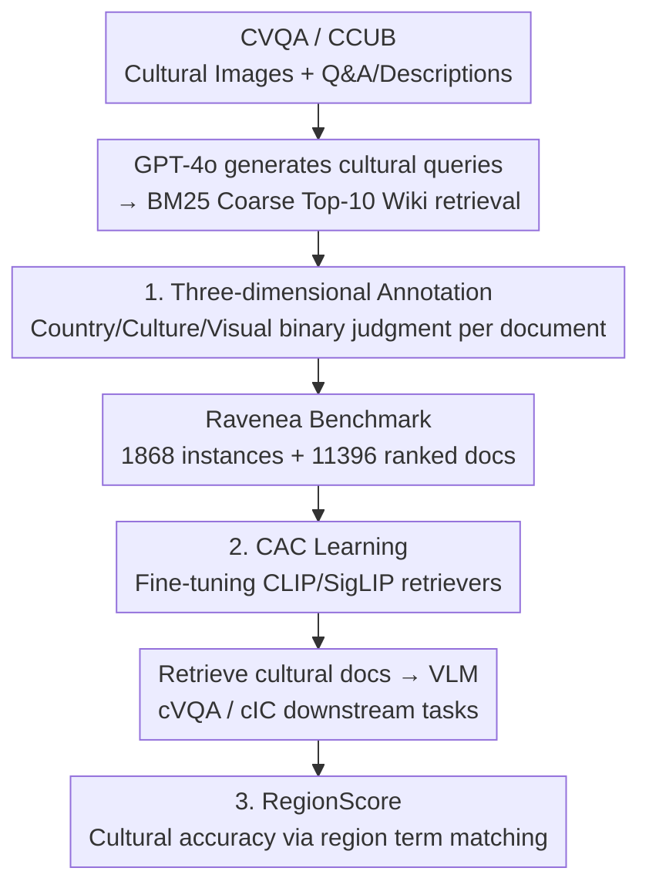

# RAVENEA: A Benchmark for Multimodal Retrieval-Augmented Visual Culture Understanding

**Conference**: ICLR 2026  
**arXiv**: [2505.14462](https://arxiv.org/abs/2505.14462)  
**Code**: [https://jiaangli.github.io/ravenea](https://jiaangli.github.io/ravenea)  
**Area**: Information Retrieval  
**Keywords**: Retrieval-Augmented Generation, Cultural Understanding, Multimodal Benchmark, Visual Question Answering, Image Captioning

## TL;DR
Ravenea is the first benchmark constructed to evaluate multimodal retrieval-augmented cultural understanding. It consists of 1,868 instances and 11,396 human-ranked Wikipedia documents covering 11 categories across 8 countries. Evaluations of 7 multimodal retrievers and 17 VLMs demonstrate that culture-aware RAG improves performance by an average of 6% on cVQA and 11% on cIC.

## Background & Motivation

**Background**: While VLMs excel at general vision-language tasks, they struggle to understand cultural nuances, such as the ritual significance of traditional attire or region-specific symbols and customs. Retrieval-Augmented Generation (RAG) has proven effective in improving cultural understanding in text-only settings, but its application in multimodal cultural scenarios remains largely unexplored.

**Limitations of Prior Work**: (a) Existing multimodal cultural datasets primarily test the cultural knowledge memorized by VLMs rather than their cultural understanding in real-world scenarios; (b) It is unclear whether current multimodal retrievers can reliably retrieve culturally relevant documents; (c) VLMs exhibit significant performance variance across different countries/cultures, showing a clear cultural bias toward Western cultures.

**Key Challenge**: VLMs are increasingly deployed in scenarios like education and assistive technologies, yet their cultural blind spots may lead to misunderstandings or even reinforce cultural biases. There is a lack of a systematic benchmark to evaluate and improve this capability.

**Goal**: (a) Construct a benchmark specifically for evaluating multimodal RAG cultural understanding; (b) Evaluate the cultural retrieval capabilities of existing retrievers; (c) Quantify the performance gains brought by RAG to VLM cultural understanding.

**Key Insight**: Leveraging two existing cultural datasets (CVQA and CCUB), the authors employ an initial BM25 retrieval followed by human re-ranking and annotation to attach culturally relevant Wikipedia documents to each image, constructing a retrieval-augmented evaluation pipeline.

**Core Idea**: Build a multimodal RAG benchmark through human-annotated cultural relevance to reveal the substantial improvements cultural-aware retrieval brings to VLM understanding.

## Method

### Overall Architecture
Ravenea aims to determine whether and to what extent "culturally relevant external documents" can improve a VLM's understanding of cultural details. The paper formulates this into a pipeline of "benchmark construction $\rightarrow$ retriever training $\rightarrow$ gain quantification." First, images are sampled from two existing cultural datasets. GPT-4o generates cultural description queries, and BM25 performs a coarse retrieval of the Top-10 documents from 6 million Wikipedia articles. Humans then label these candidates as "culturally relevant/irrelevant" to produce the Ravenea benchmark with ranked documents. A **Culture-Aware Contrastive (CAC)** retriever is fine-tuned on these labels. Finally, the "retrieved document + VLM" setup is applied to downstream tasks (cVQA / cIC), using a custom **RegionScore** to measure cultural accuracy.

### Key Designs

**1. Three-dimensional Cultural Relevance Annotation: Decomposing "Cultural Relevance" into Verifiable Binary Judgments**

Asking annotators to directly judge if a document is "culturally relevant" to an image is subjective and ambiguous. Ravenea decomposes this into three independent binary dimensions: (a) Country Relevance (Is the document related to the image's country?), (b) Cultural Content Relevance (Does it involve the cultural connotations of the image?), and (c) Visual Element Relevance (Does it correspond to visible elements in the image?). Evaluating these dimensions independently improves clarity, reaching a Cohen's $\kappa = 0.83$, and allows for fine-grained analysis (e.g., distinguishing "correct country but irrelevant culture" docs).

**2. Culture-Aware Contrastive (CAC) Learning: Adding Explicit Cultural Supervision to Retrievers**

Standard contrastive learning aligns image-text semantics without knowing which document is "more culturally relevant," leading to limited performance when retrieving cultural documents using CLIP/SigLIP. CAC fine-tunes encoders on Ravenea annotations using an equally weighted combination of loss functions:

$$\mathcal{L}_{\text{CAC}} = \frac{1}{3}(\mathcal{L}_{\text{Culture Classify}} + \mathcal{L}_{\text{Rank}} + \mathcal{L}_{\text{Diversity}})$$

The classification loss uses sigmoid binary cross-entropy to explicitly judge cultural relevance. The ranking loss uses margin ranking to separate relevant from irrelevant documents. The diversity loss constrains positive sample embeddings to prevent collapse, ensuring broad coverage in retrieval. Together, these upgrade the retriever from "semantically similar" to "culturally relevant."

**3. RegionScore Evaluation Metric: Measuring Cultural Accuracy via Simple Regional Term Matching**

A major challenge in cultural evaluation is that existing metrics (ROUGE-L, CIDEr, BERTScore, CLIPScore) correlate weakly or even negatively with human judgments of cultural accuracy. RegionScore simply checks for the presence of the target country name or its corresponding adjectives/nationalities in the generated description:

$$R(\mathbf{g}^{(i)}, I_i) = 1 \quad \text{if correct regional words appear, else } 0$$

Despite its simplicity, this binary matching aligns best with human judgment, achieving a Kendall $\tau$ of 0.442, significantly higher than other semantic metrics. This reveals a systematic blind spot in current evaluation frameworks regarding the cultural dimension.

### Loss & Training

CAC training fine-tunes CLIP/SigLIP encoders using the Ravenea annotated data with an equal weighting of the three losses. Annotation quality is ensured via multi-round independent tagging + meta-checker validation (98.2% acceptance rate), with annotators undergoing detailed training and simulation tests.

## Key Experimental Results

### Main Results

Retrieval Performance (across 7 retrievers):

| Retriever | MRR↑ | P@1↑ | nDCG@5↑ |
|-----------|------|------|---------|
| CLIP-L/14 (frozen) | 75.44 | 60.87 | 78.09 |
| SigLIP2 (frozen) | 68.62 | 54.66 | 71.44 |
| LLaVA-OV-7B | 58.85 | 37.48 | 60.34 |
| **Ravenea-CLIP (Ours)** | **82.17** | **72.05** | **84.09** |
| Ravenea-SigLIP (Ours) | 70.95 | 57.14 | 73.92 |

Downstream Tasks (17 VLMs, w/ vs w/o RAG):
- cVQA: Average Gain of +6%
- cIC: Average Gain of +11% (RegionScore)
- Lightweight models benefit more significantly.

### Ablation Study

| Analysis Dimension | Key Findings |
|--------------------|--------------|
| Retriever Type | Contrastive architectures (CLIP/SigLIP) are naturally suited for retrieval; generative models (LLaVA, VL-T5) are not. |
| Cultural Fine-tuning | Ravenea-CLIP P@1 improved from 60.87 to 72.05 (+11.18), proving the value of cultural supervision. |
| Cross-country Variance | VLM performance varies greatly by country; each model has its own "cultural preference." |
| Metric Comparison | RegionScore has the highest correlation with human judgment ($\tau=0.442$); traditional metrics correlate poorly or negatively. |

### Key Findings
- Fine-tuned contrastive retrievers (Ravenea-CLIP) achieve SOTA on all metrics, with P@1 increasing by over 11%.
- Cultural RAG is more beneficial for lightweight models, as external knowledge compensates for their limited internal knowledge base.
- Different VLMs exhibit distinct "cultural preferences," with some models understanding specific cultures significantly better than others.
- Traditional automatic evaluation metrics fail to measure cultural accuracy; RegionScore provides a meaningful, albeit preliminary, alternative.
- Generative retrieval models (LLaVA-OV-7B) unexpectedly perform worse than discriminative models (CLIP) in cultural retrieval, likely due to training objectives being misaligned with retrieval tasks.

## Highlights & Insights
- **Filling the Gap**: This is the first systematic benchmark for evaluating multimodal RAG cultural understanding, featuring a large experimental scale (7 retrievers × 17 VLMs × 8 countries × 2 tasks).
- **RegionScore Insight**: The finding that simple regional term matching reflects cultural accuracy better than complex semantic metrics reveals a blind spot in current evaluation systems.
- **Effective Simplicity of Cultural Fine-tuning**: Improving retrieval performance by 11%+ using three simple contrastive losses suggests that explicit cultural signals, rather than model scale, are key.
- **Cross-cultural Variance Analysis**: Revealing unique cultural bias patterns in different VLMs provides important insights for fairness research and future calibration methods.

## Limitations & Future Work
- Only 8 countries are covered; many cultures (e.g., Africa, Middle East, Pacific Islands) remain unrepresented.
- Wikipedia as the sole knowledge source introduces bias due to uneven coverage of different cultures.
- RegionScore only checks for country/region terms and cannot evaluate the accuracy of specific cultural details (e.g., the exact meaning of a ritual).
- Only English documents are used for retrieval; cross-lingual cultural retrieval remains unexplored.
- Despite high quality, human annotators may have their own biases when interpreting certain cultures.
- cVQA utilizes a multiple-choice format, which may not fully reflect open-ended cultural reasoning abilities.

## Related Work & Insights
- **vs CVQA (Romero et al., 2025)**: CVQA only provides Q&A pairs without external knowledge; Ravenea extends this with human-ranked Wikipedia documents for RAG evaluation.
- **vs CCUB (Liu et al., 2023)**: CCUB focuses on cultural descriptions for text-to-image generation; Ravenea reverses the direction (image-to-text) and incorporates retrieval.
- **vs Seo et al. (2025)**: While they study cultural RAG in text-only settings, Ravenea extends the paradigm to multimodal contexts.
- **Practical Implications**: Explicit cultural retrieval augmentation should be considered for any multimodal system in culturally sensitive scenarios, such as cultural heritage preservation or multicultural education.

## Rating
- Novelty: ⭐⭐⭐⭐ First multimodal RAG cultural benchmark; effectively fills an important gap.
- Experimental Thoroughness: ⭐⭐⭐⭐⭐ Large-scale evaluation across 7 retrievers and 17 VLMs with multi-dimensional analysis.
- Writing Quality: ⭐⭐⭐⭐ Well-organized, though the dataset construction section is somewhat lengthy.
- Value: ⭐⭐⭐⭐ High value for cultural fairness research, though limited by 8 countries.

<!-- RELATED:START -->

## Related Papers

- [\[ICLR 2026\] RAG4DMC: Retrieval-Augmented Generation for Data-Level Modality Completion](rag4dmc_retrieval-augmented_generation_for_data-level_modality_completion.md)
- [\[ACL 2026\] UniversalRAG: Retrieval-Augmented Generation for Multimodal Corpora](../../ACL2026/multimodal_vlm/universalrag_retrieval-augmented_generation_over_corpora_of_diverse_modalities_a.md)
- [\[ACL 2026\] Utility-Oriented Visual Evidence Selection for Multimodal Retrieval-Augmented Generation](../../ACL2026/multimodal_vlm/utility-oriented_visual_evidence_selection_for_multimodal_retrieval-augmented_ge.md)
- [\[NeurIPS 2025\] Windsock is Dancing: Adaptive Multimodal Retrieval-Augmented Generation](../../NeurIPS2025/multimodal_vlm/windsock_is_dancing_adaptive_multimodal_retrieval-augmented_generation.md)
- [\[ICLR 2026\] MME-Unify: A Comprehensive Benchmark for Unified Multimodal Understanding and Generation Models](mme-unify_a_comprehensive_benchmark_for_unified_multimodal_understanding_and_gen.md)

<!-- RELATED:END -->
