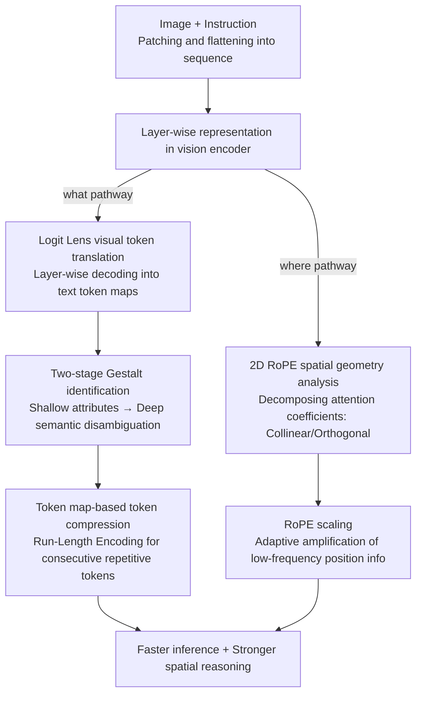

# Reading Images Like Texts: Sequential Image Understanding in Vision-Language Models

**Conference**: ICLR 2026  
**OpenReview**: [https://openreview.net/forum?id=qYcZVezPW7](https://openreview.net/forum?id=qYcZVezPW7)  
**Code**: https://github.com/Siriuslala/vlm_interp  
**Area**: Multimodal VLM / Interpretability  
**Keywords**: VLM Interpretability, logit lens, 2D RoPE, spatial awareness, token compression

## TL;DR
Drawing inspiration from the "dual-stream hypothesis" of human vision, this paper dissects VLM visual processing into "what" (object identification) and "where" (localization) pathways. By using logit lens to translate image patches into text tokens, the authors discover that the vision encoder follows a two-stage Gestalt-like process: "attribute recognition followed by object disambiguation." Furthermore, after theoretically deriving the geometric structure of spatial relations in 2D RoPE, they propose an instruction-agnostic token compression algorithm to increase speed and a RoPE scaling technique to enhance spatial reasoning.

## Background & Motivation
**Background**: Current mainstream VLMs adopt Transformer architectures where a vision encoder (ViT) splits images into patches, flattens them into 1D sequences via raster scan, projects them into text semantic space via a connector, and concatenates them with instructions for text generation. This workflow is highly effective across various real-world tasks.

**Limitations of Prior Work**: First, VLMs suffer from severe hallucinations, often misidentifying objects or misjudging spatial relationships (confusing "left of" vs. "right of"). Second, the internal mechanisms of these models remain a black box, hindering both understanding and architectural innovation. Third, existing multimodal interpretability research is fragmented, mostly focusing on "identifying neurons/attention heads corresponding to specific concepts" without a systematic characterization of the **dynamic layer-wise evolution** of visual information.

**Key Challenge**: ViT utilizes Transformers designed for "naturally ordered text." When forcing 2D images into 1D sequences, **adjacent patches of the same object are scattered across non-contiguous positions**. Human vision is Gestalt-based—actively organizing discrete signals into a whole. This raises a fundamental question: How do VLMs understand 2D concepts using 1D sequences? Does this "machine vs. human" cognitive gap impair performance?

**Goal**: Following the dual-stream hypothesis, this paper addresses two sub-problems: (1) How do VLMs associate non-contiguous tokens belonging to the same object to predict object categories? (2) How do VLMs infer 2D spatial relationships from 1D sequences?

**Key Insight**: Instead of training new models, the authors dissect "reading images" as if "reading text." Since visual tokens are eventually mapped to the text space, the language model's unembedding matrix is used to "translate" each image patch into text tokens (logit lens), transforming abstract visual representations into readable, layer-wise observable natural language.

**Core Idea**: The visual representations are translated into "text token maps" to observe the two-stage Gestalt evolution of the "what" pathway. The spatial geometry of the "where" pathway is analyzed by mathematically decomposing 2D RoPE coefficients. These findings are then implemented as practical algorithms (token compression and RoPE scaling) to validate the analysis through empirical performance.

## Method

### Overall Architecture
This paper follows a dual-path "analysis + application" structure based on the "dual-stream hypothesis." Each path involves observing a mechanism and then constructing an algorithm to verify it.

The first is the **what pathway (object identification)**: A logit lens is applied layer-wise to the vision encoder to decode each patch into text tokens, generating token maps/segmentation maps. Quantitative statistics of "attribute tokens" vs. "representative tokens (object labels)" across layers reveal a two-stage conclusion: "attribute recognition in shallow layers and semantic disambiguation in deep layers." This leads to an **instruction-agnostic token compression** algorithm based on token maps (merging consecutive repeated tokens via run-length encoding).

The second is the **where pathway (localization)**: The authors first analyze the geometry of learnable 1D absolute position embeddings (revealing clear row-column structures via t-SNE) and then focus on the more general 2D RoPE. They derive spatial relationship coefficients from the attention dot-product (showing "left-right" collinearity and "left-right vs. front-back" orthogonality), validated via PCA and intervention experiments. Finding that "discriminative terms carrying relative distance are small in magnitude and easily overwhelmed," they develop **RoPE scaling** to amplify position information in low-frequency dimensions, enhancing spatial reasoning.

### Key Designs

**1. Logit Lens visual token translation: Observing "images" as "text" layer-by-layer**

The primary challenge is that visual representations are unreadable, and deep tokens are highly entangled (self-attention mixes information from many tokens), making linear measures like cosine similarity insufficient. The authors utilize logit lens: the visual part of the $l'$-th LLM layer output $H^{l'}=(v^{l'}_1,...,v^{l'}_{N_V})$ is multiplied by the language model's unembedding matrix $W_U$, taking the argmax to obtain text tokens for each patch: $W^V=\arg\max_{w\in V}\mathrm{Softmax}(W_U[(v^{l'}_1,...,v^{l'}_{N_V})])$. To observe the ViT layer-wise, they define a family of functions $F=\{f_l\}_{l=1}^{L_V}$ by truncating the ViT after layer $l$ and applying logit lens to the LLM's $l'$-layer (e.g., $l'=25$ for LLaVA-1.5-7B). This enables the creation of **token maps** (text tokens in a grid) and **segmentation maps** (coloring patches that hit specific object keywords). This transforms visual processing into a sequence of readable "text maps." A potential concern regarding the connector being trained only on the last ViT layer is addressed by the residual flow property, where the connector inherently handles earlier layer outputs as they are linear components of the final representation.

**2. Two-stage Gestalt identification: Shallow attributes vs. Deep semantic disambiguation**

To understand how VLMs associate scattered patches into categories, the evolution of token maps on GQA samples was observed. Shallow layers contain mostly non-semantic tokens (punctuation, spaces). Shallow-to-middle layers begin to show **attribute tokens** (e.g., "fur," "yellow") representing low-level shared features. Middle-to-deep layers see these disappear as **representative tokens** (object labels like "bear," "rock") emerge. Quantitatively, attribute token ratio $r_A$ peaks around layer 15 before dropping, while $r_R$ rises. Identification is thus split into **attribute recognition** (detecting shared low-level features) and **semantic disambiguation** (integrating features into high-level concepts). POPE hallucination experiments confirm this: accuracy for [object] hits remains near 50% (random) until layer 12, after which it rises, showing the model only becomes "certain" in the middle layers. This behavior mirrors Gestalt principles of similarity/proximity (dot-product attention) and closure (prior-based gap filling).

**3. 2D RoPE spatial geometry: Collinear and Orthogonal, but with weak signal**

Focusing on 2D RoPE for "where" pathway analysis, the authors use a simplified setting: objects A and B with relations $R=\{\text{left, right, front, back}\}$. Setting B as the origin, A's positions are $(-m,0),(m,0),(0,n),(0,-n)$. Deriving A's attention output shows that RoPE only affects the weighting coefficients. Comparing "left" and "right" relations, the X-axis component $\mathrm{Re}[q_A^X k_B^{X*}e^{\pm im\theta}]$ yields conjugate symmetric terms, resulting in collinear but opposite vectors. This explains why "left/right" are geometrically opposite. "Left/right" and "front/back" information resides in orthogonal X and Y sub-spaces. Importantly, the discriminative terms carrying relative distance have much smaller magnitudes than shared object terms (due to trigonometric values $< 1$). This "drowning" of spatial signals in high-frequency dimensions $(i=d/2)$ forms a bottleneck for spatial reasoning, as shown in "object erasure" experiments on What's Up B.

**4. RoPE scaling: Amplifying low-frequency dimensions to recover spatial signals**

To address the bottleneck where spatial signals are overwhelmed by frequency decay, the authors propose RoPE scaling: $(\theta_i)'=\theta_i\cdot g(i)$, where $g(i)=1+\alpha(2i/d)^p$. This function ensures that high-index dimensions $i$ (low frequency) are significantly amplified while low-index dimensions are preserved. This compensates for the loss of positional information caused by frequency decay. This method works both training-free and via fine-tuning (on 60k GQA samples). It enhances spatial reasoning without degrading general performance on MMBench, serving as a plug-and-play trick.

### Loss & Training
Token compression requires distilling a "visual decoder" $\varphi$ (placed between the connector and LLM). It is trained using knowledge distillation with a weighted loss: $L=\alpha L_{\text{soft}}+(1-\alpha)L_{\text{hard}}=\alpha\tau^2 D_{KL}(P_T\|Q_T)+(1-\alpha)H(Y,Q)$, where $P_T$ and $Q_T$ are smoothed distributions from the teacher (LLM's final logits) and student ($\varphi$). Training is lightweight: LLaVA-1.5-7B's decoder takes ~5 hours on an A40 using <100k unlabeled data. During inference, visual token maps are flattened, and consecutive repeated tokens are compressed via Run-Length Encoding (RLE).

## Key Experimental Results

### Main Results: Token Compression (Table 1, VQA/General Ability, Multiple Datasets)

| Model / Method | GQA | TextVQA | MMBench-EN | POPE | Reduction Rate |
|------|------|------|------|------|------|
| LLaVA-1.5-7B Original | 60.50 | 45.01 | 53.73 | 85.96 | / |
| LLaVA + RLE (method1) | 61.32 | 43.16 | 51.40 | 86.00 | 27.83% |
| LLaVA + Punct. Removal Top1 (method2) | 60.14 | 35.04 | 47.33 | 85.66 | 58.35% |
| LLaVA + Punct. Removal Top2 (method3) | 61.06 | 38.53 | 50.45 | 85.90 | 48.55% |
| Qwen2.5-VL-7B Original | 61.20 | 78.21 | 84.68 | 89.23 | / |
| Qwen2.5-VL + RLE (method1) | 60.80 | 76.33 | 84.27 | 87.46 | 16.19% |
| Qwen2.5-VL + Punct. Removal Top2 (method3) | 60.03 | 74.78 | 83.58 | 86.83 | 32.09% |

Method 1 uses pure RLE; method 2 removes visual embeddings decoding into punctuation (high reduction, but hurts TextVQA); method 3 removes tokens where both top-2 decodings are punctuation. These methods significantly shorten sequences with controllable performance loss.

### Main Results: RoPE Scaling (Table 2, Spatial Reasoning Benchmarks)

| Method | What's Up A | What's Up B | COCO-spatial | GQA-spatial |
|------|------|------|------|------|
| Qwen2-VL-2B | 74.61 | 53.16 | 49.84 | 76.61 |
| + RoPE scaling | 77.27 | 58.25 | 50.24 | 78.22 |
| + SFT | 78.54 | 61.52 | 58.08 | 81.29 |
| + SFT + RoPE scaling | 79.42 | 63.48 | 59.03 | 82.24 |
| Qwen2-VL-7B | 98.06 | 87.84 | 88.79 | 92.84 |
| + RoPE scaling | 98.86 | 88.97 | 89.27 | 94.31 |
| + SFT + RoPE scaling | 99.03 | 90.44 | 89.67 | 96.98 |

Training-free RoPE scaling provides a ~5 point gain on What's Up B for the 2B model and shows consistent, complementary gains when combined with SFT.

### Key Findings
- **Object identification is a two-stage Gestalt process**: Attribute tokens peak around layer 15 before representative tokens take over; POPE accuracy only escapes random guessing after layer 12.
- **Punctuation removal is a double-edged sword**: While method 2 achieves 58.35% reduction in LLaVA, it causes TextVQA to drop from 45.01 to 35.04, indicating punctuation-related visual tokens are not redundant for text-dense tasks.
- **Spatial discriminative terms are drowned by frequency decay**: In "left-right" tasks, Y-axis attention is 1.5x larger than X-axis attention, even though the X-axis contains the discriminative info. RoPE scaling corrects this by amplifying low-frequency dimensions.

## Highlights & Insights
- **The "reading images as text" perspective is ingenious**: Using logit lens to create token maps visualizes the black box and identifies the "consecutive repeated tokens" structure for compression, serving both interpretability and efficiency.
- **Theory-Engineering Closed Loop**: The "where" pathway analysis doesn't stop at visualization; it traces coefficients down to the $\sin(m\theta)$ term, diagnosing the "small magnitude + frequency decay" issue and providing a specific mathematical "prescription" through RoPE scaling.
- **Portable Tricks**: RoPE scaling is training-free and plug-and-play. Any 2D RoPE-based VLM can utilize it to enhance spatial reasoning without sacrificing generality.

## Limitations & Future Work
- The authors admit RoPE scaling is a **local patch** for RoPE's inherent flaws; a more fundamental positional encoding to capture relative spatial relationships is needed.
- The layer-wise logit lens relies on residual flow arguments for connector validity, which is a reasonable approximation rather than a strict proof.
- Token compression lacks robustness for text-dense tasks (TextVQA); there is a clear trade-off between reduction rate and fine-grained performance.
- Theoretical analysis simplifies objects to single patches and reduces dimensions to 4; quantitative validity in high-dimensional, multi-patch scenarios requires further verification.

## Related Work & Insights
- **vs. Neo et al. / Sonia Joseph (Logit Lens)**: While they map visual tokens to labels, Ours provides a **dynamic, systematic layer-wise** characterization of ViT processing, offering the two-stage Gestalt conclusion.
- **vs. ToME (Similarity-based merging)**: ToME uses keys to measure token similarity for higher compression; Ours merges identical tokens translated to natural language, maintaining better downstream performance and instruction-agnosticism.
- **vs. Instruction-related compression**: Methods using attention scores relative to prompts may yield better rates but require re-computation for every inference and are incompatible with FlashAttention; Ours focuses on the image itself, making it more practical for deployment.

## Rating
- **Novelty**: ⭐⭐⭐⭐⭐ Dual-stream perspective + logit lens token map + 2D RoPE geometric decomposition forms a unique and coherent analysis.
- **Experimental Thoroughness**: ⭐⭐⭐⭐ Covers multiple models and benchmarks with detailed analysis, though high-dimensional theoretical validation is limited.
- **Writing Quality**: ⭐⭐⭐⭐⭐ Clear structure ("Analysis → Algorithm → Verification") with well-integrated theory and visualization.
- **Value**: ⭐⭐⭐⭐ Enhances internal understanding of VLMs while providing two practical, plug-and-play algorithms for the community.<!-- RELATED:START -->

## Related Papers

- [\[ICLR 2026\] AttTok: Marrying Attribute Tokens with Generative Pre-trained Vision-Language Models towards Medical Image Understanding](atttok_marrying_attribute_tokens_with_generative_pre-trained_vision-language_mod.md)
- [\[CVPR 2026\] A More Word-like Image Tokenization for MLLMs](../../CVPR2026/multimodal_vlm/a_more_word-like_image_tokenization_for_mllms.md)
- [\[ICLR 2026\] ERGO: Efficient High-Resolution Visual Understanding for Vision-Language Models](ergo_efficient_high-resolution_visual_understanding_for_vision-language_models.md)
- [\[ICLR 2026\] Self-Evolving Vision-Language Models for Image Quality Assessment via Voting and Ranking](self-evolving_vision-language_models_for_image_quality_assessment_via_voting_and.md)
- [\[CVPR 2026\] Beyond Single Images: A Comprehensive Benchmark for Album-Level Vision-Language Understanding](../../CVPR2026/multimodal_vlm/beyond_single_images_a_comprehensive_benchmark_for_album-level_vision-language_u.md)

<!-- RELATED:END -->
