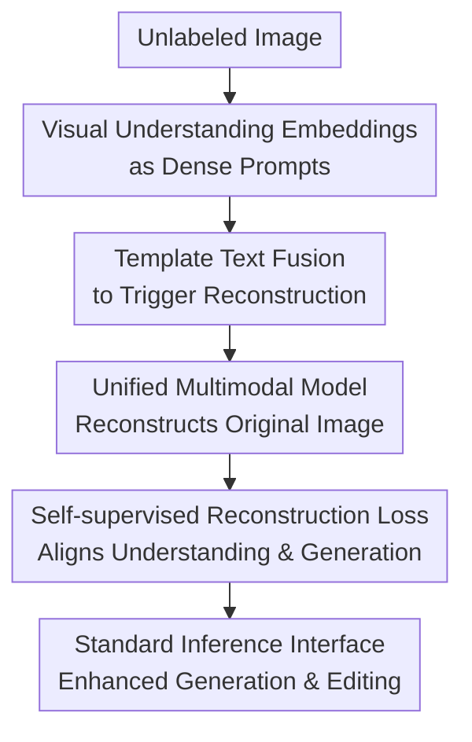

# Reconstruction Alignment Improves Unified Multimodal Models

**Conference**: ICLR 2026  
**OpenReview**: [https://openreview.net/forum?id=ppQWp8yrm7](https://openreview.net/forum?id=ppQWp8yrm7)  
**Paper**: [Project Page](https://reconstruction-alignment.github.io/)  
**Code**: To be released  
**Area**: Multimodal VLM  
**Keywords**: Unified Multimodal Models, Reconstruction Alignment, Visual Understanding Encoder, Image Generation, Image Editing

## TL;DR
RECA treats the visual understanding embeddings of a Unified Multimodal Model (UMM) as dense "visual prompts." By re-aligning the understanding and generation branches through post-training with unlabeled image reconstruction, it significantly improves 1.5B UMMs on GenEval, DPGBench, and image editing benchmarks without requiring extra captions, GPT-4o distillation, or reinforcement learning.

## Background & Motivation
**Background**: Unified Multimodal Models (UMMs) aim to perform visual understanding, text understanding, image generation, and image editing within a single model. Unlike conventional diffusion models that only handle generation, UMMs typically feature a visual understanding encoder, a language model backbone, and some form of image generation head. Theoretically, the ability to "understand images" should transfer to "generating images": the model should be able to answer "what is this" and draw the corresponding content based on instructions.

**Limitations of Prior Work**: In practice, this does not happen smoothly. Conventional training relies mainly on image-text pairs or multimodal sequences, where captions serve as sparse descriptions of images. Even with hundreds of words, captions easily miss textures, geometry, occlusion relationships, inter-object positions, atypical attributes, and artistic styles. Models thus learn default correlations from training corpora; for example, broccoli is typically green, so when faced with rare combinations like "yellow broccoli," the understanding branch might know what it is, but the generation branch remains biased toward drawing it green.

**Key Challenge**: The understanding side of UMMs can already compress images into semantically rich visual embeddings, but the generation side primarily learns from sparse text prompts during training. Consequently, a gap exists where "understanding is dense but generation supervision is sparse." Details captured by the visual understanding encoder are not fully utilized to train generative capabilities, leading to misalignment between understanding and generation.

**Goal**: The authors aim to provide a low-resource post-training method for existing UMMs rather than designing a new generator. Specific goals include: using only unlabeled images without manual captions or extra annotations; adapting to various UMM architectures (discrete tokens, masked autoregressive, continuous diffusion); and maintaining the original inference interface so that no additional input is needed for text-to-image or image editing tasks.

**Key Insight**: The critical observation is that embeddings from visual understanding encoders (e.g., CLIP, SigLIP, InternVL3, MAE variants) already reside in a language-aligned semantic space and can be consumed by the language model backbone like dense text prompts. Since captions are not dense enough, the visual embeddings obtained from the understanding encoder can be sent back into the model to let the generation side learn to reconstruct the original image from these semantic embeddings.

**Core Idea**: Replace sparse "caption $\rightarrow$ image" supervision with a self-supervised "visual understanding embedding $\rightarrow$ original image reconstruction" objective. This treats the image itself as the densest possible prompt to calibrate the UMM's understanding-generation pathway.

## Method

### Overall Architecture
The RECA (Reconstruction Alignment) pipeline is straightforward: given an unlabeled image, its semantic embeddings are first extracted using the UMM’s visual understanding encoder. These embeddings are then concatenated with a template text (e.g., "Please describe the image in detail") as a multimodal input. Finally, the same UMM is tasked with generating or reconstructing the original image, and generation-related parameters are updated using a reconstruction loss. Post-training, the model functions like a standard UMM during inference: text-to-image only requires text, and image editing only requires the original image and editing instructions, with no need for visual embeddings.

Unlike feeding longer captions to the model, RECA's target of supervision is the image itself rather than text. It does not require the model to translate the image into words first; instead, it teaches the model how the generative side should use these embeddings to restore visual content when the understanding embeddings already contain color, spatial layout, object attributes, and semantic relationships.

### Key Designs
**1. Visual Understanding Embeddings as Dense Prompts: Bypassing the Caption Information Bottleneck**

Traditional T2I training can be formulated as $L_{t2i}=L(f_\theta(t_{prompt}), I_{gt})$, where $t_{prompt}$ is a caption or generation prompt and $I_{gt}$ is the ground-truth image. Even long captions are compressed human language descriptions that naturally lose details. RECA replaces sparse text with visual understanding embeddings $h_v$, changing the objective to $L_{RECA}=L(f_\theta(\mathrm{concat}(t_{template}, h_v)), I_{gt})$.

Here, $h_v$ is not a pixel-heavy generative code from a VAE or VQ-GAN, but semantic embeddings from the understanding branch. The intuition is that since the UMM's understanding encoder is trained to align with language space, visual and textual concepts share a semantic manifold in deep features. This allows it to act as a "text prompt" denser than any caption, directly addressing the generation-understanding gap.

**2. Reconstruction Alignment as a Post-training Objective: Calibrating Generation with Unlabeled Images**

RECA does not change the primary UMM architecture but introduces a self-supervised reconstruction task during post-training. The input consists of embeddings from the understanding encoder plus a prompt template; the output target is the same image or its latent/token representation. For discrete autoregressive or MaskGIT-style models, the loss can be cross-entropy; for continuous diffusion or flow-matching models, it can be a diffusion/flow reconstruction loss. By denoting the generation paradigm broadly as $L(\cdot, \cdot)$, RECA remains architecture-agnostic.

The total training objective is $L_{total}=\lambda_{RECA}L_{RECA}+\lambda_{i2t}L_{i2t}+\lambda_{t2i}L_{t2i}$. In experiments, $\lambda_{RECA}=1$ and $\lambda_{t2i}=0$. If understanding and generation share parameters (e.g., Show-o, Harmon), $\lambda_{i2t}=1$ is kept to avoid degradation of visual understanding. If the modules are decoupled (e.g., OpenUni, BAGEL), the understanding side is frozen with $\lambda_{i2t}=0$. This makes RECA a "last-mile calibration" that avoids training from scratch or using expensive human preference/GPT-4o data.

**3. Semantic Layer Reconstruction vs. Pixel Copying: Selecting Understanding Encoders and Low Input Resolution**

The paper distinguishes between visual understanding encoders and visual generation encoders. In ablations with BAGEL, using embeddings from a generation encoder like VAE resulted in a GenEval score of only 78.5 and DPG of 83.92, which is near or below the baseline. Conversely, using an understanding encoder like ViT/SigLIP at 224×224 reached GenEval 82.4 and DPG 85.29. This indicates that RECA's effectiveness stems from semantic cues rather than providing more pixel-level clues to the generator.

The authors also found that blindly increasing the input resolution of the understanding encoder is counterproductive. In BAGEL, 224×224 embeddings outperformed 512×512 because high-resolution embeddings retain more low-level pixel details, encouraging the model to rely on local textures instead of learning semantic alignment. Show-o's VQGAN variant showed similar risks where 512×512 reconstruction cross-entropy dropped nearly to zero as the model simply "copied tokens." Reducing input to 256×256 or applying blur mitigates this token-copying collapse.

**4. Maintaining Inference Interface: Self-supervised Path During Training, Zero Extra Cost at Deployment**

RECA is easily applicable because it only modifies the training phase. During training, the image is fed into the model as a dense image prompt for reconstruction. During inference, this reconstruction input does not exist; the model uses the original UMM interface. T2I tasks use only text prompts, and image editing tasks use the original image plus editing instructions. This differentiates RECA from heavier post-training methods that require extra decoders, verifiers, or RL rewards. It is also orthogonal to classifier-free guidance (CFG).

### Key Findings
Using the "yellow broccoli" problem as an example: a standard UMM might recognize yellow broccoli in a VQA task, but when asked to "generate a yellow broccoli," the generation branch—biased by training data—draws it green. RECA training samples do not need a caption stating "this is a yellow broccoli"; instead, a yellow broccoli image is fed into the understanding encoder to get $h_v$ (which contains object and atypical color attributes), and the model is required to reconstruct the image from $h_v$. If the model tries to draw it green, the reconstruction loss penalizes this understanding-generation mismatch. This mechanism specifically improves color binding, object positioning, and identity preservation in image editing.

### Loss & Training
The core loss of RECA is:

$$
L_{RECA}=L(f_\theta(\mathrm{concat}(t_{template},h_v)), I_{gt})
$$

Where $t_{template}$ is the trigger template, $h_v$ is the understanding encoder output, and $I_{gt}$ is the target image/latent. The total objective is:

$$
L_{total}=\lambda_{RECA}L_{RECA}+\lambda_{i2t}L_{i2t}+\lambda_{t2i}L_{t2i}
$$

In experimental setups, $\lambda_{RECA}=1$ and $\lambda_{t2i}=0$. Shared-parameter models keep $\lambda_{i2t}=1$, while decoupled models freeze the understanding component and set $\lambda_{i2t}=0$. The authors use 360 templates expanded by GPT-o3 to prevent overfitting to a single prompt format. Training data includes MidjourneyV6, LLaVA Mix-665K, and 10,000 FLUX-generated images for BAGEL. Main experiments deliberately exclude GPT-4o-Image distillation data to avoid template leakage on GenEval.

## Key Experimental Results

### Main Results
RECA's most compelling results are for Harmon-1.5B: without GPT-4o-Image distillation or RL, it improves GenEval overall from 0.73 to 0.86 and DPGBench from 80.93 to 87.21, outperforming several larger open-source models. Combined with GPT-4o-Image data, it reaches GenEval 0.90 and DPGBench 88.15.

| Model | Params | GenEval Overall ↑ | DPGBench ↑ | Note |
|-------|--------|-------------------|------------|------|
| Harmon baseline | 1.5B | 0.73 | 80.93 | Author repro, 12 seeds |
| Janus-Pro | 7B | 0.80 | 84.33 | Larger UMM |
| BAGEL baseline | 14B | 0.79 | 84.03 | Larger UMM |
| GPT-4o-Image | - | 0.84 | 86.23 | Private model |
| RECA | 1.5B | 0.86 | 87.21 | No GPT-4o dist./RL |
| RECA + GPT-4o data | 1.5B | 0.90 | 88.15 | w/ Distillation data |

Cross-architecture results demonstrate RECA is not limited to a specific backbone. Show-o, OpenUni, Harmon, and BAGEL all show gains, with particularly significant improvements in positional and color attributes for Harmon and OpenUni.

| Architecture | Paradigm | Baseline GenEval | RECA GenEval | Baseline DPG | RECA DPG |
|--------------|----------|------------------|--------------|--------------|----------|
| Show-o-512 | Discrete/MaskGIT | 66.2 | 72.3 (+6.1) | 82.21 | 84.94 (+2.73) |
| OpenUni-3.6B | Continuous Diff | 61.9 | 74.1 (+12.2)| 79.02 | 82.75 (+3.73) |
| Harmon-1.5B | MAR | 72.9 | 85.7 (+12.8)| 80.93 | 87.21 (+6.28) |
| BAGEL | Continuous Diff | 78.8 | 82.4 (+3.6) | 84.03 | 85.29 (+1.26) |

### Ablation Study
Ablations show that RECA improves alignment more effectively than standard SFT on the same data. When using both SFT and RECA, the sequence "SFT followed by RECA" is significantly better.

| Config | GenEval ↑ | DPG ↑ | Note |
|--------|-----------|-------|------|
| MidjourneyV6 + SFT | 74.76 | 80.89 | Standard I2T supervision |
| MidjourneyV6 dense caption + SFT | 74.05 | 80.67 | Dense captions don't solve the core issue |
| MidjourneyV6 + RECA | 85.69 | 87.21 | Self-supervised recon is stronger |

| Training Order | GenEval ↑ | DPG ↑ | Explanation |
|----------------|-----------|-------|-------------|
| RECA $\rightarrow$ SFT | 85.91 | 85.67 | Subsequent SFT dilutes alignment |
| SFT $\rightarrow$ RECA | 89.00 | 87.50 | Coarse alignment then RECA refinement |

| Visual Condition | Resolution | GenEval ↑ | DPG ↑ | ImgEdit ↑ | GEdit ↑ |
|------------------|------------|-----------|-------|-----------|---------|
| Baseline | - | 78.8 | 84.03 | 3.38 | 6.94 |
| VAE encoder | 256×256 | 78.5 | 83.92 | 3.63 | 7.08 |
| ViT encoder | 224×224 | 82.4 | 85.29 | 3.75 | 7.27 |
| ViT encoder | 512×512 | 79.2 | 84.61 | 3.68 | 7.18 |

### Key Findings
- RECA's improvements are concentrated in semantic alignment subtasks, especially color, color attributes, spatial relations, and complex object compositions (e.g., Harmon-1.5B spatial score jumped from 44.9 to 75.7).
- Gains in counting are limited. The authors suggest counting involves mid-level visual features that are difficult to extract from linguistic semantic embeddings.
- Image editing improved significantly for BAGEL-RECA across substitution, addition, composition, and identity preservation.
- Visual understanding capabilities were not sacrificed (e.g., Harmon MME score increased slightly from 1195 to 1223).
- T2I-CompBench results show RECA improves 3D spatial, shape, texture, and numeracy across architectures.

## Highlights & Insights
- **The image itself is the densest caption**: Instead of generating longer captions or distilling stronger models, RECA uses understanding embeddings as dense prompts to let the image supervise the image.
- **Wide architecture coverage**: The same training paradigm works across discrete, MAR, and continuous diffusion UMMs, addressing structural misalignment.
- **Resolution Insight**: Higher resolution is not always better for RECA; semantic reconstruction is the goal, and too much pixel-level information can lead to shortcut learning (token copying).
- **Clear positioning in post-training pipelines**: SFT is suitable for coarse image-text alignment, while RECA is ideal as a low-cost "last-mile" stage for fine-grained semantic fidelity.

## Limitations & Future Work
- RECA primarily improves visual attributes that are easily linguisticized; performance on tasks like counting remains limited.
- It depends on the quality of the UMM's existing visual understanding encoder (e.g., gains are smaller for Show-o's CLIP encoder).
- It relies on the understanding encoder's semantic mapping; if the encoder incorrectly maps a "pink banana" to the "pink shoe" manifold code, RECA will reinforce that wrong projection rather than correcting it.
- While it shows a scaling trend from 10k to 240k images, its stability at massive scales or for video/3D inputs is yet to be proven.

## Related Work & Insights
- **vs. Standard/Dense SFT**: SFT is limited by the language bottleneck of captions; RECA uses understanding embeddings to bypass this for spatial, color, and attribute binding.
- **vs. GPT-4o-Image Distillation**: Distillation is expensive and prone to template leakage; RECA is cheaper and more robust when leakage data is removed.
- **vs. Representation Alignment (REPA, VA-VAE)**: These often align DiT/VAE states to external encoders; RECA targets UMMs by treating understanding embeddings as input conditions.
- **vs. Reconstruction Tuning (ROSS)**: Methods like ROSS add auxiliary decoders for understanding; RECA uses the model's own generative path to improve generation.

## Rating
- Novelty: ⭐⭐⭐⭐☆ Simple but addresses the structural misalignment of unified models effectively.
- Experimental Thoroughness: ⭐⭐⭐⭐⭐ Covers multiple architectures, paradigms, editing/understanding tasks, and rigorous leakage analysis.
- Writing Quality: ⭐⭐⭐⭐☆ Clear logic and illustrative figures; some appendix results are dense.
- Value: ⭐⭐⭐⭐⭐ Extremely practical for training UMMs: low-cost, unlabeled data, and zero inference overhead.

<!-- RELATED:START -->

## Related Papers

- [\[ICLR 2026\] MME-Unify: A Comprehensive Benchmark for Unified Multimodal Understanding and Generation Models](mme-unify_a_comprehensive_benchmark_for_unified_multimodal_understanding_and_gen.md)
- [\[ICLR 2026\] Modal Aphasia: Can Unified Multimodal Models Describe Images From Memory?](modal_aphasia_can_unified_multimodal_models_describe_images_from_memory.md)
- [\[ICLR 2026\] Unified Vision-Language Modeling via Concept Space Alignment](unified_vision-language_modeling_via_concept_space_alignment.md)
- [\[ICLR 2026\] ORION: Decoupling and Alignment for Unified Autoregressive Understanding and Generation](orion_decoupling_and_alignment_for_unified_autoregressive_understanding_and_gene.md)
- [\[ICLR 2026\] Visual Jigsaw Post-Training Improves MLLMs](visual_jigsaw_post-training_improves_mllms.md)

<!-- RELATED:END -->
