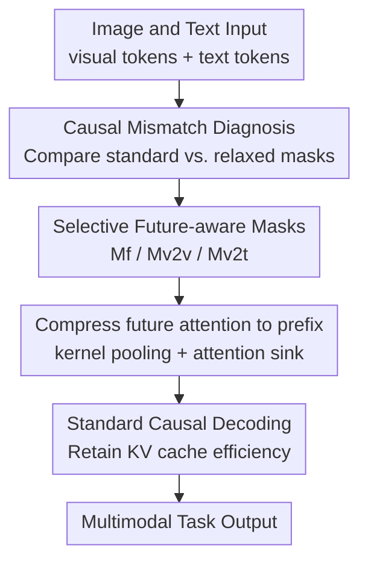

# Rethinking Causal Mask Attention for Vision-Language Inference

**Conference**: ICLR2026  
**OpenReview**: [https://openreview.net/forum?id=DuDFytFC5Z](https://openreview.net/forum?id=DuDFytFC5Z)  
**Code**: To be confirmed  
**Area**: Multi-modal VLM  
**Keywords**: Causal attention, VLM inference, Visual token, future-aware mask, Inference acceleration  

## TL;DR
This paper re-evaluates the rationality of decoder-only VLMs inheriting the causal mask from LLMs. It finds that allowing visual tokens to "see" future visual/textual context during the prefill stage improves performance in multi-image, visual relationship, and text-dense QA tasks. The authors propose a lightweight future-aware attention that compresses future attention into prefix positions, retaining most benefits while maintaining causal decoding and low latency.

## Background & Motivation
**Background**: Current mainstream VLMs typically convert images into a sequence of visual tokens via a visual encoder, concatenate them with text tokens, and feed them into a decoder-only LLM. To remain compatible with auto-regressive generation, multi-modal sequences follow the LLM's left-to-right causal mask: the $i$-th token can only attend to positions $j \le i$, while future positions are masked by $-\infty$.

**Limitations of Prior Work**: This rule is logical for text generation as "peeking" at future words violates linguistic causality. However, visual information is not naturally a 1-D sequence. Semantics in image patches, continuous frames, or multi-image inputs require global comparison. Later visual tokens may contain objects, state changes, or spatial relationships necessary for understanding current patches. Strictly masking future context for visual tokens leads to the loss of available visual cues during the prefill stage.

**Key Challenge**: Visual encoders already extract global or local semantics at the image level, but upon entering the LLM, these tokens are forced into a unidirectional sequence by the textual causal mask. Visual understanding requires a more complete context, whereas the auto-regressive framework demands no leakage of future generated content; the two are not perfectly aligned for visual tokens.

**Goal**: The authors aim to answer three questions: First, whether causal attention inherited from LLMs is truly suitable for visual tokens in VLMs; second, if constraints are relaxed, whether visual queries should attend to future visual tokens, future text tokens, or both; third, whether future semantics can be injected into the inference process without breaking standard causal decoding or KV cache efficiency.

**Key Insight**: Instead of retraining a VLM or changing the architecture, this paper performs a mechanistic analysis of the inference-time attention mask. This approach is direct: by only changing the prefill attention mask for the same LLaVA checkpoint across the same tasks, the impact of future visibility for visual tokens can be observed.

**Core Idea**: Maintain strict auto-regression for text tokens while selectively opening future visual or textual attention for visual queries. Future attention scores are then compressed into prefix/attention sink regions using pooling, allowing the model to indirectly acquire future visual semantics while still decoding via a standard causal mask.

## Method
### Overall Architecture
The method consists of two layers: first, defining three types of future-aware causal masks for empirical analysis; second, proposing the light future-aware attention family to compress future attention scores back to past prefix positions, ensuring the final attention pattern remains a standard lower triangular matrix. The input is the common $X=x_v \oplus x_t$, and the output is auto-regressively generated by the original VLM without parameter tuning.

Standard causal masks are defined as $M^c_{i,j}=0$ if $j\le i$, otherwise $M^c_{i,j}=-\infty$. The key design modifies only the upper triangular regions of visual queries: when $i\in V$, the query selectively accesses future positions; when $i\in T$, it reverts to the original causal mask. This prevents text generation from peeking at future answers while allowing visual tokens to absorb fuller context during prefill.

### Key Designs
**1. Causal Mismatch Diagnosis: Proving "text-style left-to-right" is not a natural constraint for visual reasoning**

The paper decomposes the VLM input into visual tokens $V=[1,m]$ and text tokens $T=[m+1,m+n]$, with attention scores calculated as $B(x_v,x_t)=(Q_v\oplus Q_t)(K_v\oplus K_t)^\top/\sqrt d$. Conventional VLMs treat visual patches and text tokens identically within the causal mask $h_\theta(x_v,x_t;M^c)=\mathrm{Softmax}(B+M^c)$. 

However, visual token order is often just a flattened spatial index. A patch in the bottom-right is not "future" compared to one in the top-left. In multi-image tasks, subsequent frames provide necessary evidence for current actions. Forcing visual queries to look only backward results in a loss of cross-patch and cross-frame comparison. Preliminary results on tasks like ALFRED show that while breaking causality between text tokens disrupts predictions, relaxing it for visual tokens often improves performance.

**2. Selective Future-Aware Masks: Categorizing "looking ahead" into full, visual-to-visual, and visual-to-textual**

To refine the concept of vision looking ahead, three masks are defined. First, **Future-Aware Full Mask** $M^f$: for any visual query $i\in V$, all future positions are visible ($j\le i$ or $j>i, i\in V$). This allows visual tokens to preview future images and text, suitable for tasks requiring global timelines.

Second, **Future-Aware Visual-to-Visual Mask** $M^{v2v}$: visual queries can see future visual tokens, but future text tokens remain masked. This specifically targets visual relationship reasoning where the core information resides between visual tokens.

Third, **Future-Aware Visual-to-Textual Mask** $M^{v2t}$: visual queries can see future text tokens but not future visual tokens. This is beneficial for text-dense tasks (e.g., OCR-VQA, TextVQA) where visual regions must align with subsequent text prompts or questions. In all masks, text queries remain strictly auto-regressive.

**3. Future Attention Compression: Retaining semantic gains without sacrificing decoding efficiency**

opening future attention scores naively breaks standard KV cache efficiency during decoding. The **light future-aware attention** family moves most costs to the prefill stage: it identifies attention scores that are valid under $\mu\in\{M^f,M^{v2v},M^{v2t}\}$ but located in the future region, then aggregates these scores using 1D kernel pooling.

These aggregated semantics are merged into past regions, specifically the prefix/attention sink tokens. The final attention is formulated as $h'_\theta(x_v,x_t;\mu)=B(x_v,x_t)+C(B,\mu)+M^c$. Thus, the model "summarizes" future visual signals into past anchor points during prefill, allowing subsequent generation to benefit from future context while strictly following a lower triangular pattern.

**4. Task-Dependent Mask Selection**

The study finds that different tasks require different future contexts. **Temporal multi-image** tasks benefit more from $M^f$ or $M^{v2v}$ due to long-range dependencies across frames. **Visual relation** tasks benefit from $M^{v2v}$ for cross-image alignment. **Text-dense visual QA** (OCR-VQA) benefits most from $M^{v2t}$, as it allows visual queries to access future textual cues. Future-aware attention acts as a modality-aware inference knob rather than a blind violation of causality.

### Mechanism
In a multi-image navigation task, standard causal masks prevent early visual tokens from utilizing evidence (e.g., "goal object found") appearing in later frames. With $M^f$, early visual queries can integrate the entire sequence during prefill. Using the light focus merge, these high-response future scores are pooled and pushed to the first prefix token. During decoding, the action tokens access this prefix to read compressed future scene semantics, explaining why $M^f+merge$ approaches the performance of full future-aware masks with significantly lower latency.

### Loss & Training
This work is primarily an inference-only method and does not introduce new training losses or update LLaVA parameters. All mask variants are applied by substituting or augmenting the attention mask during inference. 

The authors also explored training-related extensions: fine-tuning LIBERO-Spatial on OpenVLA-OFT with future-aware masks increased success rates from 84.7% to 85.1%, and using a lightweight MLP adapter to learn mask selection improved performance on various benchmarks. However, the core contribution remains the training-free inference analysis.

## Key Experimental Results
### Main Results
Evaluated on LLaVA-7B and LLaVA-13B using MILEBench, covering various scenarios.

| Model | Method | CLEVR | Nav | Moving | Object | SpotDiff | TQA |
|------|------|-------|-----|--------|--------|----------|-----|
| LLaVA-7B | $M^c$ | 0.166 | 0.310 | 0.490 | 0.485 | 0.162 | 0.320 |
| LLaVA-7B | $M^{v2v}$ | 0.177 | 0.325 | 0.515 | 0.500 | 0.167 | 0.385 |
| LLaVA-7B | $M^{v2t}$ | 0.181 | 0.320 | 0.490 | 0.495 | 0.165 | 0.385 |
| LLaVA-7B | $M^f$ | 0.187 | 0.320 | 0.505 | 0.505 | 0.171 | 0.400 |
| LLaVA-7B | $M^f$+merge | 0.188 | 0.320 | 0.505 | 0.490 | 0.173 | 0.375 |

$M^f$ significantly improves performance on CLEVR, Object, SpotDiff, and TQA. The merge version retains these gains (e.g., 7B CLEVR 0.166 → 0.188), though some tasks show minor degradations due to compression loss.

### Ablation Study
Ablations focus on mask types, merging efficiency, and pooling robustness.

| Configuration | Key Metric | Description |
|------|----------|------|
| $M^c$ | Baseline on temporal tasks | Standard causal mask; safe for text, restricts visual context |
| $M^f$ | AP 39.8→39.9, VN 31→32 | Full future visibility; stable gains for multi-image and navigation |
| $M^{v2v}$ | VCC 16.2→16.7, VRE 16.6→18.1 | Future visual-only; best for visual relations and differences |
| $M^{v2t}$ | TextVQA 32.0→38.5 | Future text-only; largest gains for text-dense visual QA |
| $M^f$+merge | Latency 83.18→26.54 ms/token | Approx. 3x speedup via standard causal decoding recovery |

Kernel pooling is found to be robust to hyperparameters (pool size 1 to 25); both max and mean pooling yield similar results, suggesting the mechanism of "compressing future semantics to sinks" is the primary driver.

### Key Findings
- Future visibility for visual tokens is beneficial but task-dependent (Temporal, Relation, and OCR tasks benefit most).
- Text tokens must remain strictly causal; breaking text causality disrupts predictions.
- $M^{v2v}$ and $M^{v2t}$ serve different alignment needs (visual-visual vs. visual-text).
- Light future-aware merge shifts costs to prefill, reducing decoding latency from 43-83 ms/token to ~26 ms/token.
- Merging attention into the first prefix token is highly effective, indicating attention sinks can act as semantic aggregation points.

## Highlights & Insights
- The research challenges a fundamental, often unquestioned design: whether visual tokens should follow a left-to-right causal mask.
- The clean decomposition into $M^f$, $M^{v2v}$, and $M^{v2t}$ allows for granular factor analysis of multi-modal future context.
- The merge strategy is practical, bypassing the conflict between future attention and KV cache efficiency by utilizing the attention sink phenomenon.
- This work is particularly relevant for long-context multi-modality. Rather than simply extending context lengths, modality-aware mask design offers a cheaper path to inference enhancement.

## Limitations & Future Work
- **Limitations**: Primarily tested on image→text sequences; interleaved image-text scenarios need more evaluation. Mask selection is currently manual; automated routing is promising but not the main focus. Merging into a single prefix may lose fine-grained token-to-token details. 
- **Future Work**: Exploration of multi-sink tokens, task-adaptive prefix ratios, and hierarchical pooling. Extension to modern models beyond the LLaVA series and different visual encoders.

## Related Work & Insights
- **Standard VLMs**: LLaVA, InternVL, etc., inherit LLM causal masks. This work highlights that this constraint is overly restrictive for visual tokens.
- **StableMask**: Adjusts causal masks in LLMs. This paper extends the concept to multi-modal settings, emphasizing modality-specific causality.
- **Inference Optimization**: Unlike KV cache pruning which focuses on efficiency, this work prioritizes first discovering useful future semantics and then engineering compatibility with efficiency.

## Rating
- Novelty: ⭐⭐⭐⭐☆
- Experimental Thoroughness: ⭐⭐⭐⭐☆
- Writing Quality: ⭐⭐⭐⭐☆
- Value: ⭐⭐⭐⭐☆

<!-- RELATED:START -->

## Related Papers

- [\[ICML 2026\] Seeing is Understanding: Unlocking Causal Attention into Modality-Mutual Attention for Multimodal LLMs](../../ICML2026/multimodal_vlm/seeing_is_understanding_unlocking_causal_attention_into_modality-mutual_attentio.md)
- [\[ICLR 2026\] Pay Less Attention to Function Words for Free Robustness of Vision-Language Models](pay_less_attention_to_function_words_for_free_robustness_of_vision-language_mode.md)
- [\[ICLR 2026\] Capacity-Aware Inference: Mitigating the Straggler Effect in Mixture of Experts](capacity-aware_inference_mitigating_the_straggler_effect_in_mixture_of_experts.md)
- [\[CVPR 2026\] BiomedCCPL: Causal Conditional Prompt Learning for Biomedical Vision-Language Models](../../CVPR2026/multimodal_vlm/biomedccpl_causal_conditional_prompt_learning_for_biomedical_vision-language_mod.md)
- [\[ACL 2026\] From Heads to Neurons: Causal Attribution and Steering in Multi-Task Vision-Language Models](../../ACL2026/multimodal_vlm/from_heads_to_neurons_causal_attribution_and_steering_in_multi-task_vision-langu.md)

<!-- RELATED:END -->
