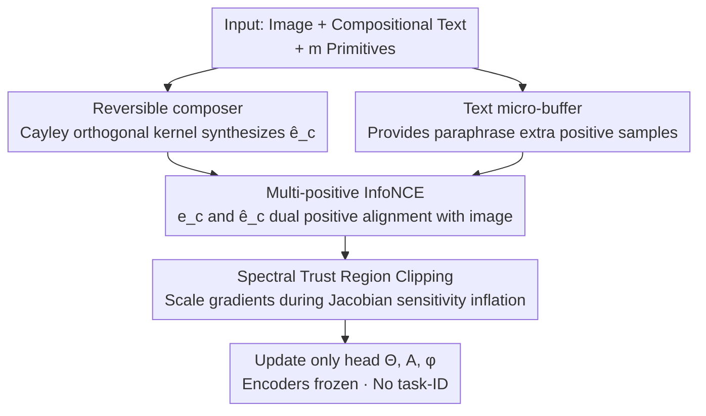

# Reversible Primitive–Composition Alignment for Continual Vision–Language Learning

**Conference**: ICLR 2026  
**OpenReview**: [https://openreview.net/forum?id=eiTy6AYeQi](https://openreview.net/forum?id=eiTy6AYeQi)  
**Area**: Multimodal VLM / Continual Learning  
**Keywords**: Continual Learning, Vision-Language Models, Compositional Generalization, Reversible Mapping, Spectral Stability  

## TL;DR
Addressing the overlooked phenomenon in VLM sequential adaptation where "primitive recognition remains while compositional ability degrades," this paper proposes COMPO-REALIGN—a lightweight alignment head. It utilizes a Cayley orthogonal reversible composer to synthesize composition embeddings from primitive embeddings, treats text and synthetic compositions as dual positive samples for images via a multi-positive InfoNCE, and clips gradients using a spectral trust region when alignment sensitivity inflates. It improves the strongest baseline by +2.4 R@1 and reduces forgetting by approximately 40% in compositional DIL and multi-domain MTIL retrieval tasks.

## Background & Motivation
**Background**: CLIP-like vision-language models are increasingly deployed in non-stationary environments where new domains, tasks, and drifting data streams arrive continuously. Significant progress has been made in continual learning: geometric/topological preservation and distillation (Mod-X, ZSCL, CTP, ZAF), scalable streaming protocols (TiC-CLIP), error-aware consolidation (DKR), and suppressing forgetting using replay or parameter-efficient prompts/adapters under limited memory.

**Limitations of Prior Work**: Almost all existing methods focus on whether "average task/domain accuracy" or "zero-shot scores" are maintained, while ignoring a more subtle degradation: under sequential adaptation, models can maintain overall task/domain performance but collapse in **fine-grained compositional generalization**—especially in realistic scenarios with tight rehearsal budgets and no task-ID at test time. The authors' exploratory experiments (Fig. 1–3) confirm this: primitive (color/shape/material, attribute/object) recognition remains stable, but as tasks progress, compositional accuracy declines, with the Compositional Retention Ratio (CRR) dropping below 1, and zero-shot composition being most severely affected.

**Key Challenge**: Compositional degradation is not an isolated phenomenon but is deeply coupled with the **geometric properties** of the alignment. Exploratory experiments reveal two accompanying signals: (i) compositional error increases alongside the alignment Jacobian spectral radius $\hat\sigma_{\max}$ and the **cycle-consistency error** (CCE, the degree to which the primitive↔composition mapping fails to close); (ii) subspace drift is concentrated in the deep layers of the text tower and later tasks. In other words, the loss of compositional ability is predicted by two factors—declining reversibility and unstable alignment geometry.

**Goal**: To allow continual VLMs to maintain **structurally reliable** behavior and preserve zero-shot transfer under strict memory and no task-ID constraints. This is divided into three sub-problems: how to anchor the "meaning of composition" across tasks, how to keep the primitive↔composition mapping recoverable, and how to suppress the instability of alignment geometry.

**Key Insight**: The authors propose the "structure-before-memory" principle—rather than stacking more replay samples, it is more effective to enforce reversibility and geometric stability directly within the representations. An interesting piece of evidence from the exploratory experiments is that, given the same budget, **text-centric micro-buffers** are more effective than image-centric buffers, suggesting that symbolic structural anchors are more memory-efficient than raw memories.

**Core Idea**: A composer + an objective + a stabilizer—using a composer that is orthogonal and reversible by design to make the "primitive→composition" mapping inherently reversible; using multi-positive InfoNCE to bind text and synthetic compositions as two views of the same concept; and using a spectral trust region to scale updates when sensitivity is too high. The entire process only trains a lightweight head and freezes the backbone.

## Method

### Overall Architecture
COMPO-REALIGN is a minimalist alignment head attached to a frozen CLIP backbone, designed to solve "compositional ability degradation under sequential adaptation." The input is a triplet $(x, y_c, \{p_i\}_{i=1}^m)$—an image, a compositional text, and its $m$ primitives (e.g., "red" + "cube"). Frozen encoders $f_v, f_t$ encode and L2-normalize them to obtain $z_v, e_c, e_{p,i}$. The core process involves averaging primitives after shaping through a lightweight adapter and MLP, then synthesizing the composition embedding $\hat e_c$ via an **orthogonal reversible mapping**. Subsequently, the text composition $e_c$ and synthetic composition $\hat e_c$ are treated as **two positive samples** for image $z_v$ in a symmetric InfoNCE. In each step, the maximum singular value of the alignment Jacobian is estimated to scale the head's gradient if sensitivity exceeds a threshold. Paraphrases from a tiny text buffer can optionally be used as additional positive samples. Only the head parameters $(\Theta, A, \phi)$ are updated; encoders remain frozen without task-IDs.

### Key Designs

**1. Reversible composer: Using Cayley orthogonal kernels to make "primitive→composition" inherently reversible**

To address the pain point of "compositional degradation accompanied by loss of reversibility," the authors' idea is: if the model can directly synthesize an embedding that behaves like a text composition from primitives, and this synthesis is reversible, then the "binding structure" (which attribute binds to which object) can be recovered and will not be washed away by sequential adaptation. Specifically, each primitive is shaped via adapter $A$ and a small MLP $\phi$, then averaged as $\bar u = \frac1m\sum_i \phi(A e_{p,i})$, and passed through an orthogonal mapping and normalized: $\hat e_c = R(\Theta)\bar u / \|R(\Theta)\bar u\|_2$. Crucially, $R(\Theta)$ is constructed to be strictly orthogonal via the Cayley transform:

$$R(\Theta) = (I - S)(I + S)^{-1}, \quad S = \tfrac12(\Theta - \Theta^\top)$$

Since $S$ is skew-symmetric, $R(\Theta)^\top R(\Theta) = I$ and $R(\Theta)^{-1} = R(\Theta)^\top$, so the back-inference from $\hat e_c$ to the primitive set is well-defined—reversibility becomes a **design property** rather than relying on an extra loss penalty. In ablation studies, replacing the orthogonal kernel with a standard linear mix (removing Cayley) dropped CRR by 0.03 and retrieval/VQA by 1–1.6 points, confirming that "reversibility by design" is a robust inductive bias.

**2. Multi-positive InfoNCE: Treating text and synthetic compositions as dual positive samples for images**

The text composition $e_c$ and synthetic composition $\hat e_c$ are essentially two views of the same concept. Treating them together as positive samples for the image is equivalent to telling the model "match the image to both ways you encode the composition," which **implicitly pulls $e_c$ and $\hat e_c$ together** without the need for separate cycle or set losses. Specifically, a symmetric two-positive InfoNCE is used: the numerator for the image-to-composition direction $\mathcal L_{v\to c}$ is $\exp(s(z_v,e_c)/\tau) + \exp(s(z_v,\hat e_c)/\tau)$, and the denominator sums both views for all samples in the batch. The text-to-image direction $\mathcal L_{c\to v}$ is symmetric, and the total objective is $\mathcal L_{\text{Tri}} = \frac12(\mathcal L_{v\to c} + \mathcal L_{c\to v})$. This is the **only loss** used—reversibility and geometric stability are achieved without additional losses. Ablation shows that removing the synthetic positive sample (degrading to pure text InfoNCE) is one of the largest single-point losses: retrieval R@1 drops by 1.9 bidirectionally, CRR drops 0.04, and AF rises 0.8, indicating dual-view alignment is critical for binding retention.

**3. Text micro-buffer: Replacing image memory with symbolic anchors at near-zero cost**

Under a strict rehearsal budget, the authors store a tiny amount of text snippets (~64 per task) instead of images. A paraphrase template $y_c'$ taken from the buffer is encoded as $e_c'$ and directly acts as an **additional positive sample** in the numerator/denominator of the same InfoNCE, naturally extending two positives to multiple positives without new losses. This design echoes the "structure-before-memory" principle: text serves as symbolic structural anchors, which are much more efficient than storing raw images. In ablation, this was the highest leverage item—clearing the buffer ($M=0$) dropped retrieval R@1 by 2.5 bidirectionally, CRR by 0.05, and AF rose by 1.5, with VQA metrics dropping 2.3–2.5, even exceeding the loss from removing synthetic positives, validating that "symbolic anchors are more memory-efficient and effective than raw memory."

**4. Spectral Trust Region: Clipping gradients rather than adding regularization when alignment sensitivity inflates**

Exploratory experiments found a strong correlation between compositional failure and an excessive Jacobian spectral radius. Based on this, the authors implement "geometric stability" as **trust region clipping** rather than an extra loss term. Defining the Jacobian of the alignment similarity with respect to stacked primitives as $J_p = \partial s(z_v,\hat e_c)/\partial\,\mathrm{vec}(U_p) \in \mathbb R^{1\times md}$, the maximum singular value $\hat\sigma_{\max} \approx \|J_p v\|_2$ is estimated using 1–2 power iteration steps (on the JVP), and the head gradient is scaled by:

$$g_\theta \leftarrow \alpha\, g_\theta, \quad \alpha = \min\Big(1, \frac{\gamma}{\hat\sigma_{\max}}\Big)$$

If the local sensitivity exceeds target $\gamma$, the step is scaled down proportionally; otherwise, it remains unchanged. It acts as a geometric safety valve: disabling clipping in ablation hardly affected top-1 retrieval but significantly increased forgetting (AF +1.1) and worsened ZSTD, showing it stabilizes geometry and forgetting rather than just boosting accuracy.

### Loss & Training
The entire process only optimizes head parameters $(\Theta, A, \phi)$, while encoders are frozen and no task-ID is used. Each minibatch consists of five steps: (i) encode and normalize $(x, y_c, \{p_i\})$; (ii) synthesize $\hat e_c$ via Cayley orthogonal kernel; (iii) calculate multi-positive symmetric InfoNCE $\mathcal L_{\text{Tri}}$ on current samples (optionally adding buffer paraphrases as extra positives); (iv) estimate $\hat\sigma_{\max}$ via power iteration and clip head gradients by $\alpha=\min(1,\gamma/\hat\sigma_{\max})$; (v) update via optimizer. Temperature $\tau$ defaults to 0.07, power iteration steps $T_{\text{pow}}\in\{1,2\}$, and mean pooling is used for primitives (attention pooling was similar in accuracy but slower).

## Key Experimental Results

### Main Results
**Retrieval / ITM (Track A Compositional DIL + Track B Multi-domain MTIL)**: COMPO-REALIGN sets new SOTAs across both settings.

| Method | Avg R@1 (I→T) ↑ | Avg R@1 (T→I) ↑ | CRR ↑ | AF ↓ | ZSTD ↓ |
|------|------|------|------|------|------|
| Replay-Text | 51.8 | 38.7 | 0.84 | 7.5 | −4.1 |
| ZSCL | 54.2 | 40.8 | 0.86 | 6.1 | −2.9 |
| C-CLIP | 56.4 | 43.0 | 0.88 | 5.1 | −2.1 |
| DIKI | 56.0 | 43.2 | 0.89 | 5.0 | −1.9 |
| **COMPO-REALIGN** | **58.8** | **45.1** | **0.91** | **3.2** | **−1.3** |

Compared to the strongest baselines (C-CLIP / DIKI), Avg R@1 (I→T) improved by +2.4 absolute; AF dropped from 5.0–5.1 to 3.2 (relative reduction of ~36–37%, ~40% per abstract); CRR rose to 0.91, indicating significantly better attribute-object binding maintenance; and ZSTD was minimized, showing the least damage to zero-shot transfer.

**Continual VQA (Track C)**: Surpasses recent prompt/MoE methods on CLOVE-scene / CLOVE-function / VQACL with the lowest AF.

| Method | CLOVE-scene ↑ | CLOVE-func ↑ | VQACL ↑ | AF ↓ |
|------|------|------|------|------|
| CL-MoE | 63.5 | 59.2 | 55.4 | 4.7 |
| **COMPO-REALIGN** | **65.1** | **60.4** | **56.8** | **3.6** |

### Ablation Study
Single-factor ablation (disabling one component at a time, averaged over Retrieval/VQA):

| Configuration | R@1 I→T | CRR | AF | VQACL | Description |
|------|------|------|------|------|------|
| Full (ours) | 58.8 | 0.91 | 3.2 | 56.8 | Full Model |
| w/o Synthetic positive (pure text InfoNCE) | 56.9 (−1.9) | 0.87 | 4.0 | 55.0 | Dual-view alignment is the main driver |
| w/o Spectral Trust Region (no clipping) | 57.9 (−0.9) | 0.89 | 4.3 | 56.0 | Top-1 almost unchanged but forgetting rises |
| Orthogonal kernel → Linear mix (no Cayley) | 57.2 (−1.6) | 0.88 | 3.8 | 55.6 | Reversibility is a robust inductive bias |
| buffer M=0 (no text buffer) | 56.3 (−2.5) | 0.86 | 4.7 | 54.3 | Largest leverage; symbolic anchors save memory |
| Mean → Attention pooling | 58.5 (−0.3) | 0.91 | 3.3 | 56.7 | Similar accuracy but slower |
| w/o primitive shaper (no ϕ/A) | 57.6 (−1.2) | 0.88 | 3.9 | 55.7 | Smoothens primitive geometry; mildly beneficial |

### Key Findings
- **Removing the text buffer caused the largest drop** (−2.5 R@1 bidirectionally, −2.3~−2.5 VQA)—validating that "structural anchors + dual-view alignment" are the two main pillars.
- **Spectral Trust Region stabilizes geometry, not accuracy**: Disabling it barely moves top-1 but increases AF by 1.1 and worsens ZSTD, acting as a "safety valve."
- **Mechanism Validation**: Cross-task $\hat\sigma_{\max}$ strongly negatively correlates with R@1 and CRR (Pearson −0.82 / −0.81); CCE correlates positively with |ZSTD| (+0.82), with stronger correlations in deep layers (L10–L12)—alignment geometry in later layers is most critical for compositional retention.
- **Reversible Readout**: The PR-AUC (0.612) / ROC-AUC (0.846) for back-inferring primitive sets from $\hat e_c$ significantly outperformed ablations (0.812 without orthogonal kernel, 0.774 with pure text), and the margin under counterfactual attribute/object swaps was significantly larger for the full model (Wilcoxon $p<0.01$)—reversibility provides true binding discriminability rather than surface alignment.

## Highlights & Insights
- **"Structure-before-memory" as an actionable diagnosis-to-solution loop**: The authors first quantify "compositional degradation" using three metrics (CRR, CCE, Jacobian spectrum), then systematically address each diagnosed issue (reversibility, dual-views, spectral clipping). Every component corresponds to a diagnosed lesion, rather than being an arbitrary trick.
- **Reversibility as a design property, not a penalty**: Using the Cayley transform naturally yields an orthogonal matrix, avoiding the manual weighting of cycle-consistency losses. This allows for well-defined back-inference of primitives—a concept transferable to any representation learning task requiring "embedding reversibility/readout."
- **Geometric stability via trust regions rather than regularization**: Implementing "Jacobian spectrum suppression" as gradient clipping (min(1, γ/σ)) intervenes only when sensitivity inflates. This doesn't disturb the objective function, making it a cleaner "safety valve" paradigm than adding regularization terms.
- **Text micro-buffers as symbolic anchors**: Storing only 64 text snippets per task outperformed image-centric buffers of the same budget, providing an inspiration for memory-sensitive edge-side continual learning—storing semantics is more valuable than storing pixels.

## Limitations & Future Work
- The method is tied to a continual stream setting with a "fixed primitive list, only rotating compositions/domains"; whether the inductive bias of the reversible composer holds if new tasks introduce entirely new primitives remains to be fully verified.
- The spectral trust region uses 1–2 power iteration steps to estimate $\hat\sigma_{\max}$, which is a coarse approximation; the selection of threshold $\gamma$ and its sensitivity across different backbones/tasks was not elaborated in the main text.
- Evaluation mainly focused on retrieval/ITM/VQA with frozen CLIP-like dual-tower backbones; whether it preserves structure in generative VLMs or scenarios where encoders are updated remains to be verified.
- Specific definitions for diagnostic metrics like CRR and CCE are in the appendix, with only summaries in the main text—exact replication requires the appendix formulas (⚠️ details subject to original text).

## Related Work & Insights
- **vs. ZSCL / Mod-X / ZAF (Geometry/Zero-shot stability)**: These focus on preserving global similarity structures or zero-shot output stability, emphasizing "average stability." This work goes further by asking "if the internal binding structure remains"—using reversible readout and resistance to counterfactual swaps (structure-first over stability-first).
- **vs. IncCLIP / ConStruct-VL / GIFT (Replay-based)**: These rely on storing images or synthesizing negative text to combat forgetting. Ours only stores extremely minimal text snippets as symbolic anchors; ablation proves text anchors are more efficient than image memory under the same budget.
- **vs. DIKI / CL-MoE (Adapter/Prompt/MoE-based)**: These use parameter-efficient modules to reduce interference, often requiring task-IDs. Ours uses a single task-ID-free lightweight reversible head, outperforming them in retrieval (+2.4 R@1) and VQA while reducing forgetting by ~40%.

## Rating
- Novelty: ⭐⭐⭐⭐⭐ Based on a new diagnosis of "compositional degradation with loss of reversibility + geometric instability," treating reversibility as a design attribute of the orthogonal kernel and stability as trust region clipping is a fresh perspective.
- Experimental Thoroughness: ⭐⭐⭐⭐ Covers three streams (DIL/MTIL/VQA) and includes mechanism validation (spectral-structure coupling, reversible readout, buffer analysis), though some diagnostic definitions are relegated to the appendix.
- Writing Quality: ⭐⭐⭐⭐ Clear minimalist narrative ("one composer + one objective + one stabilizer"), well-prepared by exploratory experiments.
- Value: ⭐⭐⭐⭐ Lightweight, task-ID free, and memory-friendly; valuable for edge-side continual VLM and compositional robustness.

<!-- RELATED:START -->

## Related Papers

- [\[ICLR 2026\] Enhanced Continual Learning of Vision-Language Models with Model Fusion](enhanced_continual_learning_of_vision-language_models_with_model_fusion.md)
- [\[ICLR 2026\] Decoupling Primitive with Experts: Dynamic Feature Alignment for Compositional Zero-Shot Learning](decoupling_primitive_with_experts_dynamic_feature_alignment_for_compositional_ze.md)
- [\[ICLR 2026\] Fed-Duet: Dual Expert-Orchestrated Framework for Continual Federated Vision-Language Learning](fed-duet_dual_expert-orchestrated_framework_for_continual_federated_vision-langu.md)
- [\[ICLR 2026\] KeepLoRA: Continual Learning with Residual Gradient Adaptation](keeplora_continual_learning_with_residual_gradient_adaptation.md)
- [\[ICLR 2026\] Memory-Free Continual Learning with Null Space Adaptation for Zero-Shot Vision-Language Models](memory-free_continual_learning_with_null_space_adaptation_for_zero-shot_vision-l.md)

<!-- RELATED:END -->
