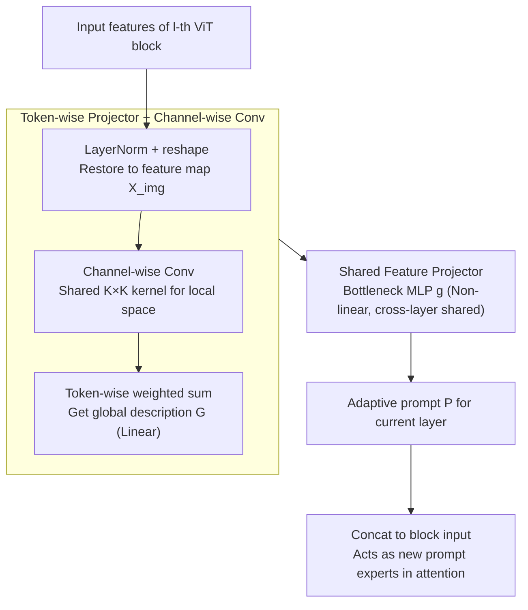

# Revisit Visual Prompt Tuning: The Expressiveness of Prompt Experts

**Conference**: ICLR 2026  
**arXiv**: [2501.18936](https://arxiv.org/abs/2501.18936)  
**Code**: [GitHub](https://github.com/Minhchuyentoancbn/VAPT)  
**Area**: Multi-modal/Vision-Language Models  
**Keywords**: Visual Prompt Tuning, Mixture-of-Experts, Parameter-Efficient Fine-Tuning, Vision Transformer, Adaptive Prompting  

## TL;DR

This work reveals the limitations of VPT from a Mixture-of-Experts (MoE) perspective—prompt experts are input-independent constant functions with limited expressiveness. VAPT is proposed to make prompt experts input-adaptive through token-wise projectors and shared feature projectors, achieving superior performance with fewer parameters and providing theoretical guarantees for optimal sample efficiency.

## Background & Motivation

- **Background**: Visual Prompt Tuning (VPT) achieves parameter-efficient fine-tuning by prepending learnable prompt tokens to ViT inputs, becoming a significant branch of PEFT methods.
- **Limitations of Prior Work**: Theoretical understanding of VPT remains insufficient. Recently, Le et al. (2024) established a connection between attention mechanisms and MoE, revealing that each attention head can be interpreted as a combination of multiple MoE models, where VPT effectively adds new prompt experts to these MoEs.
- **Key Challenge**: Through the MoE lens, it is observed that pretrained experts $f_j(\bm{X}) = W_m^{V\top} \bm{x}_j$ are linear functions of the input $\bm{X}$, while prompt experts $f_{N+j'}(\bm{X}) = W_m^{V\top} \bm{p}_{j'}$ are fixed constant vectors independent of the input. This asymmetry in expressiveness restricts the adaptation capability of VPT.
- **Goal**: Enhance the functional expressiveness of prompt experts while maintaining parameter efficiency.
- **Key Insight**: Design an input-adaptive prompt generation mechanism while keeping a simple functional form to support theoretical analysis.
- **Core Idea**: Utilize a token-wise projector to aggregate global features and a shared MLP projector to generate adaptive prompts, upgrading prompt experts from constant functions to non-linear functions of the input.

## Method

### Overall Architecture

The core problem VAPT addresses is that prompt tokens in VPT are fixed vectors independent of the input. From an MoE perspective, their corresponding prompt experts degenerate into constant functions with limited expressiveness. VAPT replaces "fixed prompts" with "input-dependent prompts" by inserting a VAPT module into each ViT block. This module reads the current layer's input $\tilde{\bm{X}}^{(l)}$ and generates layer-specific prompt tokens $\bm{P}^{(l)}$ on the fly. The pipeline involves: restoring features to a feature map, encoding local space via a channel-wise convolution, aggregating into a global description vector per prompt via a token-wise projector, and finally applying a non-linear transformation through a bottleneck MLP shared across all layers. The first two steps are linear aggregations, while the last step introduces non-linearity, enabling the prompt expert to become a non-linear function of the input while remaining mathematically tractable.

### Key Designs

**1. Token-wise Projector + Channel-wise Conv: Supplying global spatial information latent to pretrained experts**

Pretrained experts essentially perform linear projections $f_j(\bm{X}) = W_m^{V\top}\bm{x}_j$ on individual patches, capturing only local info. VAPT generates prompts that complementarily carry global information. It first uses a channel-wise convolution on the feature map $\bm{X}_{\text{img}} \in \mathbb{R}^{H \times W \times d}$ to encode local spatial relationships $\bm{X}_{\text{conv}} = F * \bm{X}_{\text{img}}$. All $d$ channels share the same $K \times K$ kernel, involving only $K^2$ parameters (a $d$-fold reduction compared to standard conv) while modeling adjacency. Then, a token-wise projection aggregates this map into a global description for each prompt:

$$G_{j'}(\bm{X}_{\text{conv}}) = \sum_{k=1}^{H' \cdot W'} \alpha_{j',k}\, \bm{x}_k^{\text{conv}} \in \mathbb{R}^d$$

Where $\alpha_{j',k}$ are learnable scalar weights. Since both convolution and weighted sums are linear, this stage remains a linear mapping $W_{j'}\bm{X}$.

**2. Shared Feature Projector: Upgrading to non-linear adaptive prompts with higher parameter efficiency**

To upgrade prompt experts to non-linear functions, VAPT passes the global description through a bottleneck MLP $g(\bm{x}) = W^{(2)} \sigma(W^{(1)} \bm{x})$, where $W^{(1)} \in \mathbb{R}^{r \times d}$, $W^{(2)} \in \mathbb{R}^{d \times r}$, and $r \ll d$. The final prompt is:

$$\bm{P}_{j'}(\bm{X}) = W^{(2)} \sigma(W^{(1)} W_{j'} \bm{X}) \in \mathbb{R}^d.$$

In the MoE framework, both the expert function $f_{N+j'}(\bm{X}) = W_m^{V\top}\bm{P}_{j'}(\bm{X})$ and the score function $s_{i,N+j'}(\bm{X}) = \frac{\bm{x}_i^\top W_m^Q W_m^{K\top}\bm{P}_{j'}(\bm{X})}{\sqrt{d_v}}$ become input-adaptive. Counter-intuitively, this approach is more parameter-efficient than VPT because the projector $g$ is shared across all ViT blocks. The parameters consist of token-wise projections ($L \times N_p \times H' \times W'$), convolution ($L \times K^2$), and the shared projector ($2rd$). For ViT-B/16, the total parameter count is typically lower than VPT's $L \times N_p \times d$.

### Loss & Training

Standard cross-entropy classification loss is used, updating only VAPT parameters and the classification head.

## Key Experimental Results

### Main Results (ViT-B/16 Supervised ImageNet-21K)

| Method | Tuned/Total(%) | FGVC | VTAB-Natural | VTAB-Specialized | VTAB-Structured |
|---|---|---|---|---|---|
| Full Fine-tuning | 100.00 | 88.54 | 75.88 | 83.36 | 47.64 |
| VPT-Deep | 0.73 | 89.11 | 78.48 | 82.43 | 54.98 |
| LoRA | 0.73 | 89.46 | 78.26 | 83.78 | 56.20 |
| E2VPT | 0.39 | 89.22 | 80.01 | 84.43 | 57.39 |
| SA2VP | 0.65 | 90.08 | 80.97 | 85.73 | 60.80 |
| **Ours** | **0.36** | **89.58** | **81.43** | **85.13** | **59.34** |

Ours outperforms full fine-tuning by 7.34% on VTAB-1K and by 1.04% on FGVC.

### Ablation Study

- **Low-data scenario** (Stanford Dogs 1% data): VAPT 60.1% vs VPT 3.6%—an enormous gap.
- **Removing channel-wise conv**: Performance drops, confirming the importance of spatial modeling.
- **Removing feature projector** (linear only): Performance drops, highlighting the necessity of non-linear transformations.

### Analysis across Pretraining (MAE/MoCo v3)

| Pretraining | Method | VTAB-Natural | VTAB-Specialized | VTAB-Structured |
|---|---|---|---|---|
| MAE | VPT-Deep | 36.02 | 60.61 | 26.57 |
| MAE | **Ours** | **59.23** | **79.10** | **51.49** |
| MoCo v3 | VPT-Deep | 70.27 | 83.04 | 42.38 |
| MoCo v3 | **Ours** | **79.54** | **86.92** | **59.41** |

### Key Findings

1. VAPT consistently outperforms VPT across all pretraining objectives and benchmarks with fewer parameters.
2. The advantage is particularly significant on self-supervised pretraining (MAE).
3. In low-data scenarios, VAPT's advantage grows exponentially (60.1% vs 3.6%), validating the optimal sample efficiency predicted by Theorem 1.
4. High parameter efficiency: surpassed full fine-tuning with only 0.36% parameters.

## Highlights & Insights

1. **Theory-Practice Alignment**: The MoE perspective provides a clear explanation for VPT's limitations. The theoretical analysis (Theorem 1 giving an $\mathcal{O}_P([\log(n)/n]^{1/2})$ convergence rate) aligns perfectly with the empirical gains in low-data regimes.
2. **Elegant Design Philosophy**: Instead of simply adding parameters, VAPT uses a structured projector (token-wise + shared MLP) to maintain functional simplicity while boosting expressiveness.
3. **Counter-intuitive Discovery**: Achieving better performance with fewer parameters (0.36% vs 0.73%) challenges the "more parameters = better performance" stereotype.
4. **Value of the MoE Framework**: Provides a unified perspective for understanding and improving various prompt-based methods.

## Limitations & Future Work

1. Token-wise projection weights $\alpha_{j',k}$ are learnable but input-independent; making them adaptive could be a next step.
2. The feature projector is identical across layers—different layers might require different non-linear transformations.
3. Theoretical analysis is currently limited to simplified single-head scenarios.
4. Validation is focused on classification; performance on dense prediction tasks (detection/segmentation) remains to be explored.

## Related Work & Insights

- **VPT Family**: Baseline is VPT-Deep (Jia et al., 2022); E2VPT (Han et al., 2023) introduces pruning; SA2VP (Pei et al., 2024) focuses on spatial adaptation.
- **Other PEFT Methods**: LoRA (Hu et al., 2021) and Adapters (Cai et al., 2020) target different components for parameter efficiency.
- **MoE-Prompt Connection**: Le et al. (2024) established the theoretical link that this work extends into a concrete visual prompting method.
- **Mechanism**: The MoE framework implies a broader design space where score functions can also be explicitly enhanced.

## Rating

⭐⭐⭐⭐ (4/5)

- **Novelty**: ⭐⭐⭐⭐ Solid MoE-driven problem identification and solution.
- **Experimental Thoroughness**: ⭐⭐⭐⭐⭐ Comprehensive coverage across benchmarks and pretraining targets.
- **Writing Quality**: ⭐⭐⭐⭐ Logical flow from theoretical perspective to design.
- **Value**: ⭐⭐⭐⭐⭐ Efficient, high-performing, and theoretically grounded.

<!-- RELATED:START -->

## Related Papers

- [\[ICLR 2026\] Visual Prompt-Agnostic Evolution](visual_prompt-agnostic_evolution.md)
- [\[ICCV 2025\] PRO-VPT: Distribution-Adaptive Visual Prompt Tuning via Prompt Relocation](../../ICCV2025/multimodal_vlm/pro-vpt_distribution-adaptive_visual_prompt_tuning_via_prompt_relocation.md)
- [\[ICLR 2026\] PSP: Prompt-Guided Self-Training Sampling Policy for Active Prompt Learning](psp_prompt-guided_self-training_sampling_policy_for_active_prompt_learning.md)
- [\[ICLR 2026\] Meta-Adaptive Prompt Distillation for Few-Shot Visual Question Answering](meta-adaptive_prompt_distillation_for_few-shot_visual_question_answering.md)
- [\[ICLR 2026\] A-TPT: Angular Diversity Calibration Properties for Test-Time Prompt Tuning of Vision-Language Models](a-tpt_angular_diversity_calibration_properties_for_test-time_prompt_tuning_of_vi.md)

<!-- RELATED:END -->
