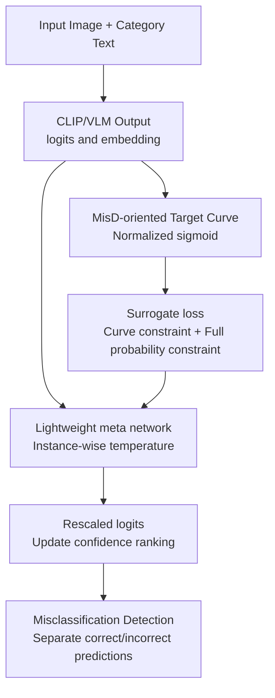

# Revisiting Confidence Calibration for Misclassification Detection in VLMs

**Conference**: ICLR 2026  
**OpenReview**: [https://openreview.net/forum?id=d8WMoi571f](https://openreview.net/forum?id=d8WMoi571f)  
**Code**: [Code Link](https://openreview.net/forum?id=d8WMoi571f) (Anonymous link in supplementary material)  
**Area**: Multimodal VLM / Confidence Calibration / Misclassification Detection  
**Keywords**: VLM Confidence Calibration, Misclassification Detection, CLIP, Posterior Calibration, Temperature Scaling  

## TL;DR
This work demonstrates that standard confidence calibration limits the misclassification detection capability of VLMs even under perfect calibration. It introduces MisD-oriented reliability curves, a differentiable surrogate loss, and a lightweight posterior meta network to learn instance-wise temperature coefficients, effectively separating correct predictions from incorrect ones.

## Background & Motivation
**Background**: Vision-Language Models (VLMs) like CLIP have become standard backbones for zero-shot classification, fine-grained recognition, and remote sensing. Deploying these models requires not only high accuracy but also trustworthy confidence scores. Existing methods such as temperature scaling, instance-wise calibration, and text-distance calibration for VLMs attempt to ensure that a model's stated confidence of 0.8 corresponds to an empirical accuracy of approximately 80%.

**Limitations of Prior Work**: In high-risk applications, the critical issue is often not whether the confidence value matches empirical accuracy, but whether the model can rank incorrect predictions with lower confidence and correct predictions with higher confidence. This task is known as misclassification detection (MisD): given a threshold, high-confidence samples are treated as reliable, while low-confidence samples are flagged as potential errors. Traditional calibration focuses on making the reliability curve diagonal but does not guarantee sufficient separation between correct and incorrect samples on the confidence axis.

**Key Challenge**: The objectives of standard calibration and MisD are not equivalent. Perfect calibration requires $P(\hat{y}=y \mid s=p)=p$. MisD, however, seeks ranking separation. If the confidence distribution is widely spread in the $[0,1]$ range, even a perfectly diagonal reliability curve will allow incorrect samples in the high-confidence region and correct samples in the low-confidence region.

**Goal**: The paper addresses this at three levels: theoretically explaining why "perfect calibration" imposes an upper bound on MisD; designing a target reliability curve aligned with MisD; and providing a posterior method for CLIP/VLM that re-ranks confidence without altering the original predicted classes or representation capability.

**Key Insight**: Starting from the reliability diagram, the authors observe that the area below or above the reliability curve can be interpreted as the precision of detecting correct or incorrect predictions within a confidence interval. This perspective shifts the focus from "closeness to the diagonal" to "which regions benefit the detection of correct/incorrect samples," allowing for the design of curves optimized for MisD.

**Core Idea**: Replace the standard diagonal calibration target with a MisD-oriented normalized sigmoid reliability curve. Train a lightweight meta network to predict an instance-wise temperature coefficient, making correct predictions sharper and incorrect ones flatter to increase separation in confidence ranking.

## Method

### Overall Architecture
The proposed method does not retrain the VLM backbone but adds a posterior recalibration module after the output of CLIP or a prompt-tuned CLIP. The workflow involves determining the required reliability curve for MisD through theoretical analysis, converting this curve into a differentiable surrogate loss, and training a Lightweight Meta Network (LMN). This network uses logits, image embeddings, and text embeddings to generate an instance-specific temperature coefficient $\tau_v$ that adjusts confidence ranking without changing original VLM parameters.

The key distinction is that the diagonal reliability curve is no longer the sole ideal target. For MisD, it is preferable for low-confidence regions to correspond primarily to incorrect samples and high-confidence regions to correct ones. The authors construct a target curve that suppresses expected accuracy for $s < 0.5$ and elevates it for $s > 0.5$, using a parameter $\lambda$ to control the smoothness and avoid aggressive hard steps.

### Key Designs
**1. Reliability Diagram Reinterpretation: Calibration Maps as MisD Precision Tools**

In a traditional reliability diagram, the vertical axis is accuracy and the horizontal is confidence; the curve value $f(s)$ represents $P(\text{correct} \mid \text{confidence}=s)$. The authors show that for a confidence interval $[a,b]$ with sample density $w(s)$, the precision for detecting correct predictions is the normalized area under the curve: $Prec^+ = \frac{\int_a^b w(s)f(s)ds}{\int_a^b w(s)ds}$. Conversely, detecting incorrect predictions corresponds to the area above the curve: $Prec^- = \frac{\int_a^b w(s)(1-f(s))ds}{\int_a^b w(s)ds}$. This reinterpretation allows the limitations of standard calibration in MisD to be expressed as explicit precision upper bounds.

**2. MisD-oriented Target Curve: Tuning Calibration and Separation via Normalized Sigmoid**

Under perfect calibration, $f(s)=s$. The paper proves that in this state, $Prec^+$ in high-confidence regions equals $E_{s \sim w(s \mid s \in [r,1])}[s]$, and $Prec^-$ in low-confidence regions equals $E_{s \sim w(s \mid s \in [0,r])}[1-s]$. These cannot reach 1 unless confidence values are strictly binary (0 or 1). To solve this, the authors propose a normalized sigmoid curve:
$$\Psi(s) = \frac{\sigma((s-0.5)/\lambda) - \sigma(-0.5/\lambda)}{\sigma(0.5/\lambda) - \sigma(-0.5/\lambda)}$$
As $\lambda \to \infty$, $\Psi(s)$ becomes diagonal (standard calibration). As $\lambda \to 0$, it approaches a step function. The authors demonstrate that $\Psi(s)$ yields higher $Prec^+$ for $r > 0.5$ and higher $Prec^-$ for $r < 0.5$ compared to the diagonal target.

**3. Surrogate Loss: Converting Non-differentiable Curves into Trainable Constraints**

Since reliability curves are statistical estimates, optimizing them directly via binning is non-differentiable and high-variance. Instead, a surrogate loss is designed. For correct samples with low confidence, the loss encourages sharper distributions using $1 - \Psi(s)$ and standard cross-entropy. For incorrect samples with high confidence, it encourages flatter distributions using $\Psi(s)$ and a uniform distribution constraint. The final objective fuses these weighted constraints to ensure stable probability distribution shapes.

**4. Lightweight Meta Network: Learning Instance-wise Temperature Without Compromising VLM Capabilities**

To preserve zero-shot capabilities, the LMN does not update the image/text encoders. It uses a few fully connected layers to predict an instance-level temperature $\tau_v$ based on: logits $z_v$ (classification margin), image embeddings $\xi(x_v)$ (visual difficulty), and predicted text embeddings $\psi(t_p)$ (semantic confusion). The final logits are rescaled as $z'_v = \tau_v z_v$. Large $\tau_v$ sharpens the distribution, while small $\tau_v$ flattens it, effectively re-ranking confidence without changing the top-1 predicted class.

### Loss & Training
The model is trained on a small calibration set (e.g., 16-shot). If the VLM uses prompt tuning, the 16-shot set is split: one part for prompt learning and the other for LMN training. Hyperparameters include $\beta$ (balancing correct/incorrect samples, optimal around 0.6) and $\lambda$ (steepness, recommended default 0.05).

## Key Experimental Results

### Main Results
Evaluation was performed across six datasets (DTD, Flowers102, EuroSAT, RESICS45, MNIST, CUB). Metrics include AUROC and FPR90-Error (Success = correct as positive, Error = incorrect as positive).

| Dataset | Metric | Zero-shot CLIP | ViLU | LMN (Ours) | Main Observation |
|:---|:---|:---|:---|:---|:---|
| DTD | AUROC↑ / FPR90-E↓ | 0.762 / 0.572 | 0.769 / 0.521 | 0.802 / 0.457 | Improved ranking and error detection |
| EuroSAT | AUROC↑ / FPR90-E↓ | 0.650 / 0.742 | 0.723 / 0.538 | 0.788 / 0.468 | Significant gain in remote sensing |
| MNIST | AUROC↑ / FPR90-E↓ | 0.813 / 0.482 | 0.877 / 0.263 | 0.915 / 0.205 | Massive reduction in FPR |

Compared to zero-shot CLIP, LMN improves AUROC by 6.1% and reduces FPR90-Error by 22.9% on average.

### Ablation Study
The ablation focuses on the Full-Probability Constraint (FPC) and the overall target curve constraint (+ALL).

| Dataset | CLIP AUROC / FPR90-E | +FPC AUROC / FPR90-E | +ALL AUROC / FPR90-E | Note |
|:---|:---|:---|:---|:---|
| DTD | 0.762 / 0.572 | 0.795 / 0.471 | 0.802 / 0.457 | FPC reduces overconfidence; curve enhances separation |
| RESICS45 | 0.779 / 0.508 | 0.794 / 0.482 | 0.808 / 0.445 | Full objective is stronger for error detection |

Open-vocabulary experiments show that LMN generalizes to unseen classes better than baselines like DOR, as it avoids aggressive fine-tuning of the backbone.

### Key Findings
- Standard calibration methods yield marginal MisD gains (e.g., FeatureClipping AUROC +0.7%), supporting the theoretical claim that diagonal alignment $\neq$ separation.
- FPC provides the bulk of the gains by increasing entropy for incorrect samples, while the sigmoid target further optimizes the curve shape.
- LMN is architecture-agnostic, improving performance for CLIP-L/14 and SigLIP-B/16.
- Efficiency: LMN has only ~17K-20K parameters and trains in seconds to a minute per dataset.

## Highlights & Insights
- The geometric reinterpretation of reliability diagrams as MisD precision tools is highly valuable, turning empirical observations into provable area relationships.
- The normalized sigmoid objective is elegant: $\lambda \to \infty$ recovers calibration, while $\lambda \to 0$ maximizes separation.
- The posterior design is practical for high-risk deployment, improving confidence ranking without risking the corruption of the original model's predictions.
- Forcing incorrect samples toward a uniform distribution is an intuitive way to mitigate "confident errors."

## Limitations & Future Work
- Primarily focused on classification VLMs (CLIP family); extension to generative VLMs or open-ended QA is non-trivial as confidence definitions differ.
- Requires labeled calibration sets; mechanisms for estimating correctness in unlabeled scenarios remain a future direction.
- The default 0.5 threshold might not fit all application risk profiles; the curve shape could be driven by specific cost functions.

## Related Work & Insights
- **vs Temperature Scaling**: TS uses a single global temperature for NLL/ECE; ours uses instance-level temperature for separation.
- **vs FeatureClipping / DOR**: These focus on alignment with empirical accuracy; ours identifies the theoretical upper bound of such approaches for MisD.
- **vs ViLU / FSMisD**: These treat MisD as a binary classification problem or use prompt-based strategies; ours directly reshapes the confidence ranking for better integration with existing calibration pipelines.

## Rating
- **Novelty**: ⭐⭐⭐⭐☆ Theoretical derivation of MisD bounds from reliability diagrams is insightful.
- **Experimental Thoroughness**: ⭐⭐⭐⭐☆ Covers diverse datasets and backbones, though lacks generative VLM evaluation.
- **Writing Quality**: ⭐⭐⭐⭐☆ Solid logic; minor notation inconsistencies between body and appendix.
- **Value**: ⭐⭐⭐⭐☆ Highly practical for posterior VLM deployment in safety-critical systems.

<!-- RELATED:START -->

## Related Papers

- [\[ICLR 2026\] Revisiting Multimodal Positional Encoding in Vision-Language Models](revisiting_multimodal_positional_encoding_in_visionlanguage_models.md)
- [\[ICLR 2026\] A-TPT: Angular Diversity Calibration Properties for Test-Time Prompt Tuning of Vision-Language Models](a-tpt_angular_diversity_calibration_properties_for_test-time_prompt_tuning_of_vi.md)
- [\[CVPR 2026\] Mind the Way You Select Negative Texts: Pursuing the Distance Consistency in OOD Detection with VLMs](../../CVPR2026/multimodal_vlm/mind_the_way_you_select_negative_texts_pursuing_the_distance_consistency_in_ood_.md)
- [\[CVPR 2025\] Rethinking VLMs for Image Forgery Detection and Localization](../../CVPR2025/multimodal_vlm/rethinking_vlms_for_image_forgery_detection_and_localization.md)
- [\[CVPR 2026\] CICA: Coupling Confidence-Aware Pretraining with Confidence-Informed Attention for Robust Multimodal Sentiment Analysis](../../CVPR2026/multimodal_vlm/cica_coupling_confidence-aware_pretraining_with_confidence-informed_attention_fo.md)

<!-- RELATED:END -->
