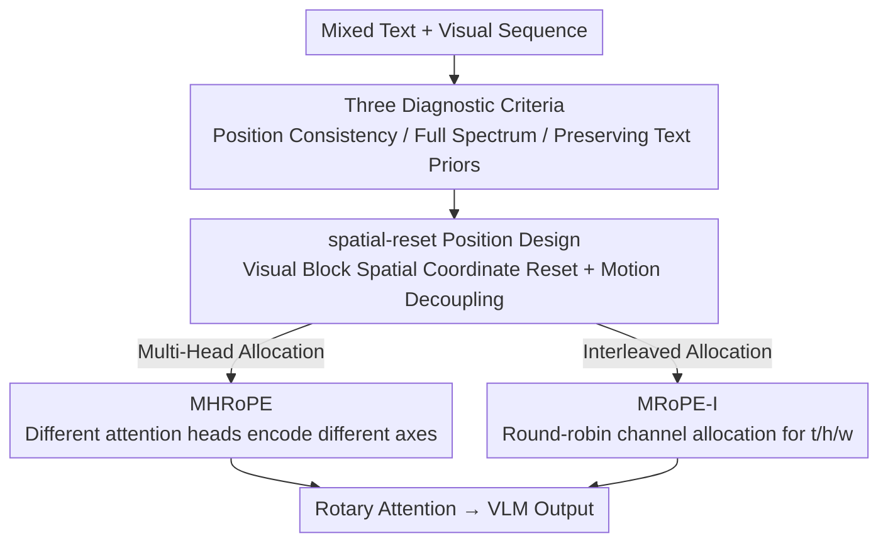

# Revisiting Multimodal Positional Encoding in Vision-Language Models

**Conference**: ICLR 2026  
**OpenReview**: [https://openreview.net/forum?id=sCCF4ygDAw](https://openreview.net/forum?id=sCCF4ygDAw)  
**Code**: https://github.com/JJJYmmm/Multimodal-RoPEs (Available)  
**Area**: Multimodal VLM  
**Keywords**: Multimodal Positional Encoding, RoPE, MRoPE, Frequency Allocation, Vision-Language Models

## TL;DR
This paper systematically deconstructs the two pillars of multimodal RoPE—"position design" and "frequency allocation"—distilling three criteria: position consistency, full-spectrum utilization, and preserving text priors. Based on these, the authors propose the architecture-free spatial-reset position design along with two frequency allocation variants, MHRoPE and MRoPE-I, which consistently outperform existing RoPE schemes across 20+ benchmarks in image, video, and grounding tasks.

## Background & Motivation

**Background**: Self-attention is inherently permutation-invariant, necessitating positional encoding to inform the LLM of sequence order and relative distances. Rotary Positional Encoding (RoPE) has become the de facto standard for modern LLMs like Llama and Qwen. As LLMs are adapted into Vision-Language Models (VLMs), positional encoding must handle 1D text and 2D/3D visual inputs simultaneously, leading to two primary approaches: 1D schemes that flatten all tokens into a single sequence (vanilla RoPE, V2PE) and multi-dimensional schemes that extend position identifiers across time, height, and width axes (e.g., MRoPE in Qwen2-VL).

**Limitations of Prior Work**: 1D schemes discard the inherent 3D geometric structure of visual content, causing significant performance drops in spatial reasoning and grounding tasks. Conversely, multi-dimensional MRoPE partitions channels into contiguous t-h-w blocks, forcing the temporal axis to occupy only the highest frequency channels, which leads to rapid attention decay along the temporal dimension and harms long-video modeling. Subsequent works (VideoRoPE, HoPE, CircleRoPE, IL-RoPE, etc.) have introduced fragmented, specialized patches for images, video, or generation, each introducing new issues. Diagonal layouts cause visual token position IDs to overlap with generated text, leading to "modality confusion during generation" (e.g., infinite text repetition); circular layouts increase modality gaps and collapse video frames into a ring, losing the temporal axis.

**Key Challenge**: These methods fail to balance "position design" and "frequency allocation." Preserving low-frequency modeling for the temporal axis often shoves spatial axes into narrow high-frequency bands, damaging fine-grained spatial reasoning. Preserving 3D structure often breaks compatibility with the base LLM’s text RoPE, hindering knowledge transfer. A unified solution that simultaneously achieves unambiguous positioning, full-spectrum utilization for all axes, and invariant text encoding is missing.

**Goal**: To identify an "all-around" multimodal positional encoding that supports image/video understanding and fine-grained visual grounding without any architectural changes.

**Key Insight**: The authors decompose multimodal RoPE into three orthogonal design axes—position design, frequency allocation, and compatibility with text-only RoPE. They use controlled experiments to diagnose failure modes of existing methods and derive robust design principles.

**Core Idea**: The design space is constrained by three empirical criteria: position consistency, full-spectrum utilization, and preserving text priors. This is implemented via the spatial-reset position design and two allocation methods, MHRoPE and MRoPE-I, which ensure every positional axis accesses the complete frequency spectrum.

## Method

### Overall Architecture

Rather than proposing a fundamentally new encoding, this paper provides a diagnosis followed by a prescription. The diagnostic phase evaluates existing methods across three axes to distill three criteria: **Position Consistency** (unambiguous coordinates, appropriate modality intervals, preserved 3D structure, slow growth), **Full-Spectrum Utilization** (each axis utilizes the full spectrum from high to low frequencies), and **Preserving Text Priors** (text token RoPE must remain identical to the base LLM for knowledge transfer). The prescription involves two modifications to MRoPE: adding **spatial-reset** for position design and providing **MHRoPE** and **MRoPE-I** variants for frequency allocation. Both strictly maintain text RoPE invariance. The method is plug-and-play, taking mixed text-visual sequences and outputting multi-axis position IDs for rotary attention.

### Key Designs

**1. Three Diagnostic Criteria: Unifying Fragmented Schemes**
The primary contribution is defining the problem space. By comparing multimodal RoPE schemes across three design axes, the authors attribute performance drops to specific violations. Diagonal layouts violate position consistency (overlapping visual and text IDs lead to repetitive "1111..." generation). MRoPE locks the temporal axis to high frequencies and assigns non-overlapping bands to spatial axes, violating full-spectrum utilization and harming long-video and fine-grained grounding. IL-RoPE and Omni-RoPE zero out spatial dimensions for text tokens, violating text prior preservation and resulting in lower performance than vanilla RoPE. These criteria ensure unambiguous layout, rich representation, and faithful transfer from pretrained LLMs.

**2. spatial-reset: Aligning Visual Attention and Decoupling Motion**
MRoPE uses a "skip max coordinate" rule to prevent modality overlap ($m^t_{\text{next}} = \max(m^t_{\text{prev}}, m^h_{\text{prev}}, m^w_{\text{prev}}) + 1$). While achieving basic consistency, the authors observed "visual attention sinking"—attention concentrates on the top-left of each image/frame, similar to the attention sink on the initial token in LLMs. **spatial-reset** resets spatial dimensions (h, w) to zero for each visual block, aligning this visual sink with the LLM's inductive bias toward small position IDs, thereby accelerating visual adaptation. It also decouples motion representation in video. In standard MRoPE, time and space are coupled: relative vectors are "polluted" by temporal terms ($m_{\text{rel}}=(t_2-t_1,\,(t_2-t_1)+(h_2-h_1),\,(t_2-t_1)+(w_2-w_1))$). With spatial-reset, the relative vector becomes a clean $m'_{\text{rel}}=(t_2-t_1,\,h_2-h_1,\,w_2-w_1)$, providing a more intuitive spatio-temporal bias.

**3. MHRoPE: Allocating Position Axes via Attention Heads**
MRoPE's limitation in multi-scale modeling stems from "channel slicing," where the $d$-dimensional channel is split into t/h/w segments, reducing frequency resolution for each axis. Inspired by the redundancy in RoPE (partial RoPE), MHRoPE assumes this redundancy exists at the attention head level. It allocates positional axes to specific **attention heads** (partitioned at KV heads in GQA and repeated to Query heads). Consequently, each axis utilizes the **full frequency spectrum** within its assigned heads, avoiding resolution loss. This approach is also more scalable as the number of positional axes increases.

**4. MRoPE-I: Round-Robin Interleaving for Extrapolation Compatibility**
MRoPE-I takes a different path: instead of contiguous blocks, it assigns feature channels to the temporal, vertical, and horizontal axes using fine-grained **round-robin interleaving**. Since frequency decays monotonically with channel index, interleaved allocation ensures each axis receives a uniform distribution of frequencies. This uniformity also makes it naturally compatible with extrapolation algorithms like NTK-aware or YaRN, which rely on global spectrum rescaling (negated by contiguous slicing). MHRoPE and MRoPE-I both transform the asymmetric decay of MRoPE into a unified decay profile for all axes.

### Loss & Training
The method modifies neither the loss function nor the architecture. Training utilizes Qwen2.5-VL’s ViT and connector with Qwen2.5-7B as the LLM backbone. The ViT is frozen, while the connector and LLM are unfrozen. Training uses ~2M high-quality SFT samples (covering captioning, OCR, reasoning, grounding, documents, long video). Parameters: batch size 128, AdamW ($\alpha=0.9, \beta=0.98$, weight decay 0.05), cosine learning rate decay ($1\times10^{-5}$ to $3\times10^{-6}$), 32K context window, and a rotary base of $10^6$.

## Key Experimental Results

### Main Results
MHRoPE and MRoPE-I lead across image, video, and grounding categories (Table 2):

| Category | Vanilla RoPE | MRoPE | VideoRoPE | CircleRoPE | MHRoPE | MRoPE-I |
|------|------|------|------|------|------|------|
| Image | 62.17 | 61.90 | 57.03 | 60.16 | 62.92 | **63.79** |
| Video | 51.64 | 51.51 | 52.18 | 51.09 | **52.58** | 52.36 |
| Grounding | 73.48 | 73.69 | 72.59 | 74.96 | 74.92 | **75.85** |

MRoPE-I shows gains over vanilla RoPE: MMMU +2.67%, ChartQA +5.28%, RefCOCO$_{\text{val}}$ +3.27%. VideoRoPE and HoPE collapse on DocVQA/InfoVQA/ChartQA (DocVQA drops from 82.94 to ~60) due to modality confusion from diagonal layouts.

### Ablation Study

Position design ablation (fixed frequency allocation to Interleave, Table 4):

| Position Design | Image | Grounding | Video | Note |
|------|------|------|------|------|
| vanilla RoPE | 65.69 | 73.48 | 51.64 | 1D Flattening Baseline |
| + 3D structure | 65.87 | 74.40 | 51.29 | Benefits Grounding |
| + 3D + spatial-reset | **66.65** | **75.85** | **52.36** | Gains across all categories |
| + diagonal layout | 61.20 | 72.33 | 52.51 | Collapse on Docs (DocVQA 60.13), repetitive output |
| + modality interval | 62.80 | 73.19 | 50.88 | Large interval → ignores vision |
| + text spatial-reset | 58.27 | 68.2 | 50.71 | Breaks text compatibility |
| + scaling rotary base | 60.15 | 74.13 | 52.11 | Deviates from base RoPE; image drop |

Frequency allocation ablation (fixed design to spatial-reset, Table 5): Interleave (Overall 64.95) ≈ Multi-Head (64.63) > VideoRoPE-like (63.31) > IL-RoPE-like (63.07), proving full-spectrum utilized for each axis is superior.

### Key Findings
- **spatial-reset is the most robust modification**: Adding it to 3D structures improves images, grounding, and video simultaneously by aligning with LLM small position ID biases and decoupling motion.
- **Deviating from base text RoPE is harmful**: Resetting spatial dimensions for text or scaling the rotary base leads to performance drops, supporting the "Preserving Text Priors" criterion.
- **Cross-architecture generalization**: MHRoPE and MRoPE-I remain optimal on Qwen3-VL-4B/8B architectures, confirming the validity of the findings.

## Highlights & Insights
- **Standardized Diagnostic Framework**: Mapping fragmented multimodal RoPE schemes onto three orthogonal axes allows performance drops to be attributed to specific violations, offering more guidance than simple benchmarking.
- **Visual Attention Sink Analogy**: Translating the attention sink phenomenon from LLM initial tokens to the top-left of visual blocks and using spatial-reset to align with LLM biases is a clever cross-modal insight.
- **Full-Spectrum via Attention Heads**: MHRoPE suggests that when channels are insufficient for multiple axes, utilizing the attention head dimension is a more scalable approach for future multi-axis (e.g., multi-view) encodings.
- **Plug-and-Play**: The modifications affect only position ID construction, requiring zero architectural or loss function changes.

## Limitations & Future Work
- Evaluations are primarily on the Qwen family (2.5-VL, 3-VL); broader verification on InternVL or LLaVA is needed.
- The mitigation of the visual attention sink via spatial-reset is based on qualitative visualization; quantitative metrics for sink intensity are missing.
- No automated criterion is provided for choosing between MHRoPE and MRoPE-I, which alternate in performance across different tasks.
- The focus remains on understanding tasks; effectiveness in image generation scenarios (the focus of IL-RoPE) has not been evaluated.

## Related Work & Insights
- **vs MRoPE (Qwen2-VL)**: MRoPE’s contiguous slicing locks time to high frequencies and causes visual attention sinks; this work adds spatial-reset to eliminate sinks and uses multi-head/interleaved allocation for full spectrums.
- **vs VideoRoPE / HoPE**: These improve long video but damage spatial reasoning via high-frequency crowding and cause modality confusion via diagonal layouts; this work prevents overlap and ensures full-spectrum allocation.
- **vs CircleRoPE**: Circular layouts increase modality gaps and collapse the temporal axis; this work maintains appropriate intervals and temporal representation.
- **vs IL-RoPE / Omni-RoPE**: These reset text spatial dimensions, breaking compatibility with base RoPE; this work preserves text priors for better transfer performance.

## Rating
- Novelty: ⭐⭐⭐⭐ Not a brand-new mechanism, but the systematic "Triple-axis diagnosis + Three criteria" and the spatial-reset perspective are highly valuable.
- Experimental Thoroughness: ⭐⭐⭐⭐⭐ 20+ benchmarks, controlled variables, cross-architecture validation, and dual-axis ablations.
- Writing Quality: ⭐⭐⭐⭐⭐ Clear logic from failure modes to design principles, with intuitive visualizations.
- Value: ⭐⭐⭐⭐⭐ Zero architecture change, plug-and-play, and cross-architecture effectiveness make it a practical guide for multimodal encoding design.

<!-- RELATED:START -->

## Related Papers

- [\[CVPR 2026\] MODIX: A Training-Free Multimodal Information-Driven Positional Index Scaling for Vision-Language Models](../../CVPR2026/multimodal_vlm/modix_a_training-free_multimodal_information-driven_positional_index_scaling_for.md)
- [\[ICML 2026\] Circle-RoPE: Cone-like Decoupled Rotary Positional Embedding for Vision-Language Models](../../ICML2026/multimodal_vlm/circle-rope_cone-like_decoupled_rotary_positional_embedding_for_large_vision-lan.md)
- [\[CVPR 2025\] FastVLM: Efficient Vision Encoding for Vision Language Models](../../CVPR2025/multimodal_vlm/fastvlm_efficient_vision_encoding_for_vision_language_models.md)
- [\[ECCV 2024\] BRAVE: Broadening the Visual Encoding of Vision-Language Models](../../ECCV2024/multimodal_vlm/brave_broadening_the_visual_encoding_of_vision-language_models.md)
- [\[ICLR 2026\] Pay Less Attention to Function Words for Free Robustness of Vision-Language Models](pay_less_attention_to_function_words_for_free_robustness_of_vision-language_mode.md)

<!-- RELATED:END -->
