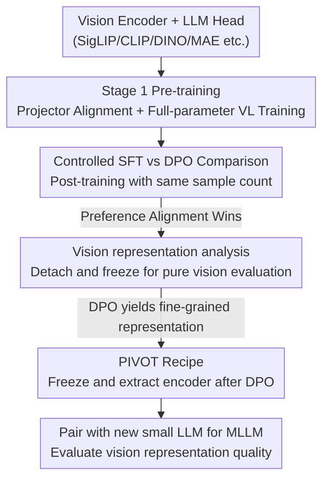

# RL Makes MLLMs See Better Than SFT

**Conference**: ICLR 2026  
**OpenReview**: [https://openreview.net/forum?id=3gM6HwHvnc](https://openreview.net/forum?id=3gM6HwHvnc)  
**Code**: https://github.com/junha1125/PIVOT  
**Area**: Multimodal VLM  
**Keywords**: MLLM, DPO, SFT, Vision Encoder, Preference Alignment

## TL;DR
This paper systematically compares the different impacts of SFT and RL (represented by DPO) on Multimodal Large Language Models (MLLMs) and their vision encoders. It finds that DPO not only performs better on vision-intensive VQA tasks but also reshapes the vision encoder to be more fine-grained and capable of localization. Based on this, it proposes PIVOT, an extremely low-cost recipe for vision encoder evolution.

## Background & Motivation

**Background**: The mainstream perception of MLLMs is that "capability primarily stems from the LLM backbone." Since language models have massive parameters and impressive capabilities, vision encoders are treated as fixed "eyes" and are rarely scrutinized by researchers. Meanwhile, the training paradigm for MLLMs is shifting from SFT (Supervised Fine-Tuning for instruction following) to RL (Reinforcement Learning/Preference Alignment, primarily DPO), further exacerbating the neglect of the vision side.

**Limitations of Prior Work**: There is almost no controlled comparison in the field regarding "what exactly is the difference between SFT vs RL on MLLMs," nor has anyone systematically analyzed how these two post-training strategies rewrite vision encoder representations. Existing conclusions remain at a preliminary level, such as "fine-tuning the vision encoder is better than freezing it," while it remains unknown whether DPO is truly stronger than SFT, whether this trend holds across model scales, and how it affects the vision encoder.

**Key Challenge**: The root lies in an implicit "LLM-centric" assumption—attributing all MLLM capabilities to the language model, leading the vision encoder to be treated as an almost invariant black box during post-training. However, the authors suspect that gradients from preference alignment actually backpropagate all the way to the vision encoder, quietly rewriting "how the model sees images," which has never been verified.

**Goal**: This is broken down into three progressive sub-questions: (1) Between SFT and DPO, which is stronger across diverse VQA tasks as vision and language scales increase? (2) Does post-training truly reshape vision representations, and does DPO do it better? (3) If so, can this process be reversed as a recipe for evolving vision encoders to surpass SOTA vision models?

**Key Insight**: Detach the vision encoder from the MLLM for independent evaluation—measuring representation quality across multiple dimensions such as ImageNet linear probing, ADE20K segmentation probing, Grad-CAM gradient visualization, and vision-language representation alignment, thereby decoupling changes on the vision side from the language side.

**Core Idea**: Train a "vision encoder + LLM head" using the contrastive gradients of DPO preference alignment, then extract and freeze the trained vision encoder. With less than 1% of the compute required for standard vision pre-training, this creates MLLM vision backbones (PIVOT) that are stronger than larger encoders trained for longer durations.

## Method

### Overall Architecture

Rather than proposing a new module, this paper first uses a set of **controlled experiments** to answer "who is stronger between SFT and DPO and why," then solidifies this discovery into a **reusable vision encoder evolution recipe, PIVOT**. The research pipeline follows three steps: ① Under a unified architecture (LLaVA-OneVision implementation, using Qwen2.5 as the LLM, SigLIP2 as the vision encoder, and a 2-layer MLP as the projector), perform SFT and DPO post-training using the **exact same** number of "image-question-answer" samples, conducting scaling comparisons across both vision (86M→1B) and language (0.5B→7B) dimensions; ② **Detach and freeze** the post-trained vision encoder from the LLM and evaluate it on pure vision benchmarks such as ImageNet classification, semantic segmentation, gradient visualization, and representation alignment to see how post-training altered the vision representations; ③ Redefine "using an LLM head to train a vision encoder with DPO" as **PIVOT (Preference-Instructed Vision OpTimization)**—after training, freeze the encoder, discard the original LLM head, and pair it with a brand new small LLM to form an MLLM for evaluation, proving that the PIVOT-evolved encoder can surpass original or even larger encoders.

### Key Designs

**1. Controlled SFT vs DPO Comparison: Isolating strategy impact under the same sample count**

Prior works (e.g., MPO) often compare "Stage 1 pre-trained models" against "models with DPO added," which conflates "training for an extra round" with "using DPO." This work feeds both algorithms the **exact same number of "image-question-answer" triplets** (20K sampled from MPO data) during Stage 2 post-training, with the only variable being the loss function. The post-training dataset is denoted as $X_{PT}=\{x_i\}$, where each sample $x_i=\{I_i, q_i, y_i^c, y_i^r\}$ contains an image, a question, a chosen answer $y^c$, and a rejected answer $y^r$; the two objectives are:

$$\mathcal{L}_{SFT} = -\mathbb{E}_{i}\log \pi_\theta(y_i^c \mid I_i, q_i), \quad \mathcal{L}_{DPO} = -\mathbb{E}_{i}\log \sigma\!\left(\beta\Big[\log\tfrac{\pi_\theta(y_i^c|I_i,q_i)}{\pi_{ref}(y_i^c|I_i,q_i)} - \log\tfrac{\pi_\theta(y_i^r|I_i,q_i)}{\pi_{ref}(y_i^r|I_i,q_i)}\Big]\right)$$

where $\pi_\theta$ is the MLLM, $\pi_{ref}$ is the reference model, and $\beta$ controls the strength of preference alignment. Under this fair setting, scaling across vision encoders (B/16→g/16) and language models (0.5B→7B) consistently shows: DPO leads SFT by a stable and significant margin in **strongly vision-related** tasks (OCR & Chart, Vision-Centric) (e.g., +3.1%p on OCR & Chart and +4.2%p on Vision-Centric for g/16), while nearly tying in Knowledge VQA which relies on LLM knowledge (approx. +0.3%p). More importantly, DPO is highly data-efficient—3K samples of DPO (60.4%p) can outperform 40K samples of SFT (59.5%p). This suggests that gains from preference alignment reside in "seeing the image" rather than "using knowledge," directly pointing to changes in the vision encoder itself.

**2. Vision Encoder Detachment Analysis: Isolating the "eye" to prove reshaping**

VQA scores alone cannot determine whether the LLM or the vision encoder improved. This paper's critical operation is **physically detaching the vision encoder (and projector)** from the post-trained MLLM and **freezing the weights**, then evaluating them on pure vision tasks unrelated to the LLM. Four types of complementary evidence were used: (i) **ImageNet Linear Probing**—linear classification on detached features showed DPO outperforms SFT by +1.83%p (SigLIP2-So/16+Qwen-3B) to +1.96%p (L/16+Qwen-1.5B) in Top-1 accuracy, and larger LLM heads yield stronger vision encoders (+4.4%p for a 7B head vs. 0.5B head), proving post-training rewrites vision representations and larger LLMs provide more informative signals; (ii) **Grad-CAM Visualization**—observing gradients on vision features $A=\Phi_{ViT}(I)$ found DPO gradients precisely focus on "question-relevant regions," whereas SFT gradients are more diffuse; (iii) **ADE20K Segmentation Probing**—patch-level classification with a 2-layer MLP showed DPO consistently superior to SFT across 6 encoders (e.g., +1.08%p patch recall on CLIP-L/14 336px), indicating enhanced localization; (iv) **Vision-Language Representation Alignment**—DPO-trained encoders show higher alignment scores with the reference LLM. These findings together lead to the core conclusion: **RL/DPO makes vision representations stronger and more localized.**

**3. PIVOT Recipe: Reversing preference alignment as a vision encoder evolution engine**

Since DPO trains vision encoders better, this process is repackaged as a standalone recipe: **PIVOT**. In short: use an LLM as a "head" and use DPO to train the vision encoder you want to evolve. The workflow: take a common vision encoder (CLIP/SigLIP1/DINOv2/MAE etc.), attach an LLM head, perform Stage 1 pre-training on 3M instruction data, then DPO on 20K preference pairs (Stage 2). Finally, **detach and freeze** the encoder to obtain a "PIVOT-enhanced encoder." For evaluation, it is reassembled with a **brand new Qwen2.5-1.5B** (projector pre-training + instruction fine-tuning on Cambrian 737K) to isolate the encoder's own capability gains. PIVOT's selling points are "efficiency" and "tier-jumping": with only 8 H100s for 18 hours (under 1% of standard pre-training compute), SigLIP1-So/14+PI (53.2%p) outperforms the generational update SigLIP2-So/16 (52.4%p), and SigLIP2-So/16+PIVOT (55.6%p) outperforms SigLIP2-g/16 (53.9%p), which has 2.5x more parameters. It is "not a new method, but a neglected training paradigm"—optimizing the vision encoder as a first-class citizen during post-training.

### Example: How PIVOT enables small encoders to jump tiers

Taking the SigLIP2 series: an MLLM with the original SigLIP2-So/16 (400M params) scores 52.4%p on average VQA; the same So/16 after PIVOT (seeing just 0.003B preference samples) and reassembled yields 55.6%p, surpassing the significantly larger SigLIP2-g/16 (1000M params, 53.9%p). In other words, a "lower-tier + PIVOT" encoder achieves gains through minimal extra training that otherwise require "moving to a larger model" or "switching to the next generation model"—OCR & Chart improved from 46.6 to 53.9, and Vision-Centric from 50.6 to 52.4.

### Loss & Training

Post-training is strictly controlled: SFT uses $\mathcal{L}_{SFT}$ from Eq. (1) (maximizing likelihood of chosen answers), while DPO uses $\mathcal{L}_{DPO}$ (preference contrast between chosen/rejected answers, with $\beta$ controlling strength). Both use the **same number** of triplets. PIVOT defaults to DPO—ablations show the DPO version (56.7%p) is 1.3%p higher than the SFT version (55.4%p) on SigLIP2-g/16. The overall two-stage paradigm (Stage 1 large-scale instruction pre-training + Stage 2 small-scale preference alignment) intentionally mimics the RLHF pipeline of InstructGPT.

## Key Experimental Results

### Main Results

After applying PIVOT to various vision encoders, MLLMs (uniformly using Qwen2.5-1.5B) showed comprehensive improvements in average VQA:

| Vision Encoder | Configuration | Average | OCR&Chart | Vision-Cent. |
|----------------|---------------|---------|-----------|--------------|
| SigLIP1-So400m | Original | 50.9 | 42.3 | 49.8 |
| SigLIP1-So400m | +PIVOT | 53.2 | 46.8 | 51.7 |
| SigLIP2-So400m | Original | 52.4 | 46.6 | 50.6 |
| SigLIP2-So400m | +PIVOT | 55.6 | 53.9 | 52.4 |
| SigLIP2-giant(1B) | Original | 53.9 | 50.8 | 51.9 |
| SigLIP2-giant(1B) | +PIVOT | 56.7 | 54.7 | 54.2 |
| CLIP-large | +PIVOT | 49.5 (+3.2) | 37.8 | 48.6 |
| DINOv2-giant | +PIVOT | 43.6 (+2.7) | 18.7 | 49.2 |
| MAE-huge | +PIVOT | 39.7 (+2.9) | 18.2 | 43.3 |

Highlights: SigLIP2-So/16+PIVOT (55.6) jumps tiers to surpass SigLIP2-g/16 (53.9), which has 2.5x more parameters. Even purely self-supervised (MAE, MoCo) and purely classification-supervised (ImageNet-Sup) encoders are improved by PIVOT, indicating universal gains.

### Ablation Study

| Configuration | Key Metrics | Explanation |
|---------------|-------------|-------------|
| PIVOT (DPO) | 56.7%p avg | Default recipe, SigLIP2-g/16 |
| +SFT (Substituted) | 55.4%p avg | Dropped 1.3%p when switching to SFT, confirming DPO superiority in PIVOT |
| DPO ImageNet Probing | +1.83~1.96%p | Linear probing of detached encoders, DPO > SFT |
| DPO Seg. Probing | +1.08%p recall| CLIP-L/14 336px, better patch-level localization |
| DPO Data Efficiency | 3K > SFT 40K | DPO 3K samples (60.4) > SFT 40K samples (59.5) |

### Key Findings

- **DPO gains are concentrated on the vision side**: DPO significantly leads SFT in vision-intensive tasks (OCR & Chart, Vision-Centric) but ties in Knowledge VQA, proving preference alignment primarily improves "seeing" rather than "knowledge retrieval."
- **Post-training truly reshapes the vision encoder**: Detached probing on ImageNet/Segmentation shows higher pure vision performance for DPO-trained encoders—the first evidence that DPO learns vision representations, not just language alignment.
- **Larger LLMs provide more informative signals**: A 7B LLM head trains a vision encoder that is 4.4%p higher in ImageNet accuracy than a 0.5B head.
- **Sharper Gradients**: Grad-CAM shows DPO vision gradients focus precisely on question-relevant areas, while SFT is diffuse, explaining the souce of improved localization.

## Highlights & Insights
- **Turning "Vision Encoders" from black boxes into research subjects**: Through physical detachment + pure vision probing, the study cleanly decouples the impact of post-training on the vision side from the language side—a methodological approach that other works can mirror.
- **PIVOT's "Leveraging" effect**: With less than 1% compute (18 hours on 8×H100), small encoders surpass larger/newer ones, transforming "vision backbone evolution" from expensive pre-training into cheap post-training fine-tuning.
- **Mechanism explanation of Contrastive Objective → Fine-grained Gradients**: The contrastive signal in DPO naturally provides more focused vision gradients than SFT, explaining "why RL sees better" at the gradient level.
- **Strong Universality**: From language-supervised (CLIP/SigLIP) to self-supervised (MAE/MoCo/DINOv2) and classification-supervised (ImageNet-Sup) encoders, PIVOT is effective across the board.

## Limitations & Future Work
- **RL limited to DPO**: The main text focuses almost exclusively on DPO as the RL representative. While the appendix includes PPO/GRPO/MPO, the universality of the "RL > SFT" conclusion depends on this specific case.
- **Lightweight Evaluation Protocol**: PIVOT encoders were tested with a small Qwen2.5-1.5B LLM and Cambrian 737K data. Whether tier-jumping holds on large-scale SOTA MLLMs (e.g., 7B+ with tens of millions of instructions) remains to be verified.
- **Absolute Scores**: VQA averages are mostly in the 50%+ range, belonging to a controlled research setting rather than a leaderboard-chasing one. Whether relative gains persist on stronger bases is unknown.
- **Future Directions**: Extending PIVOT to stronger RL (e.g., GRPO), larger preference datasets, and exploring the combination of PIVOT-enhanced encoders with multi-encoder ensembles.

## Related Work & Insights
- **vs. Multi-Vision Encoder Ensembles (Cambrian/Tong et al.)**: They rely on stacking encoders (e.g., SigLIP1+ConvNeXt-XXL, 1.25B params) to reach 51.4%p; Ours achieves 53.2%p with a single SigLIP1+PIVOT without adding parameters, and the two methods can be stacked (53.6%p).
- **vs. DPO Enhancement Works like MPO**: MPO compares "pre-trained models vs. those with DPO added," confounding training volume with the algorithm; Ours uses a controlled comparison to cleanly isolate the advantage of the "DPO algorithm itself" over SFT.
- **vs. LLM-Centric MLLM Research**: Most research attributes MLLM capability to the LLM backbone; Ours proves that post-training substantially reshapes vision representations, putting the evolution of vision encoders back on the table.

## Rating
- **Novelty**: ⭐⭐⭐⭐⭐ First systematic proof that DPO reshapes vision encoders, and the application of preference alignment as a vision backbone evolution recipe.
- **Experimental Thoroughness**: ⭐⭐⭐⭐ Scaling across vision/language + four types of probing + multi-encoder verification, though the base models are small and absolute scores are not peak SOTA.
- **Writing Quality**: ⭐⭐⭐⭐⭐ Clear three-step logic (Comparison → Analysis → Recipe), with six findings building a complete chain of evidence.
- **Value**: ⭐⭐⭐⭐⭐ A practical recipe for low-cost vision backbone evolution + mechanistic insights into why RL improves vision, offering directional significance for MLLM vision research.

<!-- RELATED:START -->

## Related Papers

- [\[CVPR 2026\] Why Does RL Generalize Better Than SFT? A Data-Centric Perspective on VLM Post-Training](../../CVPR2026/multimodal_vlm/why_does_rl_generalize_better_than_sft_a_data-centric_perspective_on_vlm_post-tr.md)
- [\[ICLR 2026\] Visual Jigsaw Post-Training Improves MLLMs](visual_jigsaw_post-training_improves_mllms.md)
- [\[ICLR 2026\] Constructive Distortion: Improving MLLMs with Attention-Guided Image Warping](constructive_distortion_improving_mllms_with_attention-guided_image_warping.md)
- [\[ICLR 2026\] On Discriminative vs. Generative Classifiers: Rethinking MLLMs for Action Understanding](on_discriminative_vs_generative_classifiers_rethinking_mllms_for_action_understa.md)
- [\[ICLR 2026\] Patch-as-Decodable-Token: Towards Unified Multi-Modal Vision Tasks in MLLMs](patch-as-decodable-token_towards_unified_multi-modal_vision_tasks_in_mllms.md)

<!-- RELATED:END -->
