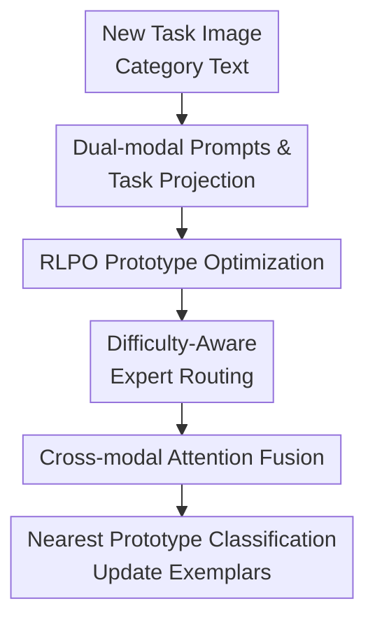

# RLAP-CLIP: Continual Multimodal Learning with Prototype Adaptation and Difficulty-Aware Routing

**Conference**: ICLR2026  
**OpenReview**: [https://openreview.net/forum?id=rMHZfCznhZ](https://openreview.net/forum?id=rMHZfCznhZ)  
**Code**: TBC  
**Area**: Multimodal VLM / Continual Learning / CLIP  
**Keywords**: CLIP Continual Learning, Prototype Optimization, Dual-modal Prompts, Difficulty-Aware Routing, Mixture of Experts (MoE)  

## TL;DR
RLAP-CLIP addresses class-incremental multimodal continual learning for CLIP by replacing simple mean category prototypes with reinforcement learning-based weighted optimization. It utilizes vision-text dual-modal prompts and difficulty-aware MoE routing to process samples of varying complexity, consistently outperforming methods like PROOF and C-CLIP across eight classification datasets.

## Background & Motivation
**Background**: Large-scale vision-language models (VLMs) like CLIP excel in zero-shot classification by aligning images and text in a shared semantic space. Continual learning (CL) settings are more demanding, requiring the model to learn new categories sequentially without forgetting old ones. Current approaches often freeze the CLIP backbone and learn a small number of prompts, adapters, or prototype classifiers, using a few exemplars per class to maintain historical knowledge.

**Limitations of Prior Work**: This paper identifies two primary bottlenecks. First, many methods use the feature mean of historical exemplars as the category prototype, which is fragile when samples are scarce, category boundaries are fine-grained, or the feature space evolves. Outlier exemplars or multi-modal distributions can shift prototypes to unfavorable positions, degrading classification boundaries. Second, existing CL methods rely heavily on text prompts, treating the vision encoder as a fixed feature extractor. However, in fine-grained recognition tasks like CUB-200, Aircraft, or Cars, local visual details are essential for discrimination, and category names with text context alone are insufficient.

**Key Challenge**: Stability in CL requires reliable historical category representations, while plasticity requires adaptation to fine-grained visual patterns in new tasks. Passive mean prototypes favor stability but lacks discriminability. Text-centric prompts preserve CLIP's structure but waste visual adaptation potential. Simply increasing adaptation capacity may disrupt old category boundaries.

**Goal**: The authors decompose the problem into three sub-goals: making prototype construction actively serve inter-class separability; enabling lightweight adaptation for both vision and text modalities; and allocating computational resources based on sample difficulty to avoid over-processing simple samples or under-processing difficult boundary samples.

**Key Insight**: Prototypes should not be limited to simple averages; they can be viewed as sample-weighted decisions. Different exemplars contribute differently to category boundaries, and the model should learn to assign higher weights to representative samples that maximize inter-class distance. Furthermore, samples further from the optimized prototype are likely near category boundaries and require stronger expert paths for processing.

**Core Idea**: RLAP-CLIP replaces the standard "text prompt + mean prototype" approach in CLIP-based CL with "RL-optimized prototypes + dual-modal prompt adaptation + difficulty-aware MoE fusion" to balance historical preservation and new task adaptation.

## Method
### Overall Architecture
RLAP-CLIP employs a frozen CLIP ViT-B/16 as the backbone. During training, only a few task-related modules are updated: visual prompts, text prompts, task projection layers, the RLPO prototype policy network, two experts (easy/hard), and a cross-modal attention fusion layer. When a new task arrives, images and class text are adapted through dual-modal prompts and mapped to a task-specific space. Historical exemplars are weighted into more reliable prototypes via RLPO. Samples receive difficulty scores based on their distance from prototypes, which determines the routing through MoE experts and cross-modal attention for final classification.

From an information flow perspective, dual-modal prompts perform lightweight adjustments of CLIP's features to the current task. RLPO compresses exemplars into discriminative category prototypes. Difficulty routing and cross-modal attention further process sample features, visual prototypes, and text prototypes before classification. Inference follows the same processing flow using nearest prototype matching without re-training.

### Key Designs
**1. RLPO Prototype Optimization: From "Category Means" to "Boundary-Aware Sample Weighting"**

Traditional prototypes are defined as $p_c=\frac{1}{|E_c|}\sum_{x_i\in E_c} f(x_i)$, assuming all exemplars are equally reliable. RLAP-CLIP redefines this as $p_c=\sum_{i:y_i=c}w_i f_i$, where weights $w_i=\pi_\theta(f_i,P)$ are predicted by a policy network and normalized via softmax. This policy network considers both individual sample features and the set of current category prototypes $P$, learning to identify samples that maximize class separation rather than just finding the mean.

The reward function is defined as: $R_i=sim(f_i,p_{y_i})-\max_{j\ne y_i}sim(f_i,p_j)-\lambda\frac{\sum_{j\ne y_i}sim(p_{y_i},p_j)}{C-1}$. The first term encourages samples to be close to their class prototype, the second encourages distance from the nearest wrong category, and the third penalizes categories that are too close to each other. To stabilize rewards across tasks, the advantage $A_i=(R_i-\mu_R)/(\sigma_R+\epsilon)$ is calculated within each batch. The policy is updated using $L_{RLPO}$ with KL-regularization against a reference policy $\pi_{ref}$ (initialized as uniform and updated via EMA) to prevent drastic shifts.

**2. Dual-modal Prompts & Task Projection: Addressing Visual Adaptation in CLIP CL**

Instead of only learning text prompts, the method maintains task-specific visual prompts $V_t$ and text prompts $T_t$. Visual prompts are prepended to image patch embeddings before entering the frozen vision encoder, while text prompts are prepended to category templates. Visual and text features then pass through task-specific linear projections $P_v^t$ and $P_t^t$ to obtain representations $f_i^{v,(t)}$ and $f_c^{t,(t)}$ in the current task space.

This approach restricts "learning new tasks" to the prompts and projection layers, keeping the CLIP backbone frozen to prevent forgetting while allowing the vision side to learn task-specific fine-grained cues. Motivation experiments on CUB-200 show dual-modal prompts achieve 84.2% average accuracy, outperforming text-only (81.7%) and visual-only (82.9%) setups.

**3. Difficulty-Aware MoE Routing: Allocating Capacity to Boundary Samples**

The difficulty of samples in CL varies. RLAP-CLIP defines difficulty using optimized prototypes: $d_i=1-\frac{sim(f_i^v,p_{y_i}^v)+sim(f_i^t,p_{y_i}^t)}{2}$. Samples far from their class prototype are likely near boundaries or easily confused, resulting in higher difficulty scores. 

The MoE consists of two experts: an easy expert (single linear layer) and a hard expert (three-layer FFN). Routing probabilities are defined as $P(E_{easy}|x_i)=\sigma(-\alpha(d_i-\tau))$, where $\tau$ is a learned threshold and $\alpha$ controls sharpness. The final visual feature is a weighted sum: $f_i^{v,expert}=P(E_{easy}|x_i)E_{easy}(f_i^v)+P(E_{hard}|x_i)E_{hard}(f_i^v)$, directing more model capacity to samples near boundaries.

**4. Cross-modal Attention Fusion: Dynamic Weighting of Vision, Prototype, and Text**

RLAP-CLIP concatenates the expert visual feature, visual prototype, and text prototype into $h_i=[f_i^{v,expert};f_{visual\ proto};f_{textual\ proto}]$. An attention network outputs weights $[W_a,W_b,W_c]=SoftMax(Attention(h_i))$. The final classification relies on the weighted features. This allows the model to dynamically trust different modalities; some categories are distinguishable by name (text), while others require fine-grained visual differences or stable historical prototypes.

### Loss & Training
The total objective function is: $L_{total}=L_{cls}+\lambda_{clip}L_{clip}+\lambda_{RLPO}L_{RLPO}+\lambda_{MoE}L_{MoE}$. The classification loss is difficulty-weighted: $L_{cls}=-\frac{1}{B}\sum_i(1+\gamma d_i)\log p(y_i|x_i)$, giving harder samples more weight. $L_{clip}$ maintains the pre-trained CLIP alignment. $L_{RLPO}$ trains the prototype weighting policy, while $L_{MoE}$ encourages the use of both experts. The model uses CLIP ViT-B/16, training for 20 epochs per task with 20 exemplars per class.

## Key Experimental Results

### Main Results
Evaluation was conducted on eight datasets, including general classification, fine-grained recognition, and specialized domains.

| Dataset | Metric | RLAP-CLIP | Prev. SOTA | Gain |
|--------|------|-----------|--------------|------|
| CIFAR-100 | Avg / Final | 86.64 / 79.41 | PROOF 82.92 / C-CLIP 78.92 | Avg +3.72 / Final +0.49 |
| CUB-200 | Avg / Final | 85.78 / 83.67 | C-CLIP 82.14 / 79.83 | Avg +3.64 / Final +3.84 |
| Cars | Avg / Final | 94.82 / 93.15 | C-CLIP 92.18 / 90.45 | Avg +2.64 / Final +2.70 |
| Aircraft | Avg / Final | 70.25 / 68.41 | C-CLIP 65.73 / 62.15 | Avg +4.52 / Final +6.26 |
| Food-101 | Avg / Final | 88.24 / 86.88 | PROOF 87.52 / 84.74 | Avg +0.72 / Final +2.14 |
| UCF-101 | Avg / Final | 97.68 / 95.80 | PROOF 93.56 / 91.32 | Avg +4.12 / Final +4.48 |
| ImageNet-R | Avg / Final | 85.63 / 82.22 | C-CLIP 83.15 / 81.06 | Avg +2.48 / Final +1.16 |
| ObjectNet | Avg / Final | 53.89 / 48.91 | C-CLIP 51.37 / 47.82 | Avg +2.52 / Final +1.09 |

Significant gains are observed in fine-grained datasets (Aircraft, CUB-200) where visual adaptation is critical.

### Ablation Study
| Configuration | Average Accuracy | Description |
|------|------------|------|
| Base | 78.97 | Frozen CLIP, text-only prompt, mean prototypes |
| +VP | 79.64 | Added visual prompt (+0.67 avg) |
| +VP+MoE | 80.79 | Added difficulty-aware routing (+1.15 avg) |
| +VP+MoE+RLPO | 81.98 | Added RL prototype optimization (+1.19 avg) |
| RLAP-CLIP | 82.87 | Added cross-modal attention fusion (+0.89 avg) |

### Key Findings
- **RLPO** is crucial for fine-grained scenarios. In Aircraft, it contributed +2.28 points, suggesting prototype location is more critical than prompt capacity when boundaries are tight.
- **Visual prompt** gains are task-dependent, showing higher efficacy in Aircraft and ObjectNet than in Food-101.
- **Difficulty routing** based on distance is more robust than entropy-based routing, as it leverages the geometric structure of classes.
- **Exemplar budget** remains a bottleneck; reducing from 20 to 10 exemplars causes a 6.73 point drop.

## Highlights & Insights
- The transition of prototype construction from a post-processing mean to an optimized policy is a significant contribution.
- The feedback loop between difficulty scores and RLPO ensures that more reliable prototypes improve difficulty estimation, which in turn helps resolve boundary samples.
- Analysis shows that while visual prompts help, they must be balanced; in cases with strong textual markers (e.g., specific plane models), over-relying on visual features can cause confusion.

## Limitations & Future Work
- **Dependency on exemplars**: While 20 exemplars are efficient, performance drops without them; rehearsal-free settings would require generative prototypes.
- **Complexity**: Multiple modules and loss terms increase tuning difficulty.
- **Scope**: Current evaluation focuses on class-incremental classification; efficiency in domain-incremental or task-free settings remains to be explored.

## Related Work & Insights
- **vs PROOF**: Improves upon PROOF's passive mean prototypes and text-centric adaptation with active RL weighting and dual-modal prompts.
- **vs C-CLIP**: Outperforms C-CLIP's parameter-efficient adaptation, particularly in fine-grained tasks (e.g., +6.26 final accuracy on Aircraft) by focusing on boundary exemplar contributions.
- **vs CoOp/MaPLe**: Inherits multimodal prompt capabilities while specifically addressing historical prototype degradation in CL.

## Rating
- Novelty: ⭐⭐⭐⭐☆
- Experimental Thoroughness: ⭐⭐⭐⭐⭐
- Writing Quality: ⭐⭐⭐⭐☆
- Value: ⭐⭐⭐⭐☆

<!-- RELATED:START -->

## Related Papers

- [\[ICLR 2026\] KeepLoRA: Continual Learning with Residual Gradient Adaptation](keeplora_continual_learning_with_residual_gradient_adaptation.md)
- [\[CVPR 2026\] Label What Matters: Modality-Balanced and Difficulty-Aware Multimodal Active Learning](../../CVPR2026/multimodal_vlm/label_what_matters_modality-balanced_and_difficulty-aware_multimodal_active_lear.md)
- [\[ICLR 2026\] Bilateral Information-aware Test-time Adaptation for Vision-Language Models](bilateral_information-aware_test-time_adaptation_for_vision-language_models.md)
- [\[ICLR 2026\] Memory-Free Continual Learning with Null Space Adaptation for Zero-Shot Vision-Language Models](memory-free_continual_learning_with_null_space_adaptation_for_zero-shot_vision-l.md)
- [\[AAAI 2026\] Harnessing Textual Semantic Priors for Knowledge Transfer and Refinement in CLIP-Driven Continual Learning](../../AAAI2026/multimodal_vlm/harnessing_textual_semantic_priors_for_knowledge_transfer_and_refinement_in_clip.md)

<!-- RELATED:END -->
## Related Papers

- [\[ICLR 2026\] KeepLoRA: Continual Learning with Residual Gradient Adaptation](keeplora_continual_learning_with_residual_gradient_adaptation.md)
- [\[CVPR 2026\] Label What Matters: Modality-Balanced and Difficulty-Aware Multimodal Active Learning](../../CVPR2026/multimodal_vlm/label_what_matters_modality-balanced_and_difficulty-aware_multimodal_active_lear.md)
- [\[ICLR 2026\] Bilateral Information-aware Test-time Adaptation for Vision-Language Models](bilateral_information-aware_test-time_adaptation_for_vision-language_models.md)
- [\[ICLR 2026\] Memory-Free Continual Learning with Null Space Adaptation for Zero-Shot Vision-Language Models](memory-free_continual_learning_with_null_space_adaptation_for_zero-shot_vision-l.md)
- [\[ICLR 2026\] CLIP-FMoE: Scalable CLIP via Fused Mixture-of-Experts with Enforced Specialization](clip-fmoe_scalable_clip_via_fused_mixture-of-experts_with_enforced_specializatio.md)

<!-- RELATED:END -->
