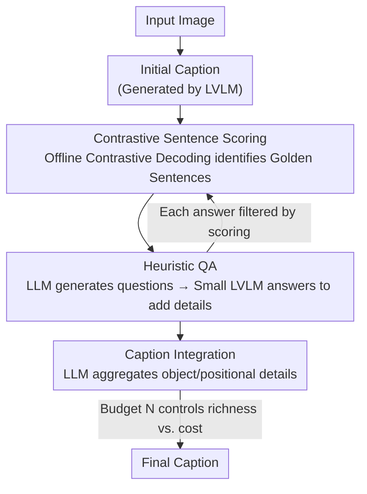

# ScaleCap: Scalable Image Captioning via Dual-Modality Debiasing

**Conference**: ICLR 2026  
**OpenReview**: [https://openreview.net/forum?id=3tUSHgohi5](https://openreview.net/forum?id=3tUSHgohi5)  
**Code**: https://github.com/Cooperx521/ScaleCap  
**Area**: Multimodal VLM  
**Keywords**: Image Captioning, Debiasing, Contrastive Decoding, Hallucination Suppression, Test-time Scaling

## TL;DR
ScaleCap employs two complementary modules—"Heuristic Question Answering" and "Contrastive Sentence Scoring"—to rectify descriptive biases in open-source LVLMs. The former recovers omitted object details through iterative questioning, while the latter removes hallucinated sentences caused by language priors via offline contrastive decoding. The system scales in precision and detail with increased inference budget. Pre-training on 450,000 images annotated by ScaleCap demonstrates consistent performance gains across 11 benchmarks.

## Background & Motivation

**Background**: High-quality detailed captions are increasingly vital for fine-grained vision-language alignment in LVLM pre-training, evolving from brief phrases to paragraph-level, context-rich descriptions. However, manual annotation or closed-source APIs like GPT-4o are expensive and non-scalable, prompting a shift toward using open-source LVLMs for self-generation.

**Limitations of Prior Work**: The quality of captions generated by open-source LVLMs remains suboptimal due to two types of **intrinsic biases**. First, **multimodal bias**: imbalances in multimodal training data lead models to describe some objects extensively while ignoring others, resulting in uneven granularity and incomplete coverage. Second, **language bias**: LVLMs inherit linguistic habits from LLMs, favoring boilerplate text and high-frequency co-occurrences, which leads to "hallucinating" objects or attributes not present in the image.

**Key Challenge**: Previous remedies involved external tools (object detectors, image taggers, expert modules) to enrich descriptions or suppress hallucinations. However, the upper bound of caption quality is strictly limited by the precision and coverage of these tools. Given the infinite combinations of real-world objects and attributes, manually designed, category-specific modules are impractical as general solutions.

**Key Insight**: The authors observe that the lack of detail is **not due to a lack of perception**, but rather insufficient information extraction during generation. When explicitly prompted with questions like "describe this omitted object in detail," the model provides accurate descriptions (statistics on 100 images show 93% of new responses successfully added object details). Furthermore, this perceptual capability does not strictly depend on model size: a 7B LVLM, when properly guided, exhibits perception comparable to a 72B model, with the gap primarily residing in reasoning.

**Core Idea**: Instead of increasing model scale or attaching external tools, the authors propose a **structured, cyclic** debiasing workflow. The model iteratively revisits, questions, and calibrates the caption—using a small LVLM for "seeing" and a strong LLM for "questioning and integration," with a budget $N$ to control the number of questions, allowing for a flexible trade-off between quality and cost.

## Method

### Overall Architecture
ScaleCap is a "generate-and-refine" scalable pipeline designed to transform an image into a comprehensive, detailed, and faithful long description. Given an input image, an LVLM first generates an **initial caption**. Then, the **Contrastive Sentence Scoring** module identifies sentences with high visual grounding, designated as "golden sentences," serving as the skeleton and starting point for subsequent expansion. Centered on these golden sentences, the **Heuristic Question Answering** module uses a strong LLM to generate a batch of followup instructions targeting objects and positions. A lightweight LVLM answers these instructions, injecting fine-grained details; each answer is filtered for hallucinations via the scoring module. Finally, a strong LLM integrates these fragmented object and spatial details into a structured final caption. The process is managed by a budget $N$ (maximum allowed instructions), enabling flexible balancing of descriptive richness and computational overhead.

### Key Designs

**1. Contrastive Sentence Scoring: Identifying and removing hallucinations via offline contrastive decoding**

This module addresses hallucinations caused by language bias. The core idea is that a token truly grounded in the image should be significantly more likely to be generated with visual conditioning than without. Conversely, if a token has a high probability even without the image, it is likely hallucinated based on language co-occurrence priors. Formally, for each token $c_t$ in the initial caption, two probability sequences are calculated: $p_t = p_\theta(y_t=c_t \mid I,[T,c_{<t}])$ conditioned on image $I$, and $p'_t = p_\theta(y_t=c_t \mid [T,c_{<t}])$ conditioned only on text. The contrastive probability is $\Delta p_t = p_t - p'_t$. A larger $\Delta p_t$ indicates a token is more dependent on visual evidence and is thus more reliable.

Unlike previous **online** contrastive decoding (which interferes with logits during decoding and may harm linguistic fluency), ScaleCap performs **offline** analysis. It analyzes the full sentence after generation without altering the decoding process, preserving coherence while detecting hallucinations. Filtering is performed at the **sentence level**: the caption is split into sentences $\{C_1,\dots,C_m\}$. For each sentence, the maximum contrastive probability across its key tokens (excluding stop words via POS tagging) is taken. Sentences exceeding a threshold $\tau$ are retained as golden sentences:

$$S_G = \{C_k \mid \max(\Delta p^k_1, \Delta p^k_2, \dots, \Delta p^k_{kl}) > \tau\}$$

A larger $\tau$ results in stricter filtering. This module serves as a "quality inspector" throughout the process, filtering both the initial caption and subsequent QA responses.

**2. Heuristic Question Answering: Bridging detail gaps via focused questioning**

This module targets granularity imbalances caused by multimodal bias. The mechanism explicitly breaks down "adding detail" into a sequence of simple questions. Using the golden sentences $S_G=\{S_1,\dots,S_q\}$ as clues, a strong LLM $M_L$ generates a set of **object instructions** $I^k_o = M_L(T_{ict}, S_k)$ via in-context learning. Each instruction, e.g., "Describe the airplane in detail," covers all objects mentioned in the sentence. Additionally, position prefixes are added to create **position instructions** $I^k_p$ (e.g., "Describe the position of the airplane in detail") to capture spatial relationships and overall layout.

For answering, a **lightweight LVLM** is deliberately used. Aligning with findings that LVLM perception is relatively consistent across scales while reasoning varies, the authors use a small $M_V$ to answer these straightforward instructions, obtaining details $D^k_{o,i}=M_V(I, I^k_{o,i})$ at low cost. This decouples "perception" (small LVLM) from "questioning and integration" (strong LLM). Scalability is achieved as more questions yield increasing levels of detail.

**3. Caption Integration & Scalable Budget N: Aggregating details and balancing costs**

The QA module produces fragmented object details $D_o$ and position details $D_p$. To avoid a disjointed final output, the integration module leverages the LLM's summarization capabilities. Using prompts $T_o$ and $T_p$, object-level and position-level details are summarized into $C_o=M_L(S_G,T_o,D_o)$ and $C_p=M_L(S_G,T_p,D_p)$. The golden sentences are provided as a skeleton to ensure structural alignment. Finally, the LLM fuses these components into a coherent final caption $F_c=M_L(S_G,T_{final},C_o,C_p)$.

Scalability is governed by budget $N$, which limits the maximum number of object/position instructions generated. A small $N$ results in fewer questions (low cost, moderate detail), while a large $N$ exhausts all instructions (highest detail). Experiments show that as $N$ increases (0→2→6→10→15→20→all), MMVet scores under the Prism framework rise from 51.8 to 58.8, and MMStar from 46.9 to 50.3, demonstrating a smooth curve where more inference budget yields better descriptions. The default setup uses Qwen2-VL-7B for perception and Qwen2-72B for integration.

## Key Experimental Results

### Main Results
**Pre-training Gains (Table 1, average across 11 benchmarks)**: Replacing other datasets with ScaleCap-450k for further pre-training yields the highest average scores across three architectures.

| Architecture | Pre-training Data | 11-Bench Avg | InfoVQA | MMVet |
|------|-----------|------------|---------|-------|
| Qwen2.5-7B | ShareGPT4V-450k | 62.4 | 47.5 | 48.9 |
| Qwen2.5-7B | DenseFusion-450k | 63.0 | 49.4 | 52.4 |
| Qwen2.5-7B | **ScaleCap-450k** | **64.7** | **51.8** | **55.9** |
| Qwen2.5-3B | DenseFusion-450k | 58.9 | 44.5 | 39.9 |
| Qwen2.5-3B | **ScaleCap-450k** | **60.1** | **47.2** | **45.6** |
| InternLM2.5-7B | DenseFusion-450k | 59.1 | 39.1 | 47.2 |
| InternLM2.5-7B | **ScaleCap-450k** | **60.2** | **39.6** | **48.0** |

InfoVQA increased by 4.3% compared to ShareGPT4V and 2.4% compared to DenseFusion; MMVet increased by 7% compared to ShareGPT4V and 3.5% compared to DenseFusion.

**Descriptive Information Richness (Table 2, Prism Framework)**: With Qwen2-72B fixed as the evaluator LLM, ScaleCap (using a 7B LVLM) achieves an average of 58.2, surpassing Prism using a 72B LVLM (56.0). This demonstrates that a small model with proper guidance can outperform a large model's brute-force generation.

| Strategy | LVLM | MMVet | InfoVQA | ChartQA | Average |
|------|------|-------|---------|---------|------|
| Prism | Qwen2-VL-7B | 53.3 | 49.3 | 68.5 | 54.1 |
| Prism | Qwen2-VL-72B | 57.3 | 50.0 | 69.5 | 56.0 |
| **ScaleCap** | Qwen2-VL-7B | **58.8** | **53.8** | **72.9** | **58.2** |

### Ablation Study

| Configuration | TextVQA | MMVet | ChartQA | Avg | Description |
|------|---------|-------|---------|-----|------|
| Object instructions only | 52.9 | 54.5 | 69.1 | 58.8 | Lacks spatial relations |
| Position instructions only | 52.3 | 54.3 | 65.7 | 57.4 | Lacks object details |
| ScaleCap (Full) | 53.2 | 58.8 | 72.5 | 61.5 | Complementary |

| Integration Model Scale | MMVet | MMStar | Description |
|------------|-------|--------|------|
| Qwen2-7B | 43.6 | 40.3 | Small LLM fails to integrate >1k tokens of detail |
| Qwen2-72B | 58.8 | 49.5 | Strong reasoning required for integration |

### Key Findings
- **Object and position instructions are mutually indispensable**: Using either alone is significantly inferior to the combined approach (58.8/57.4 vs. 61.5).
- **Integration is the bottleneck for LLM scale**: While answering can be handled by a 7B model, integration using a 7B model causes MMVet to drop from 58.8 to 43.6, validating the "small model for perception, large model for integration" hypothesis.
- **Smooth Scalability**: MMVet scores improve monotonically with the number of instructions (from 51.8 to 58.8), proving a quality-for-budget trade-off.
- **Superiority with GPT-4o**: Upgrading both components to GPT-4o reaches an MMVet score of 76.1, surpassing Sonnet 3.5, GPT-4V, and Gemini-2.0-Pro in direct-to-answer settings.

## Highlights & Insights
- **Revisiting Perception vs. Extraction**: The observation that "missing detail $\neq$ lack of perception" is a major contribution. By reframing the issue as a failure of information extraction, the solution shifts from "larger models" to "better questioning."
- **Pragmatic Offline Contrastive Decoding**: Unlike online methods that risk linguistic degradation, ScaleCap's offline sentence-level scoring balances hallucination detection with linguistic coherence.
- **Decoupled Cost Structure**: Using a 7B model for perception and a 72B model for integration optimizes the cost-quality balance by assigning specialized models to their respective strengths.
- **Image Reconstruction as a Proxy Metric**: Using FLUX to reconstruct images from captions and performing human similarity evaluations effectively visualizes descriptive coverage.

## Limitations & Future Work
- **Linear Inference Overhead**: Quality is dependent on the number of QA rounds. While budget $N$ mitigates this, the total cost for annotating 450k images remains significant.
- **Dependency on Strong LLMs for Integration**: The integration phase requires a 72B-class model, meaning the pipeline is not a "purely small model" solution.
- **Heuristic Threshold $\tau$**: The selection of $\tau$ for golden sentence filtering is empirical, and its sensitivity was not exhaustively analyzed.
- **Small-scale Human Evaluation**: The reconstruction evaluation relied on 50 images and 25 volunteers, which, while indicative, has limited statistical power.

## Related Work & Insights
- **vs. Tool-augmented Methods (e.g., DenseFusion)**: These methods rely on specific expert models whose limits are defined by category coverage. ScaleCap uses general-purpose LVLMs to cover arbitrary objects and consistently outperforms DenseFusion.
- **vs. Online Contrastive Decoding (e.g., VCD)**: Online methods often disrupt linguistic smoothness. ScaleCap’s offline approach provides a safer alternative for hallucination checks.
- **vs. Prism Framework**: ScaleCap adopts Prism’s perception/reasoning decoupling but upgrades it from an evaluation tool to a generation strategy.

## Rating
- Novelty: ⭐⭐⭐⭐ Combines "inquiring" and "offline contrastive debiasing" into a scalable pipeline.
- Experimental Thoroughness: ⭐⭐⭐⭐⭐ Comprehensive evaluation across pre-training, information richness, and image reconstruction.
- Writing Quality: ⭐⭐⭐⭐ Clear progression of logic with strong empirical support for the core thesis.
- Value: ⭐⭐⭐⭐⭐ Provides a scalable high-quality annotation solution; the ScaleCap-450k dataset is of direct community value.

<!-- RELATED:START -->

## Related Papers

- [\[ICML 2025\] Toward Robust Hyper-Detailed Image Captioning: A Multiagent Approach and Dual Evaluation Metrics for Factuality and Coverage](../../ICML2025/multimodal_vlm/toward_robust_hyper-detailed_image_captioning_a_multiagent_approach_and_dual_eva.md)
- [\[ICCV 2025\] CaptionSmiths: Flexibly Controlling Language Pattern in Image Captioning](../../ICCV2025/multimodal_vlm/captionsmiths_flexibly_controlling_language_pattern_in_image_captioning.md)
- [\[ICLR 2026\] Simulation to Rules: A Dual-VLM Framework for Formal Visual Planning](simulation_to_rules_a_dual-vlm_framework_for_formal_visual_planning.md)
- [\[ICLR 2026\] DualToken: Towards Unifying Visual Understanding and Generation with Dual Visual Vocabularies](dualtoken_towards_unifying_visual_understanding_and_generation_with_dual_visual_.md)
- [\[ICLR 2026\] CLIP-FMoE: Scalable CLIP via Fused Mixture-of-Experts with Enforced Specialization](clip-fmoe_scalable_clip_via_fused_mixture-of-experts_with_enforced_specializatio.md)

<!-- RELATED:END -->
