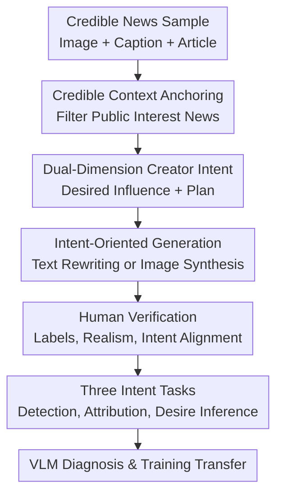

# Seeing Through Deception: Uncovering Misleading Creator Intent in Multimodal News with Vision-Language Models

**Conference**: ICLR 2026  
**OpenReview**: [https://openreview.net/forum?id=02NbD16OnA](https://openreview.net/forum?id=02NbD16OnA)  
**Code**: https://github.com/jiayingwu19/DeceptionDecoded  
**Area**: Multimodal VLM / Multimodal Misinformation Detection  
**Keywords**: Multimodal Misinformation Detection, Creator Intent, Vision-Language Models, News Credibility, Synthetic Benchmark  

## TL;DR
This paper introduces DECEPTIONDECODED: a large-scale multimodal news benchmark anchored in credible news contexts that explicitly models misleading creator intent. Using 12,000 image-text samples, it diagnoses VLM vulnerabilities to content that is "surface-consistent but intentionally misleading" and demonstrates that fine-tuning on such data improves general multimodal misinformation detection.

## Background & Motivation
**Background**: Multimodal Misinformation Detection (MMD) has historically focused on image-text alignment. Typical tasks include out-of-context detection—assigning a real image to an unrelated event—or multimedia manipulation detection, which checks for local forgeries in images or text. As VLMs like GPT-4o, Claude, Gemini, and Qwen2.5-VL are integrated into fact-checking workflows, research has shifted toward models evaluating news credibility by combining images, captions, and external evidence.

**Limitations of Prior Work**: Misleading content in real news does not always manifest as obvious image-text conflicts. A creator might maintain local semantic consistency between an image and a caption while inserting an unsubstantiated narrative—such as "secret nuclear tests cause iceberg collapse"—into the caption. Alternatively, they might use professional-looking images and objective-sounding captions to imply panic, conspiracy, or social polarization. Existing benchmarks often use CLIP similarity mismatching, sentiment replacement, or unimodal text intent inference, simplifying the issue to surface-level inconsistency and failing to capture the active narrative-design process of a creator.

**Key Challenge**: Crucial evidence of multimodal deception often lies not in "whether the image and caption are similar," but in "whether the conclusion implied by both is supported by a credible context." Without explicit creator intent labels, annotators can only guess intent post-hoc from a reader's perspective. Without credible reference articles, models struggle to distinguish between reasonable summaries, stylized expressions, and groundless misleading implications.

**Goal**: The authors aim to address three interconnected problems: first, constructing a large-scale multimodal news dataset with explicitly labeled creator intent; second, evaluating if current VLMs can identify misleading intent, attribute the source of deception, and infer the intended social impact; and third, verifying that such intent-oriented data can serve both as a diagnostic benchmark and as training data to improve robustness on real-world MMD datasets.

**Key Insight**: Drawing from strategic communication theory, this paper decomposes creator intent into *desired influence* and *execution plan*. The former describes the social dimension the creator seeks to impact (e.g., public health, political polarization, or emotional manipulation), while the latter describes the specific modifications to images or text designed to achieve that impact. Misleading samples are thus not "randomly mismatched fake news" but news generated around a clear communicative objective.

**Core Idea**: Replace traditional heuristic image-text mismatching with "credible news context + explicit creator intent + controlled rewriting" to advance multimodal misinformation detection toward implication-level intent reasoning.

## Method

### Overall Architecture
The core of DECEPTIONDECODED is not a new detection model, but a framework for systematically generating and evaluating misleading multimodal news. The input is a credible news sample $N=\{I,T,A\}$ from VisualNews, where $I$ is the news image, $T$ is the original caption, and $A$ is the credible reference article. The framework filters high-quality public interest news, assigns specific intents to creators, and then rewrites text or generates images to create a benchmark with explicit labels for deception, source, and desire.

The workflow simulates two types of news creators starting from "truthful reporting": credible creators who provide faithful paraphrases, and malicious creators who manipulate images or text based on a preset *desired influence* and *execution plan*. The generated data undergoes human verification and is organized into three tasks: misleading intent detection, misleading source attribution, and creator desire inference.

### Key Designs
**1. Credible Context Anchoring: Defining Deception based on "Distortion of Original Meaning"**

The authors select 2,000 credible multimodal news items from VisualNews, each containing an image, caption, and reference article. This step establishes the benchmark's judgmental foundation: the model must determine if the news introduces groundless implications relative to the credible context $A$, rather than just judging if the image and text "look real." For example, an image of an iceberg with the caption "Antarctic iceberg breaks off" may match, but if the caption attributes the break to secret military nuclear tests while the article discusses scientific observations, the deception arises from the distortion of the event's meaning.

To avoid ambiguity, news professionalism and public governance needs are used as filtering criteria: samples must involve public interest, use professional tones, maintain neutrality, avoid identifying specific individuals, and be clear. The final data covers ten high-impact topics such as politics, disaster, public health, and environment.

**2. Dual-Dimension Creator Intent: Decoupling "What to Influence" from "How to Do It"**

The paper denotes creator intent as $C_{int}$, composed of *desired influence* and *execution plan*. *Desired influence* represents the social dimension targeted (choosing up to three from eight categories like political polarization, public health and safety, economic misleading, or psychological manipulation). The *execution plan* is open-ended text specifying how the images or text will be modified. For instance, a report on a traffic accident might be set to "induce public panic," with an execution plan to describe a common truck fire as a terrorist attack or add images of chaos and injuries.

This separation transforms "intent" from an abstract post-hoc guess into a controlled variable in the generation process. While traditional datasets rely on reader-perceived deception, here deception stems from pre-defined goals, allowing the benchmark to support binary detection, source attribution, and desire inference.

**3. Intent-Oriented Generation: Simulating Textual, Visual, and Non-Misleading Reports**

For each credible news item, the framework generates text-modified samples $N_{text}=\{I,T',A\}$ and image-modified samples $N_{image}=\{I',T,A\}$. The text branch uses GPT-4o to generate a new caption while keeping the original image. The image branch uses GPT-4o to generate visual modification descriptions aligned with the intent, followed by image synthesis via FLUX.1 [dev]. Misleading samples are further categorized into *subtle* (slight changes in background, tone, or framing) and *significant* (obvious changes to event meaning). Non-misleading samples require faithful caption rewriting or image reconstruction consistent with the reference article.

This design deliberately covers the difficulties of real-world misinformation: deception often lacks "complete irrelevance" and instead presents images and captions that appear to fit the theme while introducing unverified explanations or emotional frameworks. DECEPTIONDECODED generates six fine-grained variants per credible news item, totaling 12,000 instances.

**4. Intent-Centric Tasks and Diagnostic Experiments: Exposing VLM Shortcuts**

The dataset supports three tasks: Task 1: Determine if the sample contains misleading creator intent; Task 2: Attribute the source of deception (image, text, or none); Task 3: Infer the *desired influence* from preset categories. The first two are evaluated by accuracy, the third by F1. Two reasoning paradigms are designed: *implication-oriented* (asking if the content conveys bias or manipulation) and *consistency-oriented* (requiring the model to compare image, caption, and article for unsupported discrepancies).

Diagnostic experiments test if VLMs rely on surface cues. The authors provide only image+caption or text+article to see if internal consistency masks deception, rewrite misleading captions into professional tones to test if "professionalism" is mistaken for "credibility," and insert "trusting" or "skeptical" hints into prompts to test sensitivity to groundless cues.

### Loss & Training
The paper does not propose a new loss function but uses DECEPTIONDECODED for evaluation and training. For evaluation, VLMs output JSON-formatted predictions with temperature set to 0. A consistency-oriented prompt is used as default.

In transfer experiments, the authors perform full fine-tuning on LLaVA-v1.6-7B and Qwen2.5-VL-7B using 6,000 DECEPTIONDECODED samples. The task is binary: determine if the provided image and caption contain misinformation. Training uses answer-only supervision (prompt tokens are masked, loss is calculated only on Yes/No answers) for 1 epoch with an effective batch size of 32, a learning rate of $1\times 10^{-5}$, and bf16 mixed precision.

## Key Experimental Results

### Main Results
The primary results evaluate 14 VLMs on misleading intent detection and source attribution. The table below shows average detection accuracy under the consistency-oriented setting (note: textual deception is easier than visual deception).

| Model | Textual Decep. Avg. Acc. | Visual Decep. Avg. Acc. | Key Observation |
|------|-------------------|-------------------|----------|
| Gemini-1.5-Pro | 85.7 | 69.2 | One of the strongest, yet visual deception drops below 70% |
| o4-mini | 85.0 | 63.8 | Strong on text; unstable on subtle visual manipulation |
| Claude-3.7-Sonnet | 82.6 | 67.8 | Large models still struggle to consistently attribute intent |
| GPT-4o | 83.4 | 66.3 | Strong on textual significant; weak on visual subtle |
| Qwen2.5-VL-72B | 75.5 | 53.2 | Open-source large models lag behind top-tier proprietary models |
| LLaVA-v1.6-7B | 33.3 | 33.3 | Degenerates to predicting non-misleading |

The second set of results examines creator desire inference (Task 3).

| Model | Text M-Sub F1 | Text M-Sig F1 | Image M-Sub F1 | Image M-Sig F1 | Conclusion |
|------|--------------|--------------|---------------|---------------|------|
| Gemini-1.5-Pro | 68.5 | 81.9 | 46.6 | 63.6 | Strongest inference, but visual remains low |
| Claude-3.7-Sonnet | 61.1 | 82.6 | 44.7 | 65.4 | Significant is much easier than subtle |
| GPT-4o | 57.0 | 75.9 | 39.9 | 55.4 | Can identify some goals; social impact labels are unstable |
| Qwen2.5-VL-72B | 44.1 | 74.0 | 24.6 | 37.6 | Particularly difficult for visual intent |
| GPT-4o-mini | 0.8 | 3.2 | 1.7 | 2.6 | Small models fail at desire inference |

### Ablation Study
The study analyzes VLM vulnerabilities via input modalities, prompt styles, and training transfer.

| Analysis Setting | Representative Result | Note |
|----------|----------|------|
| Partial modality: GPT-4o Text M-Sig | I+T 51.6 / T+A 88.4 / Full 93.3 | Strong models leverage reference articles; three modalities are best |
| Partial modality: GPT-4o-mini Text M-Sig | I+T 10.2 / T+A 64.4 / Full 45.9 | Image addition interferes via surface consistency |
| Prompt hint: GPT-4o Misleading | Original 71.1 / Helpful 87.6 / Adversarial 29.3 | Groundless hints significantly shift judgment |
| Prompt hint: Qwen2.5-VL-32B Non-Misleading | Original 95.9 / Helpful 99.6 / Adversarial 3.4 | Small models follow the hint direction blindly |
| Transfer: Qwen2.5-VL-7B | MMFakeBench 27.96 → 58.66 | Fine-tuning on intent data significantly improves general MMD |
| Transfer: LLaVA-v1.6-7B | FakeNewsNet 43.73 → 65.22 | Intent signals transfer effectively to real data |

### Key Findings
- **Consistency-oriented reasoning** generally outperforms implication-oriented reasoning because most misleading samples can be caught by identifying unsupported claims relative to a credible article.
- **Visual deception is harder than textual**, especially subtle image manipulation. Human verification also showed lower accuracy/consistency for image samples.
- **VLMs are misled by surface consistency**. For small models, the more "aligned" an image and caption appear, the more likely the model is to ignore discrepancies between them and the reference article.
- **Linguistic style affects credibility judgment**. Professional and authoritative news-style tones in misleading captions are more likely to deceive models.
- **DECEPTIONDECODED is a valuable training signal**. Fine-tuning LLaVA and Qwen on 6,000 samples led to significant Macro-F1 gains on MMFakeBench, Fakeddit, and FakeNewsNet.

## Highlights & Insights
- The paper successfully operationalizes the abstract concept of "creator intent" into controllable variables (*Desired influence* and *Execution plan*).
- Using **credible reference articles $A$** as anchors provides an objective basis for defining deception as "introducing unsupported meanings."
- The failure analysis is insightful: experiments on partial modality, style reframing, and authenticity hints show that VLMs often resort to salient surface cues when evidence is complex.
- The use of synthetic data is well-positioned; rather than claiming it covers all real misinformation, it is presented as a "transferable training signal" for intent reasoning.

## Limitations & Future Work
- **Synthetic Data**: Despite human verification (99.2% for text, 89.2% for images), distribution may differ from real malicious actors (e.g., missing social network context).
- **Closed Labels**: Creator desire inference is currently a closed-label task. Real intent is often more complex or commercially driven.
- **Image Generation Evolution**: The detection difficulty is tied to the quality of image generation/editing tools, necessitating continuous benchmark updates.
- **Safety Risks**: Since the framework can generate misleading news, the authors restrict data access and do not disclose full generation prompts.

## Related Work & Insights
- **vs NewsCLIPpings**: Focuses on out-of-context mismatching. DECEPTIONDECODED addresses cases where image and text may appear consistent but distort the original narrative.
- **vs MMFakeBench / DGM4**: These focus on multimedia forgery. Ours focuses on "why" a modification is misleading (intent), prioritizing semantic and social impact reasoning.
- **vs RAG-based Fact-checking**: Complements retrieval-augmented methods by providing a benchmark to test if models actually use provided evidence for reasoning.

## Rating
- Novelty: ⭐⭐⭐⭐☆ Solid operationalization of creator intent in a multimodal benchmark.
- Experimental Thoroughness: ⭐⭐⭐⭐⭐ 14 VLMs evaluated across diverse diagnostic dimensions.
- Writing Quality: ⭐⭐⭐⭐☆ Clear logic and intuitive examples.
- Value: ⭐⭐⭐⭐⭐ Direct value for multimodal fact-checking and VLM safety evaluation.

<!-- RELATED:START -->

## Related Papers

- [\[ICML 2026\] Are VLMs Seeing or Just Saying? Uncovering the Illusion of Visual Re-examination](../../ICML2026/multimodal_vlm/are_vlms_seeing_or_just_saying_uncovering_the_illusion_of_visual_re-examination.md)
- [\[ACL 2026\] When Seeing Overrides Knowing: Disentangling Knowledge Conflicts in Vision-Language Models](../../ACL2026/multimodal_vlm/when_seeing_overrides_knowing_disentangling_knowledge_conflicts_in_vision-langua.md)
- [\[AAAI 2026\] Seeing Justice Clearly: Handwritten Legal Document Translation with OCR and Vision-Language Models](../../AAAI2026/multimodal_vlm/seeing_justice_clearly_handwritten_legal_document_translation_with_ocr_and_visio.md)
- [\[ICLR 2026\] Post-hoc Probabilistic Vision-Language Models](post-hoc_probabilistic_vision-language_models.md)
- [\[CVPR 2026\] Seeing Through Touch: Tactile-Driven Visual Localization of Material Regions](../../CVPR2026/multimodal_vlm/seeing_through_touch_tactile_localization.md)

<!-- RELATED:END -->
