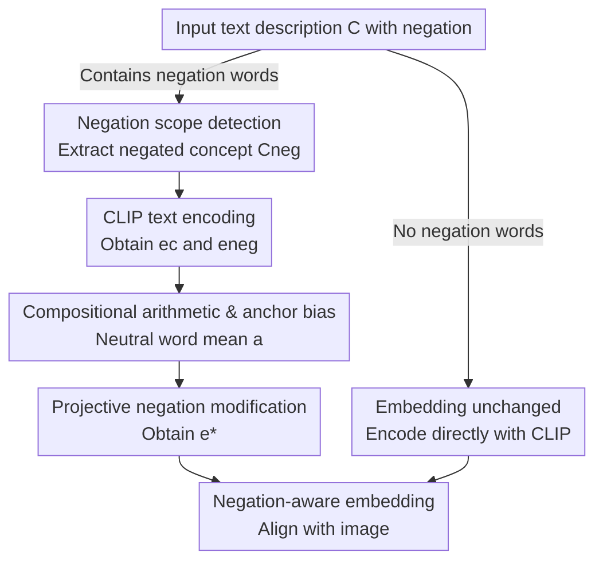

# Seeing What's Not There: Negation Understanding Needs More Than Training

**Conference**: ICLR 2026  
**OpenReview**: [https://openreview.net/forum?id=Dd86hsSam5](https://openreview.net/forum?id=Dd86hsSam5)  
**Code**: None  
**Area**: Multimodal VLM  
**Keywords**: Negation understanding, CLIP, Training-free, Embedding modification, Compositionality

## TL;DR
Addressing the persistent issue where CLIP-like vision-language models fail to understand "negation," this paper proposes a completely training-free zero-shot method. By using rules to extract negated concepts from sentences, it subtracts this semantic portion in the text embedding space via projection and adds back an anchor bias. This improves vanilla CLIP's performance on NegBench MCQ from 25.5% to 67.0%, outperforming models specifically fine-tuned on negation datasets.

## Background & Motivation

**Background**: Jointly embedded VLMs like CLIP align image-text pairs into a shared space through contrastive learning, supporting a wide range of downstream tasks such as text-to-image generation, cross-modal retrieval, image captioning, and referring expression segmentation.

**Limitations of Prior Work**: These models struggle significantly with negation. Given a diffusion model input of "a photo of a car with tires" vs. "a photo of a car without tires," the generated results are nearly identical, both containing tires. Models tend to ignore negation words like "no/not/without," a phenomenon termed "Affirmation Bias." However, negation is crucial in practical scenarios—such as autonomous driving tasks like "finding a parking spot without a car," where the model must distinguish between "presence" and "absence."

**Key Challenge**: The root of this deficiency lies in both the training data and the training paradigm. On one hand, negation descriptions are severely underrepresented in web-scale image-text pairs (less than 1% in Laion-400M), and even when present, they often do not align with the negative context of the image. On the other hand, contrastive learning encourages models to treat text as a "bag of words," naturally losing compositionality. Consequently, the mainstream approach has been **data-driven**—constructing new datasets with hard negatives followed by fine-tuning. However, this paper points out a hidden cost: models suffer from **catastrophic forgetting** of foundational knowledge, resulting in significant performance drops and increased inter-class confusion in general zero-shot classification tasks like ImageNet or Oxford Pets.

**Goal**: Enable CLIP to handle negation correctly without sacrificing general capabilities or performing any training.

**Key Insight**: The authors pose a sharp question—"Is fine-tuning on hard-negative datasets truly necessary to teach models negation?" They observe that CLIP text embeddings approximately satisfy compositional arithmetic (similar to the "King−Man+Woman≈Queen" linear pattern), and negation manifests as a **directional shift** in the embedding space. Given this, negation understanding can be directly "calculated" in the embedding space rather than "trained."

**Core Idea**: Perform a **post-hoc modification** on text embeddings containing negation—projecting out the semantics of the negated concept from the original embedding and adding back a neutral anchor bias to obtain a "negation-aware" embedding. The entire process is zero-shot and training-free.

## Method

### Overall Architecture

The method itself is a lightweight inference-time bypass: given a text description, it first detects the presence of negation words. If none are present, it uses the CLIP encoder as usual. If negation is detected, it enters the modification branch: a rule-based approach extracts the "negated concept" $C_{neg}$, the original sentence and the negated concept are encoded to obtain $e_c$ and $e_{neg}$, and a projection formula subtracts the component of $e_{neg}$ from $e_c$ while adding back an anchor bias $a$. The modified embedding $e^*$ is then aligned with the image. This process does not modify model weights, only the text-side embedding vectors.

### Key Designs

**1. Compositional Arithmetic and Anchor Bias: Enabling "Semantic Subtraction" in Embedding Space**

This is the foundation of the method. The authors verify that CLIP text embeddings approximately satisfy additive composition: the cosine similarity between the sum of "Cat" and "Flower" embeddings ($e_c+e_f$) and the composite "Cat and Flower" embedding ($e_{cf}$) is as high as 0.86, suggesting semantic information can be added directly. However, subtraction is problematic: intuitively $e_{cf}-e_f$ should equal $e_c$, but the measured similarity is low (-0.33). The authors hypothesize that text embeddings contain a **non-informative common bias** that shifts embeddings into a "correct region" of the space; subtraction removes this bias, causing the result to deviate. The solution is to add the bias back using an anchor embedding $a$. $a$ does not depend on a specific dataset and is simply the mean of CLIP embeddings for several neutral words (e.g., "neutral," "balanced"), making it cheap and universal. After adding it back, the similarity between $e_{cf}-e_f+a$ and $e_c$ rises to 0.83. This principle transforms "negation = subtracting negated semantics in embedding" from an idea into an actionable operation.

**2. Rule-based Negation Scope Detection: Precisely Identifying "What is Negated"**

To subtract semantics, one must first identify which part of the sentence is negated. The authors designed a rule-based negation scope detection algorithm using an extensive list of negation words: explicit negators (never/no/nothing/nowhere/none/not), absence indicators (absence/empty/devoid/lacks/absent), and contractions (n't/haven't/can't). The text is scanned sequentially; upon encountering a negation word, the scope is determined by its type: **pre-negators** (e.g., "empty," "devoid" followed by "of") extend from the negator to the next punctuation or conjunction; **post-negators** (e.g., "absent," "nowhere" preceded by "is/are") backtrack to the clause boundary. The sequence of words within this scope is the negated concept $C_{neg}$. If no negation words are found, modification is skipped. While this step utilizes pure NLP rules and requires no learning, the authors acknowledge it is the most fragile part of the system—failing in cases of long-distance dependencies, implicit negation (e.g., "few people"), or multiple negations.

**3. Projective Negation Modification Formula: Subtracting Only the "Truly Present" Negated Semantics**

With $e_c$ (original embedding), $e_{neg}$ (negated concept embedding), and anchor $a$, a naive approach would be $e^* = e_c - e_{neg} + a$ (Eq. 1). While effective, the authors argue CLIP may not entirely ignore negation but fails to remove it cleanly. Furthermore, fine-tuned models like NegCLIP might have already partially removed negation semantics. Since $e_{neg}$ is semantically dense and contains related concepts, it should not be subtracted blindly. The correct approach is to **estimate how much of $e_{neg}$ already exists in $e_c$ and subtract only that portion**. This is achieved via vector projection:

$$e^* = e_c - \lambda \left( \frac{\langle e_c, e_{neg}\rangle}{\langle e_{neg}, e_{neg}\rangle} e_{neg} - a \right)$$

where $\frac{\langle e_c, e_{neg}\rangle}{\langle e_{neg}, e_{neg}\rangle} e_{neg}$ is the projection of $e_c$ onto $e_{neg}$, representing the shared semantics or the "directional shift" to be eliminated. $\lambda$ is a hyperparameter controlling modification strength, tuned on a 5% COCO-MCQ split. The value of $\lambda$ is highly interpretable: vanilla CLIP requires large modification ($\lambda\approx1.9$) as it fails to separate negation, while NegCLIP*, which has been fine-tuned, only requires subtle adjustment ($\lambda\approx0.3$).

### One Instance: A photo of a cat but not flower

Using "A photo of a cat but not flower" as an example: ① The rule detector finds "not," identifies it as a pre-negator, determines the scope to the boundary, and extracts $C_{neg}=$ "flower"; ② CLIP encodes the full sentence as $e_c$ and "flower" as $e_{neg}$; ③ The mean of neutral words yields anchor $a$; ④ Applying Eq. 2, the projection of $e_c$ onto $e_{neg}$ is subtracted by factor $\lambda$ and $a$ is added to get $e^*$; ⑤ $e^*$ is aligned with images—the model no longer confuses this with "a cat and flower," and retrieval/generation results will not contain a flower.

## Key Experimental Results

### Main Results

The primary benchmark is NegBench (based on COCO/VOC2007/MSR-VTT, containing 79k samples and 18 task variants), focusing on MCQ-Neg (selecting the correct description) and Retrieval-Neg (retrieving images using prompts with positive/negative descriptions), using a ViT-B/32 backbone.

| Model | COCO-MCQ | VOC2007-MCQ | MSRvtt-MCQ | COCO R-Neg@5 | MSRvtt R-Neg@5 |
|------|----------|-------------|------------|--------------|----------------|
| CLIP (Baseline) | 24.7 | 24.3 | 27.5 | 57.3 | 44.5 |
| Ours + CLIP | **72.5** (↑47.8) | **78.6** (↑54.3) | 50.0 (↑22.5) | 63.2 (↑5.9) | 49.0 (↑5.5) |
| NegCLIP* (Fine-tuned) | 56.2 | 59.7 | 46.2 | 67.0 | 51.5 |
| Ours + NegCLIP | 69.5 (↑13.3) | 75.1 (↑15.4) | **54.1** (↑7.9) | **67.9** (↑0.9) | **52.2** (↑0.7) |

The most striking result: vanilla CLIP after training-free modification (72.5%) outperforms CLIP*/NegCLIP* specifically fine-tuned on CC12M-NegFull. Since the method only modifies embeddings for descriptions with negation, positive retrieval R@5 remains identical to the baseline, ensuring no loss in general capability. Overall NegBench MCQ improved from 25.5% → 67.0% and retrieval from 50.9% → 56.1%.

### Cross-Backbone and Cross-Dataset Generalization

| Backbone | COCO-MCQ | +Ours |
|------|----------|-------|
| SigLIP | 28.9 | 61.15 (↑32.25) |
| SigLIP2 | 27.2 | 66.3 (↑39.1) |
| AlignCLIP | 32.7 | 60.1 (↑27.4) |
| TripletCLIP | 33.8 | 61.8 (↑28.0) |

Consistent improvements across SigLIP/SigLIP2/AlignCLIP/TripletCLIP show the method is agnostic to architecture and training paradigm. On cross-dataset tests: VALSE-Existence improved from 71.0% → 79.5%; on human-annotated Flickr30K subsets, R@5 rose from 67.4% → 70.4% and R@1 from 34.0% → 41.3%, proving effectiveness on real human descriptions.

### Ablation Study and Analysis

- **Image-Text Alignment Scores**: For negation descriptions in COCO NegBench-MCQ, CLIP's alignment score was only 0.16, rising to 0.64 after modification. Affirmative description alignment also rose (0.45 → 0.65) due to reduced confusion with negation.
- **CIFAR10 Distractor Test**: Using "This is not a photo of {class}" as a distractor, vanilla CLIP still matched the negation description with 89.8% (failing to push it away). Ours+CLIP dropped this to 10.2% (close to random), indicating the negation semantics were truly pushed away from the image.
- **Modification Formula Ablation**: The projective Eq. 2 outperformed the naive Eq. 1; removing the anchor term $a$ led to performance drops. The optimal $\lambda$ was 1.9 for CLIP and 0.3 for NegCLIP*, matching the intuition that baseline models require "heavy repairs" while fine-tuned ones only need "fine-tuning."
- **Embedding Space Visualization**: After modification, affirmative and negative samples are separated along a clear "negation axis" while maintaining original category structures. Even double negations and mixed descriptions ("a cat and not a flower") are organized into semantically interpretable clusters.

## Limitations & Future Work

The authors identify two main limitations. First is the **syntactic fragility of negation extraction**—the rule-based method fails with long-distance dependencies, implicit negations (e.g., "few people"), double negations, or scope ambiguity in complex conjunctions. However, they emphasize this is a bottleneck of the extraction step rather than the core vector arithmetic; future work could integrate a lightweight sequence labeling model (e.g., fine-tuned DistilBERT) for robust detection while retaining the zero-shot backbone. Second, **existing benchmarks are too simple**—NegBench/VALSE/CC-Neg primarily test explicit negation of single objects. The success of this method suggests these benchmarks effectively only test the "decoupling of explicit labeled concepts." To truly evaluate VLM logical reasoning, future benchmarks must incorporate complex logic like double or implicit negations.

## Related Work & Insights

The value of this work lies not just in high scores, but in its challenge to the mainstream assumption that "negation understanding requires massive fine-tuning." It elegantly falsifies this—a single embedding projection outperformed large-scale fine-tuning while avoiding catastrophic forgetting. Reframing negation from a "training problem" to a "geometric/arithmetic problem in embedding space" is a highly insightful perspective. Eq. 2 is more principled than naive subtraction by only removing "what is truly present." The weakness remains the rule-based extraction bottleneck and the reliance on relatively simple benchmarks. The authors' suggestion—incorporating this compositionality constraint as a regularization term in contrastive learning—may be the more sustainable path forward for combining "calculation" and "training."

<!-- RELATED:START -->

## Related Papers

- [\[CVPR 2025\] Vision-Language Models Do Not Understand Negation](../../CVPR2025/multimodal_vlm/vision-language_models_do_not_understand_negation.md)
- [\[CVPR 2026\] More than the Sum: Panorama-Language Models for Adverse Omni-Scenes](../../CVPR2026/multimodal_vlm/more_than_the_sum_panorama-language_models_for_adverse_omni-scenes.md)
- [\[ICCV 2025\] Is Less More? Exploring Token Condensation as Training-free Test-time Adaptation](../../ICCV2025/multimodal_vlm/is_less_more_exploring_token_condensation_as_training-free_test-time_adaptation.md)
- [\[ACL 2025\] Exploring How Generative MLLMs Perceive More Than CLIP with the Same Vision Encoder](../../ACL2025/multimodal_vlm/exploring_how_generative_mllms_perceive_more.md)
- [\[ICLR 2026\] RL Makes MLLMs See Better Than SFT](rl_makes_mllms_see_better_than_sft.md)

<!-- RELATED:END -->
