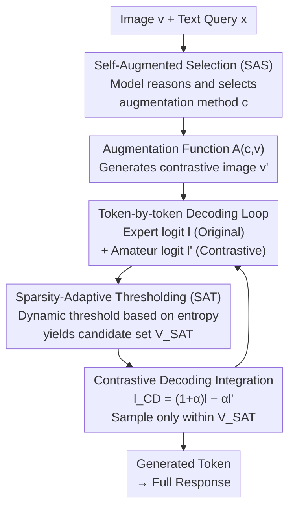

# Self-Aug: Query and Entropy Adaptive Decoding for Large Vision-Language Models

**Conference**: ICLR 2026  
**arXiv**: [2510.13315](https://arxiv.org/abs/2510.13315)  
**Code**: [https://eunwooim.github.io/selfaug](https://eunwooim.github.io/selfaug)  
**Area**: Multimodal VLM / Decoding Strategy  
**Keywords**: visual contrastive decoding, hallucination mitigation, self-augmentation, entropy-aware thresholding, training-free

## TL;DR
This paper proposes Self-Aug, a training-free decoding strategy that utilizes Self-Augmented Selection (SAS) Prompting to allow LVLMs to dynamically select visual augmentations aligned with query semantics using their own knowledge. It also introduces the Sparsity-Adaptive Thresholding (SAT) algorithm, which utilizes the full entropy information of the output distribution to dynamically adjust the candidate vocabulary size. Self-Aug consistently outperforms existing contrastive decoding methods across 5 LVLMs and 7 benchmarks.

## Background & Motivation

**Background**: Large Vision-Language Models (LVLMs) demonstrate exceptional performance in multimodal understanding and generation but inherit hallucination issues from their underlying language models—generating plausible-sounding but factually incorrect content. Visual Contrastive Decoding (VCD) is a promising training-free hallucination mitigation strategy that enhances factual consistency by contrasting standard output with "amateur" output generated from degraded visual inputs.

**Limitations of Prior Work**: Existing VCD methods face two fundamental limitations. First, visual augmentation selection is decoupled from text queries—all methods adopt generic, query-agnostic augmentations (e.g., random noise). However, different queries require distinct reasoning capabilities; for instance, "identifying objects in a photo" and "solving handwritten math" have vastly different sensitivities to visual information perturbation. While VACoDe attempts dynamic augmentation selection, it relies solely on the distribution divergence of the first token, an empirical proxy that cannot guarantee optimality for the entire sequence and has limited effectiveness in open-ended generation. Second, existing Adaptive Plausibility Constraints (APC) set thresholds based only on the maximum logit value, completely ignoring the rich information encoded in the output distribution—often leading to the erroneous discarding of correct tokens in low-confidence states.

**Key Challenge**: Contrastive decoding needs visual perturbations to amplify output differences, but generic query-agnostic augmentations fail to produce the most informative differences. Simultaneously, candidate filtering requires a balance between precision and safety, whereas existing methods lack awareness of model uncertainty.

**Goal**: (1) How to align the selection of visual augmentations with the semantic intent of text queries? (2) Is model prediction confidence correlated with the plausibility of next-token candidates? How can this correlation be leveraged to improve candidate filtering?

**Key Insight**: The authors observe that LVLMs already possess "world knowledge" regarding which visual augmentations best perturb specific queries. Through carefully designed meta-classification prompts, the model can reason and select the optimal augmentation itself. Furthermore, Shannon entropy provides a global metric for measuring output distribution uncertainty, which is more suitable for dynamic threshold adjustment than a single point maximum.

**Core Idea**: Allow the LVLM to select query-related visual augmentations to maximize the informativeness of contrastive decoding, and use output entropy to dynamically regulate the candidate set size.

## Method

### Overall Architecture
Self-Aug addresses two points of decoupling in visual contrastive decoding (VCD): the mismatch between visual augmentation and query semantics, and the uncertainty-unaware nature of candidate truncation. It decomposes the decoding pipeline into three stages: "Select Augmentation, Step-by-Step Contrast, and Dynamic Truncation." Given an image $v$ and a text query $x$, a single SAS Prompt is first used to let the LVLM reason and select the visual augmentation method $c$ (among cropping, masking, noise, color inversion, horizontal/vertical flip) that best perturbs the current query. An augmented image $v'$ is generated using the function $\mathcal{A}(c,v)$. This is followed by a token-by-token decoding loop: at each step, the expert logit $l$ (original image) and the amateur logit $l'$ (augmented image) are computed simultaneously. SAT then determines a dynamic truncation threshold based on the entropy of the current output distribution to obtain the candidate set $\mathcal{V}_{SAT}$. Contrastive decoding is performed as $l_{CD}=(1+\alpha)\cdot l-\alpha\cdot l'$, and the next token is sampled only within the candidate set. The entire process requires no architectural modifications or training.

### Key Designs

**1. Self-Augmented Selection (SAS): Let the model reason "which visual perturbation best disrupts the current query"**

This targets the pain point where existing VCD methods use query-agnostic generic augmentations (random noise). SAS shifts the decision to the model itself by constructing a structured SAS Prompt $\mathcal{P}$ containing: (a) explicit definitions and effect descriptions for each visual augmentation to provide operational knowledge; (b) a structure that forces "reasoning before selection" (inspired by STaR) to reduce post-hoc rationalization; and (c) few-shot ICL examples to help the model understand the task context. The model output is parsed via a function $g(\cdot)$ into a reasoning trajectory $r$ and a final choice $c$, and the selected perturbation is applied via $\mathcal{A}(c,v)$. This step uses greedy decoding to ensure deterministic and efficient selection. Unlike VACoDe, which relies on the distribution divergence of the first token, SAS invokes the model's internal world knowledge and common sense to align the augmentation method with query semantics.

**2. Sparsity-Adaptive Thresholding (SAT): Dynamically determining candidate size using full distribution entropy**

Existing Adaptive Plausibility Constraints (APC) only consider the maximum logit, making them "confidence-blind" filters—even when the model is uncertain, it employs a fixed standard to prune candidates, often removing correct tokens. The core insight of SAT is that sparsity (confidence) is inversely proportional to the number of candidates that should be retained. When the model is highly uncertain (high entropy), the threshold should be relaxed to retain more candidates; when highly certain (low entropy), the threshold should be tightened. This is implemented using a decaying entropy function:

$$H_{\text{decay}}(p) = \sigma\!\left(-\gamma \sum_i p_i \log_2 p_i\right)$$

where $\sigma$ is the sigmoid function and $\gamma < 0$ is a scaling parameter. The sigmoid is chosen because it is naturally bounded in $(0,1)$, provides a stable threshold for low-confidence distributions at its lower asymptote, and allows a single parameter $\gamma$ to control the steepness of the decay in the transition zone. This ensures the threshold floats in real-time based on the overall uncertainty of the output distribution.

**3. Mechanism: Integrating query-aware augmentation and confidence-aware truncation**

The components converge in the contrastive decoding step. At each timestep, expert logit $l$ and amateur logit $l'$ are computed to amplify differences, and the candidate set is pruned using the SAT dynamic threshold. The final contrastive logit is:

$$l_{CD}(y_t) = (1+\alpha)\cdot l - \alpha \cdot l' \quad \text{if } y_t \in \mathcal{V}_{SAT}, \text{ otherwise } -\infty$$

The candidate set $\mathcal{V}_{SAT}$ is determined by the dynamic threshold $\beta_t^{SAT}$ from SAT: $\mathcal{V}_{SAT} = \{y_t \in \mathcal{V} \mid p_\theta(y_t) \geq \beta_t^{SAT} \cdot \max_w p_\theta(w)\}$. Tokens outside the threshold are set to $-\infty$, and the next token is sampled from $\text{softmax}(l_{CD})$.

### Loss & Training
Self-Aug is an entirely training-free method. Hyperparameter settings: $\alpha=1$, APC $\beta=0.1$, SAT $\gamma=-0.5$. All experiments were averaged over 5 runs with standard deviations reported.

## Key Experimental Results

### Main Results (Discriminative Benchmarks)

| Model | Method | POPE-COCO Acc↑ | MME-P↑ | MMVP↑ | Avg. Gain |
|------|------|---------------|--------|-------|---------|
| LLaVA-1.5-7B | Multinomial | 82.07 | 1278.42 | 32.40 | - |
| LLaVA-1.5-7B | VCD | 83.66 | 1323.67 | 34.00 | +10.86% |
| LLaVA-1.5-7B | VACoDe | 84.29 | 1372.50 | 36.67 | +9.52% |
| LLaVA-1.5-7B | **Ours** | **82.93** | **1431.30** | **36.00** | **+14.32%** |
| LLaVA-1.5-13B | Multinomial | 83.86 | 1351.69 | 31.60 | - |
| LLaVA-1.5-13B | **Ours** | **85.37** | **1462.18** | **34.80** | **+11.59%** |
| InstructBLIP | Multinomial | 68.70 | 973.66 | 19.20 | - |
| InstructBLIP | **Ours** | **82.86** | **1198.53** | **16.13** | **+18.78%** |
| Qwen3-VL-8B | Multinomial | 88.59 | 1725.16 | 55.47 | - |
| Qwen3-VL-8B | **Ours** | **88.79** | **1726.77** | **60.50** | **+2.25%** |

### Ablation Study

| Configuration | MME-P↑ | Description |
|------|--------|------|
| Multinomial (Baseline) | 1278.42 | No contrastive decoding |
| VCD (Random Noise) | 1323.67 | Query-agnostic augmentation |
| VACoDe (First-token Selection) | 1372.50 | Augmentation selection via first-token divergence |
| Self-Aug (SAS only) | ~1400+ | Self-Augmented Selection only |
| Self-Aug (SAS + SAT) | 1431.30 | Full method |
| APC ($\beta=0.1$, fixed) | Baseline | Confidence-blind truncation |
| SAT ($\gamma=-0.5$, adaptive) | Gain | Entropy-aware dynamic truncation |

### Key Findings
- **Self-Aug is consistently effective across models**: It outperforms VCD and VACoDe on 5 LVLMs, with average gains up to +18.78% (InstructBLIP).
- **Greater benefit for weaker models**: The improvement is most significant on InstructBLIP (+18.78%), while smaller on the already strong Qwen3-VL-8B (+2.25%), as weaker models benefit more from refined contrastive signals.
- **SAS and SAT are complementary**: SAS provides more informative contrastive signals, and SAT utilizes these signals more effectively by smarter truncation.
- **Query relevance is critical**: While query-agnostic augmentations (VCD) are effective, they are significantly outperformed by query-aware SAS selections.

## Highlights & Insights
- **Meta-cognition approach via "letting the model choose"**: SAS essentially tasks the LVLM with a meta-classification problem—reasoning about which visual perturbation most severely disrupts the query. This "self-awareness" design could be generalized to any scenario requiring adaptive model configurations.
- **Clever use of entropy as an uncertainty proxy**: SAT combines Shannon entropy with a sigmoid decay into an elegant formula that realizes the intuition: "high uncertainty → lenient filtering, low uncertainty → strict filtering," requiring only one hyperparameter $\gamma$.
- **Training-free, plug-and-play design**: Requires no architectural changes or additional training, making it directly applicable to any LVLM and lowering deployment barriers.

## Limitations & Future Work
- **SAS increases inference overhead**: Executing the SAS Prompt requires an additional forward pass, and the augmentation selection itself incurs computational costs.
- **Fixed set of 6 augmentations**: Limited to pre-defined augmentations; more effective methods might be missed.
- **Diminishing marginal returns on strong models**: The +2.25% gain on Qwen3-VL-8B suggests that as models become inherently stronger, the optimization space at the decoding level shrinks.
- Future work could consider learning a lightweight augmentation selector to replace the SAS Prompt to reduce overhead.

## Related Work & Insights
- **vs VCD**: VCD uses query-agnostic random noise; Self-Aug achieves query-aware selection via SAS, providing superior information quality.
- **vs VACoDe**: VACoDe uses first-token divergence, which is unreliable for open-ended generation; Self-Aug leverages the model's reasoning for globally superior choices.
- **vs OPERA/DoLa**: These methods focus on attention patterns or layer-wise contrast; Self-Aug's visual augmentation contrast is an orthogonal direction and could theoretically be combined.

## Rating
- Novelty: ⭐⭐⭐⭐ SAS's self-augmentation selection and SAT's entropy-aware design are innovative.
- Experimental Thoroughness: ⭐⭐⭐⭐⭐ Comprehensive evaluation across 5 models and 7 benchmarks.
- Writing Quality: ⭐⭐⭐⭐ Clear technical descriptions and rigorous mathematical derivation.
- Value: ⭐⭐⭐⭐ High practical value as a plug-and-play design, though limited gains on top-tier models.

<!-- RELATED:START -->

## Related Papers

- [\[ICLR 2026\] One Patch Doesn't Fit All: Adaptive Patching for Native-Resolution Multimodal Large Language Models](one_patch_doesnt_fit_all_adaptive_patching_for_native-resolution_multimodal_larg.md)
- [\[ICML 2026\] Self-Prophetic Decoding to Unlock Visual Search in LVLMs](../../ICML2026/multimodal_vlm/self-prophetic_decoding_to_unlock_visual_search_in_lvlms.md)
- [\[ICLR 2026\] Self-Evolving Vision-Language Models for Image Quality Assessment via Voting and Ranking](self-evolving_vision-language_models_for_image_quality_assessment_via_voting_and.md)
- [\[ICLR 2026\] ViPER: Empowering the Self-Evolution of Visual Perception Abilities in Vision-Language Models](viper_empowering_the_self-evolution_of_visual_perception_abilities_in_vision-lan.md)
- [\[CVPR 2026\] WeMMU: Enhanced Bridging of Vision-Language Models and Diffusion Models via Noisy Query Tokens](../../CVPR2026/multimodal_vlm/wemmu_enhanced_bridging_of_vision-language_models_and_diffusion_models_via_noisy.md)

<!-- RELATED:END -->
