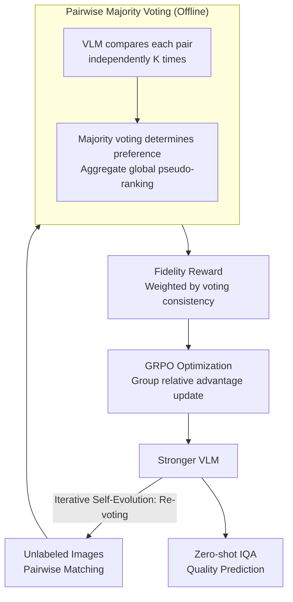

# Self-Evolving Vision-Language Models for Image Quality Assessment via Voting and Ranking

**Conference**: ICLR 2026  
**arXiv**: [2509.25787](https://arxiv.org/abs/2509.25787)  
**Code**: None  
**Area**: Multimodal VLM  
**Keywords**: VLM, Image Quality Assessment, Self-supervised, GRPO, Voting and Ranking

## TL;DR

Ours proposes the EvoQuality framework, which generates pseudo-ranking labels through pairwise majority voting combined with GRPO self-iterative optimization. This allows VLMs to autonomously improve image quality perception without human annotation, achieving a 31.8% PLCC improvement in zero-shot performance and surpassing supervised SOTA on 5 out of 7 IQA benchmarks.

## Background & Motivation

Image Quality Assessment (IQA) is a classic computer vision task focused on automatically evaluating the perceived quality of images. While Vision-Language Models (VLMs) have shown strong capabilities in various tasks, applying them to IQA faces two major challenges:

**High Annotation Costs**: Traditional VLM post-training methods (e.g., SFT or RLHF) rely on large-scale human-annotated quality scores, which are expensive to collect and suffer from high subjectivity and low consistency.

**Self-supervised Gap in Perception**: Although self-supervised techniques have proven effective in enhancing reasoning (e.g., mathematical reasoning), their application in perceptual tasks like quality judgment is almost non-existent. IQA differs from reasoning tasks as it lacks a single correct answer and relies on relative comparisons.

**Limitations of Prior Work**: Existing VLM-based IQA models mostly require supervised fine-tuning on labeled IQA datasets, leading to limited generalization and poor transfer performance on unseen datasets.

**Goal**: Can a VLM autonomously improve its image quality perception without any human labels? **Key Insight**: While a single quality judgment by a VLM may be inaccurate, reliable quality rankings can emerge through the "wisdom of the crowd" via repeated pairwise comparisons.

## Method

### Overall Architecture

EvoQuality decomposes "unlabeled IQA enhancement" into a self-supervised closed loop consisting of offline and online phases. In the offline phase, the VLM performs pairwise comparisons, and majority voting generates a consensus ranking as pseudo-labels. In the online phase, this ranking is converted into fidelity rewards to fine-tune the model using GRPO. The fine-tuned, stronger VLM then returns to the offline phase to re-vote and produce cleaner pseudo-labels, enabling iterative self-evolution. The process relies on the assumption that "individual judgments are noisy, but collective voting is reliable."

### Key Designs

**1. Pairwise Majority Voting: Aggregating Unreliable Judgments into Reliable Rankings**

Assigning absolute quality scores is subjective and unstable for VLMs, but "which image is better" is a simpler task. EvoQuality has the VLM compare each pair $K$ times ($K=5 \sim 10$ is optimal). Majority voting determines the preference for each pair, and all pairwise preferences are aggregated into a global quality ranking using counting or Bradley-Terry models. This effectively transfers the concept of self-consistency from mathematical reasoning to perceptual tasks—while a single sample may fail, the direction of multiple samples reflects the model's true inclination.

**2. Fidelity Reward: Grounding RL Signals in Voting Confidence**

To drive GRPO, the pseudo-rankings must be converted into optimizable rewards. EvoQuality provides a positive reward if the VLM's comparison matches the pseudo-ranking and a negative reward otherwise. The reward magnitude is proportional to the voting consistency of that pair. High-consistency pairs (where the model is certain) are prioritized for alignment, while pairs with near 50/50 votes (hard or noisy samples) receive low weights to prevent the model from overfitting to unreliable labels.

**3. GRPO Optimization: Group Relative Rewards instead of Critic Networks**

The model is updated via Group Relative Policy Optimization. For each input, a group of responses is sampled from the current VLM. The relative fidelity rewards within the group determine the advantage $A_i$ for each response. The update follows the policy gradient: $L_{GRPO} = -\mathbb{E}\big[\sum_{i} A_i \log \pi_\theta(y_i \mid x_i)\big]$, with an added KL divergence constraint to prevent the model from deviating too far from its original visual capabilities. GRPO eliminates the need for an additional critic network and naturally fits the relative nature of quality ranking.

**4. Iterative Self-Evolution: Mutual Improvement of Labels and Models**

After one training round, the updated VLM re-performs pairwise voting to generate higher-quality pseudo-labels. This creates a positive feedback loop: "Better Model → Accurate Pseudo-labels → Effective Training." Using relative rankings instead of absolute scores prevents the accumulation and amplification of absolute label errors across iterations, ensuring stability.

## Key Experimental Results

### Main Results

EvoQuality was evaluated across 7 major IQA benchmarks:

| Metric | Ours (EvoQuality) | Base VLM (Zero-shot) | Gain |
|------|----------------|------------------|---------|
| PLCC (Avg) | Significant Improvement | Baseline | +31.8% |
| Beating Supervised SOTA | 5/7 Benchmarks | - | - |

**Key Findings**:
- Surpassed supervised SOTA VLM-based IQA models on 5 benchmarks: LIVE, CSIQ, TID2013, KADID-10K, and SPAQ.
- Approached supervised SOTA on KonIQ-10K and FLIVE.
- Achieved these results via purely self-supervised training without any human quality annotations.

### Ablation Study

| Configuration | Effect | Description |
|------|------|------|
| Direct optimization without voting | Performance drops significantly | Voting mechanism is core |
| Fixed pseudo-labels (Single round) | Lower than iterative version | Iterative evolution provides continuous gains |
| Uniform reward weights | Lower than fidelity weighting | Consistency weighting is more effective |
| Different voting counts $K$ | Gains saturate as $K$ increases | $K=5 \sim 10$ is the optimal range |

## Highlights & Insights

1. **Extending Self-consistency from Reasoning to Perception**: Successfully adapted the "consistency across multiple samples" idea from mathematical reasoning to ranking-based IQA by using majority voting for pairwise comparisons.
2. **Ranking is Suites Self-supervision Better than Scoring**: Absolute quality scores are hard to self-evaluate, but relative quality comparisons more easily reach consensus through voting.
3. **Elegant Positive Feedback Loop**: The iterative self-evolution mechanism allows the training process to "self-accelerate."
4. **High Practical Value**: Eliminates the dependence on human annotations in the IQA field, significantly reducing deployment costs.

## Limitations & Future Work

1. **Iterative Efficiency**: High computational overhead due to multiple iterations and sampling, especially for large-scale VLMs.
2. **Base Model Dependency**: If the base VLM's initial quality perception is extremely weak, voting may fail to converge on a meaningful ranking.
3. **Task Specificity**: Designed for ranking/comparison; adaptation is needed for other perceptual tasks like aesthetic assessment or damage detection.
4. **Lack of Convergence Theory**: No theoretical analysis of the iterative evolution's convergence; risk of overfitting to pseudo-labels in practice.
5. **Scalability**: Extending voting from pairwise to listwise levels could further improve efficiency.

## Related Work & Insights

- **IQA Evolution**: Hand-crafted features (BRISQUE, NIQE) → Deep learning (DBCNN, HyperIQA) → VLM-based (Q-Align, Q-Instruct).
- **VLM Self-improvement**: Successes in self-iterative paradigms like Self-Play and Self-Rewarding LLMs inspired this work.
- **GRPO**: Transferred the DeepSeek-proposed GRPO optimizer from reasoning tasks to perceptual tasks.
- **Insight**: The core idea (Voting → Pseudo-labels → Self-iterative optimization) is potentially applicable to other vision tasks lacking unique "correct" answers.

## Rating

- **Novelty**: ⭐⭐⭐⭐ — Creative application of self-consistency and GRPO to IQA, though individual components are established.
- **Experimental Thoroughness**: ⭐⭐⭐⭐ — Comprehensive evaluation on 7 benchmarks with solid ablation, though comparison with more self-supervised methods is missing.
- **Writing Quality**: ⭐⭐⭐⭐ — Clear motivation and intuitive framework.
- **Value**: ⭐⭐⭐⭐⭐ — Large practical impact by removing the need for IQA annotations.

<!-- RELATED:START -->

## Related Papers

- [\[ICLR 2026\] Grounding-IQA: Grounding Multimodal Language Models for Image Quality Assessment](grounding-iqa_grounding_multimodal_language_model_for_image_quality_assessment.md)
- [\[CVPR 2026\] VisPlay: Self-Evolving Vision-Language Models](../../CVPR2026/multimodal_vlm/visplay_self-evolving_vision-language_models.md)
- [\[CVPR 2026\] R4-CGQA: Retrieval-based Vision Language Models for Computer Graphics Image Quality Assessment](../../CVPR2026/multimodal_vlm/r4-cgqa_retrieval-based_vision_language_models_for_computer_graphics_image_quali.md)
- [\[CVPR 2026\] UARE: A Unified Vision-Language Model for Image Quality Assessment, Restoration, and Enhancement](../../CVPR2026/multimodal_vlm/uare_a_unified_vision-language_model_for_image_quality_assessment_restoration_an.md)
- [\[CVPR 2026\] Probabilistic Prompt Adaptation for Unified Image Aesthetics and Quality Assessment](../../CVPR2026/multimodal_vlm/probabilistic_prompt_adaptation_for_unified_image_aesthetics_and_quality_assessm.md)

<!-- RELATED:END -->
