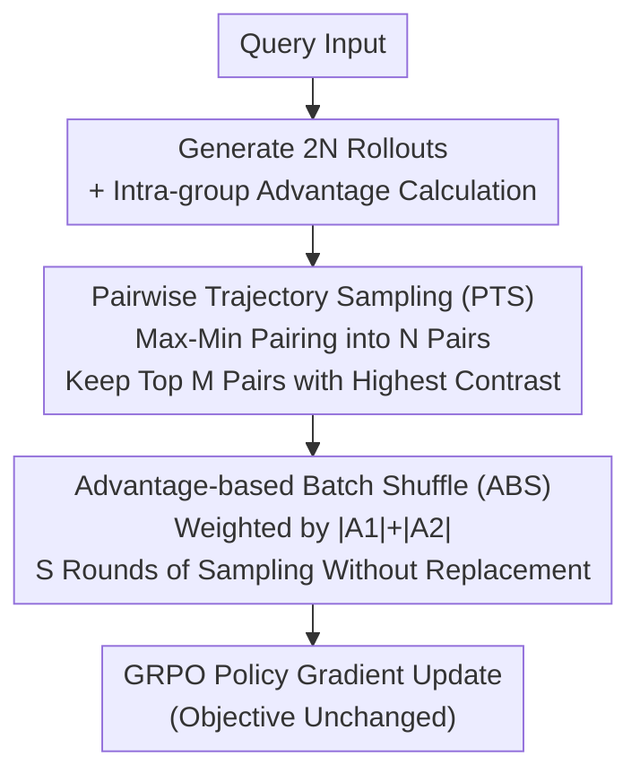

# Shuffle-R1: Efficient RL Framework for Multimodal Large Language Models via Data-centric Dynamic Shuffle

**Conference**: ICLR 2026  
**arXiv**: [2508.05612](https://arxiv.org/abs/2508.05612)  
**Code**: [https://xenozlh.github.io/Shuffle-R1](https://xenozlh.github.io/Shuffle-R1)  
**Area**: Multimodal VLM  
**Keywords**: Reinforcement Learning, Multimodal Reasoning, Data-centric Optimization, Trajectory Sampling, GRPO

## TL;DR
The Shuffle-R1 framework is proposed to address two key efficiency bottlenecks in RL training: Advantage Collapsing and Rollout Silencing. By implementing Pairwise Trajectory Sampling (selecting high-contrast trajectory pairs) and Advantage-based Batch Shuffle (reallocating training batches by advantage values), it achieves a 22% improvement over the baseline on Geo3K and surpasses GPT-4o on MathVerse.

## Background & Motivation

**Background**: Reinforcement Learning (RL) has become the mainstream post-training paradigm for enhancing the reasoning capabilities of LLMs/MLLMs. Works such as DeepSeek-R1 utilize verifiable outcome reward signals to achieve significant progress in mathematical reasoning and code generation. RL has also been extended to the multimodal domain for tasks like visual reasoning, object detection, and video understanding.

**Limitations of Prior Work**: Current RL training workflows face two overlooked key efficiency issues:
   - **Advantage Collapsing**: The advantage values of most rollouts in a batch concentrate near zero, resulting in extremely weak gradient signals and causing valuable trajectories to be drowned out by a large volume of uninformative ones.
   - **Rollout Silencing**: As training progresses, the proportion of rollouts contributing non-zero gradients continuously declines (as simple problems converge and difficult problems remain unsolved), leading to computational waste.

**Key Challenge**: The static sampling paradigm treats all trajectories equally and cannot distinguish "which data is worth updating." While increasing the number of rollouts can partially alleviate this, the computational overhead grows linearly without addressing the root cause.

**Goal**: To dynamically filter valuable trajectories and optimize batch composition to improve the quality of gradient signals and computational utilization in RL training without significantly increasing computational overhead.

**Key Insight**: Approaching from the data side, shifting the focus of RL training from "how to update" to "what data to update with," and designing adaptive trajectory selection and batch reorganization mechanisms.

**Core Idea**: Amplify key signals through pairwise sampling to select high-contrast trajectories and reshuffle batches based on advantage values, achieving dynamic data priority scheduling.

## Method

### Overall Architecture
Shuffle-R1 follows the standard GRPO policy gradient training but inserts a "data scheduling" process after advantage calculation and before gradient updates. First, each query generates $2N$ rollouts. After calculating intra-group advantages, Pairwise Trajectory Sampling (PTS) is used to select high-contrast positive-negative pairs from this expanded pool. Then, Advantage-based Batch Shuffle (ABS) reorganizes the training batches of these trajectories based on advantage values. Finally, the reorganized batches are fed into GRPO for gradient updates. Both modules only manipulate the data without modifying the objective function, transforming RL training from "treating all trajectories equally" to "dynamically prioritizing the update of valuable trajectories."

### Key Designs

**1. Pairwise Trajectory Sampling (PTS): Selecting High-Contrast Pairs to Combat Advantage Collapsing**

In a batch, most rollouts have advantage values clustered near zero, drowning the gradient signal in uninformative trajectories (Advantage Collapsing). PTS doubles the number of rollouts per query to $2N$, investing generation costs into "observing more candidates." After sorting these $2N$ rollouts by advantage in descending order, it uses max-min pairing—pairing the largest with the smallest, the second largest with the second smallest, etc. The advantage gap within each pair naturally represents the contrast intensity. After forming $N$ pairs, only the top $M=\alpha N$ pairs with the highest contrast are kept for gradient calculation (where $\alpha=0.5$ in the implementation). The key is that while rollout generation is doubled, the actual backpropagation only involves the top-$M$ pairs, keeping gradient computation consistent with the original while exchanging minor forward overhead for significantly stronger and cleaner training signals.

**2. Advantage-based Batch Shuffle (ABS): Granting High-Value Trajectories More Updates to Combat Rollout Silencing**

As training progresses, fewer rollouts contribute non-zero gradients—simple problems are solved, and hard ones remain incorrect—resulting in idle computation (Rollout Silencing). ABS no longer averages the trajectories selected by PTS into batches. Instead, it assigns an importance weight $W(p)=|\hat{A}_1|+|\hat{A}_2|$ (the sum of absolute advantage values of the pair) and normalizes this into a sampling distribution $\Phi$. It then performs $S$ rounds of sampling without replacement, picking $T$ pairs per round to form a reshuffled batch $B'$, maintaining $|B'|=|B|$ (where $T=256, S=8$). This ensures trajectories with higher advantage values are sampled more frequently for updates, while low-value ones are naturally down-weighted. This is essentially a soft priority scheduling that tilts the update budget towards samples with actual information.

### Loss & Training
The base objective follows the PPO-clip style policy gradient of GRPO with intra-group advantage normalization. The PTS+ABS suite introduces no additional loss terms. For training hyperparameters, each query generates $2N=16$ rollouts, PTS forms 8 pairs and keeps 4 pairs ($\alpha=0.5$), ABS uses a sub-sampling capacity $T=256$ and $S=8$ rounds. The learning rate is set to 1e-6, rollout temperature is 1.0, and the vision encoder is frozen.

## Key Experimental Results

### Main Results

| Model | Method | Geo3K | Math Avg. | HallBench | ChartQA |
|------|------|-------|-----------|-----------|---------|
| Qwen2.5-VL-3B | Baseline | 25.79 | 41.71 | 59.83 | 73.08 |
| Qwen2.5-VL-3B | +GRPO | 42.64 | 46.74 | 63.09 | 76.20 |
| Qwen2.5-VL-3B | +DAPO | 45.09 | 48.08 | 63.24 | 76.70 |
| Qwen2.5-VL-3B | **Ours** | **47.88(+22.09)** | **48.70(+6.99)** | 63.19 | **77.04** |
| Qwen2.5-VL-7B | Baseline | 38.12 | 49.82 | 65.19 | 79.84 |
| Qwen2.5-VL-7B | +GRPO | 52.60 | 53.13 | 68.56 | 80.84 |
| Qwen2.5-VL-7B | **Ours** | **55.89(+17.77)** | **54.63(+4.81)** | **69.51** | **81.64** |

Across cross-domain benchmarks (30k training data), the 7B model achieved 52.2% on MathVerse, surpassing GPT-4o (50.8%).

### Ablation Study

| Component | Geo3K (3B) | Math Avg. (3B) |
|------|------------|----------------|
| GRPO baseline | 42.64 | 46.74 |
| +PTS only | 46.52 | 47.89 |
| +ABS only | 44.18 | 47.35 |
| +PTS+ABS (Full) | **47.88** | **48.70** |

### Key Findings
- PTS contributes the most, providing a ~4% Geo3K improvement alone; ABS adds an additional ~1.5% gain.
- The method matches the full training results of GRPO using only 50% of the training steps, increasing training efficiency by 2×.
- Performance is consistent across 3B/7B scales, indicating scale-agnostic generalization.
- The advantage is particularly evident in small-data scenarios (Geo3K with 2.1k samples), showing high value when data is scarce.

## Highlights & Insights
- Precise Problem Definition: First to systematically identify and quantify Advantage Collapsing and Rollout Silencing as RL training bottlenecks.
- Simple and Effective Design: PTS and ABS are lightweight, easy to implement (sorting + pairing + weighted sampling), and plug-and-play.
- Comprehensive Evaluation: Validated across in-domain/out-of-domain, small/large data, and 3B/7B scales.
- Controllable Computational Overhead: Although rollouts are doubled, the gradient computation volume remains constant as it only applies to filtered trajectories.

## Limitations & Future Work
- The max-min pairing strategy for PTS is heuristic; whether better pairing methods exist (e.g., based on semantic similarity) remains to be explored.
- Resampling in ABS introduces the risk of reusing the same trajectory, which may lead to overfitting; systematic analysis is required.
- Currently only validated on mathematical reasoning tasks; generalization to generic VQA, visual dialogue, and other tasks needs verification.
- The sampling ratio $\alpha=0.5$ is fixed; adaptive adjustment could potentially further enhance performance.

## Related Work & Insights
- Complementary to NoisyRollout (increasing rollout diversity) and VL-Rethinker (reflection tokens): while the former focuses on diversity, this work focuses on quality filtering.
- Shares common ground with Curriculum Learning: both aim to make the model focus more on valuable training samples.
- Provides insights for data-side optimization in other RL training frameworks such as DPO and RLHF.

## Rating
- Novelty: ⭐⭐⭐⭐ Innovative problem definition (Advantage Collapsing/Rollout Silencing); methods are simple and effective.
- Experimental Thoroughness: ⭐⭐⭐⭐ Validated across multiple scales, data volumes, and benchmarks with complete ablations.
- Writing Quality: ⭐⭐⭐⭐ Clear problem analysis, intuitive diagrams, and logical argumentation.
- Value: ⭐⭐⭐⭐ The data-centric RL optimization perspective is highly instructive for the community; the plug-and-play nature offers high practicality.

<!-- RELATED:START -->

## Related Papers

- [\[ICCV 2025\] Jailbreaking Multimodal Large Language Models via Shuffle Inconsistency](../../ICCV2025/multimodal_vlm/jailbreaking_multimodal_large_language_models_via_shuffle_inconsistency.md)
- [\[ICLR 2026\] Human-MME: A Holistic Evaluation Benchmark for Human-Centric Multimodal Large Language Models](human-mme_a_holistic_evaluation_benchmark_for_human-centric_multimodal_large_lan.md)
- [\[ICLR 2026\] ERGO: Efficient High-Resolution Visual Understanding for Vision-Language Models](ergo_efficient_high-resolution_visual_understanding_for_vision-language_models.md)
- [\[ICLR 2026\] Breaking the SFT Plateau: Multimodal Structured Reinforcement Learning for Chart-to-Code Generation](breaking_the_sft_plateau_multimodal_structured_reinforcement_learning_for_chart-.md)
- [\[CVPR 2026\] Why Does RL Generalize Better Than SFT? A Data-Centric Perspective on VLM Post-Training](../../CVPR2026/multimodal_vlm/why_does_rl_generalize_better_than_sft_a_data-centric_perspective_on_vlm_post-tr.md)

<!-- RELATED:END -->
