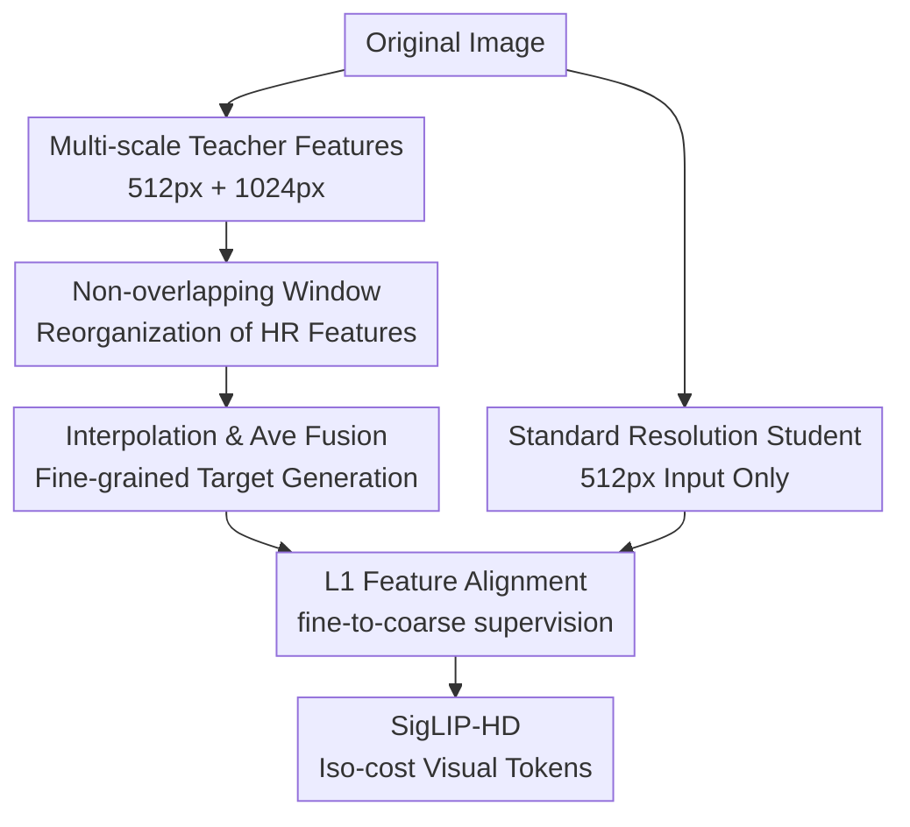

# SigLIP-HD by Fine-to-Coarse Supervision

**Conference**: ICLR2026  
**OpenReview**: [https://openreview.net/forum?id=XeLrfKEOZS](https://openreview.net/forum?id=XeLrfKEOZS)  
**Paper**: [OpenReview](https://openreview.net/forum?id=XeLrfKEOZS)  
**Code**: https://github.com/LiheYoung/SigLIP-HD  
**Area**: Multimodal VLM  
**Keywords**: High-resolution visual representation, SigLIP 2, Multimodal Large Language Models, OCR perception, Feature distillation  

## TL;DR
SigLIP-HD utilizes a frozen SigLIP 2 to generate fine-grained teacher features from multi-scale images, supervising an architecturally identical student model to learn clearer visual tokens from $512^2$ images alone. This enhances the OCR, chart, and detail perception of MLLMs without increasing inference costs.

## Background & Motivation
**Background**: Multimodal Large Language Models (MLLMs) typically process images through a vision encoder before passing visual tokens to an LLM. The quality of these visual tokens directly determines the model's ability to read text, understand charts, recognize small objects, and process high-density pages. Consequently, recent MLLMs have focused on enhancing visual representation via three routes: pre-training stronger vision encoders, combining multiple existing encoders, or increasing input image resolution.

**Limitations of Prior Work**: The first route is extremely costly, requiring massive data and GPU hours. The second route, while leveraging the strengths of models like CLIP and DINO, faces challenges in merging disparate token spaces, often leading to limited gains. The third route is the most direct and aligns with OCR/document understanding empirical evidence, but it introduces complexities such as multiple forward passes for image tiling, increased visual tokens, and post-processing modules like resamplers or pixel unshuffle, thereby increasing system complexity and LLM computational burden.

**Key Challenge**: While high-resolution inputs provide finer local information, they couple "seeing clearly" with "higher inference costs." The authors pose a more restrained question: Has the perceptual potential of current medium-resolution vision encoders been fully unleashed? If humans can still understand significant text and content on $512$px thumbnails, could models also learn finer representations under the same computational budget?

**Goal**: This work aims to develop a vision encoder that can directly replace the original SigLIP 2 checkpoint. It maintains $512^2$ input resolution and outputs the same number and dimension of visual tokens during inference—without adding projections, upsamplers, or tiling—while ensuring the tokens themselves approximate the fine-grained representations of high-resolution multi-scale inputs.

**Key Insight**: The authors observe that multi-scale high-resolution forward passes yield superior visual features, but this approach is too expensive for routine inference. They transform this "inference strategy" into a "training supervision signal": using the original frozen SigLIP 2 to generate teacher features from $512^2$ and $1024^2$ images, then training an identical student encoder to fit these finer features using only $512^2$ inputs.

**Core Idea**: Distill multi-scale high-resolution visual features back into a standard-resolution encoder, using fine-to-coarse supervision to empower low-cost visual tokens with high-resolution detail perception.

## Method

### Overall Architecture
The training framework for SigLIP-HD is straightforward. The teacher branch freezes the original SigLIP 2 and constructs a $512^2$ base scale and a $1024^2$ high-resolution scale for the same image to fuse fine-grained target features. The student branch, initialized from the same SigLIP 2, takes only $512^2$ images and aligns its patch/token-level output with the teacher's targets. Post-training, only the student branch is retained, ensuring the inference interface, token count, and architecture remain identical to the original SigLIP 2.

The essence of this method is not a complex new module, but transforming expensive multi-scale perception into an offline training "teacher." The teacher can process multiple scales during training, while the student performs only a single standard-resolution forward pass during deployment. This retains the benefit of high-resolution details without embedding extra computation into the MLLM inference pipeline.

### Key Designs
**1. Multi-scale Teacher Features: Supplementing low-res token supervision with high-res details**

The authors first address what the student should learn. Preliminary experiments with SigLIP 2-So400m/16-512px compared single-scale and multi-scale inputs. The $512^2$ base scale provides global context, while the $1024^2$ high-resolution scale preserves local details via tiling. Using only high-resolution local patches causes the loss of global relationships, and increasing resolution to $1536^2$ or $2048^2$ leads to diminishing or negative returns. Thus, the teacher uses two scales: $512^2 + 1024^2$, balancing detail gains and computational load.

High-resolution images are processed using non-overlapping $512^2$ windows rather than directly resizing with positional encoding interpolation. Let the base feature be $F^b \in \mathbb{R}^{C \times H \times W}$ and the reorganized high-resolution feature be $F^h \in \mathbb{R}^{C \times 2H \times 2W}$. This teacher feature captures global layout while incorporating text edges, chart components, and small object cues from the HR view.

**2. Interpolation and Average Fusion: Maintaining semantic consistency between teacher and student**

After obtaining $F^b$ and $F^h$, the authors avoid complex concatenation or projection heads. Instead, $F^h$ is bilinearly interpolated to $H \times W$ and averaged with $F^b$ to produce the teacher target $F^t$:

$$
F^t = \frac{1}{2}\left(F^b + \operatorname{Interp}(F^h)\right)
$$

This approach ensures the teacher target retains the same shape and channel dimension as the student output ($C \times H \times W$), eliminating the need for extra projection heads or interface changes for the LLM. Experiments showed "interpolate + average" outperformed "interpolate + concat" or "pixel unshuffle + concat," suggesting that preserving integrated features in the same dimension is more reliable than expanding feature width.

**3. Standard Resolution Student: Strengthening tokens without altering the inference system**

The student branch is initialized from SigLIP 2-So400m/16-512px but remains trainable, taking $512^2$ inputs and outputting $32^2$ tokens. The student never sees the $1024^2$ image yet is required to generate features approximating the multi-scale fusion $F^t$. This is referred to as fine-to-coarse supervision: supervising coarser representations with finer, high-resolution representations.

This design delivers the primary value of SigLIP-HD. Unlike other methods requiring tiling or token compression during inference, SigLIP-HD shifts the cost to the training phase. Users can simply swap the SigLIP 2 checkpoint with SigLIP-HD without changing preprocessing, token counts, or the LLM projector.

**4. Strict L1 Alignment: Direct patch-level feature regression**

The student feature $F^s$ is trained to approximate $F^t$ at the patch/token level. The authors compared cosine similarity, cosine similarity + smooth L1, and pure L1, ultimately selecting the simplest and strictest L1 loss:

$$
\mathcal{L}_{\text{align}} = \left\|F^s - F^t\right\|_1
$$

Since the teacher and student share the same semantic space and output shape, L1 effectively constrains numerical deviations in every position and channel. This is particularly beneficial for OCR and chart tasks that rely on fine-grained patch representations.

### Loss & Training
The training data consists of 4.5M raw images from Cambrian-1, covering natural images, scene text, and documents. The optimizer is AdamW with an initial learning rate of $5 \times 10^{-5}$, weight decay of $0.04$, and a batch size of $512$. Training lasts $90K$ iterations with a cosine scheduler and $4K$ warm-up iterations. Training follows SigLIP 2's preprocessing, only adjusting the teacher's HR size to $1024$. Training takes approximately $34$ hours on $32$ A100 GPUs using BFloat16.

Downstream evaluation follows the LLaVA two-stage pipeline. SigLIP-HD serves as the vision encoder with $512^2$ input and $32^2$ tokens. Tests include frozen/unfrozen encoders, LLaVA-1.5/NeXT data, AnyRes strategies, and various LLM backends to ensure robust gains.

## Key Experimental Results

### Main Results
The primary comparison is between SigLIP-HD and the original SigLIP 2-So400m/16-512px under identical token counts and inference budgets. Gains are concentrated in OCR, charts, and detail-oriented tasks.

| Setting | Vision Encoder | DocVQA | ChartQA | TextVQA | HRBench | Avg |
|------|------------|--------|---------|---------|---------|-----|
| LLaVA-1.5 SFT, freeze encoder | SigLIP 2 | 32.2 | 19.3 | 61.0 | 41.3 | 55.8 |
| LLaVA-1.5 SFT, freeze encoder | SigLIP-HD | 34.7 | 20.2 | 63.1 | 46.2 | 57.4 |
| LLaVA-NeXT SFT, unfreeze encoder | SigLIP 2 | 56.0 | 61.6 | 65.8 | 43.5 | 62.8 |
| LLaVA-NeXT SFT, unfreeze encoder | SigLIP-HD | 59.6 | 65.2 | 65.7 | 48.3 | 64.4 |

SigLIP-HD also complements high-resolution strategies like AnyRes. Using LLaVA-NeXT data with an unfrozen encoder, SigLIP-HD continues to outperform SigLIP 2.

| Inference Strategy | Vision Encoder | DocVQA | ChartQA | TextVQA | InfoVQA | AI2D | Avg |
|----------|------------|--------|---------|---------|---------|------|-----|
| AnyRes | SigLIP 2 | 67.6 | 63.9 | 66.9 | 27.2 | 65.8 | 64.8 |
| AnyRes | SigLIP-HD | 69.7 | 67.4 | 68.4 | 27.7 | 69.3 | 66.3 |

Generalization across LLMs was confirmed. For instance, with LLaVA-NeXT data and a frozen encoder, SigLIP-HD improved ChartQA from $45.2$ to $49.8$ on Llama-3.2-3B and DocVQA from $62.5$ to $64.2$ on Qwen2.5-7B.

### Ablation Study
| Configuration | Key Metrics | Note |
|------|----------|------|
| Cosine similarity loss | Avg 54.3 | Directional alignment helps, but inferior to L1 for patch details |
| Cosine sim + smooth L1 | Avg 54.2 | Combined loss yields no additional gain |
| L1 loss | Avg 54.6 | Final choice; simple and best average results |
| 1 scale teacher: $1024^2$ | Avg 50.7 | Lack of global context leads to significant drop |
| 2 scales teacher: $512^2+1024^2$ | Avg 54.6 | Optimal configuration; balanced detail and global view |
| 3 scales teacher: $512^2+1024^2+1536^2$ | Avg 54.0 | No further gains, increased teacher training cost |
| Base:high fusion weight 1:1 | Avg 57.4 | Default average fusion works best |

### Key Findings
- High-resolution information is valuable, but the best teacher incorporates both global base-scale info and $2\times$ high-res local info. Relying solely on $1024^2$ vision degrades performance, proving details cannot replace global context.
- Non-overlapping sliding windows are the best practice for HR teacher features. Global HR forward passes via positional interpolation damage spatial relations.
- OCR and document/chart tasks benefit most ($+3.6$ on DocVQA/ChartQA in LLaVA-NeXT settings). This confirms the goal of making standard tokens finer and more stable.
- SigLIP-HD remains effective within AnyRes, showing it is a superior base encoder even when the system already uses tiling.
- The method generalizes; CLIP-L/14-336px trained with this approach (CLIP-HD) improved DocVQA from $31.1$ to $33.2$.

## Highlights & Insights
- **Shifting HR costs from inference to supervision**: SigLIP-HD inherits high-res benefits by using HR as an offline teacher rather than an online requirement.
- **Teacher feature design outweighs loss function**: Methodological choices (scales, tiling, fusion) are more critical than the specific loss (L1 vs. Cosine), as incorrect scale configurations lead to marked drops.
- **Global views are irreplaceable**: Increasing the weight of high-resolution features during fusion degrades performance, suggesting that high-res VLM design must maintain global semantic and layout consistency.
- **Strong engineering value**: Maintaining the original architecture and token count makes SigLIP-HD exceptionally easy to adopt in existing MLLM pipelines.
- **Base-agnostic**: The success of CLIP-HD proves that any encoder capable of generating better multi-scale features can benefit from this fine-to-coarse distillation.

## Limitations & Future Work
- The method cannot recover information completely lost during downsampling. If an object is indiscernible at $512^2$, the student cannot hallucinate true details; native HR remains necessary for extreme tasks.
- Training still requires multi-scale teacher passes, shifting computational costs to post-training. While 34 hours on 32 A100s is lighter than full pre-training, it is not zero-cost.
- As a self-distillation method, its upper bound is limited by the quality of the original encoder's multi-scale representations.
- Evaluation focused on MLLM benchmarks. Effectiveness in dense prediction, localization, or open-vocabulary detection requires further verification.

## Related Work & Insights
- **vs. High-res MLLM / AnyRes**: Unlike AnyRes or Qwen2.5-VL which increase token counts, SigLIP-HD enhances the base encoder. They are complementary rather than mutually exclusive.
- **vs. Multi-encoder Methods**: Unlike Cambrian-1 which merges different models, SigLIP-HD uses self-supervised multi-scale signals to avoid cross-model alignment issues.
- **vs. AM-RADIO**: While AM-RADIO aggregates different models, SigLIP-HD focuses on how HR multi-scale features from the *same* model can supervise standard-res features.
- **Insight**: For resource-constrained MLLMs, distilling high-cost paths into a low-cost encoder is often more practical than simply increasing resolution, especially when token count is a bottleneck.

## Rating
- Novelty: ⭐⭐⭐⭐☆ Accurate problem targeting through fine-to-coarse distillation.
- Experimental Thoroughness: ⭐⭐⭐⭐⭐ Comprehensive coverage of AnyRes, LLMs, scales, and CLIP migration.
- Writing Quality: ⭐⭐⭐⭐☆ Clear logic supported by well-structured preliminary experiments.
- Value: ⭐⭐⭐⭐⭐ High practical value as a drop-in replacement for OCR/Document MLLMs.

<!-- RELATED:START -->

## Related Papers

- [\[CVPR 2026\] Boosting Document Parsing Efficiency and Performance with Coarse-to-Fine Visual Processing](../../CVPR2026/multimodal_vlm/boosting_document_parsing_efficiency_and_performance_with_coarse-to-fine_visual_.md)
- [\[ACL 2025\] CART: A Generative Cross-Modal Retrieval Framework with Coarse-To-Fine Semantic Modeling](../../ACL2025/multimodal_vlm/cart_a_generative_cross-modal_retrieval_framework_with_coarse-to-fine_semantic_m.md)
- [\[ICLR 2026\] DataProphet: Demystifying Supervision Data Generalization in Multimodal LLMs](demystifying_supervision_data_generalization_in_multimodal_lms.md)
- [\[ICLR 2026\] MergeTune: Continued Fine-Tuning of Vision-Language Models](mergetune_continued_fine-tuning_of_vision-language_models.md)
- [\[CVPR 2026\] Learning complete and explainable visual representations from itemized text supervision](../../CVPR2026/multimodal_vlm/learning_complete_and_explainable_visual_representations_from_itemized_text_supe.md)

<!-- RELATED:END -->
