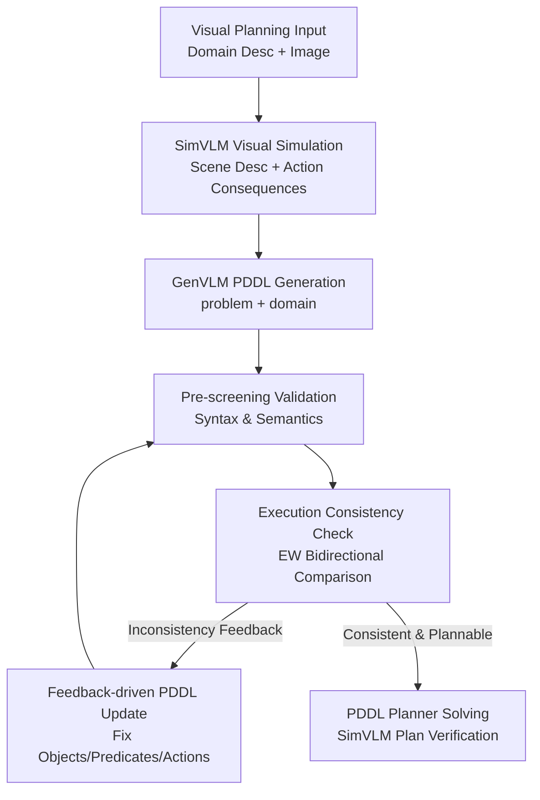

# Simulation to Rules: A Dual-VLM Framework for Formal Visual Planning

**Conference**: ICLR 2026  
**OpenReview**: [https://openreview.net/forum?id=7tlLpQpGlx](https://openreview.net/forum?id=7tlLpQpGlx)  
**Paper**: [Project Page](https://sites.google.com/view/vlmfp)  
**Code**: To be released  
**Area**: Multimodal VLM / Visual Planning  
**Keywords**: Dual-VLM, Visual Planning, PDDL, Action Simulation, Symbolic Planning  

## TL;DR
VLMFP utilizes a SimVLM, proficient in visual-spatial understanding and action simulation, to supervise a GenVLM adept at PDDL generation. It automatically converts visual planning tasks from images into PDDL problem/domain files solvable by formal planners, significantly outperforming direct VLM planning and feedback-free PDDL generation baselines in grid-world and 3D tasks.

## Background & Motivation
**Background**: Long-horizon planning tasks are common in robot assembly, multi-robot collaboration, navigation, and gaming environments. While pure LLMs or VLMs can process natural language and images to output action sequences directly, they often struggle with multi-step constraints, spatial relationships, and status changes post-action. Another class of methods delegates tasks to PDDL planners: provided a domain file correctly describes action rules and a problem file describes the current instance, planners can reliably search for long-horizon solutions.

**Limitations of Prior Work**: The strength of PDDL is also its barrier. A problem PDDL must accurately specify objects, locations, and initial/goal states from an image; a domain PDDL must accurately define universal rules for a task category—e.g., avoiding ice holes in FrozenLake, opening packages only when facing them in Package, or managing ingredient states in Overcooked. Existing VLM+PDDL works mostly require the VLM to generate the problem file while assuming the domain file is provided by experts. Without manual rule files, planners cannot function.

**Key Challenge**: Mapping images to PDDL requires two simultaneous capabilities: visual-spatial understanding precise enough for object positions and occlusions, and formal rule generation knowledgeable in predicates, preconditions, effects, and PDDL syntax. A single large VLM is often unreliable in both: it may misperceive positions or omit action preconditions. Furthermore, without real environment interaction, there is no external oracle to verify if generated rules match the visual world.

**Goal**: The authors aim to solve "Simulation to Rules" as stated in the title: starting from visual observations and natural language rules, to automatically generate PDDL problem and domain files without relying on manual domain PDDL or accessing the real environment, and then solve them using formal planners. Specifically, the system must interpret images into structured scenes, generate candidate PDDL, detect discrepancies between PDDL execution and visual simulation, and provide feedback to the generative model for rule correction.

**Key Insight**: Instead of assigning all responsibilities to one model, the capacity is split across two VLMs. A smaller but fine-tuned SimVLM handles visual scene description, action consequence simulation, and goal achievement judgment. A large GenVLM handles PDDL generation and refinement. The key observation is that short-horizon action simulations in the visual world serve as "surrogate feedback without environment interaction" to check the authenticity of symbolic action rules.

**Core Idea**: Use the visual action simulation results produced by SimVLM to iteratively calibrate the PDDL problem/domain generated by GenVLM, making the symbolic environment perceived by the formal planner progressively approximate the real environment in the image.

## Method

### Overall Architecture
The input to VLMFP consists of a domain description $n_d$ and a problem setting image $i_p$. The output includes executable PDDL files and an action plan solved by a PDDL planner and verified by SimVLM. First, SimVLM generates a scene description $n_p$ from the image. Then, GenVLM generates candidate PDDL based on $n_d, i_p, n_p$. A PDDL validator performs syntax/semantic pre-screening. Execution consistency is checked by comparing SimVLM simulations with PDDL executions via random action sequences; inconsistencies are fed back to GenVLM to refine the rules.

The formal representation follows this flow. Step 1: SimVLM $V_S$ generates the scene description $n_p = V_S(n_d, i_p)$. Step 2: GenVLM $V_G$ generates initial files $f_d^{(0)}, f_p^{(0)} = V_G(n_d, i_p, n_p)$. If the feedback $s$ is generated during the check, GenVLM updates the files: $f_d^{(t)}, f_p^{(t)} = V_G(n_d, i_p, n_p; s, f_d^{(t-1)}, f_p^{(t-1)})$.

### Key Designs
**1. SimVLM Visual Simulation: Turning the Image World into a Verifiable Action Oracle**

The core step is training a VLM capable of "simulating actions after seeing an image." SimVLM is fine-tuned on Qwen2-VL-7B. Given a domain description, image, and action sequence, it outputs: initial state descriptions, step-by-step execution reasons and success/failure results, and final goal achievement. Thus, SimVLM does not just transcribe images; it provides a queryable reference world model at the local action level.

This addresses the most elusive errors in VLM planning: plans that sound plausible but fail because a step hits a wall, enters an ice hole, or fails a dependency. The authors used 430,000 action sequence simulation samples covering 6 grid worlds, varying map sizes, obstacle probabilities, and visual appearances to train SimVLM. The PDDL generated later is trusted only if its symbolic execution matches SimVLM's visual simulation.

**2. GenVLM PDDL Generation: Filling Formal Rules and Instance Descriptions with LLM Knowledge**

GenVLM (GPT-4o) generates two files: the problem PDDL (describing objects, initial states, and goals) and the domain PDDL (describing reusable predicates and action rules). The authors highlight that domain files are harder as they must generalize rules across the environment rather than just describing the current image. For instance, while a problem file lists hole coordinates, a domain file must specify movement preconditions regarding boundaries and hole-avoidance.

SimVLM's scene description provides "visual compensation." Generating PDDL directly from images often leads to missing lines or misunderstood spatial relations. Using SimVLM's structured natural language output as an intermediate layer transforms visual recognition into a symbolic generation problem. Simultaneously, GenVLM provides PDDL expertise that SimVLM lacks: predicate declarations, type systems, action parameters, and file compatibility.

**3. Execution Consistency Check: Detecting Discrepancies via EW Scores**

PDDL validation alone is insufficient because a syntactically correct file can still contain wrong rules. The key check involves running random action sequences in both worlds: SimVLM judges if an action is executable in the image world, while the generated PDDL judges executability in the symbolic world. If SimVLM deems moving onto an ice hole a failure while PDDL allows it, the domain precondition is under-constrained.

The Exploration Walk (EW) score measures bidirectional consistency. It samples from the distribution $P_{sim,T}$ of sequences executable by SimVLM to see if PDDL agrees, and conversely samples from the PDDL-executable distribution $P_{f_d,f_p,T}$ to see if SimVLM agrees. The harmonic mean of these executable rates provides the total score:

$$
mEW(\hat d, \hat p)=2\left(\left(\frac{1}{T_{max}}\sum_{T=1}^{T_{max}}\mathbb{E}_{q\sim P_{sim,T}}[E_{f_d,f_p}(q)]\right)^{-1}+\left(\frac{1}{T_{max}}\sum_{T=1}^{T_{max}}\mathbb{E}_{q\sim P_{f_d,f_p,T}}[E_{sim}(q)]\right)^{-1}\right)^{-1}
$$

This prevents the PDDL from being either "too loose" or "too strict." Both types of errors generate interpretable feedback for the next update cycle.

**4. Feedback-driven PDDL Update: Translating Failed Actions into Localized Rule Fixes**

When EW checks find inconsistencies, the system provides the failed action, SimVLM's reasoning, PDDL results, and the current files to GenVLM. The update prompt requires GenVLM to systematically check predicates and actions to determine if the problem file missed an object or the domain file missed a precondition/effect. 

In a FrozenLake example: if PDDL allows moving to `pos-1-2` but SimVLM identifies it as a hole, GenVLM infers the `move` precondition is incomplete and adds a constraint like `(not (ice-hole ?to))`. This process translates "failures in visual simulation" into "missing predicates in symbolic rules."

### Loss & Training
SimVLM is trained via Supervised Fine-Tuning (SFT). 430,000 samples were used from 6 grid-world domains. Qwen2-VL-7B was fine-tuned for 3 epochs with a learning rate of $1\times10^{-5}$ and a batch size of 2. 10% of the data served as a validation set. Evaluation uses strict string matching for Task Description, Execution Reason, Execution Result, and Goal Reach.

GenVLM works in a closed loop via prompting without training. The system allows up to 5 PDDL re-generation attempts for pre-screening and 4 refinement cycles. The process stops when the EW score reaches 1.0 and SimVLM validates the found plan.

## Key Experimental Results

### Main Results
The authors evaluate SimVLM performance and VLMFP end-to-end planning success. SimVLM was tested on seen and unseen appearances across 1000 samples per domain. VLMFP success is reported over 1500 trials (15 instances for domain generation, 100 new instances for testing).

| Module / Setting | Seen Mean | Unseen Mean | Description |
|--------|------|------|------|
| SimVLM Task Description | 95.5% | 82.6% | Strict string match |
| SimVLM Execution Reason | 85.7% | 88.1% | Step-by-step reasoning |
| SimVLM Execution Result | 85.5% | 87.8% | Success/failure prediction |
| SimVLM Goal Reach | 82.4% | 85.6% | Final goal assessment |
| SimVLM overall average | 87.3% | 86.0% | Six domain average |

| Method | Seen Avg Success | Unseen Avg Success | Gain over GPT-4o |
|------|---------|------|------|
| Direct GPT-4o | 1.3% | 1.7% | Direct planning nearly unusable |
| Direct GPT-5 | 11.8% | 10.0% | Stronger model still fails long-horizon |
| CoT GPT-4o | 1.7% | 2.0% | CoT fails symbolic consistency |
| CoT GPT-5 | 12.7% | 12.0% | Reasoning helps but success remains low |
| CodePDDL GPT-4o | 30.7% | 32.3% | Problems solved without update loop |
| VLMFP GPT-4o (Ours) | 70.0% | 54.1% | Significant improvement (+39.3 seen) |

VLMFP shows a clear advantage in complex domains like Sokoban and Overcooked, where CodePDDL often scores 0% due to missing action constraints.

### Ablation Study
Ablation experiments removing pre-screening, feedback, and updates:

| Configuration | FrozenLake | Maze | Sokoban | Package | Printer | Overcooked | Average |
|------|---------|------|------|------|------|------|------|
| No Prescreening | 94.3 | 62.5 | 23.9 | 56.9 | 37.3 | 10.3 | 47.5 |
| No Feedback | 95.5 | 84.9 | 38.0 | 58.9 | 53.4 | 35.9 | 61.1 |
| No Update | 88.1 | 87.5 | 0.0 | 0.0 | 7.2 | 1.1 | 30.7 |
| VLMFP (Ours) | 95.2 | 88.7 | 55.8 | 75.2 | 58.7 | 46.2 | 70.0 |

### Key Findings
- The update step is the largest contributor. "No Update" results are similar to CodePDDL, failing in complex domains.
- Pre-screening and feedback are vital. Removing pre-screening drops average success from 70.0% to 47.5%, proving that syntax errors pollute consistency checks.
- While SimVLM's scene description accuracy drops on unseen appearances, action simulation remains relatively reliable.
- VLMFP succeeds in 3D settings (e.g., Assembly success at 92.4%), demonstrating scalability beyond 2D grids.

## Highlights & Insights
- The primary highlight is using visual action simulation as a feedback source for PDDL domain generation.
- The Dual-VLM split is logical: small models simulate the visual world, while large models handle general reasoning and PDDL syntax.
- The EW bidirectional check is a practical innovation; sampling only one way misses either over-constrained or under-constrained rules.
- Recyclability of domain PDDL: Once the domain file is corrected using one image, it generalizes to 100 new instances.

## Limitations & Future Work
- SimVLM is an empirical oracle, not a ground-truth environment. Errors in SimVLM perception can derail PDDL updates.
- Dependence on expensive closed-source GenVLMs for high-quality PDDL generation and prompt following.
- EW checks via random sampling may not explore the entire state space, potentially missing edge-case rule violations.
- Future work could upgrade SimVLM to a more universal world model and integrate counterexample-guided synthesis for better state coverage.

## Related Work & Insights
- **Compared to Direct VLM/CoT Planning**: Direct planning success is extremely low; VLMFP succeeds by offloading long-horizon search to formal planners.
- **Compared to LLM+P Methods**: VLMFP focuses on visual instead of textual input and generates both problem and domain files automatically.
- **Compared to VLM problem generation**: While prior works only generated problem files from images, VLMFP also generates the domain rules.
- **Insight**: This "Generative model + World model counterexamples + Formal system verification" paradigm is applicable beyond PDDL to other formal task graphs or safety-critical policies.

## Rating
- Novelty: ⭐⭐⭐⭐⭐ 
- Experimental Thoroughness: ⭐⭐⭐⭐☆ 
- Writing Quality: ⭐⭐⭐⭐☆ 
- Value: ⭐⭐⭐⭐⭐ 

<!-- RELATED:START -->

## Related Papers

- [\[CVPR 2026\] SIMPACT: Simulation-Enabled Action Planning using Vision-Language Models](../../CVPR2026/multimodal_vlm/simpact_simulation-enabled_action_planning_using_vision-language_models.md)
- [\[ICLR 2026\] DualToken: Towards Unifying Visual Understanding and Generation with Dual Visual Vocabularies](dualtoken_towards_unifying_visual_understanding_and_generation_with_dual_visual_.md)
- [\[ICLR 2026\] Fed-Duet: Dual Expert-Orchestrated Framework for Continual Federated Vision-Language Learning](fed-duet_dual_expert-orchestrated_framework_for_continual_federated_vision-langu.md)
- [\[ICLR 2026\] K-Sort Eval: Efficient Preference Evaluation for Visual Generation via Corrected VLM-as-a-Judge](k-sort_eval_efficient_preference_evaluation_for_visual_generation_via_corrected_.md)
- [\[ICLR 2026\] ScaleCap: Scalable Image Captioning via Dual-Modality Debiasing](scalecap_scalable_image_captioning_via_dual-modality_debiasing.md)

<!-- RELATED:END -->
