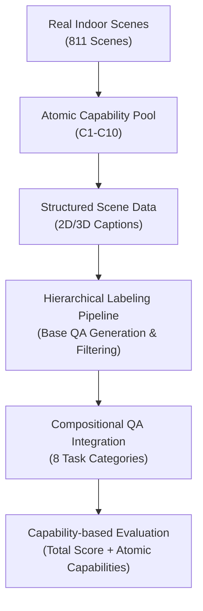

# SpaCE-10: A Comprehensive Benchmark for Multimodal Large Language Models in Compositional Spatial Intelligence

**Conference**: ICLR 2026  
**OpenReview**: [https://openreview.net/forum?id=Df7UjwEgIle](https://openreview.net/forum?id=Df7UjwEgIle)  
**Code**: https://github.com/VisionXLab/SpaCE-10  
**Area**: Multimodal VLM  
**Keywords**: Compositional Spatial Intelligence, Multimodal Large Language Model Evaluation, Spatial Reasoning, 3D Scene Understanding, Multi-view Fusion

## TL;DR
SpaCE-10 constructs a benchmark for compositional spatial intelligence in MLLMs by decomposing spatial capabilities in real indoor scenes into 10 atomic capabilities, which are then recomposed into 8 categories of QA tasks. Utilizing 811 real-world scenes and 5k+ high-quality QA pairs, it reveals significant weaknesses in current models regarding multi-view integration, counting, inverse reasoning, and situational perspective understanding.

## Background & Motivation
**Background**: Multimodal Large Language Models (MLLMs) have advanced rapidly in image-text QA and video understanding. These models are increasingly expected to perform real-world spatial tasks such as robotics, navigation, and indoor assistance. Real-world tasks involve more than simple object recognition; for example, "getting a watch near the nightstand" requires identifying objects, locating the nightstand, understanding "near," finding targets across multiple views, and path planning.

**Limitations of Prior Work**: Existing spatial intelligence benchmarks often cover limited scenes or single capabilities. Some 3D QA datasets focus on point cloud QA but resemble general scene QA; recent VLM benchmarks include complex questions but lack explicit mapping to specific spatial capabilities. Consequently, low model scores do not clarify whether the failure lies in object recognition, multi-view fusion, counting, or the composition of these skills.

**Key Challenge**: Real-world spatial tasks require models to compose multiple foundational capabilities on the fly, yet evaluation systems often treat spatial intelligence as a "black-box" total score. Aggregate accuracy masks the underlying capability structure: two models with similar scores might differ greatly in their proficiency at size comparison versus counting, or a model might perform well on single-choice questions but fail entirely on multiple-choice or inverse questions.

**Goal**: The authors aim to advance MLLM spatial intelligence evaluation from "asking spatial questions" to a "capability-organized question system." Specifically, SpaCE-10 addresses three questions: which atomic spatial capabilities are critical for real tasks; how these capabilities compose into evaluatable QA types; and what the respective bottlenecks are for current MLLMs in atomic and compositional capabilities.

**Key Insight**: The paper leverages real-world indoor scanned scenes rather than synthetic geometry or single images. This requires models to handle occlusions, viewpoint changes, functional affordances, local relationships, and global paths—factors essential for future embodied intelligence.

**Core Idea**: Construct a diagnostic spatial intelligence benchmark using "10 atomic spatial capabilities + 8 types of compositional QA + a hierarchical semi-automatic labeling pipeline." This allows the evaluation to provide not just a total score, but also identify specific capability compositions where models fail.

## Method
### Overall Architecture
SpaCE-10 is an evaluation benchmark rather than a new model architecture. It collects multi-view snapshots and video frames from 4 real 3D indoor scene datasets, converts scenes into structured descriptions, generates base QA pairs, and finally upgrades single-capability questions into compositional spatial questions through capability integration, with human filtering ensuring answer reliability.

The construction logic follows: "Real Scene Acquisition → Structured Scene Representation → Base QA Generation → Compositional Capability Integration → Large-scale Model Evaluation."

### Key Designs
**1. Atomic Capability Pool: Decomposing Spatial Intelligence into 10 Diagnostic Components**

SpaCE-10 defines capabilities before generating questions. Spatial intelligence is decomposed into C1-C10: Object Recognition, Spatial Localization, Spatial Relations, Size Comparison, Counting, Functional Knowledge, Multi-view Fusion, Forward Understanding, Inverse Reasoning, and Situational Observation. These cover the spectrum from "what is seen" to "imagining relationships from a specific position."

Each question is tagged with these capabilities. For instance, entity counting requires C1, C2, C5, C7, and C8; functional reasoning further requires C3, C6, C9, and C10. This allowed errors to be explained as failures in specific combinations rather than just point deductions.

**2. Hierarchical Labeling Pipeline: From Structured Scenes to Controllable QA**

Directly generating complex spatial questions from images via MLLMs often leads to hallucinations or ambiguity. SpaCE-10 uses a hierarchical pipeline:
- **Phase 1**: Three human experts acquire 3D point cloud snapshots from 4-6 directions (38+ hours).
- **Phase 2**: 10 keyframes are selected from videos using CLIP encoders and k-means; GPT-4o generates 2D captions, which are refined by a GPT-4o inspector.
- **Phase 3**: 3D snapshots and 2D frames are used to generate 3D captions, followed by rule-based extraction of structured scene data.
Human filtering (112+ hours) ensured that incorrect options and invalid answers were removed, resulting in 5k+ final QA pairs.

**3. Compositional QA Integration: Forcing Cross-view and Inverse Reasoning**

The benchmark recomposes base QA into tasks resembling real-world challenges. For size comparison and object-scene relations, multiple base questions from the same scene are integrated into one question where each option refers to a different object or location. This forces the model to search the entire room and fuse multiple views (C7).

For "Entity Presence," simple existence questions are inverted to "which option contains NO objects present in the scene," transforming recognition into inverse reasoning (C9). "Functional Reasoning" requires models to judge if an object with a specific function exists near a target while confirming the absence of two other functional object types.

**4. Capability-based Evaluation: Analyzing the Atomic Capability Matrix**

The paper maps QA types back to C1-C10 to construct a model's average performance across atomic capabilities. This "capability profile" reveals that similar total scores do not imply similar capability structures. For instance, while InternVL3.5-241B is overall the strongest, its C5 (counting) score is only 37.5%, far below the human performance of 89.9%.

### Mechanism Example
In **Functional Reasoning**, a base question might ask: "Which object near the bed is described correctly regarding its function?" The compositional version in SpaCE-10 might ask: "Which of the following descriptions is correct?" where options include: "Near the bed, there is an object for storage, but it lacks objects for cleaning and ventilation." This requires finding the target across views, identifying neighbors, mapping them to functions, and performing a "one exists, two do not" inverse judgment.

## Key Experimental Results
### Main Results
SpaCE-10 evaluates nearly 50 closed-source and open-source MLLMs, including GPT-4o, Claude-3.7, Gemini-2.0, and InternVL/Qwen series.

| Model/Category | Overall | Representative Strengths | Key Observations |
| :--- | :--- | :--- | :--- |
| Human | 91.2 | Significant lead across all tasks | Humans are far superior even in complex numerical/reasoning tasks. |
| InternVL3.5-241B-A28B | 55.0 | EP 64.2, SA 68.2, OO 63.5 | Strongest open-source model; 36.2 points behind humans. |
| GPT-5 (Estimated/Latest) | 53.4 | SA 71.0, FR 66.8, OO 60.7 | Strong perception/functional reasoning; weak spatial planning. |
| LLaVA-OneVision-72B | 52.8 | FR 67.3, SA 67.9, OO 64.5 | Large-scale open 2D MLLMs approach closed-source levels. |
| GPT-4o-2024-11-20 | 49.0 | EQ 58.3, OO 58.3, OS 56.2 | Relatively strong at counting (EQ); very weak at spatial planning (SP). |
| LEO-7B (3D MLLM) | 11.1 | No significant advantages | Very weak on whole-scene point clouds; 3D models struggle with global QA. |

The main conclusion is that 2D MLLMs currently outperform dedicated 3D MLLMs on this benchmark, likely due to the superior general reasoning and multi-modal dialogue capabilities of 2D models compared to the object-centric design of many 3D models.

### Ablation Study
The "ablation" compares performance on base versus compositional versions of the same question types to observe the impact of adding multi-view fusion, inverse reasoning, and situational observation.

| Task | Base Avg | Comp. Avg | Gain/Loss | Integrated Capabilities |
| :--- | :--- | :--- | :--- | :--- |
| SA | 57.3 | 38.2 | -19.1 | +C7 |
| EP | 67.8 | 26.8 | -41.0 | +C7, C9 |
| FR | 83.0 | 42.8 | -42.9 | +C7, C9, C10 |

The data confirms that models struggle significantly when multiple foundational capabilities are dependent on one another in a single question.

### Key Findings
- **Human Gap**: The best model (55.0) lags far behind humans (91.2).
- **2D vs. 3D**: Existing 3D MLLMs struggle with whole-scene reasoning and general dialogue.
- **Compositional Difficulty**: Integrating multi-view and inverse reasoning causes performance to drop by over 40% in tasks like FR and EP.
- **Counting Bottleneck**: C5 is consistently the weakest capability across models; even the best model achieves only 37.5% compared to 89.9% for humans.
- **Total Score vs. Profile**: Models with similar total scores often have entirely different capability bottlenecks.

## Highlights & Insights
- **Capability-First Design**: Unlike datasets that categorize questions post-hoc, SpaCE-10 starts with a capability pool (C1-C10), making it a diagnostic tool rather than just a leaderboard.
- **Option Recomposition**: A simple yet effective method to transform local recognition tasks into whole-scene multi-view integration tasks.
- **Actionable Training Guidance**: The capability matrix identifies specific areas (e.g., C5, C10) where data augmentation and post-training are most needed.
- **Embodied Relevance**: These findings suggest that for embodied agents, failure often results from the breakdown of one basic capability link within a complex compositional task.

## Limitations & Future Work
- **Static Evaluation**: Currently focuses on QA; it does not evaluate real-time execution, navigation, or grasping in dynamic environments.
- **Indoor Limitation**: Limited to indoor scanned scenes; does not cover outdoor environments or complex dynamic interactions.
- **LLM Bias**: The use of GPT-4o for generation, despite human filtering, may still introduce linguistic or stylistic biases.
- **Capability Isolation**: In tasks involving multiple capabilities, pinpointing the exact failure point (causal attribution) remains challenging without further intervention experiments.

## Related Work & Insights
- **Comparison to ScanQA/SQA3D**: While prior works focus on point clouds or situated QA, SpaCE-10 emphasizes the decomposition and composition of atomic capabilities for MLLM diagnosis.
- **Comparison to Sparkle**: SpaCE-10 shares the idea of capability decomposition but expands the scope to directions, size, counting, and functional knowledge in real indoor scenes.
- **VSI/OmniSpatial Context**: SpaCE-10 provides a more rigorous pressure test for multi-view and inverse reasoning compared to traditional spatial understanding benchmarks.

## Rating
- **Novelty**: ⭐⭐⭐⭐☆ Excellent organization of spatial intelligence into a diagnostic framework.
- **Experimental Thoroughness**: ⭐⭐⭐⭐⭐ Comprehensive evaluation across 50 models, including unique 2D vs. 3D comparisons.
- **Writing Quality**: ⭐⭐⭐⭐☆ Clear structure and logic.
- **Value**: ⭐⭐⭐⭐⭐ Highly valuable for identifying the "compositional" bottlenecks in MLLM spatial intelligence.

<!-- RELATED:START -->

## Related Papers

- [\[CVPR 2026\] SpatialScore: Towards Comprehensive Evaluation for Spatial Intelligence](../../CVPR2026/multimodal_vlm/spatialscore_towards_comprehensive_evaluation_for_spatial_intelligence.md)
- [\[ICLR 2026\] MMSI-Bench: A Benchmark for Multi-Image Spatial Intelligence](mmsi-bench_a_benchmark_for_multi-image_spatial_intelligence.md)
- [\[ICLR 2026\] MME-Emotion: A Holistic Evaluation Benchmark for Emotional Intelligence in Multimodal Large Language Models](mme-emotion_a_holistic_evaluation_benchmark_for_emotional_intelligence_in_multim.md)
- [\[CVPR 2026\] Scaling Spatial Intelligence with Multimodal Foundation Models](../../CVPR2026/multimodal_vlm/scaling_spatial_intelligence_with_multimodal_foundation_models.md)
- [\[CVPR 2026\] Is your VLM Sky-Ready? A Comprehensive Spatial Intelligence Benchmark for UAV Navigation](../../CVPR2026/multimodal_vlm/is_your_vlm_sky-ready_a_comprehensive_spatial_intelligence_benchmark_for_uav_nav.md)

<!-- RELATED:END -->
