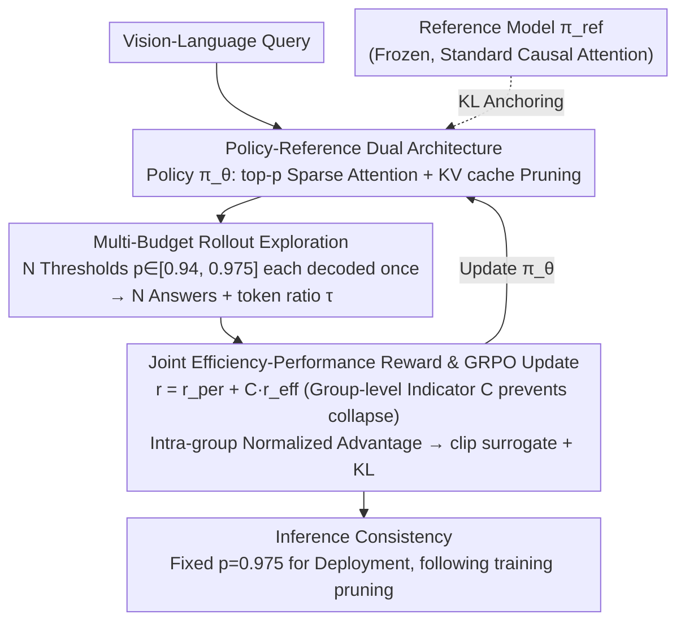

# Sparsity Forcing: Reinforcing Token Sparsity of MLLMs

**Conference**: ICLR 2026  
**arXiv**: [2504.18579](https://arxiv.org/abs/2504.18579)  
**Area**: Multimodal VLM  
**Keywords**: token sparsity, RL post-training, GRPO, efficiency-performance joint reward, multi-budget exploration

## TL;DR
Ours proposes Sparsity Forcing—a RL post-training framework based on GRPO. It adopts an MLLM with top-$p$ sparse attention as the policy model and the original MLLM as the reference model. Through multi-budget rollout exploration of varying token retention thresholds $p$, it performs group-relative optimization using a joint reward of efficiency (token reduction rate) and performance (answer correctness). This framework enhances the token reduction rate of Qwen2/2.5-VL from 20% to 75% with minimal accuracy loss, achieving a 3× memory reduction and 3.3× decoding acceleration.

## Background & Motivation

**MLLM Inference Bottleneck**: When processing high-resolution images or long videos, visual encoders generate a massive amount of visual tokens, severely restricting generation efficiency (e.g., video inputs exceeding 16k tokens).

**Ceiling of Natural Sparsity Utilization**: Methods such as FastV and ZipVL utilize the inherent sparsity of attention maps to prune redundant tokens. however, they can only safely reduce tokens by approximately 50%; further compression (e.g., retaining 20% or 10%) leads to a sharp decline in accuracy.

**Limitations of Trainable Sparse Attention**: Methods like MOBA and NSA use pre-defined rigid sparsity patterns, ignoring the dynamics of inputs and layers, and require training from scratch, which is impractical for MLLM post-training scenarios.

**Proxy Objective Problem in Attention Sharpening Regularization**: Regularization terms like $L_\infty$ or entropy minimization optimize proxy objectives for attention distribution sharpness. These do not directly control the token budget, and the learned sharpness cannot reliably translate into end-to-end token savings.

**Training-Inference Mismatch in SFT**: Existing SFT methods under teacher forcing impose sparsity on ground-truth tokens rather than generated outputs. This inconsistency with auto-regressive decoding during inference limits actual efficiency gains.

**Core Motivation**: An inference-aligned post-training method is needed to directly optimize efficiency and performance as end-to-end objectives rather than proxies, allowing the model to actively learn "which tokens can be safely discarded."

## Method

### Overall Architecture

Sparsity Forcing treats "making MLLMs sparser" as a reinforcement learning objective. An MLLM with top-$p$ sparse attention serves as the policy model $\pi_\theta$, while the original MLLM with frozen parameters serves as the reference model $\pi_{\text{ref}}$. For each vision-language query, the policy model performs auto-regressive decoding (rollout) using several different token retention thresholds. Joint rewards are calculated based on "answer correctness + token reduction rate," followed by group-relative optimization using GRPO to backpropagate gradients to the policy model. After training, the threshold is fixed at the upper bound of the training range for deployment. The entire training loop uses the exact same sparse attention and KV cache pruning pipeline as deployment, ensuring learned sparsity transfers losslessly.

### Key Designs

**1. Policy-Reference Dual Architecture: Maintaining Original Capabilities under High Sparsity**

The policy model $\pi_\theta$ executes sparse token selection and KV cache pruning during decoding. Its top-$p$ attention independently determines the number of tokens to retain in each layer by accumulating and sorting attention scores to find the smallest prefix $b$ such that the cumulative mass reaches the threshold: $b = \min\{p \in \mathbb{Z} \mid \sum_{j=1}^{p} a_{\text{sorted}(j)} \geq p \times \ell\}$, where $a_j = \sum_{c=1}^{\ell} \mathbf{A}_{c,j}$ is the cumulative attention score of the $j$-th token and $\ell$ is the sequence length. Such pruning is aggressive and can easily degrade the model. Therefore, a frozen reference model $\pi_{\text{ref}}$ with standard causal attention is introduced to anchor the policy near the original distribution via KL divergence $\mathbb{D}_{\text{KL}}(\pi_\theta \| \pi_{\text{ref}})$. The reference model acts as a safety rope, allowing the model to explore high sparsity without losing task fidelity.

**2. Multi-budget Rollout Exploration: Generating Contrastive Signals without Manual Labeling**

For the same query, Ours performs $N$ independent rollouts with different thresholds $p_n$, resulting in $N$ answers $\{\mathbf{o}_1, \dots, \mathbf{o}_N\}$ and corresponding token ratios $\{\tau_1, \dots, \tau_N\}$. These thresholds form a "budget scan" from sparse to dense: smaller $p$ values retain fewer tokens, testing if correctness can be maintained; larger $p$ values retain more tokens, serving as a baseline for correctness. The training threshold range is set to $p \in [0.94, 0.975]$ with a step of 0.005. This avoids the need for pre-defined positive/negative pairs in DPO—rollouts that are both efficient and correct naturally gain positive advantages, while those that fail or retain too many tokens receive negative advantages. As training progresses, the "minimum budget required for correctness" shifts downward, and the rollout range adapts automatically.

**3. Joint Efficiency-Performance Reward & GRPO Update: End-to-End Efficiency Optimization**

Each rollout receives two rewards: a performance reward $r_{\text{per}} \in \{0, 1\}$ based on answer correctness, and an efficiency reward $r_{\text{eff}} = 1 - \tau_i$ representing the token reduction rate. Crucially, a group-level indicator $C = \mathbb{1}\{\exists j: \text{Correct}(\mathbf{o}_j) = 1\}$ is introduced. The efficiency reward is only added to the total reward if at least one rollout in the group is correct: $r_i = r_{\text{per},i} + C \cdot r_{\text{eff},i}$. This is essential for preventing collapse—if all rollouts in a group are incorrect, $C$ prevents the efficiency signal from further rewarding "heavier pruning," which would push the model toward generating empty answers. Advantages are calculated using intra-group normalization $A_i = (r_i - \text{mean}) / \text{std}$, followed by updates using the GRPO clip surrogate objective:

$$\mathcal{J}(\theta) = \mathbb{E}\left[\min\left(\frac{\pi_\theta(\mathbf{o}_n|\mathbf{x})}{\pi_{\theta_{\text{old}}}(\mathbf{o}_n|\mathbf{x})} A_i,\; \kappa(\cdot) A_i\right) - \beta \mathbb{D}_{\text{KL}}(\pi_\theta \| \pi_{\text{ref}})\right]$$

The on-policy nature of GRPO allows positive/negative contrasts to update in real-time, avoiding the obsolescence of pre-defined pairs in DPO. Efficiency and performance thus become true end-to-end optimization targets.

**4. Inference Consistency: Mirroring the Deployment Pipeline during Training**

The training and inference utilize the same sparse attention workflow, including identical token pruning strategies and KV cache management. During inference, the threshold is fixed at the training upper bound ($p=0.975$). Since the model has learned to produce sparser attention distributions even at this relatively loose threshold during training, it preserves accuracy while inheriting efficiency gains. This addresses the mismatch in SFT, where teacher forcing during training and auto-regressive decoding during inference lead to reduced actual efficiency gains.

## Key Experimental Results

### Table 1: Comparison across Image Benchmarks (7 Tasks)

| Model | Method | Token Ratio ↓ | MME | MMBench | MMStar | ChartQA | TextVQA | OCRBench | MMMU-Pro | Mean |
|------|------|-----------|-----|---------|--------|---------|---------|----------|----------|------|
| Qwen2.5-VL-7B | Full | 100% | 2303 | 83.9 | 62.2 | 84.0 | 82.9 | 845 | 36.7 | 73.8 |
| | FastV | 52.1% | 2115 | 81.9 | 61.2 | 80.2 | 79.6 | 760 | 34.5 | 69.9 |
| | ZipVL | 79.5% | 2290 | 83.9 | 60.4 | 82.0 | 82.6 | 837 | 36.2 | 72.9 |
| | **Sparsity Forcing** | **24.7%** | **2286** | **84.1** | **62.5** | **83.1** | **82.6** | **847** | **36.7** | **73.6** |

### Table 2: Comparison of Sparsity Enhancement Methods (Qwen2.5-VL-7B)

| Method | Type | Token Ratio ↓ | MME | MMStar | ChartQA | VideoMME | Mean |
|------|------|-----------|-----|--------|---------|----------|------|
| Full | - | 100% | 2303 | 62.2 | 84.0 | 64.5 | 73.2 |
| MOBA | Trainable Sparse Attn | 25% | 1906 | 58.6 | 77.3 | 62.6 | 66.6 |
| Sharpness Loss | Attn Sharpening Reg. | 25% | 1965 | 59.6 | 77.0 | 63.7 | 67.6 |
| ZipVL (Post-train) | Sparse Attn Finetune | 61.7% | 2264 | 62.0 | 78.9 | 64.2 | 71.5 |
| **Sparsity Forcing** | **RL Post-training** | **26.4%** | **2286** | **62.5** | **83.1** | **64.0** | **72.8** |

### Table 3: Ablation of Sparse Attention Types (Qwen2.5-VL-7B)

| Sparse Attention | Token Ratio | MME | VideoMME |
|-----------|----------|-----|----------|
| Top-$k$ | 25% | 2160 | 60.2 |
| Threshold | 37.8% | 2218 | 61.6 |
| **Top-$p$** | **24.1%** | **2286** | **64.0** |

## Key Findings

1.  **Sparsity reinforced by 3.75×**: Inherent sparsity in ZipVL only reduces tokens from 100% to ~80% (20% reduction), whereas Sparsity Forcing safely reduces it to ~25% (75% reduction), indicating that the potential for MLLM sparsity is vastly underutilized.
2.  **Group-level Indicator $C$ is Crucial**: Without $C$, efficiency signals in all-incorrect groups would still reward heavier pruning, leading to model degradation (e.g., empty answers). $C$ ensures efficiency is rewarded only when correctness is achieved.
3.  **Top-$p$ Outperforms Top-$k$ and Threshold**: As an online strategy, Top-$p$ adaptively adjusts the number of retained tokens based on each layer's attention distribution, whereas Top-$k$ and Threshold are offline strategies that fail to adapt to input variations, resulting in a 3-4 point accuracy gap at similar token ratios.
4.  **Significant Layer-wise Sparsity Variation**: After training, token retention rates vary significantly across layers—shallow layers retain more tokens (requiring global context), while deeper layers retain fewer (focusing on key tokens), justifying the need for dynamic layer-wise strategies.
5.  **Adaptive Sparsity Growth in Long Sequences**: When input increases from 4k to 20k tokens, the retention ratio drops from ~35% to ~20% with almost no accuracy loss. This suggests that longer sequences contain more redundancy, allowing the method to scale naturally.

## Highlights & Insights

*   **Paradigm Shift "From Utilization to Reinforcement"**: Unlike previous methods that passively utilize inherent sparsity, Sparsity Forcing actively trains for greater sparsity, fundamentally restructuring the attention distribution.
*   **Inference-Consistent Design**: The training loop perfectly mirrors the inference pipeline (auto-regressive + sparse KV cache), eliminating the teacher forcing gap found in SFT.
*   **Practical Deployment Value**: 3× memory reduction + 3.3× decoding acceleration makes long video processing feasible, directly impacting MLLM deployment.
*   **Lightweight Post-training**: Training Qwen2.5-VL-7B takes 883 GPU hours (8×A100), avoiding the need for training from scratch while increasing efficiency for strong existing models.

## Limitations & Future Work

1.  **Training Overhead**: Although less than training from scratch, multi-rollout increases training costs (a group size of 8 means 8 inferences per sample).
2.  **Limited to QwenVL and LLaVA Series**: Generalizability has not been verified on other architectures (e.g., InternVL, Gemini), where attention sparsity characteristics might differ.
3.  **Dependency on Sparse Attention Frameworks**: Relies on specific implementations like ZipVL; not all inference engines provide native support, requiring additional engineering for deployment.
4.  **Focus on Visual Tokens**: Pruning primarily targets visual tokens, offering limited gains for pure text or text-heavy tasks where the sparsity margin for OCR-like tasks is smaller.

## Related Work & Insights

### vs ZipVL (He et al., 2024)
ZipVL is a training-free sparse attention method that utilizes inherent sparsity with a top-$p$ threshold but only safely achieves ~20% reduction. Sparsity Forcing is built upon ZipVL and uses RL to reinforce sparsity, upgrading ZipVL from "utilization" to "reinforcement," increasing token reduction from 20% to 75% within the same framework. The fundamental difference is that ZipVL does not change model weights, whereas Sparsity Forcing modifies the attention distribution.

### vs MOBA (Lu et al., 2025)
MOBA uses trainable sparse attention with block-wise attention probing and MoE-like ideas, employing pre-defined patterns and requiring training from scratch. In post-training comparisons (Table 3), MOBA achieves an MME of 1906 at a 25% token ratio, compared to 2286 for Sparsity Forcing. The rigid patterns in MOBA ignore input/layer dynamics, making it less suitable for fine-tuning existing MLLMs.

## Rating

*   **Novelty**: ⭐⭐⭐⭐⭐ First to apply GRPO to MLLM sparsity reinforcement; unique combined design of joint rewards, multi-budget exploration, and inference consistency.
*   **Experimental Thoroughness**: ⭐⭐⭐⭐⭐ 13 benchmarks (7 image + 6 video), 4 models, and detailed ablations on mechanisms, rollout ranges, group sizes, and hallucination robustness.
*   **Writing Quality**: ⭐⭐⭐⭐⭐ Thorough problem analysis; clear narrative from utilization to reinforcement; effective illustrations.
*   **Value**: ⭐⭐⭐⭐⭐ 3× memory + 3.3× speed; directly applicable to MLLM deployment acceleration; post-training approach lowers the barrier to entry.

<!-- RELATED:START -->

## Related Papers

- [\[ICCV 2025\] SparseMM: Head Sparsity Emerges from Visual Concept Responses in MLLMs](../../ICCV2025/multimodal_vlm/sparsemm_head_sparsity_emerges_from_visual_concept_responses_in_mllms.md)
- [\[ICLR 2026\] Patch-as-Decodable-Token: Towards Unified Multi-Modal Vision Tasks in MLLMs](patch-as-decodable-token_towards_unified_multi-modal_vision_tasks_in_mllms.md)
- [\[ICCV 2025\] Sparsity Outperforms Low-Rank Projections in Few-Shot Adaptation](../../ICCV2025/multimodal_vlm/sparsity_outperforms_low-rank_projections_in_few-shot_adaptation.md)
- [\[ICLR 2026\] Enhancing Multi-Image Understanding through Delimiter Token Scaling](enhancing_multi-image_understanding_through_delimiter_token_scaling.md)
- [\[ICLR 2026\] MMDuet2: Enhancing Proactive Interaction of Video MLLMs with Multi-Turn Reinforcement Learning](mmduet2_enhancing_proactive_interaction_of_video_mllms_with_multi-turn_reinforce.md)

<!-- RELATED:END -->
