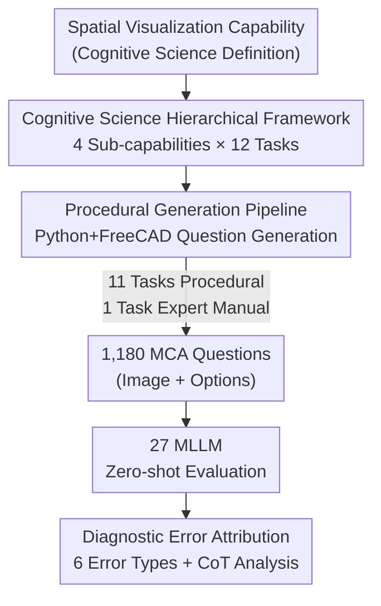

# SpatialViz-Bench: A Cognitive Science-Driven Benchmark for Diagnosing the Spatial Visualization Capabilities of MLLMs

**Conference**: ICLR 2026  
**OpenReview**: [https://openreview.net/forum?id=OqZ7bm28Xx](https://openreview.net/forum?id=OqZ7bm28Xx)  
**Code**: https://github.com/wangst0181/SpatialViz-Bench  
**Area**: Multimodal VLM  
**Keywords**: Spatial Visualization, MLLM Benchmark, Procedural Generation, Cognitive Science, Error Diagnosis

## TL;DR
To address the gap in existing multimodal benchmarks that only evaluate "visible information" rather than "internal mental rotation/folding/perspective" of objects, this paper decomposes spatial visualization into 4 sub-capabilities × 12 tasks based on cognitive science. It uses Python+FreeCAD to procedurally generate 1,180 infinitely expandable and contamination-free questions. Evaluation across 27 MLLMs reveals that the strongest model, Gemini-2.5-pro, achieves only 44.66% (Human: 82.46%), and the use of CoT in open-source models leads to performance degradation.

## Background & Motivation

**Background**: MLLMs connect the reasoning capabilities of LLMs with ViT "eyes," showing remarkable performance in various multimodal tasks. However, these tasks mostly evaluate **spatial perception**—identifying relative positions, distances, and sizes from visible visual input (e.g., BLINK, What'sUp, SpatialRGPT-bench)—or **spatial memorization**—tracking objects in videos (e.g., VSI-bench, VCBench). These rely on "visible" explicit information.

**Limitations of Prior Work**: Humans possess a capability called **spatial visualization**—constructing and manipulating invisible structures internally (mentally rotating an object, imagining unfolded origami, inferring internal cross-sections of solids, predicting gear movement). This is crucial in architectural design and surgical planning, yet current MLLMs are weak in this area and have rarely been systematically evaluated. Existing scattered evaluations have three flaws: ① **Data Contamination**: Questions are mostly scraped from online IQ tests, civil service exams, and math competitions, leading to potential overlap between training and evaluation sets (SOTA on MM-IQ’s 3D Geometry is only 27.64, and on MathVision’s Descriptive Geometry is only 26.00); ② **Category Dilution**: Spatial visualization is often buried in broad categories like "mathematical reasoning" or "logical reasoning," focusing on "solving the problem" rather than "testing spatial capability itself"; ③ **Narrow Coverage**: Specialized datasets often focus on a single sub-skill (e.g., only mental rotation or paper folding), with insufficient problem counts per sub-skill, amplifying random error.

**Key Challenge**: Spatial visualization is a capability **decoupled from visible information requiring internal mental operations**, whereas existing evaluations either lack precision in mixed tasks or lack anti-contamination measures due to public data scraping. To diagnose it cleanly, it must be isolated from confounding factors—like designing a physics exam that only tests basic principles.

**Goal**: Build a procedural, standardized, and dynamically updatable benchmark specifically for evaluating MLLM spatial visualization capabilities, enabling fine-grained diagnosis of "where exactly the model fails."

**Key Insight**: Return to the roots of cognitive science. Thurstone (1938) defined spatial visualization as "executing mental operations on visual images" and decomposed spatial capability into factors like perception, visualization, and rotation. The authors build a hierarchical framework accordingly and use procedural generation (inspired by CLEVR's use of Blender) to ensure scalability, controllable difficulty, and anti-contamination.

**Core Idea**: Use **cognitive science sub-capability classification** as the backbone for task design and **Python+FreeCAD procedural generation** as the mechanism for problem creation, solving both "what to test" and "how to generate clean data."

## Method

### Overall Architecture
SpatialViz-Bench is a benchmark construction methodology involving "hierarchical task design + procedural generation + diagnostic evaluation." It uses a cognitive framework to decompose spatial visualization into two stages: **observing visible information** and **discerning implicit information**, with the latter alternating between spatial visualization (mentally manipulating images) and spatial memory (temporarily storing visual-spatial information). Based on this, 4 core sub-capabilities are defined—Mental Rotation, Mental Folding, Visual Perspective, and Mental Animation—each with 3 evaluation tasks, totaling 12 tasks and 1,180 questions. The generation pipeline for 11 out of 12 tasks is procedural: given a task name, parameters, and standardized templates, it randomly generates reference images, positive samples (correct answers), and negative samples (distractors) with geometric transformations from an algorithm pool. It also records explanations for each error. Evaluation is performed zero-shot on 27 MLLMs, followed by a 6-class error attribution system for diagnosis.

### Key Designs

**1. Cognitive Science-Driven 4 Sub-capabilities × 12 Tasks Framework: Isolating Spatial Visualization**

Addressing the issue of spatial visualization being drowned in broad tasks, the authors build the framework based on **cognitive capabilities** rather than question types. Based on Thurstone’s spatial factor theory, visualization is split into: **Mental Rotation** (mentally representing and rotating objects while maintaining features), **Mental Folding** (mentally folding 2D patterns into 3D objects or vice versa), **Visual Perspective** (imagining internal structures from external features), and **Mental Animation** (visualizing movement within system components). Each sub-capability includes 3 tasks (e.g., 2D/3D rotation and projections under mental rotation). Each task has 2-3 difficulty levels with 40-50 questions each. Most options are **images** rather than text, forcing models into visual reasoning rather than text matching. This ensures clean evaluation targets and enables fine-grained error attribution.

**2. Python + FreeCAD Procedural Generation Pipeline: Contamination-Free and Scalable**

To stop data contamination and small sample sizes, the authors engineered a pipeline integrating **Python and FreeCAD**. Difficulty is controlled using **cognitive load parameters** rather than heuristic rules (e.g., aligning rotation complexity to mental transformation steps as per Shepard & Metzler 1971). The pipeline uses **controlled randomness** for diversity and systematically generates **distractors with explanations**—recording how each wrong option was geometrically derived from the correct answer (e.g., "removed a block" or "mirrored view"). This enables deep diagnosis. Anti-contamination is ensured by **dynamic bank updates**, as randomization allows for a constant stream of new problems that never overlap with training data. Note: The Mechanical Systems task is **expert-handcrafted** due to the technical difficulty of procedurally generating physically consistent motion, focusing on dynamic motion propagation.

**3. Six-Class Error Attribution System: Diagnosing the "Where" and "Why"**

Instead of just reporting accuracy, the authors define a diagnostic error analysis method with **6 categories**: Perceptual, Spatial Transformation, Spatial Memorization, Instruction Following, Methodological (suboptimal strategies), and Calculation & Reasoning. Annotation involved 2 humans and Gemini-2.5-pro as a tool. Reliability was confirmed with a Cohen's Kappa $\kappa=0.85$ on a 100-error subset. This allows for quantifying why models fail, leading to the conclusion that the bottleneck lies in low-level perception and transformation rather than high-level reasoning.

## Key Experimental Results

### Main Results
Zero-shot evaluation results (Accuracy %):

| Model | Overall | Mental Rotation Avg | Mental Folding Avg | Visual Perspective Avg | Mental Animation Avg |
|-------|---------|---------------------|--------------------|------------------------|----------------------|
| Human Baseline | **82.46** | 85.56 | 80.56 | 75.42 | 88.33 |
| Gemini-2.5-pro (Best) | 44.66 | 44.23 | 35.00 | 42.19 | 62.92 |
| o1 | 41.36 | 46.92 | 29.72 | 37.81 | 57.50 |
| Gemini-2.5-flash | 36.86 | 35.77 | 32.50 | 32.81 | 50.00 |
| LLaMA-4-Scout-17B (Best Open) | 34.24 | 37.31 | 28.61 | 34.06 | 39.58 |
| Qwen2.5-VL-72B-Instruct | 35.00 | 29.23 | 24.17 | 39.06 | 43.75 |
| Qwen2.5-72B (Text-only) | 25.86 | 21.67 | 22.22 | 31.25 | 28.33 |
| Random Baseline | 25.08 | 27.69 | 21.67 | 28.12 | 23.33 |

Key signals: ① Massive gap between top models (44.66%) and humans (82.46%); ② Text-only models ≈ Random, proving **strong visual dependency**; ③ Closed-source models significantly outperform open-source models by ~10 points (statistically confirmed via non-overlapping 95% Wilson intervals).

### Ablation Study: The CoT Paradox

| Configuration | Key Observation |
|---------------|-----------------|
| CoT vs. No-CoT | Closed-source (Claude-3.5) benefits; multiple open-source models drop significantly. |
| Drop Location | Most severe in pure visual tasks (3D view projection, 3D rotation). |
| CoT Template Change | Qwen2.5-VL-72B: -2.12%, Claude-3.5: -4.23% (Stable trend). |
| Extraction Rule Change | Difference < 1.2% (Confirms failure is in reasoning, not parsing). |

### Key Findings
- **Perception + Transformation errors account for nearly 60%**: These two categories dominate, while calculation and instruction following errors are minimal. This proves the bottleneck is in **low-level visual perception and transformation**.
- **Scaling models does not solve spatial flaws**: While larger models reduce total errors, the error distribution remains dominated by perception/transformation. Qwen2.5-VL 72B eliminated spatial memory errors but showed limited improvement on core spatial transformations compared to 7B.
- **Difficulty collapse is only visible on top models**: Most models show a "performance floor" at L0. Only top-tier models like Gemini-2.5-pro and o1 demonstrate statistically significant performance drops as difficulty scales, as they are the only ones scoring above random at the baseline level.

## Highlights & Insights
- **"Capability-driven" rather than "Task-driven" philosophy**: Basing the benchmark on cognitive sub-capabilities allows for fine-grained diagnostics—identifying exactly which spatial stage fails.
- **Procedural Generation as a Triple-Win**: It provides anti-contamination, theoretically grounded difficulty gradients, and self-contained explanations for distractors.
- **Localization of the CoT Paradox**: The study specifies that CoT interference occurs primarily in pure visual-spatial tasks for open-source models, providing practical guidance for prompting strategies.
- **Models as Internal World Models**: Strong spatial visualization allows models to perform lightweight "what-if" internal simulations (e.g., gear rotation propagation), which is more efficient than calling heavy video generation models.

## Limitations & Future Work
- **Manual mechanical system tasks**: These lack the dynamic update benefits of the procedural pipeline.
- **Small human baseline**: Samples were from 8 engineering/CS students, potentially overestimating "average" human performance.
- **LLM-assisted attribution bias**: Using strong models to judge others' errors may introduced latent bias.

## Related Work & Insights
- **vs. Spatial Perception (BLINK / SpatialRGPT-bench)**: Those test visible relations; Ours tests implicit inferred structures.
- **vs. MM-IQ / MathVision**: Those mix spatial tasks with math/logic and use potentially contaminated public data; Ours uses isolated cognitive categories and procedural generation.
- **vs. Single-skill datasets (SPARE3D / SRBench)**: Those have narrow coverage; Ours provides comprehensive coverage across 4 sub-capabilities.
- **vs. LEGO-Puzzles**: Both use procedural generation, but Ours provides broader coverage and deeper diagnostic error attribution.

## Rating
- Novelty: ⭐⭐⭐⭐⭐ 
- Experimental Thoroughness: ⭐⭐⭐⭐⭐ 
- Writing Quality: ⭐⭐⭐⭐ 
- Value: ⭐⭐⭐⭐⭐ 

<!-- RELATED:START -->

## Related Papers

- [\[ICLR 2026\] VisJudge-Bench: Aesthetics and Quality Assessment of Visualizations](visjudge-bench_aesthetics_and_quality_assessment_of_visualizations.md)
- [\[ICLR 2026\] MMSI-Bench: A Benchmark for Multi-Image Spatial Intelligence](mmsi-bench_a_benchmark_for_multi-image_spatial_intelligence.md)
- [\[ICLR 2026\] ODI-Bench: Can MLLMs Understand Immersive Omnidirectional Environments?](odi-bench_can_mllms_understand_immersive_omnidirectional_environments.md)
- [\[ICLR 2026\] PRISMM-Bench: A Benchmark of Peer-Review Grounded Multimodal Inconsistencies](prismm-bench_a_benchmark_of_peer-review_grounded_multimodal_inconsistencies.md)
- [\[ICLR 2026\] IWR-Bench: Can LVLMs Reconstruct Interactive Webpage from a User Interaction Video?](iwr-bench_can_lvlms_reconstruct_interactive_webpage_from_a_user_interaction_vide.md)

<!-- RELATED:END -->
