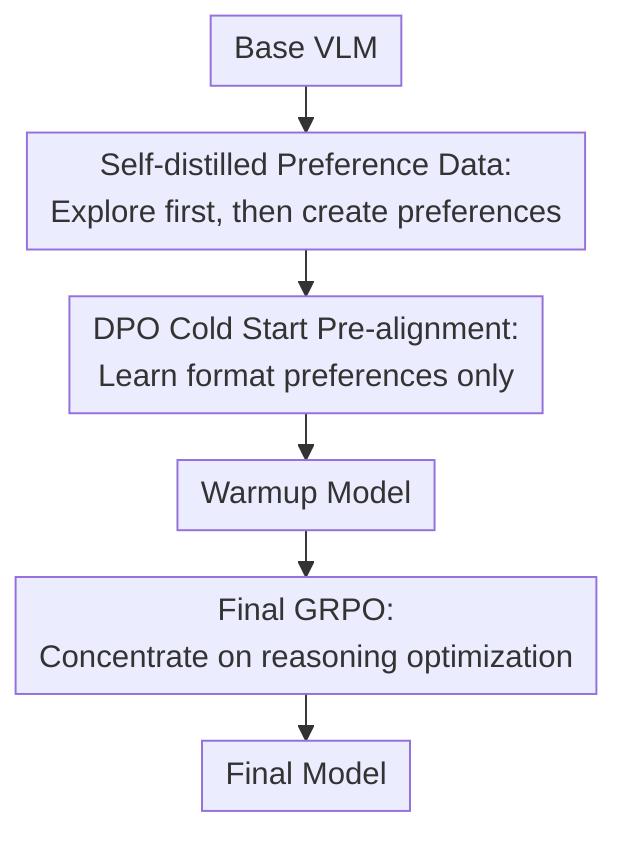

# SPECS: Decoupling Multimodal Learning via Self-distilled Preference-based Cold Start

**Conference**: ICLR2026  
**OpenReview**: [https://openreview.net/forum?id=oNmMv7Lcj5](https://openreview.net/forum?id=oNmMv7Lcj5)  
**Code**: To be confirmed  
**Area**: Multimodal VLM  
**Keywords**: Multimodal reasoning, preference cold start, self-distillation, DPO, GRPO  

## TL;DR
SPECS redesigns the cold start phase of multimodal large models before entering RLVR: it first constructs preference pairs that distinguish only the output paradigm through self-distillation, then uses DPO+SFT loss for format pre-alignment, and finally applies GRPO for deep reasoning. This approach achieves better generalization, training stability, and multimodal reasoning performance than traditional SFT cold starts.

## Background & Motivation
**Background**: Following DeepSeek-R1, increasing research has applied Reinforcement Learning from Verifiable Rewards (RLVR) to Vision-Language Models, creating a class of MLLM-r1 methods for multimodal reasoning. Typically, these do not start RL directly from a base VLM but undergo a cold start to ensure the model can output readable reasoning formats, follow answer structures, and possess preliminary complex problem-solving capabilities.

**Limitations of Prior Work**: The mainstream cold start method is SFT, where the model imitates high-quality reasoning trajectories as ground truth. While effective in the short term as the model quickly learns reasoning templates and answer styles from the training set, it couples "format execution," "reasoning organization," and "specific problem solving" into a single cross-entropy objective. Models may converge quickly on the training distribution but generalize poorly to slightly different instructions, question types, or format requirements, and subsequent RL tends to follow the narrow paths already imitated.

**Key Challenge**: Cold start is intended to provide a better initial policy for RL. However, if SFT-based cold starts learn specific problem content too early, they may sacrifice the exploration space. In multimodal reasoning, answer formats are often shallowly transferable, whereas true visual understanding, mathematical reasoning, and cross-modal evidence integration should be refined via rewards during the RL stage. Mixing these two types of objectives places an excessive burden on the cold start phase.

**Goal**: The authors aim to answer two questions: first, whether SFT or preference learning is more beneficial for generalization and subsequent RL during cold start; second, whether cold start data must come from stronger teacher models or human annotations, or if the model can generate sufficiently matched preference signals itself.

**Key Insight**: Starting with the quantification of generalization ability, the paper proposes a Generalization Factor (GF) to simultaneously measure ID and OOD gains. Experiments reveal that DPO and DPO+SFT loss maintain OOD performance better than SFT during cold start. Consequently, the authors redefine cold start as a shallow preference alignment: the model is taught correct response structures and reasoning paradigms without over-memorizing specific answer content at this stage.

**Core Idea**: Use self-distillation to generate preference pairs where "the answers are both correct but the formats differ" (one good, one bad). This allows DPO cold start to focus on transferable output paradigms, leaving complex reasoning capabilities for final GRPO optimization.

## Method

### Overall Architecture
The SPECS workflow can be summarized as "creating an exploratory version of oneself, generating format preferences from oneself, and delegating reasoning to RL." Instead of replacing SFT with another content-imitation step, it narrows the cold start objective to shallow transferable standards like format, structure, and style: chosen and rejected samples both retain correct answers as much as possible, with differences primarily stemming from whether the output paradigm meets requirements.

Training consists of three stages. Stage 1 involves a short GRPO on the base VLM to obtain Ours-zero, a seed model with better exploration and reasoning generation than the base. It is then used alongside the base model to generate responses, which undergo consistency filtering and format corruption to construct self-distilled preference data. Stage 2 utilizes these preference pairs to train a DPO cold start model, adding SFT loss on chosen responses as a constraint to obtain a format-aware Warmup Model. Stage 3 uses this Warmup Model as a starting point for final GRPO, where rewards primarily drive answer accuracy and reasoning quality.

### Key Designs
**1. GF: Quantifying Cold Start Generalization**

Rather than assuming "SFT overfits, DPO generalizes," the paper designs a metric to measure cold start generalization. In-distribution tasks are denoted as ID, and tasks with changed formats or requirements are denoted as OOD. Relative performance gains over the base model, $G_{ID}(n)$ and $G_{OOD}(n)$, are calculated. GF combines them using an $F_\beta$-like form: $\Gamma(n)=(1+\beta^2)\frac{G_{ID}(n)G_{OOD}(n)}{\beta^2G_{ID}(n)+G_{OOD}(n)}$, where $\beta=2$ is usually chosen to emphasize OOD gains.

This metric penalizes cold starts that only improve on training formats. While SFT converges fastest on ID, low OOD gains will pull down the GF; DPO starts slower but maintains higher OOD performance. This supports the choice in SPECS: cold start should prioritize leaving a broader generalization and exploration space for subsequent RL over training set fitting speed.

**2. Self-distilled Preference Data: Constructing Format Preferences via Model Capability**

Traditional synthetic data often relies on stronger teacher models, but a large gap between teacher and student can lead to distributions mismatched with the student's current capability. SPECS first uses a short-term GRPO to train the base VLM into Ours-zero. The goal here is not the final score but better exploration. Ours-zero and the base model then generate responses for multimodal questions, using structures like `<think>...</think><answer>...</answer>`.

The chosen response is not simply the longer one; external evaluators check "whether the reasoning process and final answer are consistent," keeping only consistent samples. Rejected responses are designed as samples with correct answers but corrupted formats (e.g., removing all tags, removing only `<answer>`, or replacing tags with plain text like `Answer:`). This ensures preference signals focus on format and reasoning paradigms rather than content correctness.

**3. DPO Cold Start Pre-alignment: Learning Relative Preferences over Memorization**

During cold start, SPECS uses DPO to optimize the relative probability of chosen versus rejected responses. The standard DPO loss is $L_{DPO}=-\mathbb{E}[\log\sigma(\beta\log\frac{\pi_\theta(y_w|x)}{\pi_{ref}(y_w|x)}-\beta\log\frac{\pi_\theta(y_l|x)}{\pi_{ref}(y_l|x)})]$. Since both chosen and rejected are constructed for the same problem with correct answers, the model is encouraged to learn "which expression structure is preferred" rather than copying full reasoning trajectories token-by-token.

The paper adds SFT loss on chosen samples as a regularizer: $L_{hybrid}=L_{DPO}+\lambda L_{SFT}$ (with $\lambda=1$). This prevents pure DPO from merely increasing the chosen/rejected margin while potentially suppressing the probability of the chosen response itself. Combined, they stabilize high-quality text distributions while providing direction.

**4. Final GRPO: Handing Over to Deep Reasoning Optimization**

The final stage uses GRPO for RLVR, starting from the DPO-aligned Warmup Model. Because the model already follows the output structure, credit assignment in the RL stage can concentrate on answer accuracy, use of visual evidence, and reasoning path quality, rather than repeatedly updating for shallow issues like tag formats.

The total reward is the sum of format and accuracy rewards: $R_{total}(o,q)=R_{format}(o)+R_{acc}(o,q)$. Correct formatting gives a fixed $0.5$, while accuracy is judged by type: rules for multiple-choice/numerical questions, and GPT-4o as an external judge for short answers. This aligns with the overall goal of decoupling: cold start establishes format discipline, and final RL pushes the multimodal reasoning ceiling.

### Mechanism Example
Consider a visual geometry problem where the model must place reasoning in `<think>` and the final answer in `<answer>`. A base VLM might provide a natural language answer or a correct numerical value without closing tags. Ours-zero, after short-term GRPO, is more likely to generate a full reasoning chain and answer but might still produce inconsistent samples (e.g., reasoning suggests 4, answer writes 3).

SPECS utilizes Ours-zero to generate candidate chosen samples, filtering for consistency. For the rejected sample, it takes a response with a correct answer but corrupts the format (e.g., removing `<answer>` or changing it to `Answer: 12`). Thus, for the same problem, the model receives a preference pair: the chosen sample is correct and properly formatted; the rejected one is correct but incorrectly formatted.

During DPO, the objective becomes clear: prefer structured reasoning and answer packaging when answers are equally correct. By the final GRPO stage, the model no longer needs to learn tag rules from scratch and can spend its exploration budget on counting visual objects, checking geometric relations, and cross-modal verification.

### Loss & Training
In terms of data allocation, Stages 1 and 3 use Orsta47K and virl39K for GRPO, while Stage 2 uses approximately 9K self-distilled preference pairs. The base model is Qwen2.5-VL-7B. GRPO training is based on the MM-EUREKA framework, and DPO/SFT training uses LlamaFactory.

For GRPO, the rollout and training batch sizes are 128, with 8 rollouts per sample. The learning rate is $1\times10^{-6}$, maximum output length is 10,240 tokens, and a clipping setting similar to DAPO is used without KL penalty. For DPO, the batch size is 64, learning rate is $1\times10^{-6}$, maximum length is 16,384 tokens, and $\lambda$ is set to 1.

The authors compared the training overhead of SFT and DPO. With 9K data points and identical parameters, DPO's total time was only about 498 seconds more than SFT, with throughput dropping from 1.035 to 0.979 samples/s. This indicates that the gains from SPECS are not due to significantly increased training costs but the change in cold start objectives.

## Key Experimental Results

### Main Results
SPECS was compared against general VLMs and reasoning VLMs on MEGA-Bench Core, using QwenVL-2.5-7B as the base. Ours-7B outperformed the backbone in overall scores and multiple sub-fields, particularly in Science.

| Model | MEGA-Bench Core | Knowledge | Mathematics | Perception | Science | Metrics |
|------|-----------------|-----------|-------------|------------|---------|---------|
| QwenVL-2.5-7B | 38.84 | 27.67 | 41.24 | 28.93 | 41.64 | 35.07 |
| Orsta-7B | 41.65 | 31.48 | 43.84 | 32.82 | 41.66 | 38.31 |
| Ours-zero | 42.44 | 29.87 | 43.77 | 32.80 | 47.32 | 37.96 |
| Ours-7B | 42.64 | 31.71 | 44.58 | 34.14 | 51.87 | 39.17 |
| Ours - Backbone | +3.8 | +4.0 | +3.3 | +5.2 | +10.2 | +4.1 |

On other multimodal understanding and math reasoning benchmarks, SPECS consistently provided gains. Compared to QwenVL-2.5-7B, MathVista improved by $12.2$ and MathVerse by $10.5$, indicating that this cold start method does more than improve format adherence—it truly helps subsequent RL learn stronger reasoning.

| Model | MMMU | MathVision | MathVista | MathVerse | Overall |
|------|------|------------|-----------|-----------|---------|
| QwenVL-2.5-7B | 54.2 | 25.40 | 63.70 | 38.20 | 45.38 |
| MM-Eureka-7B | 55.55 | 26.90 | 73.00 | 47.58 | 50.76 |
| VL-Rethinker-7B | 56.70 | 29.70 | 73.60 | 48.98 | 52.25 |
| Orsta-7B | 54.33 | 25.76 | 70.20 | 32.10 | 45.60 |
| Ours-zero | 54.30 | 26.88 | 72.90 | 47.33 | 50.35 |
| Ours-7B | 56.78 | 29.50 | 75.90 | 48.73 | 52.73 |
| Ours - Backbone | +2.5 | +4.1 | +12.2 | +10.5 | +7.3 |

### Ablation Study
Self-distillation and decoupled data strategies are the two core ablation points. In the table, the score before the slash is post-cold start; the score after is post-RL. Using external Qwen32B/72B teachers is not necessarily better; self-distillation yielded the highest final average. Decoupled data scored slightly lower post-cold start than coupled data but reached a higher ceiling after RL.

| Configuration | MEGA-Bench | MMMU | MathVista | MathVision | MathVerse | AVG |
|------|------------|------|-----------|------------|-----------|-----|
| Qwen2.5-VL-7B | 35.07 | 54.20 | 63.70 | 25.40 | 38.20 | 43.31 |
| Qwen32B Distillation | 27.04 / 29.87 | 51.44 / 56.67 | 66.90 / 71.50 | 25.53 / 28.03 | 43.53 / 46.07 | 42.89 / 46.43 |
| Qwen72B Distillation | 34.00 / 37.30 | 53.89 / 58.56 | 67.50 / 73.30 | 25.62 / 28.91 | 43.53 / 46.83 | 44.90 / 48.98 |
| Base model Distillation | 35.37 / 37.92 | 53.11 / 56.11 | 67.90 / 74.40 | 25.55 / 28.68 | 43.40 / 46.82 | 45.07 / 48.79 |
| Self Distillation | 37.52 / 39.17 | 54.89 / 56.78 | 72.00 / 75.90 | 25.75 / 29.50 | 46.19 / 48.73 | 47.27 / 50.02 |
| Coupled Data | 37.02 / 38.76 | 55.44 / 55.44 | 71.10 / 73.10 | 27.37 / 28.65 | 47.46 / 47.46 | 47.67 / 48.68 |
| Decoupled Data | 37.52 / 39.17 | 54.89 / 56.78 | 72.00 / 75.90 | 25.75 / 29.50 | 46.19 / 48.73 | 47.27 / 50.02 |

Another key ablation is the cold start method itself. DPO-based GRPO outperformed SFT-based GRPO across all listed benchmarks, with the average score rising from 47.65 to 50.02. The paper also reports smoother policy loss curves and more stable format rewards for DPO-based GRPO, suggesting better alignment with subsequent reward-driven optimization.

| Cold Start Method | MEGA-Bench | MMMU | MathVista | MathVision | MathVerse | AVG |
|------------|------------|------|-----------|------------|-----------|-----|
| Qwen2.5-VL-7B-Instruct | 35.07 | 54.20 | 63.70 | 25.40 | 38.20 | 43.31 |
| SFT-based GRPO | 37.52 | 54.44 | 74.10 | 28.61 | 43.60 | 47.65 |
| DPO-based GRPO | 39.17 | 56.78 | 75.90 | 29.50 | 48.73 | 50.02 |

### Key Findings
- The advantage of DPO cold start is reflected not just in final scores but in higher OOD generalization, Pass@K potential, and rollout exploration. RBF statistics in the appendix show the proposed method exceeds base and SFT at sample sizes of 120, 240, and 480, facilitating better searching for solutions during RL.
- Self-distillation is more suitable than strong teacher distillation here. The issue is not the teacher's strength, but that the teacher's output distribution may be too distant for a 7B student; SPECS samples chosen responses from Ours-zero, which is closer to the student’s capability boundary.
- Decoupled data for cold start might not have the highest immediate score, but performs better after RL. Learning "answer correctness differences" too early during cold start may preempt the RL stage's task, while learning only format preferences leaves room for final reasoning optimization.
- Filtering chosen responses is valuable. Removing verification lowered the average score to 48.13 from 50.02, indicating that even a few samples with inconsistent reasoning and answers can significantly disrupt cold start quality.

## Highlights & Insights
- The most clever aspect of SPECS is shifting the cold start objective from "teaching the model to solve" to "teaching the model how to express correctly for RL." This cleans up the DPO preference signal and avoids SFT's issue of coupling specific problem patterns with format rules.
- GF serves as a valuable diagnostic tool. While many cold start methods only report final downstream scores, GF forces researchers to balance ID and OOD, revealing the fragility of SFT-type methods in instruction format transfer earlier.
- The choice of self-distillation is practical. Rather than finding a teacher that generates long chains the student cannot absorb, it is better to push the student into an explorable region with short-term RL and let it produce candidate data within its own capability distribution.
- Preference pairs where "both answers are correct but formats differ" are easily transferable to other RLVR scenarios, such as text-based math, code reasoning, or agent tool calling. Preferences can be limited to structured outputs or tool-calling protocols, leaving actual task optimization for RL.
- The hybrid DPO+SFT loss provides a stable compromise. Pure DPO might over-pursue the margin, while SFT loss anchors the chosen distribution; this is particularly important for short training phases like cold start.

## Limitations & Future Work
- Experiments primarily focused on multimodal VLM reasoning; it has not yet been proven that the same process provides stable gains in pure text math, code reasoning, or long-range agent tasks. Results are best interpreted as evidence for "Multimodal RLVR cold start."
- OOD settings revolve around output format changes and specific benchmarks; real-world OOD may involve more complex factors like visual domain shifts, task language changes, or tool environment changes.
- The self-distillation pipeline still relies on external models for chosen response consistency verification, and short-answer accuracy uses a GPT-4o judge. While not strong teacher distillation, this introduces potential bias and costs from external evaluators.
- Emphasizing format preferences in cold start data may be insufficient for scenarios requiring explicit task strategies. If "shallow format" and "deep strategy" cannot be clearly decoupled for certain tasks, the data may need finer preference dimensions.
- Using Qwen2.5-VL-7B as the main backbone means the behavior across model scales and architectures requires further verification. Smaller models might lack the underlying exploration capability required for Ours-zero self-distillation, while larger models might be less sensitive to the cold start method.

## Related Work & Insights
- **vs SFT cold start**: SFT treats chosen reasoning trajectories as ground truth to be imitated, leading to fast ID convergence but memorization of both format and content. SPECS uses preference learning to widen the relative probability between good and bad formats, sacrificing early fitting speed for better OOD and subsequent RL stability.
- **vs R1-Onevision / Vision-R1 pipelines**: These methods usually synthesize long CoT or instruction data for SFT before using RL for multimodal reasoning enhancement. SPECS differs by no longer attempting to directly teach complex reasoning during cold start, but rather pre-aligning the output paradigm to allow GRPO to carry the main reasoning learning.
- **vs MM-Eureka / Orsta / VL-Rethinker**: These works focus on RL data, rewards, or reasoning capabilities themselves. SPECS focuses on initialization strategies prior to RL. It can be seen as a "patch" for these RLVR pipelines: with the same final GRPO, a more generalized and stable starting point yields a higher ceiling.
- **vs External Teacher Distillation**: Strong teacher distillation provides high-quality answers but may result in distribution mismatch. SPECS uses Ours-zero self-distillation, sacrificing teacher capability for preference data more aligned with the student's current proficiency.
- **Insights for Future Research**: Cold start is not necessarily "the stronger, the better"; the key is whether it preserves the exploration space needed for subsequent RL. Future research could investigate finer-grained decoupling, such as making format, evidence citation, tool calling, and answer verification separate preference dimensions.

## Rating
- Novelty: ⭐⭐⭐⭐☆ Not an invention of DPO or GRPO, but the clear restructuring of multimodal RLVR cold start as "self-distilled preference + objective decoupling" is well-defined.
- Experimental Thoroughness: ⭐⭐⭐⭐☆ Covers major multimodal and math reasoning benchmarks with ablations on self-distillation, decoupled data, SFT/DPO, and verifiers; would be more complete with more backbones and real-world OOD.
- Writing Quality: ⭐⭐⭐⭐☆ The method chain and experimental conclusions are intuitive, and GF helps organize the narrative; some table naming and textual details are slightly unrefined but do not hinder understanding.
- Value: ⭐⭐⭐⭐⭐ Highly relevant for researchers working on MLLM-r1 / RLVR, as it highlights that cold start is not just "doing SFT first" but determines the subsequent RL exploration space and training ceiling.

<!-- RELATED:START -->

## Related Papers

- [\[ICLR 2026\] Catching the Details: Self-Distilled RoI Predictors for Fine-Grained MLLM Perception](catching_the_details_self-distilled_roi_predictors_for_fine-grained_mllm_percept.md)
- [\[ECCV 2024\] Decoupling Common and Unique Representations for Multimodal Self-supervised Learning](../../ECCV2024/multimodal_vlm/decoupling_common_and_unique_representations_for_multimodal_self-supervised_lear.md)
- [\[ICLR 2026\] Decoupling Primitive with Experts: Dynamic Feature Alignment for Compositional Zero-Shot Learning](decoupling_primitive_with_experts_dynamic_feature_alignment_for_compositional_ze.md)
- [\[ICLR 2026\] Thinking as Society: Multi-Social-Agent Self-Distillation for Multimodal Misinformation Detection](thinking_as_society_multi-social-agent_self-distillation_for_multimodal_misinfor.md)
- [\[ICLR 2026\] CapRL: Stimulating Dense Image Caption Capabilities via Reinforcement Learning](caprl_stimulating_dense_image_caption_capabilities_via_reinforcement_learning.md)

<!-- RELATED:END -->
