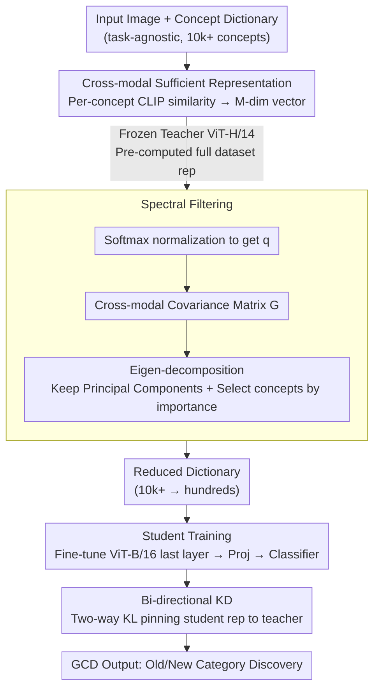

# SpectralGCD: Spectral Concept Selection and Cross-modal Representation Learning for Generalized Category Discovery

**Conference**: ICLR 2026  
**arXiv**: [2602.17395](https://arxiv.org/abs/2602.17395)

**Code**: [GitHub](https://github.com/miccunifi/SpectralGCD)

**Area**: Category Discovery/Multimodal Learning  
**Keywords**: Generalized Category Discovery, CLIP, Cross-modal Representations, Spectral Filtering, Concept Dictionary, Knowledge Distillation

## TL;DR

Ours proposes SpectralGCD, which represents images as semantic mixtures (cross-modal similarity vectors) over a CLIP concept dictionary. It automatically selects task-relevant concepts through spectral filtering and maintains semantic quality via bi-directional knowledge distillation. It achieves multimodal SOTA across six benchmarks with computational costs comparable to unimodal methods.

## Background & Motivation

**Generalized Category Discovery (GCD)**: GCD aims to discover new categories from unlabeled data by leveraging a labeled subset of known classes. Unlike Novel Category Discovery (NCD), the unlabeled data in GCD contains both known (Old) and unknown (New) classes, making it more aligned with real-world scenarios.

**Limitations of Unimodal Methods**: Parametric classifier methods, represented by SimGCD, are trained directly on visual features and prone to overfitting on spurious visual cues (e.g., backgrounds) of old classes. This leads to an imbalance in Old/New performance—achieving high accuracy on old classes but poor performance on new ones.

**Costs of Multimodal Methods**: TextGCD and GET significantly improve performance by introducing CLIP textual information. However, TextGCD requires LLMs for description generation and separate training of image/text encoders, while GET requires training an inversion network. Their computational costs are substantially higher than unimodal methods.

**Deficiencies in Independent Modality Processing**: Existing multimodal GCD methods input visual and textual modalities into separate classifiers independently, failing to fully exploit CLIP’s inherent cross-modal alignment capabilities.

**Inspiration from Probabilistic Topic Models**: Analogous to "document = mixture of topics" in LDA, this paper proposes "image = mixture of semantic concepts"—using CLIP image-text similarity directly as a unified cross-modal representation.

**Practical Deployment Requirements**: In practice, discovery processes need periodic re-runs as new data arrives. Thus, computational efficiency is critical; the high cost of current multimodal methods limits their utility.

## Method

### Overall Architecture

SpectralGCD represents each image as a "semantic mixture" over a CLIP concept dictionary—namely, a image-text similarity vector. The process follows two steps: first, a frozen strong teacher automatically selects a task-relevant concept subset from a massive dictionary (spectral filtering); then, a lightweight student classifier is trained on this compact representation, using bi-directional distillation to prevent semantic drift during training. Since both steps use pre-computed cross-modal representations from the teacher, the overall computational cost is comparable to pure-vision unimodal methods.

### Key Designs

**1. Cross-modal Sufficient Representation: Translating images into concept coordinates to provide pure semantics to the classifier**

The pain point of GCD is that classifiers directly consuming raw visual features tend to memorize spurious cues like backgrounds for old classes, leading to poor generalization on new classes. SpectralGCD adopts an alternative representation: for image $x_i$ and concept dictionary $\bar{\mathcal{C}} = \{c_j\}_{j=1}^M$, it computes the per-concept CLIP image-text cosine similarity divided by temperature $\tau$, yielding an $M$-dimensional vector $z_{\theta,\phi}(x_i; \bar{\mathcal{C}}) = \left[\frac{f_\theta(x_i)^\top g_\phi(c_j)}{\|f_\theta(x_i)\| \|g_\phi(c_j)\|} \cdot \frac{1}{\tau} \mid c_j \in \bar{\mathcal{C}}\right] \in \mathbb{R}^M$. Each dimension represents the alignment between the image and a specific concept. This vector approximates a "sufficient representation": if categories truly depend only on semantic concepts, then $p(y|x) = p(y|z(x;\mathcal{C}))$, meaning optimal prediction is possible using only concept coordinates without raw pixels. During training, a linear projection $u_i = W^\top z_{\theta,\phi}(x_i; \bar{\mathcal{C}})$ reduces dimensionality before entering the parametric classifier $p_i = L_\psi(u_i)$. Because the coordinate axes are human-readable semantic concepts, the model cannot easily exploit background textures, significantly boosting performance on new classes.

**2. Spectral Filtering: Using the covariance spectrum to automatically prune irrelevant concepts**

Dictionaries often contain tens of thousands of concepts, most of which are irrelevant to the current task. Keeping all of them is slow and introduces noise. SpectralGCD uses a frozen teacher (ViT-H/14) to pre-compute representations for the whole dataset. After softmax normalization (denoted as $q_i$), it constructs the covariance matrix $G = \frac{1}{N-1} \sum_{i=1}^N (q_i - \mu)(q_i - \mu)^\top \in \mathbb{R}^{M \times M}$ and performs eigenvalue decomposition. The results serve two purposes: noise filtering, retaining only the top $k^*$ principal components that reach cumulative explained variance $\beta_e$ (default 0.95); and concept importance selection, scoring concepts by $s = \sum_{i=1}^{k^*} \lambda_i v_i^2$ (where $\lambda_i, v_i$ are eigenvalues and eigenvectors), retaining a subset $\hat{\mathcal{C}}$ reaching cumulative importance $\beta_c$ (default 0.99). This works because softmax amplifies foreground concepts and suppresses background noise; when combined with CLIP’s preference for object semantics, the principal eigenvectors naturally align with task-relevant object concepts—this shares the same mathematical justification as PCA or LSA for selecting topical words. On Stanford Cars, 196 classes result in 200–450 selected concepts; CIFAR-100's 100 classes result in 1000–4000.

**3. Bi-directional Knowledge Distillation: Using two-way KL to pin student representations to the teacher and prevent semantic drift**

Fine-tuning can cause the student's cross-modal representations to deviate from clean semantics during joint optimization, diluting the benefits of spectral filtering. SpectralGCD uses pre-computed teacher representations for bi-directional distillation: $\mathcal{L}_{\text{kd}} = \underbrace{-\frac{1}{|\mathcal{B}|}\sum_{i \in \mathcal{B}} \sigma(\hat{z}_i^*) \log \sigma(\hat{z}_i)}_{\text{Forward}} + \underbrace{-\frac{1}{|\mathcal{B}|}\sum_{i \in \mathcal{B}} \sigma(\hat{z}_i) \log \sigma(\hat{z}_i^*)}_{\text{Reverse}}$, where $\hat{z}_i^*$ is the teacher and $\hat{z}_i$ is the student. The forward term aligns the student with the teacher's distribution, while the reverse term penalizes the student for assigning mass to concepts the teacher deems irrelevant. This two-way constraint ensures tighter alignment. Ablations show both are necessary: without distillation, representation consistency (Spearman ρ) is 0.487 and All accuracy is 77.4%; with both, ρ rises to 0.665 and accuracy to 89.1%. Since teacher representations are pre-computed and reusable, distillation adds negligible training overhead.

### Loss & Training

The total objective sums three loss types: $\mathcal{L} = \mathcal{L}_{\text{cls}} + \mathcal{L}_{\text{c}} + \mathcal{L}_{\text{kd}}$. $\mathcal{L}_{\text{cls}}$ includes supervised and unsupervised classification losses, $\mathcal{L}_{\text{c}}$ includes supervised and unsupervised contrastive losses, and $\mathcal{L}_{\text{kd}}$ is the bi-directional distillation. The training strategy involves fine-tuning only the last transformer block of ViT-B/16, with the text encoder frozen and teacher representations pre-computed, allowing overall efficiency to match unimodal methods.

## Key Experimental Results

### Table 1: Comprehensive Comparison with SOTA (Accuracy %)

| Method | Type | CUB All | CUB New | Cars All | Cars New | Aircraft All | IN-100 All |
|------|------|---------|---------|----------|----------|-------------|-----------|
| SimGCD | Unimodal | 60.3 | 57.7 | 53.8 | 45.0 | 54.2 | 83.0 |
| SelEx | Unimodal | 73.6 | 72.8 | 58.5 | 50.3 | 57.1 | 83.1 |
| DebGCD | Unimodal | 66.3 | 63.5 | 65.3 | 57.4 | 61.7 | 85.9 |
| GET | Multimodal | 77.0 | 76.4 | 78.5 | 74.5 | 58.9 | 91.7 |
| TextGCD | Multimodal | 76.6 | 74.7 | 86.9 | 86.7 | 50.8 | 88.0 |
| **SpectralGCD** | **Multimodal** | **79.2** | **78.5** | **89.1** | **87.4** | **63.0** | **93.4** |

### Table 2: Ablation of Distillation Types (Stanford Cars)

| Distillation Loss | Spearman ρ | All Accuracy |
|----------|-----------|----------|
| FD + RD | 0.665±0.09 | **89.1** |
| FD only | 0.639±0.11 | 86.0 |
| RD only | 0.611±0.11 | 87.5 |
| No KD | 0.487±0.15 | 77.4 |

### Table 3: Robustness to Dictionary Selection (Stanford Cars / CIFAR-100)

| Method | Dictionary | Cars All | CIFAR100 All |
|------|------|----------|-------------|
| TextGCD* | OpenImagesV7 | 78.1 | 82.6 |
| TextGCD* | Tags | 86.2 | 84.3 |
| SpectralGCD | OpenImagesV7 | 85.8 | 84.9 |
| SpectralGCD | Tags | **89.1** | **86.1** |

## Key Findings

- **Cross-modal representations significantly boost performance on new classes**: Compared to pure visual features, cross-modal representations show a massive gain in the New class category, effectively mitigating overfitting to spurious old-class cues. SpectralGCD achieves 78.5% on CUB New, far exceeding SimGCD's 57.7%.

- **Small student outperforms large teacher**: Although the student model (ViT-B/16) is much smaller than the teacher (ViT-H/14), SpectralGCD outperforms the teacher's zero-shot performance on several benchmarks (e.g., +6.6 points on ImageNet-100), proving the method's value beyond model scale.

- **Spectral filtering is critical for fine-grained datasets**: On Stanford Cars (196 classes, selecting 200-450 concepts), spectral filtering yields significant gains. On CIFAR-100 (100 classes, selecting 1000-4000 concepts), the effect is more moderate.

- **Bi-directional distillation is essential**: All accuracy is only 77.4% without distillation, rising to 89.1% with FD+RD. Spearman correlation increases from 0.487 to 0.665, confirming distillation effectively maintains teacher-student consistency.

- **Training efficiency matches unimodal methods**: On CUB, SpectralGCD's training time is comparable to unimodal SimGCD and significantly lower than GET (which requires 3121s for preparation) and TextGCD.

## Highlights & Insights

- **Elegant analogy of "Image = Mixture of Concepts"**: The migration from probabilistic topic models to visual concept representation is natural and provides a solid theoretical motivation.

- **Unified cross-modal representation vs. independent modalities**: Instead of processing vision and text separately and then fusing them, using image-text similarity directly as a unified representation is simple yet effective.

- **Information-theoretic basis of spectral filtering**: The eigen-decomposition of the covariance matrix provides an LSA/PCA-style interpretation—this is mathematically grounded information selection rather than a black-box choice.

- **Balance of efficiency and performance**: By once-off pre-computing teacher representations, freezing the text encoder, and fine-tuning only the last transformer block, the method is highly deployment-friendly.

## Limitations & Future Work

- **Dependency on teacher and dictionary**: Performance is constrained by the teacher's quality and the dictionary's coverage. If the teacher lacks domain knowledge or the dictionary misses key concepts, performance drops. Table 4 shows CUB All is only 72.7% when using ViT-B/16 as a teacher, compared to 79.2% with ViT-H/14.

- **Global vs. image-specific concept dictionaries**: The current dictionary is global per dataset. It does not adapt to individual images, potentially missing concepts important for specific images but globally insignificant.

- **Prior knowledge of category count**: Like most GCD methods, it requires a predefined $K$, which might be hard to determine in real-world applications.

- **Sensitivity to spectral filtering thresholds**: While default values $\beta_e=0.95, \beta_c=0.99$ work across most datasets, optimal values may vary.

## Related Work & Insights

- **vs. TextGCD**: TextGCD (Tags+Attributes) achieves 86.9% All on Stanford Cars; SpectralGCD reaches 89.1% (+2.2) using only Tags. TextGCD requires additional LLM attribute generation and separate encoders, while SpectralGCD's unified representation is more efficient.

- **vs. GET**: GET uses an inversion network to map image features to text tokens, requiring 3121s for preparation. SpectralGCD's spectral filtering takes only 194s and exceeds GET by 1.7 points on ImageNet-100 (93.4 vs 91.7).

- **vs. SimGCD**: SimGCD is a classic unimodal parametric classifier with high efficiency but is limited by pure visual representations. SpectralGCD maintains similar efficiency while achieving significant gains on New classes (CUB: 78.5 vs 57.7).

## Rating

- Novelty: ⭐⭐⭐⭐ Innovative combination of cross-modal concept mixtures and spectral filtering; strong analogy to topic models.
- Experimental Thoroughness: ⭐⭐⭐⭐⭐ 6 benchmarks, multiple baselines, efficiency analysis, and extensive ablations (distillation/dictionary/teacher/student/thresholds/splits).
- Writing Quality: ⭐⭐⭐⭐ Clear theoretical motivation from sufficient representations; structured method descriptions and intuitive figures.
- Value: ⭐⭐⭐⭐ Advances both the performance and efficiency frontiers of GCD, with broad implications for multimodal representation and concept selection.

<!-- RELATED:START -->

## Related Papers

- [\[CVPR 2026\] Multi-Modal Representation Learning via Semi-Supervised Rate Reduction for Generalized Category Discovery](../../CVPR2026/multimodal_vlm/multi-modal_representation_learning_via_semi-supervised_rate_reduction_for_gener.md)
- [\[ICLR 2026\] Exploring Cross-Modal Flows for Few-Shot Learning](exploring_cross-modal_flows_for_few-shot_learning.md)
- [\[ICLR 2026\] DecAlign: Hierarchical Cross-Modal Alignment for Decoupled Multimodal Representation Learning](decalign_hierarchical_cross-modal_alignment_for_decoupled_multimodal_representat.md)
- [\[ACL 2026\] Cross-Modal Masked Compositional Concept Modeling for Enhancing Visio-Linguistic Compositionality](../../ACL2026/multimodal_vlm/cross-modal_masked_compositional_concept_modeling_for_enhancing_visio-linguistic.md)
- [\[ICLR 2026\] Delving into Spectral Clustering with Vision-Language Representations](delving_into_spectral_clustering_with_vision-language_representations.md)

<!-- RELATED:END -->
