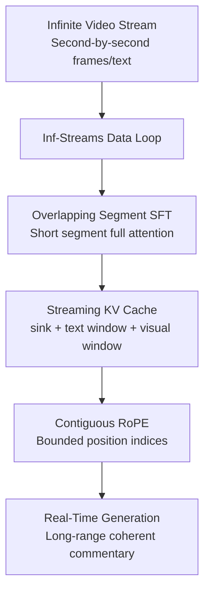

# StreamingVLM: Real-Time Understanding for Infinite Video Streams

**Conference**: ICLR2026  
**OpenReview**: [https://openreview.net/forum?id=gVbPWbA97s](https://openreview.net/forum?id=gVbPWbA97s)  
**Code**: https://github.com/mit-han-lab/streaming-vlm  
**Area**: Multimodal VLM / Streaming Video Understanding  
**Keywords**: Streaming VLM, Infinite Video, KV Cache, Contiguous RoPE, Real-Time Commentary  

## TL;DR
StreamingVLM utilizes a unified framework of "overlapping short segments during training and reusing compact KV cache during inference," enabling 7B-class VLMs to maintain low latency, long-range memory, and second-level real-time commentary capabilities over hours of video streams.

## Background & Motivation
**Background**: Video VLMs are evolving from offline short video QA toward continuous perception scenarios such as real-time assistants, embodied AI, and autonomous driving. Traditional video VLMs typically encode a finite video segment to answer questions at once or process videos in disjoint chunks. While effective for videos spanning tens of seconds to minutes, these methods struggle with "always-on" real-world video streams.

**Limitations of Prior Work**: Directly applying full attention to an entire video causes visual and text tokens to accumulate over time, leading to memory and computation explosion. Moreover, positional encodings eventually exceed the range seen during training. While simple sliding windows limit context length, non-overlapping windows frequently lose context, causing incoherent commentary, while overlapping windows require repeated recomputation of historical tokens, failing to meet real-time latency demands.

**Key Challenge**: Real-time video understanding requires three simultaneous capabilities: retaining enough history to know "what just happened," perceiving recent frames to know "what is happening now," and keeping per-step latency within a fixed budget. Existing solutions usually trade off among these: they are either slow with more memory, fast with "amnesia," or suffer from a mismatch between training and inference attention patterns.

**Goal**: The authors aim to transform VLMs into truly streamable systems. The input consists of continuous video frames and historical text, while the output is a real-time commentary generated over time. The model needs to operate stably on long videos (over 2 hours) and achieve real-time processing speeds of up to 8 FPS on a single H100.

**Key Insight**: A critical observation is that long-video inference does not necessarily require retaining all historical visual tokens. For streaming tasks like sports commentary, a few stable anchors, a relatively long text history, and a short recent visual window are sufficient. If the model is trained to handle this "recent visual + historical text" context structure, inference no longer needs to rely on expensive full recomputation.

**Core Idea**: StreamingVLM uses SFT on overlapping short segments with full attention to simulate the inference-stage attention sink + sliding window structure. It then employs a reusable KV cache and contiguous RoPE during inference to fix the context length, transforming the infinite video stream into a stable, finite context update problem.

## Method

### Overall Architecture
The workflow of StreamingVLM is divided into training, data, and inference pipelines. First, second-level aligned vision-commentary data is constructed from long-duration sports videos. Then, overlapping segment SFT is used to teach the model streaming context. Finally, during inference, only the KV states of the attention sink, recent text window, and recent visual window are retained. This allows the model to update a compact cache for each new video segment instead of re-processing the entire history.

The framework consists of four main components: Streaming KV Cache (what to keep/discard), Contiguous RoPE (maintaining positional stability after discarding tokens), Overlapping Segment SFT (aligning training with inference), and the Inf-Streams Data Loop (providing dense training signals).

### Key Designs
**1. Streaming KV Cache: Compressing Infinite History into Reusable Context**

StreamingVLM avoids recomputing historical tokens for every sliding window by maintaining a compact KV cache. This cache consists of three parts: attention-sink text tokens of length $T_{sink}$, recent text tokens of length $T_{window}$, and visual tokens covering the last $V_{window}$ seconds. In the default configuration, the system retains 512 sink tokens, 512 recent text tokens, and a 16-second visual window.

This design mirrors the memory structure of the task itself. Sports commentary requires knowledge of the opening, scores, and previous statements, making text history more valuable than visual history. Conversely, visual content changes rapidly, and older frames rarely influence current output, allowing old visual tokens to be evicted first. This prevents "amnesia" at chunk boundaries and avoids redundant computation of overlapping sections.

**2. Contiguous RoPE: Maintaining Positional Distribution Stability after Eviction**

A subtle issue arises when the KV cache retains only a finite window: if RoPE positions for new tokens continue to grow infinitely with real time, the model soon encounters indices far beyond the training range. Simply resetting positions breaks the relative relationship between retained and new tokens. StreamingVLM employs contiguous RoPE: when old tokens are evicted, the positions of subsequent and new tokens are shifted left as a whole, keeping the indices of the retained sequence continuous.

Consequently, the effective RoPE indices roll within a fixed range. For models like Qwen-VL that use 3D positional encoding, this idea is extended to the time, height, and width dimensions of visual tokens. Time indices are shifted left with the window to remain continuous, explaining why contiguous RoPE is significantly more stable on infinite streams than native RoPE.

**3. Overlapping Segment SFT: Training for Streaming Inference Habits**

Training on hours of video with full attention is computationally prohibitive. StreamingVLM decomposes long videos into segments of length $W$ seconds with an overlap of $O$ seconds. Full attention is used within each segment. In the SFT experiments, $W=24s$ and $O=12s$. Visual and text tokens are interleaved at 1-second intervals, contrary to the common practice of placing all visual tokens before text.

This strategy approximates the inference context without using sparse masks during training. The overlap provides historical context (sink and recent text) and visual continuity. The model learns a structure of "context from the previous segment + current visual changes + current text output," preventing a loss of synchronization with the time stream during inference with a fixed KV cache.

**4. Inf-Streams Data Loop: Learning When to Speak and When to Stay Silent**

The paper also introduces data tailored for streaming commentary. Over 6,000 hours of English sports videos (basketball, football, etc.) were collected. ASR was performed using WhisperX, followed by GPT-5 cleaning to retain actual commentary while correcting errors in player names and removing advertisements. This resulted in 2,449 full matches and 525K streaming SFT samples.

The key is second-level vision-text alignment. Every second in training has a slot: if there is commentary, the text is predicted; otherwise, a placeholder `...` is inserted. This teaches the model the rhythm of real-time commentary: staying silent when visual changes are trivial and outputting immediately during key actions. High-quality annealing data (14,786 samples) further hones the quality of action-focused commentary.

### Mechanism Example
Assume the model is watching a 2-hour football match. At the start, system prompts and early text enter the attention sink. By 03:30, the 16s visual window captures a penalty setup, and the text window contains context like "Portugal attacking" and "Ronaldo standing at the spot." The model generates "Ronaldo against David De Gea. A heart-stopping penalty." and appends it to the history.

By 91:31, early visual frames are long gone, but the text history and sink maintain knowledge of the teams, score trends, and prior events. When a goal occurs, StreamingVLM generates long-range consistent commentary like "Portugal got three points with Ronaldo's three goals!" without re-watching the whole match or recomputing old tokens, relying on bounded contiguous RoPE positions.

### Loss & Training
The training primarily involves supervised fine-tuning. Initialized from Qwen2.5-VL-Instruct-7B, Phase 1 uses 525K Inf-Streams-Train and 526K LiveCC-WhisperX samples. Phase 2 uses 14K high-quality annealing samples. Total cost is approximately 128 H100-days.

Loss is calculated only on text positions; visual tokens serve as context. The `...` placeholder prevents the model from feeling forced to output every second. While full attention is used within training segments, the data organization simulates the sink/window structure found during inference.

## Key Experimental Results

### Main Results
The experiments cover streaming captioning/commentary and general video VQA. Captioning is evaluated on Inf-Streams-Eval and LiveCC-Sports-3K CC via win rates, while VQA is tested on MVBench, VideoMME, etc.

| Task / Dataset | Baselines | StreamingVLM Result | Baseline Result/Notes | Conclusion |
|--------|------|------|----------|------|
| Inf-Streams-Eval | vs GPT-4o mini chunk | 66.18 win rate | GPT-4o mini chunk-based | Ours wins in infinite mode |
| Inf-Streams-Eval | vs LiveCC chunk | 87.81 win rate | LiveCC chunk restricted | Superior long-range coherence |
| Inf-Streams-Eval | vs LiveCC infinite | 99.12 win rate | LiveCC infinite lacks memory | Comprehensive win |
| LiveCC-Sports-3K CC | vs LiveCC | 56.19 win rate | LiveCC is specialized | Better generalization |
| LongVideoBench | Accuracy | 59.00 | Qwen2.5-VL-7B: 54.70 | Gain +4.30 without VQA SFT |
| OVOBench Realtime | Accuracy | 61.96 | Qwen2.5-VL-7B: 56.00 | Gain +5.96 in perception |

StreamingVLM does not just excel at sports lingo; it improves general video VQA and real-time understanding. Gains in LongVideoBench suggest that overlapping segment SFT helps models utilize temporal continuity without sacrificing base abilities.

### Ablation Study
| Configuration | Key Metric | Notes |
|------|---------|------|
| Native RoPE chunk 100s | vs GPT-4o mini 63.23 | Chunking avoids out-of-distribution positions but hurts long memory |
| Native RoPE infinite | vs GPT-4o mini 25.09 | Infinite position indices cause severe performance collapse |
| Contiguous RoPE infinite | vs GPT-4o mini 66.18 | Bounded positions support infinite stream inference |
| $V_{window}=0s$ | vs GPT-4o mini 52.90 | No recent visual awareness causes significant drops |
| $V_{window}=16s$ | vs GPT-4o mini 66.18 | Balanced spot for action coverage and efficiency |
| + Inf-Streams-Train | vs GPT-4o mini 63.46 | Overlapping SFT provides the largest jump in ability |

### Key Findings
- The structural gain comes from training-inference alignment. Post-hoc KV eviction (like ReKV) on vanilla models fails to provide real-time commentary and can even break output stability.
- **Contiguous RoPE** is the stabilizer for infinite streams. Native RoPE's win rate drops from 63.23 to 25.09 in infinite mode, proving positional extrapolation is a primary cause of long-video failure.
- The visual window has diminishing returns. 0s is poor, 1s to 16s shows steady improvement, but 32s provides no further gains. 16s covers most sports action contexts while maintaining fixed latency.

## Highlights & Insights
- Decomposing "infinite video" into "finite KV state updates" is a highly practical contribution. It acknowledges the differing value of visual vs. text history, using an asymmetric retention strategy for deployment.
- The training strategy is elegant: it uses short segment full attention without complex sparse attention training, instead relying on data layout and loss positions to habituate the model to inference conditions.
- Contiguous RoPE is a portable trick for any cross-modal long-stream task requiring KV eviction to avoid out-of-distribution positional indices.

## Limitations & Future Work
- Data is domain-specific (English sports). Rhythm and styles for surveillance, surgery, or driving may differ. Cross-domain streaming data is a future bottleneck.
- Reliance on historical text as memory means hallucinations may propagate. Error correction mechanisms were not extensively discussed.
- The use of GPT-5 as a judge for pairwise win rates may favor fluency over factual correctness.
- Efficiency was demonstrated on 7B models with H100s; smaller edge devices or multi-camera setups would require re-tuning window and cache strategies.

## Related Work & Insights
- **vs Full Attention Video VLMs**: Full attention is information-complete but computationally uncontrollable. StreamingVLM sacrifices old visual details for stable real-time inference.
- **vs StreamingLLM**: StreamingLLM solves infinite text generation; StreamingVLM migrates the sink/window concept to interleaved visual-language inputs and handles 3D RoPE continuity.
- **vs LiveCC / VideoLLM-online**: While previous works moved toward live interaction, StreamingVLM more systematically unifies training data, positional encoding, and inference cache for truly long videos.

## Rating
- **Novelty**: ⭐⭐⭐⭐☆ Combines attention sink, KV reuse, and contiguous RoPE for streaming VLMs effectively.
- **Experimental Thoroughness**: ⭐⭐⭐⭐⭐ Comprehensive ablations on ROPE, windows, and data.
- **Writing Quality**: ⭐⭐⭐⭐☆ Clear logic; good visualizations of motivation.
- **Value**: ⭐⭐⭐⭐⭐ Directly addresses bottlenecks in real-time video assistants with high reusability.

<!-- RELATED:START -->

## Related Papers

- [\[ICLR 2026\] WorldSense: Evaluating Real-World Omnimodal Understanding for Multimodal LLMs](worldsense_evaluating_real-world_omnimodal_understanding_for_multimodal_llms.md)
- [\[ACL 2026\] Hybrid Autoregressive-Diffusion Model for Real-Time Sign Language Production](../../ACL2026/multimodal_vlm/hybrid_autoregressive-diffusion_model_for_real-time_sign_language_production.md)
- [\[ICLR 2026\] Can Vision-Language Models Answer Face to Face Questions in the Real-World?](can_vision-language_models_answer_face_to_face_questions_in_the_real-world.md)
- [\[ICLR 2026\] Long-tailed Test-Time Adaptation for Vision-Language Models](long-tailed_test-time_adaptation_for_vision-language_models.md)
- [\[ICML 2026\] TimeSpot: Benchmarking Geo-Temporal Understanding in Vision-Language Models in Real-World Settings](../../ICML2026/multimodal_vlm/timespot_benchmarking_geo-temporal_understanding_in_vision-language_models_in_re.md)

<!-- RELATED:END -->
