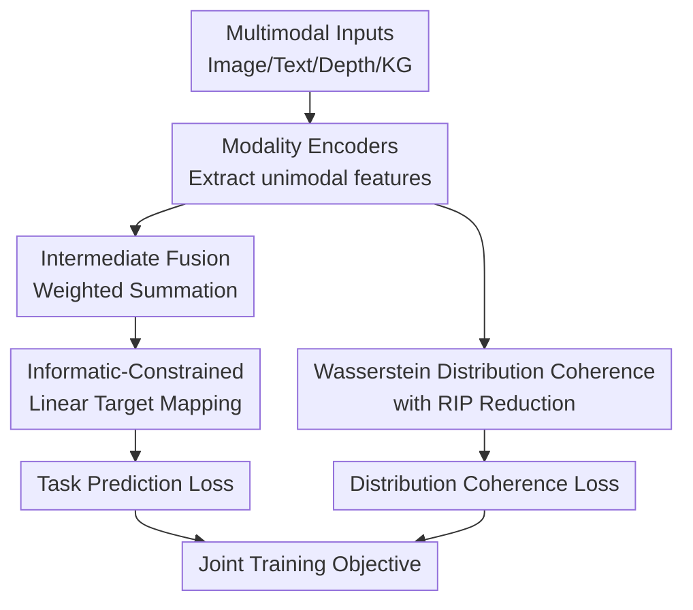

# Supporting Multimodal Intermediate Fusion with Informatic Constraint and Distribution Coherence

**Conference**: ICLR2026  
**OpenReview**: [https://openreview.net/forum?id=5bxmmuRhO6](https://openreview.net/forum?id=5bxmmuRhO6)  
**Code**: Provided in supplementary materials, no public repository found yet  
**Area**: Multimodal Fusion / Multimodal Representation Learning  
**Keywords**: Intermediate Fusion, Informatic Constraint, Distribution Coherence, Wasserstein Distance, Multimodal Generalization  

## TL;DR
This paper re-analyzes the disparity between multimodal Intermediate Fusion (IF) and Late Fusion (LF) from the perspective of generalization error. It proposes IID, which employs informatic constraints to ensure the linear target mapping of IF meets theoretical conditions, and utilizes Wasserstein distribution coherence with RIP dimensionality reduction to mitigate inter-modal distribution misalignment. The approach achieves consistent performance gains in vision-language classification, scene recognition, and multimodal knowledge graph link prediction.

## Background & Motivation
**Background**: Multimodal representation learning typically synthesizes features from various modalities such as images, text, depth maps, and knowledge graphs into a single representation for downstream tasks. Two main fusion paradigms exist: Intermediate Fusion (IF), which merges features in the latent space before applying a unified target mapping, and Late Fusion (LF), which applies separate target mappings to each modality and combines them at the logits or decision level.

**Limitations of Prior Work**: Empirically, IF is often superior because it mixes multimodal information at the representation level. However, most existing provable multimodal generalization analyses are built on the LF framework. This leaves the advantages of IF largely empirical: why IF might generalize better than LF, under what conditions it does so, and how to design an IF method directly guided by theory remain insufficiently answered.

**Key Challenge**: The potential of IF stems from earlier merging of multimodal semantics, but this introduces an easily overlooked issue: inconsistent feature distributions across modalities. If image, text, and fused features originate from significantly different distributions, the unified target mapping—despite sharing parameters—may be hindered by distribution shifts during training. In other words, while IF retains more task-relevant information, it is also exposed to stronger inter-modal distribution incoherence.

**Goal**: The authors aim to address two sub-problems simultaneously. First, to establish clear theoretical conditions under which IF outperforms LF beyond mere empirical substitution. Second, to design trainable modules based on these conditions that nudge IF’s linear target mapping toward a theoretically favorable parameter set while harmonizing multimodal representations at the distribution level.

**Key Insight**: The paper deconstructs IF and LF from a fine-grained perspective: "whether feature dimensions carry task-relevant semantics." Latent features of each modality are partitioned into task-relevant semantic dimensions and task-irrelevant noise dimensions. Fused features in IF are then viewed as combinations of these dimensions. This allows the authors to discuss whether a specific set of parameters exists for a single linear target mapping such that the cross-entropy loss of IF is no higher than that of LF.

**Core Idea**: The empirical advantages of IF are converted into optimizable objectives via "Informatic Constraint + Distribution Coherence." The informatic constraint ensures the linear target mapping satisfies theoretically favorable parameter conditions, while distribution coherence reduces the distribution incoherence term in the generalization error upper bound.

## Method

### Overall Architecture
IID is a general multimodal training framework built upon IF. Given $M$ modal inputs $x_i=\{x_i^1,\cdots,x_i^M\}$ for the $i$-th sample in a batch, the model first extracts unimodal features $z_i^m=h_m(x_i^m)$ using encoders. These are combined via fusion weights $w_m$ through latent-space weighted summation to produce the fused representation $z_i=\sum_m w_m z_i^m$. This representation then enters a linear target mapping $g(\cdot)$ for prediction. During training, two additional regularizers are introduced: the informatic constraint loss $L_{ic}$ and the distribution coherence loss $L_{dc}$.

The core of this framework is not the reinvention of fusion weights, but the integration of existing static or dynamic weighting methods into the IF framework while adding the two theoretically derived constraints. Consequently, the paper implements three versions: IID-L using vanilla late-fusion style static weights, IID-Q reusing dynamic weights from QMF, and IID-P reusing dynamic weights from PDF. This allows for the separation of "fusion weight strategy" from the "contributions of the two proposed modules."

### Key Designs
**1. Informatic-Constrained Linear Target Mapping: Forcing IF Classification Heads into Favorable Parameter Sets**

The paper first proves that within a certain set of linear target mapping parameters $\Lambda$, IF can achieve a cross-entropy loss per sample no higher than LF; furthermore, the generalization error of IF can also be lower than LF. This is an existence result: it shows a favorable category of parameters for IF exists, but training does not automatically guarantee convergence toward this set. Thus, IID requires a computable constraint to push the mapping toward this state.

Directly constraining the parameters is difficult because the theoretical formula requires the individual modal classification losses $L(z_m\theta_m, y)$ of LF, whereas IID is an IF framework that does not explicitly train independent heads. The authors adopt an information-theoretic view: lower cross-entropy usually implies higher mutual information between features and labels. The goal "prediction loss of fused representation is lower than individual modal losses" is rewritten as maximizing $I(z;y)-\sum_m I(z_m;y)$, ensuring the fused representation contains more task-relevant information than single-modality representations.

The final informatic constraint loss is defined in a variational form:

$$
L_{ic}=\sum_i\left(-\log q_\theta(y_i|z_i)+\lambda KL(N_{z_i}\|N)-\sum_m[\log q_\theta(y_i|z_i^m)-\lambda KL(N_{z_i^m}\|N)]\right).
$$

Here $q_\theta(\cdot|\cdot)$ is provided by the linear target mapping. $N_{z}$ is a Gaussian distribution fitted by feature mean and variance, and $N$ is a standard Gaussian. The first part encourages the fused representation to be more informative, while the second part suppresses the ability of unimodal representations to explain labels independently. The KL terms prevent representation collapse.

**2. Wasserstein Distribution Coherence with RIP Reduction: Reducing Distribution Incoherence**

In the second step of theoretical analysis, the authors derive a generalization error bound for IF under $K$-Lipschitz assumptions. This bound includes an empirical error, weight-related error, hypothesis space bias, and a term $\sum_m K\mathbb{E}(w_m)D_M(\mu_m,\mu)$. Here $\mu_m$ is the $m$-th modality feature distribution and $\mu$ is the fused distribution; this term is defined as distribution incoherence. Intuition suggests that if a unimodal distribution is far from the fused distribution, the unified target mapping learned during training is more likely to incur generalization loss on test distributions.

As seeking the Wasserstein barycenter for multimodal distributions is computationally expensive, the paper proves that in standard IF weighted summation, the distance from unimodal distributions to the fused distribution can be upper-bounded by the sum of inter-modal distances. Thus, optimization focuses on minimizing the Wasserstein distance between different modalities.

The challenge lies in computation. Running Sinkhorn directly on high-dimensional features is costly. Sampled Sinkhorn loses information, and Radon transform neural networks lack stability. IID's solution is to transform high-dimensional features into the frequency domain via FFT $\hat z_m=F(z_m)$, retaining the $d_1$ principal components with the largest amplitudes. It then uses a dimensionality reduction matrix $\Psi_m=\Phi F^{-1}$ satisfying the Restricted Isometry Property (RIP) to obtain low-dimensional representations $\tilde z_m=\Psi_m\hat z_m$. RIP preserves the geometric structure between points, ensuring that the Wasserstein distance calculated in low dimensions reflects the distribution differences in the original space.

**3. Relaxed Optimal Transport: Robustness to Reduction Perturbation**

Dimensionality reduction inevitably loses some semantics. Strictly enforcing optimal transport plans to satisfy original marginal distributions makes training over-sensitive to reduction errors. IID introduces a Lagrange-style loose marginal constraint into the Wasserstein estimation:

$$
\widetilde W(\mu_{m_1},\mu_{m_2})=\arg\min_T\sum_{j,k}T_{jk}C_{jk}+\lambda_1[KL(T\mathbf{1}\|u)+KL(T^\top\mathbf{1}\|v)].
$$

$T$ is the transport plan, $C_{jk}$ is the Euclidean distance between low-dimensional features, and $u,v$ are discrete support weights. KL relaxation allows flexibility in matching quality, preventing transport plans from becoming rigid due to frequency domain truncation or random reduction. The final loss is $L_{dc}=\sum_{m_1\ne m_2}\widetilde W(\mu_{m_1},\mu_{m_2})$.

**4. Decoupling from Fusion Weight Strategies**

The paper does not focus on a new fusion weight formula. Instead, it recognizes that existing methods like QMF and PDF have already addressed dynamic weights. IID focuses on the previously neglected distribution incoherence and informatic constraints for IF. This decoupling makes IID a plug-and-play enhancement for existing IF models.

### Mechanism Example
Take multimodal sentiment classification as an example. A sample includes a tweet: "Outcast came out last week. Should you skip it? Our review:" and a corresponding image. BERT encodes the text into $z_{text}$ and ResNet encodes the image into $z_{img}$. Using IID-P, the weights are calculated via PDF’s dynamic weighting (e.g., if the image is noisy, the text weight increases). IF produces $z=w_{text}z_{text}+w_{img}z_{img}$.

Standard IF stops here, but IID adds two actions during training. Informatic constraint ensures $z$ explains the label better than $z_{text}$ or $z_{img}$ alone, preventing the model from relying on unimodal shortcuts. Distribution coherence projects the features into the low-dimensional frequency domain to estimate Wasserstein distance, encouraging the textual and visual representation distributions to align.

### Loss & Training
The total loss for IID consists of three parts:

$$
L_{IID}=\alpha L_{ic}+\beta L_{dc}+\sum_i L(f_{IF}(x_i),y_i).
$$

Hyperparameters $\alpha$ and $\beta$ control the regularization strength. Searches were conducted for $\alpha\in\{1, 0.1, 0.01, 0.001\}$ and $\beta$ in a range from $10^{-10}$ to $10^{-14}$. Optimal combinations varied by dataset (e.g., $\{1, 10^{-12}\}$ for NYU Depth V2).

## Key Experimental Results

### Main Results
The authors validated IID on three task categories across eight datasets: Vision-Language Classification (MVSA-Single, MVSA-Multiple, HFM, Food101), Scene Recognition (NYU Depth V2, SUN RGB-D), and Link Prediction (FB-IMG, WN9-IMG).

| Task / Dataset | Metric | Ours (Best) | Prev. SOTA | Gain |
|--------|------|------|----------|------|
| MVSA-Single | Avg Acc | IID-P 81.13 ± 0.84 | PDF 79.94 ± 0.95 | +1.19 |
| MVSA-Multiple | Avg Acc | IID-P 71.23 ± 0.44 | PDF 69.54 ± 0.25 | +1.69 |
| HFM | Avg Acc | IID-P 86.88 ± 0.39 | PDF 86.03 ± 0.31 | +0.85 |
| Food101 | Avg Acc | IID-P 93.73 ± 0.14 | PDF 93.32 ± 0.22 | +0.41 |
| NYU Depth V2 | Avg Acc | IID-P 72.04 ± 0.55 | PDF 71.37 ± 0.76 | +0.67 |
| SUN RGB-D | Avg Acc | IID-P 62.99 ± 0.24 | PDF 62.34 ± 0.43 | +0.65 |

| Link Prediction | Metric | OTKGE | OTKGE + IID | Gain |
|--------|------|------|----------|------|
| FB-IMG | MRR | 0.843 | 0.855 | +0.012 |
| WN9-IMG | MRR | 0.923 | 0.932 | +0.009 |

### Ablation Study
| Dataset / Version | w/o D | w/o I | Full IID |
|------|---------|------|------|
| MVSA-Single / IID-P | 80.79 | 80.46 | 81.13 |
| MVSA-Multiple / IID-Q | 69.59 | 70.67 | 71.08 |
| NYU Depth V2 / IID-Q | 70.95 | 70.48 | 71.61 |

### Key Findings
- IF itself provides competitive performance: Replacing LF frameworks in QMF/PDF with IF yielded better accuracy across vision-language datasets, justifying the theoretical focus on IF.
- Informatic constraints amplify IF's advantage over LF. Figure 5 shows that adding $L_{ic}$ consistently boosts performance across different weighting strategies.
- Distribution coherence aligns with classification gains. Figure 4 demonstrates that IID-Q reduces the average Wasserstein distance compared to QMF while improving accuracy.
- RIP-based dimensionality reduction effectively balances cost and accuracy. Figure 2 shows it approaches ground-truth Wasserstein distances more closely than sampled Sinkhorn or RTN with limited time overhead.
- Plug-and-play capability: In link prediction tasks, IID enhanced existing IF models like MMKRL and OTKGE.

## Highlights & Insights
- **Theoretically Driven**: The paper targets the theoretical gap for IF by deconstructing IF/LF disparities at the feature dimension level.
- **Clever Informatic Proxy**: Rather than forcing independent LF heads into an IF framework, the authors use mutual information and variational approximation, making the constraint lightweight yet effective.
- **Optimized Distribution Alignment**: Instead of a "naive OT loss," the method combines frequency domain sparsification, RIP reduction, and relaxed marginals to address efficiency and robustness.
- **Isolated Contributions**: By using IID-Q, IID-P, and IID-L alongside their baseline counterparts, the experimental design clearly validates the modular benefits of $L_{ic}$ and $L_{dc}$ independent of weighting logic.

## Limitations & Future Work
- **Idealized Theoretical Conditions**: The existence results for the parameter set $\Lambda$ assume linear mapping; complex nonlinear heads in deep networks may deviate from these assumptions.
- **Approximation Gap**: The shift from cross-entropy to mutual information is a necessary condition approximation. Whether maximizing mutual information always equates to lower IF loss requires deeper inquiry.
- **Hyperparameter Sensitivity**: Regularization coefficients ($\alpha, \beta$) and reduction dimensions ($d_1$) appear sensitive to specific datasets, necessitating validation-set tuning.
- **Task Scope**: The current validation focuses on classification and link prediction. Extensions to generative VLMs or multimodal LLM instruction tuning are yet to be explored.

## Related Work & Insights
- **vs QMF/PDF**: While prior SOTA focused on dynamic weighting strategies to handle low-quality data or covariance, IID improves the structural generalization of IF regardless of the weight formula used.
- **vs Modality-Invariant Methods**: Unlike MISA, which explicitly splits representations, IID acts as a pluggable regularizer during fusion, maintaining a simpler architecture.
- **For Future Work**: In Large Multimodal Models (LMMs), informatic constraints and distribution coherence could potentially be applied at adapters or projection heads rather than relying solely on contrastive alignment or fine-tuning.

## Rating
- Novelty: ⭐⭐⭐⭐☆
- Experimental Thoroughness: ⭐⭐⭐⭐☆
- Writing Quality: ⭐⭐⭐⭐☆
- Value: ⭐⭐⭐⭐☆

<!-- RELATED:START -->

## Related Papers

- [\[ACL 2025\] Enhance Multimodal Consistency and Coherence for Text-Image Plan Generation](../../ACL2025/multimodal_vlm/enhance_multimodal_consistency_and_coherence_for_text-image_plan_generation.md)
- [\[CVPR 2026\] Multimodal Distribution Matching for Vision-Language Dataset Distillation](../../CVPR2026/multimodal_vlm/multimodal_distribution_matching_for_vision-language_dataset_distillation.md)
- [\[CVPR 2026\] Beyond What's Shared: Recovering Lost Unique Information from Intermediate Layers to Boost Multimodal Geo-Foundation Models](../../CVPR2026/multimodal_vlm/beyond_whats_shared_recovering_lost_unique_information_from_intermediate_layers_.md)
- [\[ACL 2025\] CORDIAL: Can Multimodal Large Language Models Effectively Understand Coherence Relations?](../../ACL2025/multimodal_vlm/cordial_can_multimodal_large_language_models_effectively_understand_coherence_re.md)
- [\[CVPR 2026\] The More, the Merrier: Contrastive Fusion for Higher-Order Multimodal Alignment](../../CVPR2026/multimodal_vlm/the_more_the_merrier_contrastive_fusion_for_higher-order_multimodal_alignment.md)

<!-- RELATED:END -->
