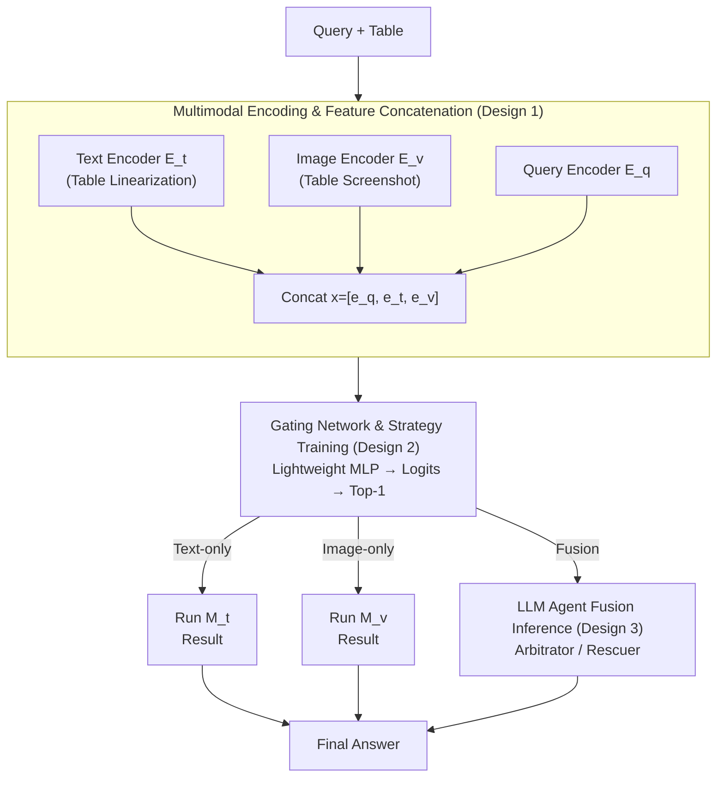

# TableDART: Dynamic Adaptive Multi-Modal Routing for Table Understanding

**Conference**: ICLR 2026  
**arXiv**: [2509.14671](https://arxiv.org/abs/2509.14671)  
**Code**: [GitHub](https://github.com/xiaobo-xing/TableDART)  
**Area**: Multimodal VLM  
**Keywords**: Table Understanding, Dynamic Routing, Multi-modal Fusion, Gating Network, LLM Agent

## TL;DR

TableDART is proposed, which dynamically selects the optimal processing path (Text-only / Image-only / Fusion) for each query-table pair via an MLP gating network with only 2.59M parameters. By reusing frozen unimodal expert models and introducing an LLM Agent for cross-modal fusion, it outperforms the strongest MLLM baseline, HIPPO, by an average of 4.02% across 7 table understanding benchmarks while reducing latency by 24.5%.

## Background & Motivation

**Background**: Table understanding is a core task connecting structured data with natural language. Existing methods follow three paradigms: (1) Table-as-Text—linearizing tables into text sequences for LLM processing, which is effective but loses spatial structure and is sensitive to serialization formats; (2) Table-as-Image—processing via VLM after screenshotting, which preserves structure but has weaker semantic capture; (3) Table-as-Multimodality—fusing text and visual views, such as HIPPO, which jointly processes both representations within an MLLM.

**Limitations of Prior Work**: Although multimodal methods are promising, they face two key limitations: (1) **Static fusion leads to redundancy and conflict**—forcing dual-modal processing for all query-table pairs, even though not all queries require multiple views. Text linearization introduces row-order sensitivity while image representations remain permutation-invariant; conflicting signals can mislead the model. (2) **Prohibitive MLLM finetuning costs**—even with parameter-efficient strategies like LoRA, HIPPO requires 25.87M trainable parameters, 10 times that of TableDART.

**Key Challenge**: The benefit of multimodal fusion stems from information complementarity, but the cost is the introduction of redundancy and potential conflicts. 58.7% of test samples can be correctly answered by both unimodal paths (i.e., "easy samples"). Forced fusion not only wastes computation but may also introduce noise.

**Key Insight**: Since the optimal processing strategy varies across query-table pairs, the system should automatically learn "when to use text, when to use images, and when fusion is necessary." An extremely lightweight routing network can perform instance-level decision-making while completely reusing existing unimodal experts.

**Core Idea**: Replace expensive MLLM finetuning with a 2.59M-parameter MLP gating network to dynamically select the Text-only / Image-only / Fusion path for each query-table pair.

## Method

### Overall Architecture

TableDART addresses the wastefulness of "one-size-fits-all" fusion: existing multimodal methods force a dual text+image path for every query-table pair, yet many queries can be resolved via a single modality. The approach places an extremely lightweight "dispatcher" on top of two frozen unimodal experts to determine the route for each query in real-time.

The system comprises five collaborative components: a Table-as-Text model $\mathcal{M}_t$ (TableGPT2-7B, frozen), a Table-as-Image model $\mathcal{M}_v$ (Ovis2-8B, frozen), a query text embedding model, a lightweight MLP gating network (the only trainable part, 2.59M parameters), and a training-free LLM Agent (Gemini 2.0 Flash, enabled only for the Fusion path). Given a query and a table, three encoders extract the text representation $\mathbf{e}_t$, image representation $\mathbf{e}_v$, and query embedding $\mathbf{e}_q$ in parallel, which are concatenated into $\mathbf{x} = [\mathbf{e}_q, \mathbf{e}_t, \mathbf{e}_v]$ and fed into the gating network. The gate outputs three logits, and the path with the highest score (Text-only / Image-only / Fusion) is executed for final inference. In other words, the routing step only looks at features without full inference, adding negligible overhead.

### Key Designs

**1. Multimodal Encoding and Feature Concatenation: Providing the Gate with a "Full View"**

For the gating network to select the correct path, it must perceive the query, the text view, and the image view simultaneously. The table is serialized as text (fed to encoder $\mathcal{E}_t$ of $\mathcal{M}_t$) and rendered as a screenshot (fed to encoder $\mathcal{E}_v$ of $\mathcal{M}_v$), while the query is encoded by an independent embedding model $\mathcal{E}_q$. These features are pooled and concatenated as $\mathbf{x} = [\mathbf{e}_q, \mathbf{e}_t, \mathbf{e}_v]$. Crucially, only the first few layers of the encoders are used rather than full expert inference—$\mathcal{E}_t$ and $\mathcal{E}_v$ only activate 7.15% and 7.63% of the experts' parameters respectively. Thus, the "full view" comes at a very low cost, providing feature-level representations instead of expensive complete answers.

**2. Gating Network and Strategy Training: Learning "Sufficiency" with Resource-Aware Soft Labels**

The gating network $\mathcal{G}$ is a lightweight MLP that outputs logits $\mathbf{z} = \mathcal{G}(\mathbf{x})$. The training challenge is that if only accuracy is pursued, the model will always choose "Fusion" for safety, reverting to a static, expensive system. TableDART solves this by splitting the objective into a task term and a resource term:

$$\mathcal{L}_{\text{total}} = \mathcal{L}_{\text{task}} + \lambda \mathcal{L}_{\text{resource}}$$

The task term does not use hard classification. Instead, a binary vector $\mathbf{s} \in \{0,1\}^3$ (indicating whether each of the three paths is correct) is pre-computed for each sample and converted into soft targets via temperature-controlled softmax. KL divergence is then used to align the predicted distribution. This allows "multiple paths to be correct simultaneously," which is more realistic than forcing a single choice. The resource term $\mathcal{L}_{\text{resource}} = \text{softmax}(\mathbf{z}/\tau_g)^T \mathbf{c}$ penalizes expensive paths based on empirical inference cost $\mathbf{c}$. This pushes simple samples toward more efficient paths. The trade-off is controlled by $\lambda = 0.15$, achieving a balance between accuracy and latency.

**3. LLM Agent Fusion Inference: Outsourcing Fusion to a Training-Free Agent**

Fusion is triggered only when the gate determines a dual-modal requirement. The system runs $\mathcal{M}_t$ and $\mathcal{M}_v$ in parallel to obtain results $r_t, r_v$ and auxiliary outputs $a_t, a_v$, which are passed with the original table to the Fusion Agent (Gemini 2.0 Flash). Rather than training another MLLM—the source of high costs in methods like HIPPO—a strong off-the-shelf model acts in two roles: as an **Arbitrator** when expert answers conflict (choosing the more reliable one based on confidence) and as a **Rescuer** when both are uncertain (combining evidence to derive a new answer). In experiments, the Rescuer role successfully recovered a significant portion of samples where both unimodal paths failed.

### Loss & Training

The training set comprises 10K mixed samples from 5 table understanding benchmarks. Only the gating network is updated; all large models remain frozen. Correctness $\mathbf{s} \in \{0,1\}^3$ for the three paths is pre-computed as supervision. Temperature $\tau$ adjusts the smoothness of the soft label distribution. During inference, the path with the highest logit is selected deterministically.

## Key Experimental Results

### Main Results

| Method | WTQ | TABMWP | TAT-QA | HiTab | FeTaQA | TabFact | InfoTabs | Avg Acc |
|------|-----|--------|--------|-------|--------|---------|---------|--------|
| TableGPT2-7B (Text) | 61.42 | 83.87 | 50.39 | 70.27 | 28.97 | 77.80 | 71.07 | 69.14 |
| Ovis2-8B (Image) | 58.76 | 87.00 | 47.67 | 68.59 | 34.70 | 80.80 | 74.11 | 69.49 |
| HIPPO-8B (Multimodal) | 55.77 | 87.50 | 60.75 | 63.00 | 33.18 | 82.27 | 75.74 | 70.84 |
| Gemini 2.0 Flash | 63.56 | 46.29 | 35.62 | 60.41 | 10.57 | 81.33 | 54.31 | 56.92 |
| **Ours (TableDART)** | **70.58** | **84.54** | **62.05** | **74.37** | **36.11** | **81.37** | **76.22** | **74.86** |

TableDART achieves an average accuracy of 74.86%, surpassing the strongest multimodal baseline HIPPO-8B by **+4.02%**. Generalization is particularly notable on unseen datasets: TableDART 74.37% vs. HIPPO 63.00% (**+18.05% gain**).

### Ablation Study

| Routing Strategy | WTQ | TABMWP | TAT-QA | HiTab | TabFact | InfoTabs | Note |
|---------|-----|--------|--------|-------|---------|---------|------|
| Random | 65.40 | 75.50 | 58.94 | 70.49 | 79.50 | 69.57 | Ineffective |
| Non-Adaptive Fusion | 70.97 | 81.47 | 63.34 | 73.35 | 81.56 | 76.83 | All paths via Fusion |
| **Dynamic Routing** | **70.58** | **84.54** | **62.05** | **74.37** | **81.37** | **76.22** | Ours |

Dynamic routing outperforms non-adaptive fusion on TABMWP (+3.07) and HiTab (+1.02), demonstrating that forced fusion can introduce noise in simpler datasets. Regarding efficiency, dynamic routing has an average latency of 2.20s vs. 2.92s for non-adaptive fusion, a **24.5% reduction**.

### Key Findings

- **58.7% of samples are "simple":** Both unimodal paths are correct, making forced fusion unnecessary.
- **24.0% of samples exhibit modal complementarity:** 17.2% are correct only via image, 6.8% only via text, validating the need for independent unimodal paths.
- **Fusion "Rescue" success rate is 14%:** Among 17.3% of difficult samples where both unimodal experts failed, the Fusion Agent "rescued" an additional 2.4%.
- **Explainable Routing:** Simple datasets like TABMWP route 97.2% to Image-only, while 88.7% of difficult samples in TAT-QA route to Fusion.

## Highlights & Insights

- **Extreme Training Efficiency:** Surpassing HIPPO (25.87M parameters) with only 2.59M trainable parameters. The core insight is that "routing decisions are more important than modal fusion." This "meta-decision + frozen experts" paradigm is transferable to any multi-expert system.
- **Generalization of Routing Strategy:** Performance is nearly identical on seen and unseen datasets (74.95% vs 74.37%), whereas HIPPO drops from 72.41% to 63.00%. This indicates the gate learns universal routing policies rather than overfitting.
- **Exquisite Training Signal:** Using "independent triple-path correctness pre-computation" as supervision allows for multiple correct paths. Soft labels with KL divergence are more reasonable than hard classification.

## Limitations & Future Work

- **Dependency on External Gemini:** The Fusion path relies on a closed-source API, raising cost and privacy concerns. Exploring open-source LLMs as replacements is necessary.
- **Pre-computation Cost:** Running three inferences for every training sample is expensive, limiting training set scalability.
- **Feature-level Gating:** Current routing is based on shallow encoder features and does not fully utilize high-level semantic complexity.
- **Fixed Path Limitation:** Only three fixed paths are explored; more flexible strategies, such as partial fusion or cascaded inference, remain uninvestigated.

## Related Work & Insights

- **vs. HIPPO**: HIPPO uses static fusion inside the MLLM; TableDART uses external dynamic routing, providing better performance and efficiency (2.59M vs. 25.87M parameters).
- **vs. Mixture-of-Experts (MoE)**: TableDART's approach is similar to MoE but functions at the model level rather than the layer level, using complete frozen models as experts rather than trainable sub-networks.
- **vs. Table-LLaVA/TabPedia**: These methods train on a single visual modality and fail to leverage the complementary advantages of the text modality.

## Rating

- Novelty: ⭐⭐⭐⭐ The combination of instance-level dynamic routing and training-free LLM Agent fusion is novel, though the fundamental concept of dynamic routing is established.
- Experimental Thoroughness: ⭐⭐⭐⭐⭐ Comprehensive across 7 benchmarks, rich ablations, routing analysis, efficiency analysis, and generalization verification.
- Writing Quality: ⭐⭐⭐⭐ Clear structure, strong motivation, and informative visualizations.
- Value: ⭐⭐⭐⭐ Provides a training-efficient multimodal fusion paradigm with broad applicability for table understanding and multi-expert systems.

<!-- RELATED:START -->

## Related Papers

- [\[ICLR 2026\] TABLET: A Large-Scale Dataset for Robust Visual Table Understanding](tablet_a_large-scale_dataset_for_robust_visual_table_understanding.md)
- [\[ICLR 2026\] Multi-modal Data Spectrum: Multi-modal Datasets are Multi-dimensional](multi-modal_data_spectrum_multi-modal_datasets_are_multi-dimensional.md)
- [\[CVPR 2026\] Multi-modal Test-time Adaptation via Adaptive Probabilistic Gaussian Calibration](../../CVPR2026/multimodal_vlm/multi-modal_test-time_adaptation_via_adaptive_probabilistic_gaussian_calibration.md)
- [\[ICML 2026\] Task-Aware Structured Memory for Dynamic Multi-modal In-Context Learning](../../ICML2026/multimodal_vlm/task-aware_structured_memory_for_dynamic_multi-modal_in-context_learning.md)
- [\[AAAI 2026\] TabFlash: Efficient Table Understanding with Progressive Question Conditioning and Token Focusing](../../AAAI2026/multimodal_vlm/tabflash_efficient_table_understanding_with_progressive_question_conditioning_an.md)

<!-- RELATED:END -->
