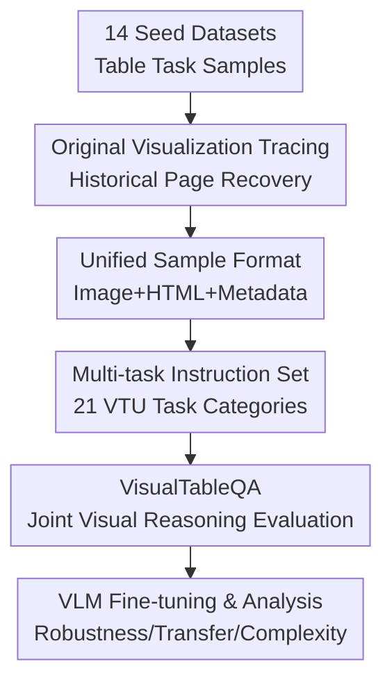

# TABLET: A Large-Scale Dataset for Robust Visual Table Understanding

**Conference**: ICLR 2026  
**OpenReview**: [https://openreview.net/forum?id=5UbeQDlYDj](https://openreview.net/forum?id=5UbeQDlYDj)  
**Paper**: [OpenReview](https://openreview.net/forum?id=5UbeQDlYDj)  
**Code**: https://github.com/alonsoapp/TABLET  
**Area**: Multimodal VLM / Document Intelligence / Visual Table Understanding  
**Keywords**: Visual Table Understanding, Table Datasets, Document Intelligence, Visual Question Answering, Multimodal Training  

## TL;DR
TABLET reorganizes 14 seed datasets for table understanding into 4 million visual table instruction samples. It prioritizes retrieving original table screenshots from actual web pages or documents, enabling VLMs to learn layouts, colors, merged cells, and image cues from real-world tables beyond synthetic renderings.

## Background & Motivation
**Background**: Table understanding has long treated tables as structured text, typically linearizing HTML, Markdown, or graph structures for language models. Recently, the ability of VLMs to directly read screenshots, PDF pages, and web interfaces has made Visual Table Understanding (VTU) a more natural paradigm. For GUI agents, web agents, and document intelligence systems, many tables are provided as pixel inputs, requiring models to understand row-column relationships, visual emphasis, and embedded images from the screen layout.

**Limitations of Prior Work**: Existing VTU training sets and benchmarks often re-render serialized tables into synthetic images with a uniform style. While scalable, this erases critical cues found in real tables, such as irregular headers, multi-row/column spans, background colors, font variations, thin borders, icons, and image cells. Models trained on such data learn visual patterns of "clean HTML tables" but face significant train-test mismatch when encountering real Wikipedia tables, scientific papers, or mathematical tables.

**Key Challenge**: Table tasks require scale and diversity, but visual robustness depends on authentic visualization. Relying solely on real screenshots makes it difficult to cover enough tasks, while relying solely on synthetic rendering fails to train models on real visual styles. The core problem of TABLET is how to re-align existing table tasks with real table images without re-labeling millions of samples.

**Goal**: Ours does not propose a specific model but constructs a trainable, evaluable, and scalable large-scale VTU resource. This resource satisfies four requirements: preserving original table visuals, covering multiple table tasks, maintaining traceable source data identifiers, and providing a new benchmark that necessitates joint visual and tabular reasoning.

**Key Insight**: Many classic table datasets originate from Wikipedia or document collections. Although they are usually released only with serialized tables or task samples, original historical versions of web pages can still be retrieved via page IDs, revision IDs, or dataset metadata. Ours leverages this to relink "old table tasks" to the "real table visualizations existing at that time," packaging them into unified VLM instruction data.

**Core Idea**: TABLET utilizes a "source data tracing + historical page recovery + dual original screenshot/HTML representation" approach to upgrade existing table understanding tasks into a real visual table training set. VisualTableQA is used to verify whether models truly utilize visual cues alongside table structures.

## Method

### Overall Architecture
The mechanism of TABLET can be understood as a data reconstruction pipeline: task samples are collected from 14 existing table understanding datasets, and corresponding original tables are traced for each sample to recover real visualizations from historical pages or documents. If recovery fails, it falls back to synthetic rendering. Finally, all tasks are unified into an instruction format, and VisualTableQA is constructed to test whether visual cues are actually utilized by the model.

The key to this process is not merely "storing table screenshots" but ensuring each training sample simultaneously possesses images, HTML, task instructions, answers, and source data identifiers. This allows subsequent researchers to train VLMs, re-render tables, rewrite prompts, perform cell highlighting/localization, or construct new tasks.

### Key Designs
**1. Original Visualization Tracing: Reconnecting Old Table Tasks to Real-World Tables**

The biggest gap in existing visual table data is the difficulty in balancing sample scale with visual authenticity. TABLET's approach is not to re-annotate 4 million tasks but to reuse semantic supervision from existing tasks while retrieving their original visuals. For tables from Wikipedia, the authors restore the page using Wikipedia's historical archive API based on the crawl time, page identifier, and revision information from the seed datasets, then perform matching across multiple tables on the page.

During matching, candidate tables and seed tables are converted to Markdown-like representations, and Levenshtein edit distance is used to measure similarity with a minimum threshold of 0.7. The intuition is specific: Wikipedia pages change constantly, making perfect matches unrealistic; however, if similarity is too low, binding the wrong table screenshot would pollute the supervision signal. TABLET falls back to synthetic rendering only when reliable matching is impossible, prioritizing real images.

**2. Unified Sample Format: More Than Just Images and Fixed Prompts**

Many image-based table datasets only release fixed screenshots and questions, making it difficult for researchers to know the origins or to re-highlight cells and rewrite instructions. TABLET preserves fields for each sample including instruction, output, table image path, raw/highlighted HTML, source data example ID, table ID, Wikipedia page ID, oldid, task type, and data split. This design makes TABLET a modular data foundation rather than a one-time benchmark.

HTML representation is particularly important. For tasks like ToTTo and TURL that rely on highlighted cells or columns, models might bypass the image and answer directly if they only see highlighted values in the prompt. The authors reverse-lookup the corresponding cells in the original table via HTML to generate explicitly highlighted versions of real visualizations, ensuring the supervision signal remains tied to the image. This transforms the training objective from "reading values in the prompt" to "localizing emphasized structures in the table image to complete downstream tasks."

**3. Multi-task Visual Table Collection: Training General VTU Capabilities via Diversity**

TABLET covers 21 categories of tasks from 14 seed datasets, totaling 4,066,851 samples and 2,031,256 unique table images. The scope includes column type annotation, entity linking, relation extraction, structure-aware parsing, table QA, table-to-text, numerical reasoning, fact verification, cell extraction, merged cell detection, and table recognition. This combination allows VLMs to simultaneously learn three capabilities: perceiving table structure, understanding content, and mapping content to natural language or JSON answers.

Different scales of training sets were designed: TABLET-L (the largest version with 3,419,176 samples), TABLET-M (sampling up to 140k per task for a balanced 1,031,082 samples), and TABLET-S (removing Table Interpretation tasks like column typing to keep 690,467 samples). This setup decouples the testing of "whether bigger is better" from "whether basic table interpretation tasks help."

**4. VisualTableQA & Visual Complexity: Focusing Evaluation on Visually Dependent Tables**

While many tasks in TABLET use visually complex tables, answers can sometimes be derived from pure text content. To test if models truly utilize visual cues, VisualTableQA was constructed: annotators selected tables with high visual complexity and posed questions that require joint visual and structural reasoning (e.g., determining if a person is in military uniform based on cell images, finding a team based on gray rows, or selecting entries based on background color). To prevent these from being solved by synthetic tables or text, samples solvable via lossy synthetic representations were filtered out.

A visual complexity metric combines HTML structural features and image features into a score $S \in [0, 1]$. Structural metrics include colspan/rowspan irregularity, color diversity, font diversity, and embedded image ratios. Visual metrics include grayscale entropy, RGB color complexity, Sobel edge irregularity, saturation, and non-white background ratios. The final score is a weighted sum $S = \sum_k w_k S_k$, where span irregularity, color diversity, and visual entropy carry higher weights. This allows for binning by visual difficulty to observe model degradation.

### Design Motivation Example
Consider a ToTTo sample requiring a sentence generation based on highlighted cells in a Wikipedia table. Traditionally, a uniform synthetic image would be generated, showing a clean grid. TABLET first finds the corresponding Wikipedia historical version based on the page title, section, source table ID, and crawl time. It then selects the candidate table closest to the seed table.

If the match is successful, TABLET captures the real table image from the page, preserving original fonts, colors, borders, and images. The system then uses HTML to locate cells annotated by ToTTo, generates a highlighted version on the real table, and records the instruction, answer, HTML, and images into a unified JSON. During training, the model sees the visual table and instructions, with output standardized as JSON (e.g., `{\"answer\": \"...\"}`).

### Loss & Training
No new loss function is proposed; training utilizes standard Supervised Fine-Tuning (SFT). Models autoregressively generate answers in a specified format given a table image and instruction. The main experiments use Qwen2.5-VL-7B-Instruct with consistent hyperparameters.

Full fine-tuning of Qwen2.5-VL-7B utilized DeepSpeed ZeRO-3, bf16, 3 epochs, AdamW, learning rate $2 \times 10^{-7}$, weight decay 0.01, cosine decay, and 0.03 warmup ratio. Visual inputs were restricted to max pixels 50,176 and min pixels 784, with only the multimodal MLP and LLM parts trained. Gemma-3-4B-IT experiments used LoRA ($r=16, \alpha=16, \text{dropout}=0.05$) with 4-bit NF4 quantization and a $2 \times 10^{-4}$ learning rate.

## Key Experimental Results

### Main Results
The main experiments address whether real visualization improves robustness, whether TABLET outperforms existing resources like MMTab, and if training transfers to unseen tasks. Evaluation includes held-in tasks (WikiTQ, TabMWP, HiTab, etc.) and held-out tasks (InfoTabs, AIT-QA, Table Recognition, VisualTableQA).

| Setting | Scale / Data Source | Representative Results | Conclusion |
|------|----------------|----------|------|
| 0-shot Qwen2.5-VL | No TABLET Tuning | VTQA 42.4, HiTab 31.2, TAT-QA 6.9 | Basic VLM has table capabilities but lacks complex reasoning. |
| MMTab Tuning | ~230k samples, mostly synthetic | VTQA 41.1, HiTab 41.5, TabRec 43.6 | Helps structure tasks but fails on real visual QA. |
| TABLET-S | 690,467 samples, w/o Table Interp. | VTQA 45.2, HiTab 64.8, TAT-QA 27.8 | Significantly outperforms MMTab even at smaller scale. |
| TABLET-M | 1,031,082 samples, balanced | VTQA 47.8, HiTab 67.0, TAT-QA 31.0 | Best cost-performance/VisualTableQA results. |
| TABLET-L | 3,419,176 samples, max version | AIT-QA 70.8, TAT-QA 32.5 | Most stable across held-in/held-out tasks. |

On held-in tasks, Qwen2.5-VL tuned on TABLET-L showed significant gains: HiTab improved from 31.2 to 67.5, FeTaQA from 7.0 to 31.5, and TAT-QA from 6.9 to 32.5. On held-out tasks, TABLET-L reached 70.8 on AIT-QA (vs. 51.7 0-shot) and 45.4 on Table Recognition (vs. 24.5 0-shot).

### Ablation Study
| Configuration | Key Metric | Description |
|------|---------|------|
| 0-shot Original vs. Synthetic | DegScore = -28.90 | Models degrade significantly on real table images without training. |
| TABLET-Bsynth | DegScore = -22.35 | Synthetic-only training mitigates degradation slightly but fails on real visuals. |
| TABLET-Borg | DegScore = -6.63 | Training on original Wikipedia visuals drastically improves robustness. |
| TABLET-Bmix | DegScore = -7.87 | Mixing real and synthetic images balances authenticity and scale. |
| TABLET-M | ~1M samples, 17 tasks | Outperforms TABLET-S, proving "Table Interpretation" tasks have transfer value. |

Visual complexity analysis showed that models trained on TABLET are less prone to collapse as complexity increases, particularly in tasks combining image data with numerical reasoning (e.g., TabMWP).

### Key Findings
- **Original visualization is critical for robustness**, not noise. TABLET-Borg reduced the degradation score from -28.90 to -6.63.
- **Mixed training (real + synthetic) is more stable** than choosing one. Mix-balanced models performed best on 5/7 original image evaluations.
- **TABLET-M exhibits high scale efficiency**, outperforming TABLET-L on VisualTableQA with only 1/3 of the data.
- **Table Interpretation tasks are not "filler."** Including column typing and entity linking improved performance on complex VTU tasks.
- **VisualTableQA gains prove compositional generalization** to visual cues that were not explicitly in the training set.

## Highlights & Insights
- TABLET’s greatest contribution is treating "dataset engineering" as a reusable asset. By preserving HTML and metadata, it allows for future prompt modifications, re-highlighting, or new benchmark construction.
- The argument for real visuals is grounded in quantitative metrics (DegScore, complexity binning), showing that synthetic-only training leaves a massive gap in real-world performance.
- VisualTableQA captures the essence of VTU: distinguishing between "reading table text" and "understanding table images."
- TABLET-M suggests that task balance and visual diversity can be more important than simple data volume.
- These resources are highly transferable to GUI agents and Document AI, where tables are encountered as screenshots with visual hierarchy.

## Limitations & Future Work
- **Source Bias**: Highly dependent on Wikipedia; visual styles may differ from corporate reports or scanned PDFs.
- **Recovery Imperfectness**: Historical pages might be missing or have broken image links, leading to fallback renderings.
- **VisualTableQA Scale**: 306 samples are useful for diagnosis but could be expanded to cover more multi-page or complex footnote scenarios.
- **Computational Cost**: TABLET-L requires ~4000 A100 GPU hours, suggesting a need for more efficient data selection strategies.

## Related Work & Insights
- **vs MMTab**: MMTab relies on synthetic rendering; TABLET is ~9x larger and prioritizes original visualizations.
- **vs WikiDT**: TABLET covers a broader range of semantic tasks (NLI, reasoning, generation) whereas WikiDT focuses on recognition and QA.
- **vs PubNet/TableBank**: These focus on TSR/OCR; TABLET integrates structure understanding with downstream reasoning.
- **Insight**: Document AI data should move from "re-labeling" to "re-connecting." Re-linking existing task samples to their original visual source (PDF/web) is a cost-effective way to build high-fidelity multimodal data.

## Rating
- Novelty: ⭐⭐⭐⭐☆ (Focuses on reconstruction and robust alignment rather than a new model architecture.)
- Experimental Thoroughness: ⭐⭐⭐⭐☆ (Extensive cross-visual and held-out analysis.)
- Writing Quality: ⭐⭐⭐⭐☆ (Clear structure and strong quantitative support.)
- Value: ⭐⭐⭐⭐⭐ (A fundamental resource for VTU, document intelligence, and pixel-level agents.)

<!-- RELATED:START -->

## Related Papers

- [\[CVPR 2026\] ChartNet: A Million-Scale, High-Quality Multimodal Dataset for Robust Chart Understanding](../../CVPR2026/multimodal_vlm/chartnet_a_million-scale_high-quality_multimodal_dataset_for_robust_chart_unders.md)
- [\[CVPR 2026\] Towards Open-Vocabulary Industrial Defect Understanding with a Large-Scale Multimodal Dataset](../../CVPR2026/multimodal_vlm/towards_open-vocabulary_industrial_defect_understanding_with_a_large-scale_multi.md)
- [\[ICLR 2026\] TableDART: Dynamic Adaptive Multi-Modal Routing for Table Understanding](tabledart_dynamic_adaptive_multi-modal_routing_for_table_understanding.md)
- [\[ICLR 2026\] RAVENEA: A Benchmark for Multimodal Retrieval-Augmented Visual Culture Understanding](ravenea_a_benchmark_for_multimodal_retrieval-augmented_visual_culture_understand.md)
- [\[ICLR 2026\] Plug, Play, and Fortify: A Low-Cost Module for Robust Multimodal Image Understanding](plug_play_and_fortify_a_low-cost_module_for_robust_multimodal_image_understandin.md)

<!-- RELATED:END -->
