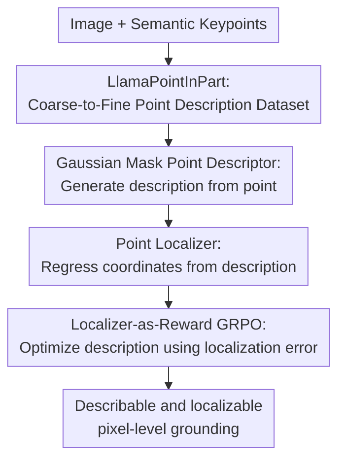

# Talking Points: Describing and Localizing Pixels

**Conference**: ICLR2026  
**OpenReview**: [https://openreview.net/forum?id=FcGQVshxMP](https://openreview.net/forum?id=FcGQVshxMP)  
**Code**: https://matanr.github.io/Talking Points  
**Area**: Multimodal VLM / Pixel-level Visual-Language Grounding  
**Keywords**: Pixel-level grounding, Keypoint description, VLM, Point localization, GRPO  

## TL;DR
This paper introduces TalkingPoints, which utilizes a Point Descriptor to describe individual pixels or keypoints in an image using coarse-to-fine natural language, and a Point Localizer to regress pixel coordinates from descriptions. It evaluates and trains "whether a point is clearly described" based on localization accuracy.

## Background & Motivation
**Background**: Visual Language Models (VLMs) can already perform Image Question Answering, region description, and box/mask grounding. They can even accept points, boxes, or masks as prompts to discuss local regions. Methods like SAM, Grounding-DINO, OMG-LLaVA, and DAM have extended grounding capabilities from full images to object and region scales by connecting spatial prompts with language.

**Limitations of Prior Work**: The issue is that region-level grounding does not equate to pixel-level understanding. A box or mask allows the model to speak broadly about "this cat" or "this chair back," but if the input is a tiny dark spot on a cat's paw, the model needs to specify which object and part it belongs to, its relative position within that part, and the surrounding visual texture. Existing keypoint methods like KptLLM and LocLLM rely heavily on predefined names or templates like "left shoulder" or "cat's left eye," which tell the model which semantic part to find but cannot freely describe why an arbitrary pixel is that specific pixel.

**Key Challenge**: The difficulty of pixel-level language grounding is not the "existence of language" but that the language must be sufficiently localizable. Human descriptions may be rich but inconsistent in style; templated keypoint names are stable but lack instance location and local appearance. Training models to generate such descriptions lacks available image-pixel-description triplet data.

**Goal**: The authors split the objective into two inverse problems: given an image and a point, generate a natural language description that uniquely localizes the point; given an image and that description, regress the corresponding pixel coordinates. The former tests if the model can "describe a pixel clearly," while the latter tests if the description is truly localizable.

**Key Insight**: The authors observe that pixel descriptions should be coarse-to-fine: first specifying the object's position in the image, then the part's position in the object, then the relative position of the point within the part, and finally local clues like color, texture, and shape. This structure is better suited for distinguishing multiple instances, parts, and tiny local differences than simply stating "dog nose."

**Core Idea**: Define pixel-level language grounding through a "Descriptor-Localizer" closed loop: the Descriptor generates localizable language, while the Localizer recovers coordinates from the language, using the recovery error as an evaluation metric or even a reinforcement learning reward.

## Method

### Overall Architecture
TalkingPoints consists of four parts: data construction, point-to-language, language-to-point, and closed-loop optimization. The authors first synthesize the LlamaPointInPart dataset, generating coarse-to-fine descriptions for semantic keypoints in images. They then train the Point Descriptor and Point Localizer separately, enabling the former to generate descriptions from image points and the latter to regress coordinates from descriptions. Finally, on the AP-10K dataset (which lacks description labels), they adapt the Descriptor using localization-based GRPO with scores provided by the frozen Localizer.

The most significant aspect of this framework is not the complexity of individual model architectures, but the fact that the task definition itself forms a closed loop. If the Descriptor merely writes a fluent caption but the Localizer cannot find the original point, it indicates the text fails to characterize the pixel. Conversely, if the Localizer can only handle training-style descriptions, it exposes style dependency in the evaluation protocol.

### Key Designs
**1. LlamaPointInPart: Writing Pixels into Localizable Coarse-to-Fine Language**

The authors first address the lack of training data. They extract images with part-level box annotations from PascalPart116, ADE20KPart234, and PartImageNet, selecting keypoints via SIFT responses within semantic parts. Thus, points are not random background pixels but belong to semantic object parts. They then record the point's position relative to the part (e.g., near the top edge, center-right), providing a localizable spatial skeleton for subsequent descriptions.

The true value lies in the multi-scale description synthesis. OMG-LLaVA views the whole image and point to generate object/part-level context; LLaVA views a local region with a Gaussian mask centered on the point to add details like texture, color, and shape; Llama3.3 then organizes this into coarse-to-fine natural language. Descriptions typically include four layers: object location, part location, point location within the part, and local appearance. The resulting LlamaPointInPart contains 20K+ triplets (17K training, 4K testing) covering 64 object categories and 297 part categories.

**2. Gaussian Mask Point Descriptor: Making the VLM Truly Look at the Pixel**

The Point Descriptor is adapted from OMG-LLaVA but, instead of predicting an object mask, it converts the input point $(x, y)$ into a fixed Gaussian attention mask centered on that point. Point coordinates form an initial semantic query via learnable prompt embeddings and a spatial query via sinusoidal positional encoding and linear projection; these enter the OMG-Seg decoder to interact with multi-scale image features.

The Gaussian mask forces cross-attention to focus only on the keypoint's neighborhood, rather than the entire object. The resulting representation is a "keypoint feature" reflecting the pixel's vicinity rather than general "object features." Meanwhile, full image features are still fed to the LLM, ensuring the generated description has both global context and a local focal point. Ablations show that removing the Gaussian mask (reverting to object masks) drops mPCK from 78.13 to 23.63, proving pixel-level description requires explicit localized attention.

**3. <SEG> Point Localizer: Compressing Language into Coordinates via a Special Token**

The Point Localizer performs the reverse mapping: inputting an image and a description to output normalized coordinates $\hat{p}=(\hat{x},\hat{y})\in[0,1]^2$. It follows the grounding VLM conversation format, prompting with "Please segment region1: [Description]", and responding with `
 keypoint 
 <SEG>`. The authors take the hidden state $h\in R^d$ of the `<SEG>` token and pass it through a text-to-vision projection and a lightweight MLP to regress 2D coordinates.

The training objective is the mean squared error $L_{loc}=\mathrm{MSE}(\hat{p},p_{gt})$. While seemingly a small change, it shifts evaluation from "is the text similar to the reference" to "can the text find the point." This is crucial for pixel-level tasks where multiple valid descriptions exist; BLEU or semantic similarity may fail to judge localizability, whereas localization error directly checks for sufficient spatial and visual cues.

**4. Localizer-as-Reward GRPO: Training Descriptor with Localization Error when Labels are Missing**

On datasets like AP-10K, which contain only image-keypoint pairs without natural language, the authors use the frozen Point Localizer as a reward model to optimize the Descriptor. For an image point, the Descriptor samples $G$ descriptions $o_i$, and the Localizer predicts coordinates $\hat{p_i}$. The reward is defined as $r_i=-\mathrm{MSE}(\hat{p_i},p)$. The better a description allows the Localizer to recover the point, the higher the reward.

Optimization uses a modified GRPO. The individual advantage is written as $\hat{A_i}=\frac{r_i-\mathrm{mean}(r)}{\mathrm{std}(r)}$, which is distributed to all tokens in the sequence and normalized by length. The full objective includes KL regularization against a reference policy $\pi_{ref}$ to prevent the model from drifting into "reward hacking" language. This loop reduces annotation costs: keypoint coordinates are cheaper than high-quality descriptions. If the reward is reliable, the Descriptor can adapt to more categories autonomously.

### Mechanism Example
Consider an image of two dogs in the snow, with the target point near the right dog's nose. A traditional template might only say "dog nose," which is ambiguous if multiple dogs are present. A human might write "the nose tip of the right puppy," but the model might not parse this consistently if the training data is coarse-to-fine.

A TalkingPoints description would first specify the target object is the puppy closer to the bottom-right, then state the point is on its nose, then clarify its relative position within the nose, and finally add local appearance like "dark-colored, nearly circular, contrasting with the snowy background." The Localizer then regresses $(\hat{x},\hat{y})$ from the `<SEG>` hidden state. If the prediction falls within a normalized distance threshold (0.1 or 0.2), it counts towards PCK; the Descriptor's quality is evaluated indirectly by this regression.

This highlights the difference from standard captioning: the text is not meant to be "poetic" but to allow another model to re-identify that specific pixel.

### Loss & Training
The Point Descriptor is initialized from OMG-LLaVA and trained on LlamaPointInPart for 10 epochs (batch size 8, learning rate $\approx 2\times10^{-4}$) using standard language modeling loss $L_{text}$ via LoRA adaptation. The Point Localizer is trained for 15 epochs (learning rate $10^{-5}$, batch size 8), optimizing LoRA, vision-to-text projection, and the MLP while freezing other parameters.

Localization is evaluated using PCK. Normalized image coordinates in $[0,1]$ are used to compute the Euclidean distance between predicted and ground-truth points; it is considered correct if the distance is below a threshold. The paper reports mPCK (average of PCK@0.1 and PCK@0.2) to cover both fine and coarse localization.

For the RL stage, group size $G=3$, KL coefficient $\beta_{KL}=0.1$, and learning rate $5\times10^{-6}$ for 3 epochs. Due to the high computational cost of sampling and Localizer calls, RL experiments were conducted on a smaller scale (e.g., Bovidae/Canidae classes).

## Key Experimental Results

### Main Results
The primary experiments on the LlamaPointInPart test set involved all methods generating descriptions, which were then fed to the same Point Localizer to measure mPCK. Results show TalkingPoints' predicted descriptions nearly match ground-truth (GT) descriptions and significantly outperform OMG-LLaVA and DAM.

| Dataset | Metric | Ours | Prev. SOTA / Baseline | Gain |
|--------|------|------|-----------------|------|
| LlamaPointInPart test | mPCK | 78.13 | OMG-LLaVA 31.03 | +47.10 |
| LlamaPointInPart test | mPCK | 78.13 | DAM 42.87 | +35.26 |
| LlamaPointInPart test | mPCK | 78.13 | GT Description 78.83 | Near GT |
| 100 Extension Samples | mPCK | ~78 | ChatGPT-5 ~62 | +16 |
| 100 Extension Samples | mPCK | ~78 | Human ~56 | +22 |

Finer PCK breakdown shows the method achieves 63.93 at the strict PCK@0.1 threshold and 92.33 at the relaxed PCK@0.2, indicating it can accurately return to specific pixels in addition to general regions.

| Method | PCK@0.1 | PCK@0.2 | mPCK |
|------|---------|---------|------|
| OMG-LLaVA | 17.26 | 44.80 | 31.03 |
| DAM | 28.24 | 57.49 | 42.87 |
| TP (Ours) | 63.93 | 92.33 | 78.13 |
| GT Description | 65.60 | 92.05 | 78.83 |

### Ablation Study
Ablations directly validate the design choices. The Gaussian mask confirms the necessity of pixel-level focal points, and LLM LoRA adaptation confirms the Localizer's need for language model reasoning.

| Configuration | Key Metric | Description |
|------|---------|------|
| Point Descriptor | mPCK 78.13 | Uses Gaussian mask to focus on neighborhood |
| w/o Gaussian mask | mPCK 23.63 | Reverts to object mask; fails to bridge point and description |
| Point Localizer | mPCK 78.83 | Performance ceiling using GT descriptions |
| w/o LLM adaptation | mPCK 47.60 | Frozen LLM; projection/MLP alone result in weak alignment |

Cross-category RL experiments show modest but consistent gains. Training on Bovidae and testing on Canidae improved mPCK from 29.85 to 29.96; the reverse improved from 28.56 to 30.36. This is categorized as a promising direction.

| Test Set | Method | mPCK | Change |
|--------|------|------|------|
| Canidae | TP zero-shot | 29.85 | - |
| Canidae | TP+RL on Bovidae | 29.96 | +0.11 |
| Bovidae | TP zero-shot | 28.56 | - |
| Bovidae | TP+RL on Canidae | 30.36 | +1.80 |

### Key Findings
- **The Gaussian mask is a major contribution.** Without it, the model defaults to understanding point prompts as general region prompts, failing to bind language to specific pixels.
- **Predicted descriptions nearly match GT descriptions**, suggesting the Descriptor learns localizable language specifically tailored to the Localizer's distribution.
- **Human descriptions performed worse than ChatGPT-5 and TP**, likely indicating the current Localizer is sensitive to the LlamaPointInPart style rather than actual descriptive quality—a limitation of the protocol.
- **RL provides consistent improvements on AP-10K**, proving localization rewards carry useful signals, although cross-dataset generalization remains a challenge.

## Highlights & Insights
- The shift from measuring "textual similarity" to "localization recoverability" is a highlight. Pixel descriptions have multiple valid forms; localization error correctly identifies if essential spatial and visual clues are present.
- The dual Descriptor-Localizer structure is intuitive. One answers "how to describe this point," the other "which point does this refer to." This loop can serve as a training target, evaluation protocol, or interactive annotation tool.
- The coarse-to-fine structure (object location, part location, relative part location, local appearance) is highly reusable for tasks like referring expression, local editing, or robotic grasp explainability.
- The Gaussian mask serves as a reminder that spatial inputs in VLMs shouldn't rely solely on linguistic tokens. Object-level and pixel-level grounding have different inductive biases; the latter must preserve local coordinates and neighborhood textures.
- Using a Localizer as a reward model has potential for scaling to low-cost data, allowing models to refine descriptions based on whether they "make sense" to a locator.

## Limitations & Future Work
- **Style Dependency**: The evaluation relies on a single Localizer trained on LlamaPointInPart, potentially penalizing valid but differently styled (e.g., colloquial) descriptions.
- **Coordinate Reliance**: Descriptions rely heavily on intra-image spatial relationships (e.g., "top-left"), which may fail in cross-view matching, video tracking, or 3D correspondence where poses change.
- **Synthetic Bias**: Using VLMs to generate training descriptions may inherit teacher model biases or hallucinate semantic parts where they don't exist in the ground truth.
- **RL Scope**: Current RL results are on similar animal categories; reliability in domains like medical imaging, remote sensing, or furniture remains to be proven.
- **Future Directions**: Training multi-style Localizers, incorporating human descriptions, and shifting from "relative image coordinates" to more stable semantic/appearance features for robotic manipulation.

## Related Work & Insights
- **vs. OMG-LLaVA**: While OMG-LLaVA accepts point prompts, its core is region-level. TalkingPoints uses its foundation but refocuses on the individual pixel via Gaussian masks and coordinate regression.
- **vs. DAM / Describe Anything**: DAM generates detailed region descriptions; TalkingPoints prioritizes unique localization, moving from description quality to regression accuracy.
- **vs. LocLLM**: LocLLM regresses coordinates from human keypoint descriptions. TalkingPoints uses free-form language and a broader range of semantic part data, incorporating a reverse Descriptor.
- **vs. KptLLM**: KptLLM focuses on semantic keypoint names and cross-category pose tasks. TalkingPoints aims to describe *any* pixel within a part without relying on fixed keypoint names.

## Rating
- **Novelty**: ⭐⭐⭐⭐⭐ Treating point description and localization as an inverse closed loop evaluated by recovery error is highly innovative.
- **Experimental Thoroughness**: ⭐⭐⭐⭐☆ Main experiments and ablations are strong, though RL scale and cross-domain generalization need more evidence.
- **Writing Quality**: ⭐⭐⭐⭐☆ Clear methodology and well-explained contributions, though readers should note the caveats of the human evaluation comparison.
- **Value**: ⭐⭐⭐⭐⭐ Provides a clear baseline and data construction method for VLMs to move from region to pixel-level language interfaces.

<!-- RELATED:START -->

## Related Papers

- [\[ICLR 2026\] From Pixels to Words -- Towards Native Vision-Language Primitives at Scale](from_pixels_to_words_--_towards_native_vision-language_primitives_at_scale.md)
- [\[CVPR 2025\] Ground-V: Teaching VLMs to Ground Complex Instructions in Pixels](../../CVPR2025/multimodal_vlm/ground-v_teaching_vlms_to_ground_complex_instructions_in_pixels.md)
- [\[CVPR 2026\] Pixels Don't Lie (But Your Detector Might): Bootstrapping MLLM-as-a-Judge for Trustworthy Deepfake Detection and Reasoning Supervision](../../CVPR2026/multimodal_vlm/pixels_dont_lie_but_your_detector_might_bootstrapping_mllm-as-a-judge_for_trustw.md)
- [\[ICLR 2026\] CapRL: Stimulating Dense Image Capabilities via Reinforcement Learning](caprl_stimulating_dense_image_caption_capabilities_via_reinforcement_learning.md)
- [\[ICLR 2026\] SPECS: Decoupling Multimodal Learning via Self-distilled Preference-based Cold Start](specs_decoupling_multimodal_learning_via_self-distilled_preference-based_cold_st.md)

<!-- RELATED:END -->
