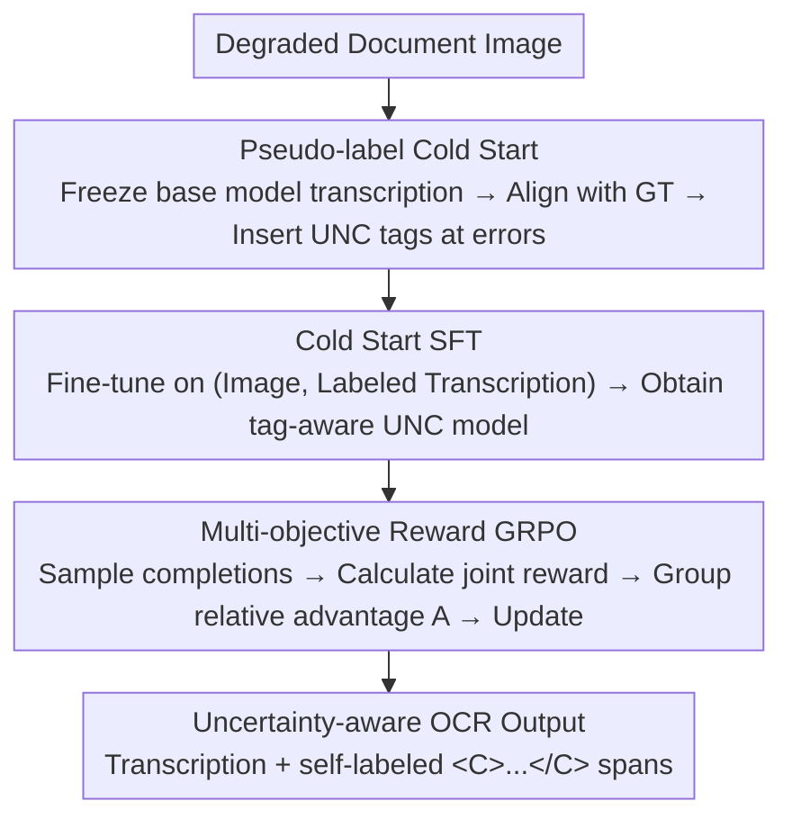

# Teaching VLMs to Admit Uncertainty in OCR from Lossy Visual Inputs

**Conference**: ICLR 2026  
**OpenReview**: [https://openreview.net/forum?id=zyCjizqOxB](https://openreview.net/forum?id=zyCjizqOxB)  
**Code**: https://github.com/NikoGuan/Uncertainty_OCR  
**Area**: Multimodal VLM  
**Keywords**: Uncertainty-aware OCR, Visual Language Model, Hallucination, GRPO, Degraded Documents

## TL;DR
Addressing the hallucination issue where VLMs "fluently fabricate typos without warning" on blurry/degraded documents, this paper teaches models to frame uncertain segments with `<C>...</C>` tags during transcription. By employing a "pseudo-label cold start + multi-objective reward GRPO" training strategy, the model achieves a word-level F1 of 0.685 for uncertainty labels on the self-built Blur-OCR benchmark without sacrificing transcription accuracy.

## Background & Motivation

**Background**: Modern OCR is being largely replaced by VLMs (e.g., Qwen2.5-VL, GOT, Dolphin), which significantly outperform traditional CRNN/TrOCR-style pipelines on clean documents.

**Limitations of Prior Work**: When processing degraded documents—characterized by blur, low resolution, compression artifacts, or occlusions—VLMs tend to "hallucinate." They generate fluent text without visual support and provide **no uncertainty signals**. This is more dangerous than traditional OCR: while traditional models often output gibberish in illegible areas, making them easy to filter, VLM errors "look correct," allowing them to propagate unnoticed and pollute digital archives or downstream analysis.

**Key Challenge**: Current post-training (SFT/RLHF) focuses solely on rewarding accuracy, effectively forcing models to "guess even when unsure." Consequently, high accuracy and "honestly admitting uncertainty" have become neglected contradictions.

**Goal**: To train an OCR model that maintains strong transcription accuracy while **explicitly and locally** marking its unreliable segments, supported by an objective evaluation protocol.

**Key Insight**: Instead of suppressing guesses, make them "transparent." Whether a model labels a segment should not depend on pixel-level legibility (subjective and model-dependent) but on **the reliability of its own transcription** for that specific instance. Even if a region is blurry, if the model can correctly complete it using context, it should not be labeled as uncertain.

**Core Idea**: Reframe OCR as a sequence decision task of "transcription + self-labeling uncertainty spans," using `<C>...</C>` tags to enclose suspicious segments, and utilizing GRPO with multi-objective rewards to learn this global labeling behavior.

## Method

### Overall Architecture

The method addresses how to enable a VLM, originally capable only of "hard transcription," to learn to frame uncertain segments with `<C>...</C>` tags without sacrificing accuracy or gaming rewards. The authors implement a **two-stage** pipeline: first, a "pseudo-label cold start" provides an initial strategy for labeling; second, a multi-objective reward (combining accuracy and uncertainty coverage with anti-hacking damping) is used via GRPO to reinforce this behavior.

Why not SFT alone? Since UNC tags are paired brackets that can span long text segments, their placement depends on the **global selection** of the entire transcription. Token-level SFT optimizes local next-token likelihood, which over-penalizes transcripts that are better overall but have approximate spans, while missing those with malformed tags. Thus, core training is delegated to GRPO for sequence-level rewards.

### Key Designs

**1. Uncertainty Tagging Paradigm & Membership Rules: Framing "Where to Worry" as Evaluable Binary Classification**

Addressing the pain point of VLMs failing to warn users, this defines UNC tags as `<C>...</C>`. During inference, the model encloses suspicious segments. Strict rules define "what is enclosed" at **character-level** and **word-level** granularities $L\in\{\text{char},\text{word}\}$. After discarding malformed tags, the prediction $\hat{y}$ is aligned with the ground truth $y$. Characters between `<C></C>` are considered "explicitly inside," while segments missing in the prediction that are **adjacent** to a UNC span boundary on the alignment path are "implicitly inside."

This turns evaluation into binary classification where "errors" are the positive class. Let $\text{ErrIn}_L$ be TP, $\text{CorrectIn}_L$ be FP, and $\text{ErrOut}_L$ be FN:

$$P_L=\frac{\text{ErrIn}_L}{\text{CorrectIn}_L+\text{ErrIn}_L},\quad R_L=\frac{\text{ErrIn}_L}{\text{ErrOut}_L+\text{ErrIn}_L},\quad F_{1,L}=\frac{2P_LR_L}{P_L+R_L}.$$

$\text{Accuracy}_L = 1 - e_L$, where $e_L$ is the normalized Levenshtein edit distance. The authors also report a **Gap** metric $\text{Gap}_L=e_{\text{in},L}-e_{\text{out},L}$ (difference in error rates inside vs. outside UNC), where a larger gap indicates better error localization.

**2. Pseudo-label Cold Start: Labeling Own Outputs Instead of Ground Truth**

Pure RL often fails due to a lack of prior, as the policy rarely explores legal tag structures. The authors generate cold-start supervision by running a pre-trained base model on degraded images, aligning outputs with GT to locate errors, and inserting UNC tags into the **model's own transcription**. For "omitted" text, uncertainty is assigned to the **nearest word**.

Key Design Motivation: Labeling own outputs ensures consistency between training and inference. Since SFT on model outputs might degrade transcription accuracy, the authors **mix in clean (Image, GT) pairs** during SFT to maintain the accuracy baseline, which is further refined via GRPO.

**3. Multi-objective Reward + Damping $\eta$: A Compound Reward to Prevent Reward Hacking**

The reward combines transcription accuracy and labeling quality:

$$R_L(\hat{y},y)=\max\Big\{0,\ (1-e_L)+\lambda\,\eta\,e_L\,F_{\beta,L}\Big\}.$$

The accuracy term is $(1-e_L)$. The labeling term uses a $\beta$-weighted F-score $F_{\beta,L}$. Two critical anti-hacking mechanisms are included:
- **$\lambda$ Range**: By setting $0<\lambda<1$, the maximum possible reward $R \le 1-(1-\lambda)e$ strictly decreases as $e$ increases. This ensures that **making an extra error, even if perfectly labeled, always results in a lower reward**, preventing the model from intentionally creating errors to boost $F_1$.
- **Length Mismatch Damping $\eta$**: To prevent credit for "eating up" large missing segments via implicit coverage, $\eta=2^{-\mathbb{I}[\rho_L>\tau]}$ (where $\rho_L$ is the length ratio) halves the labeling reward if the length mismatch is extreme ($\tau=1.3$).

**4. Char-CS + Word-reward Grain Configuration: Tight Boundaries with Dense Credit**

Through systematic sweeping, the authors found a counter-intuitive but effective pairing: **Character-level cold start + Word-level reward**. Character-level SFT teaches the model precise, tight boundaries (higher precision), while word-level rewards provide **denser and more forgiving** credit, allowing the policy to accumulate effective rewards and improve steadily compared to the sparse credit of character-level rewards.

### Loss & Training

Cold start uses LLaMA-Factory (48k pairs); GRPO is trained using VERL on 107,520 images. GRPO samples $G$ completions per input $q_b$, standardizes sequence-level rewards $R_L(\hat{y}_{b,g},y_b)$ into group relative advantages $A_{b,g}$, and maximizes the clipped objective with KL regularization:

$$J_{\text{GRPO}}(\theta)=\frac{1}{B}\sum_{b}\frac{1}{G}\sum_{g}\Big[\min\big(\rho_{b,g}A_{b,g},\ \text{clip}(\rho_{b,g},1-\epsilon,1+\epsilon)A_{b,g}\big)-\beta_{\text{KL}}D_{\text{KL}}(\pi_\theta\|\pi_{\text{ref}})\Big].$$

Default hyperparameters: $\beta=0.5, \lambda=0.9, \tau=1.3$.

## Key Experimental Results

The backbone is Qwen2.5-VL-7B, evaluated on the **Blur-OCR** benchmark (based on Project Gutenberg with random noise, resolution reduction, blur, textures, and occlusions; 107,520 train / 2,048 test images).

### Main Results

Cross-model comparison (Blur-OCR, Word-level):

| Category | Model | UNC F1 (word) | Accuracy (word) |
|------|------|------|------|
| General VLM | GPT-4o | 0.039 | 0.734 |
| General VLM | Gemini-2.5-Pro | 0.163 | 0.826 |
| General VLM | Claude-Opus-4 | 0.205 | 0.733 |
| Dedicated OCR | MinerU2.5 | – | 0.732 |
| UQ Baseline | Ensembles (5 models) | 0.491 | 0.826 |
| UQ Baseline | Qwen2.5-VL-7B (entropy) | 0.410 | 0.840 |
| **Ours** | InternVL2.5-8B (UNC) | 0.622 | 0.748 |
| **Ours** | Qwen2.5-VL-3B (UNC) | 0.638 | 0.798 |
| **Ours** | **Qwen2.5-VL-7B (UNC)** | **0.685** | **0.839** |

Ours (7B) achieves a word F1 of 0.685, outperforming general VLMs, dedicated OCR systems, and traditional UQ baselines without accuracy loss.

### Ablation Study

Impact of grains and reward parameters:

| Configuration | UNC F1 (word) | Accuracy (word) | Note |
|------|------|------|------|
| No CS + Char Reward | 0.009 | 0.735 | RL fails to learn tags |
| Random Tag CS + Char Reward | 0.298 | 0.752 | Learns format only |
| Word-CS + Char Reward | 0.300 | 0.830 | Misaligned granularities |
| **Char-CS + Word Reward** | **0.574→0.685** | **0.839** | Optimal pairing |
| $\beta$=1.2 (Recall-heavy) | 0.558 | 0.814 | Precision collapse |
| $\lambda$=1.0 (No monotonicity) | 0.811* | 0.767 | F1 high due to manufactured errors |
| $\eta$=1.0 (No damping) | 0.577 | 0.782 | Output shortening hack |

\* High F1 for $\lambda=1.0$ is a degenerate strategy; accuracy drops significantly.

### Key Findings

- **Cold start is necessary**: Without it, GRPO produces negligible tags (F1≈0.01). Structured pseudo-labeling is essential for "placing tags where they belong."
- **Paradoxical Grain Choice**: Char-level cold start (tight boundaries) + Word-level reward (dense credit) results in the best calibration.
- **Anti-hacking guards are vital**: $\lambda<1$ prevents manufacturing errors, while $\eta$ prevents length-hacking. $\beta\approx0.5$ provides the best precision-recall balance.

## Highlights & Insights
- **Quantifying "Admitting Uncertainty"**: By defining bracket tags and membership rules, the paper transforms vague "warnings" into an optimizable binary classification task suitable for RL.
- **Self-Labeling Logic**: Labeling own outputs during training avoids the train-inference discrepancy where a model might otherwise try to label positions it cannot see at test time.
- **Mathematical Anti-Cheating**: Rewards are designed structurally ($\lambda < 1$) rather than through auxiliary penalties, effectively deterring degenerate strategies like manufacturing errors to boost F1.

## Limitations & Future Work
- **Relative Uncertainty**: Uncertainty is defined relative to the model's transcription performance, not absolute pixel-level legibility.
- **Synthetic Data Reliance**: Performance is evaluated on synthetic degradations; generalization to diverse real-world historical documents requires further validation.
- **Membership Complexity**: The implicit coverage rules, while effective, introduce potential vulnerabilities that require damping mechanisms like $\eta$.
- **Recall Gap**: A word recall of 0.620 indicates that nearly 40% of errors remain unflagged.

## Related Work & Insights
- **vs. Traditional OCR Confidence**: Unlike post-processing classifiers or engine confidence scores, this approach integrates uncertainty directly into the generative stream.
- **vs. Entropy/Ensemble UQ**: This single-model approach outperforms entropy thresholds and ensembles (approx. 0.4-0.5 F1) at lower inference costs.
- **vs. Rejection-based VQA**: While prior work uses GRPO to induce "I don't know" responses in VQA, this method targets local span-level uncertainty in transcription.

## Rating
- Novelty: ⭐⭐⭐⭐⭐ Reframing OCR uncertainty as an optimizable span task with solid formal proofs.
- Experimental Thoroughness: ⭐⭐⭐⭐⭐ Self-built benchmark, cross-architecture validation, and systematic ablation of rewards.
- Writing Quality: ⭐⭐⭐⭐ Clear formal definitions and derivations, though membership rules are somewhat dense.
- Value: ⭐⭐⭐⭐⭐ Addresses the critical VLM-OCR trust issue with a generalizable paradigm for lossy inputs.

<!-- RELATED:START -->

## Related Papers

- [\[ICLR 2026\] Human Uncertainty-Aware Data Selection and Automatic Labeling in Visual Question Answering](human_uncertainty-aware_data_selection_and_automatic_labeling_in_visual_question.md)
- [\[CVPR 2025\] Ground-V: Teaching VLMs to Ground Complex Instructions in Pixels](../../CVPR2025/multimodal_vlm/ground-v_teaching_vlms_to_ground_complex_instructions_in_pixels.md)
- [\[ICLR 2026\] Detecting Misbehaviors of Large Vision-Language Models by Evidential Uncertainty Quantification](detecting_misbehaviors_of_large_vision-language_models_by_evidential_uncertainty.md)
- [\[ACL 2025\] Teaching Vision-Language Models to Ask: Resolving Ambiguity in Visual Questions](../../ACL2025/multimodal_vlm/teaching_vlm_ask_ambiguity.md)
- [\[ICLR 2026\] Revisiting Confidence Calibration for Misclassification Detection in VLMs](revisiting_confidence_calibration_for_misclassification_detection_in_vlms.md)

<!-- RELATED:END -->
