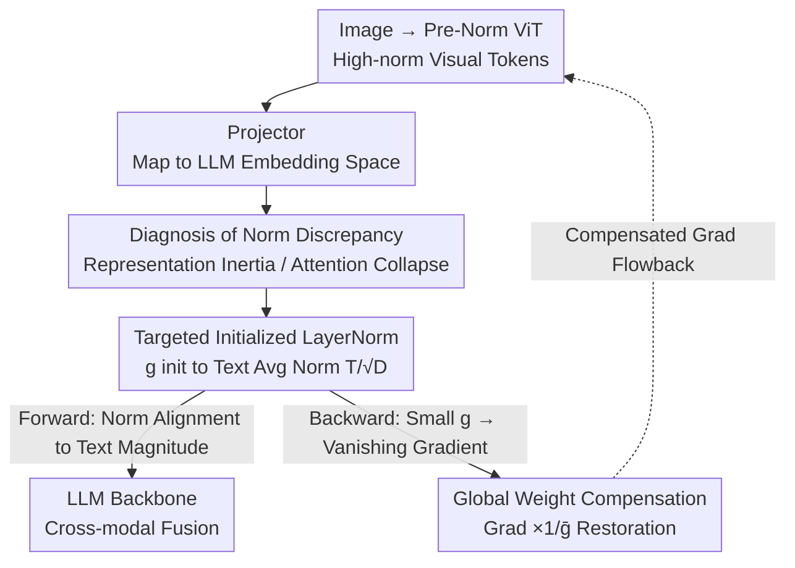

# The Unseen Bias: How Norm Discrepancy in Pre-Norm MLLMs Leads to Visual Information Loss

**Conference**: ICLR 2026  
**OpenReview**: [https://openreview.net/forum?id=GVVNG2EMQv](https://openreview.net/forum?id=GVVNG2EMQv)  
**Area**: Multimodal VLM  
**Keywords**: Pre-Norm Architecture, Norm Discrepancy, Cross-modal Fusion, LayerNorm Alignment, Gradient Compensation

## TL;DR
This paper identifies that the widely adopted Pre-Norm architecture in MLLMs causes a severe norm discrepancy between high-norm visual tokens and low-norm text tokens, leading to slow visual token updates ("representation inertia") and cross-modal attention collapse. The authors insert a **carefully initialized LayerNorm** after the visual projector to force norm alignment, coupled with Global Weight Compensation to resolve subsequent vanishing gradients. On LLaVA-1.5, this improves not only multimodal benchmarks but also text-only MMLU performance.

## Background & Motivation
**Background**: The current mainstream paradigm for MLLMs is "Pre-trained Visual Encoder (ViT) + Lightweight Projector + Pre-trained LLM." ViT encodes image patches into visual tokens, which the projector maps into the LLM's word embedding space. Visual and text tokens are then fed into the same LLM backbone. Nearly all modern Transformers (ViT and LLM) use the Pre-Norm architecture because it keeps the residual path unnormalized, ensuring stable gradient flow and easier training.

**Limitations of Prior Work**: Existing research finds that MLLMs struggle with fine-grained visual perception, and visual tokens often receive significantly lower attention weights than text tokens in self-attention. Previous works attribute these to surface-level phenomena, but the architectural root cause remains unexplored.

**Key Challenge**: Pre-Norm has an overlooked side effect—residual sums are never re-normalized, causing hidden state variance (and L2 norm) to accumulate monotonically with layer depth. Since visual tokens originate from a deep Pre-Norm ViT, their norms have already expanded significantly. They are then injected into the LLM embedding space where norms are extremely low (text embeddings are often $\approx 1$, while visual encoder outputs can reach several dozen). This creates a stark initial norm gap at the cross-modal interface.

**Goal**: To prove that this initial norm discrepancy is not static or harmless but catalyzes "geometric divergence" between the representations of the two modalities, and to design a simple intervention to eliminate it.

**Key Insight**: The authors perform a theoretical analysis of Pre-Norm update dynamics. Since the update vector magnitude $\|\Delta h\|_2$ in Pre-Norm is decoupled from the input norm $\|h\|_2$ (the same layer applies updates of approximately the same magnitude to all tokens), the "angle" rotated by an update of the same size is smaller when applied to a high-norm vector.

**Core Idea**: High-norm visual tokens possess higher "representation inertia," evolving semantically much slower than text tokens. This leads to a mismatch in convergence rates and a collapse of the attention signal-to-noise ratio. Forcing the alignment of visual token norms to text norms after the projector can fix this imbalance at its root.

## Method

### Overall Architecture
The proposed method consists of two parts: **Diagnosis** (theoretical + empirical proof that norm discrepancy exists and is harmful) and **Intervention** (a minimal architectural change + a gradient trick to ensure trainability).

Diagnosis: The authors derive an "effective angular velocity" formula under simplified assumptions, proving that larger norms lead to lower angular velocity (slower updates). They use four Research Questions (RQ1–RQ4) to empirically verify that norm gaps and update rate asymmetries are prevalent in mainstream open-source MLLMs.

Intervention: In the standard MLLM data flow "Image → ViT → Projector → LLM," an additional LayerNorm layer is inserted after the projector and before the LLM. Its gain parameter $g$ is specifically initialized to the average norm of text embeddings to compress visual token norms to the same magnitude as text. Since this target is very small (gain initialized to $\approx 0.01$), it would normally cause vanishing gradients for the visual encoder (gradients are scaled by $g$). Therefore, Global Weight Compensation (a backward hook) is used to decouple the forward norm compression from the backward gradient magnitude.

### Key Designs

**1. Asymmetric Update Dynamics Induced by Norm Discrepancy: Attributing "Visual Information Loss" to Pre-Norm**

This is the theoretical foundation. The authors write the Pre-Norm block update as $h^{(l+1)} = h^{(l)} + \Delta h^{(l)}$ and note that because normalization is inside the residual branch, the update magnitude $C^{(l)} = \|\Delta h^{(l)}\|_2$ is decoupled from input norm $\|h\|_2$. Decomposing the update into components parallel and orthogonal to $h$, the "effective angular velocity" $\theta_{\text{eff}}$ that actually changes the direction satisfies:

$$\tan(\theta_{\text{eff}}) = \frac{C^{(l)}\sin(\phi)}{\|h\|_2 + C^{(l)}\cos(\phi)}$$

As $\|h\|_2$ increases, $\tan(\theta_{\text{eff}})$ decreases. Thus, when $\|h_{\text{vis}}\|_2 > \|h_{\text{txt}}\|_2$, it follows that $\tan(\theta_{\text{eff,vis}}) < \tan(\theta_{\text{eff,txt}})$. High-norm visual tokens rotate slower, exhibiting "representation inertia" where semantic evolution lags behind text tokens. This manifests in the attention layer: for a text query $q$ to retrieve a semantically relevant visual key $k^+$, they must align geometrically in a shared space. The inertia of visual tokens caps the dot-product signal $S_{\text{rel}} \propto q\cdot k^+$, while irrelevant pairs (noise) remain nearly orthogonal and unaffected. This collapses the signal-to-noise ratio ($\mathbb{E}[S_{\text{rel}}^{(\text{imb})}] < \mathbb{E}[S_{\text{rel}}^{(\text{bal})}] $), preventing Softmax from sharpening attention on target visual regions.

**2. Targeted Initialized LayerNorm: Forcing Norm Alignment with One Line of Code**

To address the failure of projectors to flatten the norm gap, the authors insert a LayerNorm layer after the visual projector. The key is the **initialization of the gain $g$**. The target norm $T$ is the average L2 norm of all non-zero vectors in the LLM text embedding matrix:

$$T = \frac{1}{|W^*|}\sum_{w\in W^*}\|w\|_2,\qquad W^* = \{w\in W_e \mid \|w\|_2 > \epsilon\}$$

The scalar gain is initialized as $g_{\text{init}} = T/\sqrt{D}$, ensuring that visual token norms start at the same magnitude as text tokens. Ablations (Table 5) show this targeted initialization is necessary: LayerNorm with default initialization (gain=1) remains nearly unchanged after Stage 1 pre-training, whereas targeted initialization places parameters in a gradient-rich region of the loss surface.

**3. Global Weight Compensation (GWC): Unlocking the "Smaller Norm, Smaller Gradient" Deadlock**

Targeted initialization introduces a new problem: modern LLM text embeddings are very small ($\|w\|_2\approx 1$ for $D=4096$), requiring $g_{\text{init}} \approx 0.01$. In standard backpropagation, gradients flowing to the visual encoder are scaled by this weight: $\nabla_{\hat x}\mathcal{L} = \nabla_y\mathcal{L}\odot g$. This tiny $g$ triggers vanishing gradients, cutting off the visual encoder from supervision signals. GWC uses a backward hook to counteract this: let $\bar g = \frac{1}{D}\sum_i |g_i|$ be the average magnitude of the gain vector. During backpropagation, the gradient is multiplied by a compensation factor $1/\bar g$:

$$\text{Backward}(\nabla_{\hat x}\mathcal{L}) = \underbrace{(\nabla_y\mathcal{L}\odot g)}_{\text{Standard Grad}}\times\underbrace{\frac{1}{\bar g}}_{\text{Compensated Factor}}$$

This ensures forward norm alignment while restoring gradients to a unit scale ($g\cdot\bar g^{-1}\approx 1$).

### Loss & Training
The method introduces no extra loss terms and follows the standard two-stage LLaVA-1.5 training (Stage 1 pre-training alignment + Stage 2 instruction tuning). The only additions are the LayerNorm layer and the GWC backward hook. Experiments use SigLIP-SO400M-Patch14-384 as the visual encoder and Llama-3.2-3B-Instruct / Qwen2.5-7B-Instruct as backbones.

## Key Experimental Results

### Main Results
The method compares "No Norm Alignment / Naive Alignment (w/o GWC) / Ours (w/ GWC)" across multimodal and text benchmarks:

| Backbone | Method | MM-Star | SEED-Bench-2 | OCRBench | MMLU | Avg |
|----------|------|---------|--------------|---------|------|-----|
| Llama-3.2 | w/o Norm | 37.72 | 42.86 | 40.70 | 45.19 | 59.01 |
| Llama-3.2 | w/ Norm (w/o GWC) | 41.19 | 47.26 | 45.60 | 53.21 | 62.04 |
| Llama-3.2 | w/ Norm (w/ GWC) | 41.24 | 45.56 | 44.10 | 51.60 | 61.27 |
| Qwen2.5 | w/o Norm | 50.34 | 56.65 | 47.00 | 71.02 | 68.49 |
| Qwen2.5 | w/ Norm (w/o GWC) | 48.08 | 59.51 | 47.60 | 71.14 | 68.71 |
| Qwen2.5 | w/ Norm (w/ GWC) | 50.58 | 58.27 | 49.40 | 71.74 | 69.41 |

A key observation is the backbone dependency: Llama-3.2 text embeddings are not extremely small, so naive alignment suffices. Qwen2.5 has extremely small text norms, where naive alignment triggers vanishing gradients—leading to multimodal degradation. GWC is required to unlock gains in both domains. Notably, even text-only MMLU improves, suggesting the fix to architectural imbalance improves overall model health.

### Ablation Study
Ablation on initialization strategy (LayerNorm parameters after Stage 1):

| Config | L2 Norm of gain $g$ | Gain Abs Mean | Description |
|------|------------------|------------|------|
| Default (gain=1) | 53.2500 | 0.9609 | Parameters barely moved; optimization failed to start |
| Targeted Init | 2.2812 | 0.0400 | Substantial updates; reached gradient-rich region |

### Key Findings
- **GWC is critical for Qwen-like small-norm backbones**: Without it, multimodal metrics drop (MMBench -1.20). With it, they turn positive, confirming the theoretical prediction of "vanishing gradients."
- **Targeted initialization is mandatory**: Using default LayerNorm initialization results in stagnant parameters, proving that simply "adding a norm layer" is insufficient.
- **Diagnosis validated**: Post-training analysis shows the method aligns norms from shallow layers through the entire network. Attention visualization shows the baseline attention is wrongly biased toward the image bottom by RoPE distance decay, while aligned models converge on semantically relevant regions.
- **Exception for Discrete Tokenization**: Ovis 2.5 maintains a norm gap but does not suffer from update rate imbalance, suggesting discrete tokenization may naturally mitigate representation inertia.

## Highlights & Insights
- **Traces a known phenomenon (ignored visual tokens) back to Pre-Norm norm accumulation**, providing a quantifiable and falsifiable bridge through "effective angular velocity."
- **Engineered simplicity with non-trivial insights**: While adding a LayerNorm is simple, identifying the "small target → vanishing gradient" trap and resolving it with GWC (forward/backward decoupling) is elegant.
- **"Fixing imbalance improves text ability"** is a striking find: it elevates multimodal alignment from a local patch to a global improvement in representation health.

## Limitations & Future Work
- GWC potentially introduces risk of gradient oscillation; more stable compression strategies are open problems.
- Experiments are limited to LLaVA-1.5 with two backbones; generalization to 70B+ scales or original native multimodal architectures is unverified.
- Theoretical analysis relies on simplified assumptions (uniform update magnitudes/directions).
- Ovis 2.5 results suggest the conclusion is bounded by "continuous projection + Pre-Norm" architectures.

## Related Work & Insights
- **vs. Attention Reweighting**: Unlike methods that patch attention scores, this work addresses the root "geometric divergence" with nearly zero extra parameters.
- **vs. Projectors with Internal Norms (KimiVL / GLM-4.1V)**: While these models reduce norms partially, the paper shows that simply adding a norm layer does not guarantee alignment without explicitly anchoring to text norms and applying gradient compensation.
- **vs. Pre-Norm Norm Accumulation (Kim et al. 2025)**: This work extends single-modality norm accumulation research to the cross-modal interface, identifying it as a factor in visual information loss.

## Rating
- Novelty: ⭐⭐⭐⭐⭐ Systematically attributes visual loss to Pre-Norm norm discrepancy with falsifiable theory.
- Experimental Thoroughness: ⭐⭐⭐⭐ Solid evidence across RQs and main benchmarks, though backbone variety is limited.
- Writing Quality: ⭐⭐⭐⭐⭐ Clear logic from theory to empirical diagnosis to intervention.
- Value: ⭐⭐⭐⭐⭐ Minimal changes with significant gains, revealing a long-ignored design dimension.

<!-- RELATED:START -->

## Related Papers

- [\[ICLR 2026\] How Do Medical MLLMs Fail? A Study on Visual Grounding in Medical Images](how_do_medical_mllms_fail_a_study_on_visual_grounding_in_medical_images.md)
- [\[CVPR 2026\] Learning to Focus and Precise Cropping: A Reinforcement Learning Framework with Information Gaps and Grounding Loss for MLLMs](../../CVPR2026/multimodal_vlm/learning_to_focus_and_precise_croppinga_reinforcement_learning_framework_with_in.md)
- [\[ICLR 2026\] Visual Jigsaw Post-Training Improves MLLMs](visual_jigsaw_post-training_improves_mllms.md)
- [\[AAAI 2026\] Explore How to Inject Beneficial Noise in MLLMs](../../AAAI2026/multimodal_vlm/explore_how_to_inject_beneficial_noise_in_mllms.md)
- [\[ICLR 2026\] OmniVideoBench: Towards Audio-Visual Understanding Evaluation for Omni MLLMs](omnivideobench_towards_audio-visual_understanding_evaluation_for_omni_mllms.md)

<!-- RELATED:END -->
