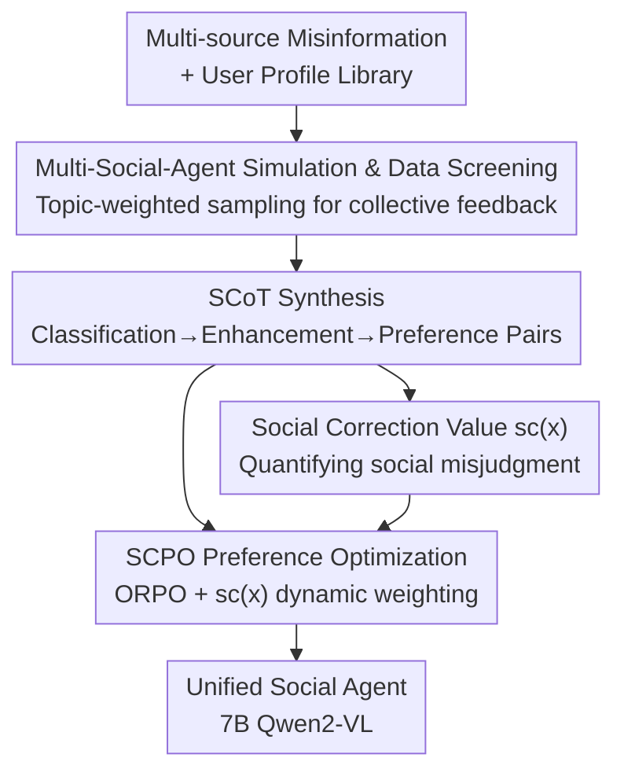

# Thinking as Society: Multi-Social-Agent Self-Distillation for Multimodal Misinformation Detection

**Conference**: ICLR 2026  
**OpenReview**: [https://openreview.net/forum?id=nHW64r5KFG](https://openreview.net/forum?id=nHW64r5KFG)  
**Code**: None  
**Area**: Multimodal VLM / Misinformation Detection / Preference Optimization  
**Keywords**: Multimodal Misinformation Detection, Social Agents, Self-Distillation, Social Chain-of-Thought, Preference Optimization

## TL;DR
This work utilizes a group of "social user" MLLM agents to perform truthfulness judgments on multimodal content from different stances. Their collective feedback is distilled into high-quality "Social Chain-of-Thought" (SCoT) preference data. Using a preference optimization algorithm, SCPO, which employs "social misjudgment degree" as a verifiable weight, the collective reasoning capabilities are internalized into a single 7B Qwen2-VL. This model outperforms larger open-source models and specialized multi-agent frameworks on MFC-Bench / MMFakeBench, even approaching or exceeding GPT-4o and Claude.

## Background & Motivation

**Background**: Real-world multimodal misinformation (fake news, out-of-context images, AI-generated content) involves a mixture of forgery techniques and is embedded in social contexts. Simple binary classification is no longer sufficient; detection models must possess the ability to understand social dynamics and perform robust reasoning. Consequently, increasing research directly utilizes MLLMs as agents for multimodal misinformation detection (MMD).

**Limitations of Prior Work**: MLLM-based methods face a dilemma. Single-agent methods are restricted to a single-perspective analysis, and in complex social tasks, they are easily misled due to a limited field of vision. Multi-agent methods, while capable of analysis from multiple social roles, incur high inference costs and make the entire multi-step pipeline difficult to optimize end-to-end (experiments showed that applying MMD-Agent to Qwen2-VL and 34B LLaVA actually reduced accuracy by 5.6% / 6.1%, as multi-step reasoning accumulates errors).

**Key Challenge**: There is a trade-off between inference efficiency (single model) and multi-perspective analysis (multi-agent). Seeking multiple social perspectives requires paying the price for multi-agent computational power and optimization, while seeking efficiency requires sacrificing perspective diversity.

**Goal**: Internalize "collective social reasoning" into **a unified model** that retains multi-perspective analysis while maintaining the efficiency of a single model. This reveals two specific sub-problems: (1) Data scarcity—the lack of multi-perspective reasoning data capable of teaching MLLMs to integrate various social perspectives; (2) Optimization difficulty—existing fine-tuning algorithms like SFT and DPO treat all samples equally and fail to differentiate or prioritize high-value samples that reflect social cognitive differences.

**Key Insight**: The authors observe that since the value of multi-agents lies in "different social roles providing different judgments," it is better to generate these judgments **offline**, synthesize them into reasoning data, and distill them back into a single model, thereby converting "multi-agent reasoning" into a "single forward pass." Furthermore, the degree to which "social users judged incorrectly" is inherently a natural, observable, and verifiable difficulty signal that can be used to dynamically adjust training priorities.

**Core Idea**: Simulate collective feedback using a group of profiled MLLM social agents → Synthesize "Social Chain-of-Thought (SCoT)" preference data → Perform self-distillation using SCPO weighted by "social correction value," compressing "thinking as society" into a single 7B model.

## Method

### Overall Architecture
The entire framework is a two-stage pipeline consisting of "offline data generation + online self-distillation." The first stage (Data Generation) aggregates multiple MMD datasets and filters for high-quality, diverse misinformation samples. It then samples a batch of MLLM user agents with social profiles based on topic weights for each sample, allowing them to provide individual truthfulness judgments. These raw feedbacks undergo a three-step "Classification → Enhancement → Synthesis" process to be refined into SCoT preference data with positive and negative pairs. The second stage (Optimization) quantifies the degree of social user misjudgment for each sample into a social correction value $sc(x)$, which is used to dynamically weight the preference loss within the ORPO framework to train a unified "social agent"—a 7B Qwen2-VL capable of multi-perspective reasoning and judgment in a single forward pass.

### Key Designs

**1. Multi-Social-Agent Simulation & Data Screening: Making Collective Feedback Diverse and Non-redundant**

This step addresses the first part of the "Data Scarcity" pain point—without the right raw materials, multi-perspective reasoning data is unattainable. The authors aggregate several existing MMD benchmarks into a comprehensive dataset, containing both synthetic manipulations (NewsCLIPpings, DGM4, AutoSplice) and real social media samples (FineFake). To handle scale and redundancy, each training sample is scored against the validation set using CLIP semantic similarity and distribution consistency based on Wasserstein gradients. High-quality and diverse base sets are obtained through top-selection and label balancing.

Social feedback is provided by a batch of user agents with profiles taken from the OASIS platform, covering demographics (nationality), psychology (enthusiastic/calm), occupation (journalist/engineer/educator), and interests (politics/science). The critical "topic-driven sampling" simulates real-world social media behavior where users are more likely to engage with content related to their interests. For each sample, a topic set $T_s$ is extracted, and for each user with an interest set $T_u$, a matching weight $w=\frac{|T_u\cap T_s|}{|T_s|}+\epsilon$ is calculated (where $\epsilon$ is a small positive number to ensure non-zero selection probability for all users). Weighted sampling is performed according to $w$. Profiles of sampled users are injected into structured system prompts to instantiate MLLM agents that generate role-based feedback with background biases.

**2. Social Chain-of-Thought Synthesis: Refining Messy Feedback into Preference Pairs**

Raw feedback cannot be used directly for training due to mixed correctness and varying quality. The authors designed a "Classification → Enhancement → Synthesis" process. **Answer-centric feedback classification** uses LLM-as-a-Judge to categorize feedback based on "consistency between conclusion and ground truth" into three groups: Correct (correct conclusion with valid reasoning), Incorrect (wrong conclusion with key reasoning flaws), and Partially Correct (incorrect conclusion but containing valid observations). A confidence score (0–1) is also assigned. The **Potential Correct Group** is defined as "Correct set + Partially Correct set with confidence > 0.5," creating a soft boundary that incorporates diverse perspectives while filtering noise.

**Role-based reasoning enhancement** further polishes the Potential Correct Group. First, knowledge injection provides the ground truth to these users, prompting them to refine explanations from their role perspectives, encouraging the addition of missed evidence while retaining role characteristics. Second, adaptive enhancement for edge cases generates adversarial negative samples for "easy samples" (where all agents were correct) to expose cognitive biases and prevent overfitting. For "hard samples" (where all agents were incorrect), the ground truth is broadcasted to construct valid role-based reasoning towards the correct conclusion. Finally, **Preference Data Synthesis** is handled by two specialized agents: the Coordinator Agent merges overlapping reasoning paths from the Potential Correct Group while preserving unique insights to produce a unified positive (chosen) SCoT; the Summarizer Agent processes the Incorrect set to retain representative misleading reasoning chains and flaws to produce a negative (rejected) SCoT.

**3. Social Correction Value Function sc(x): Converting Social Misjudgment into Verifiable Sample Difficulty**

This step addresses the "Optimization Difficulty"—algorithms like DPO treat all samples equally, ignoring information within social cognitive differences. The degree to which each sample "needs to be corrected" is quantified as its learning value:

$$sc(x) = 1 - \left(\frac{N_C}{N} + \frac{N_P}{N-N_C}\cdot\frac{1}{N}\right)$$

Where $N$ is the total number of users for the sample, $N_C$ is the count of correct users, and $N_P$ is the count of partially correct users. The coarse-grained term $\frac{N_C}{N}$ captures the ratio of correct judgments (higher means easier, lower correction need); the fine-grained term $\frac{N_P}{N-N_C}\cdot\frac{1}{N}$ adds discounted weight for partially correct users. Overall, $sc(x)\in[0,1]$. Higher values indicate harder samples (more incorrect feedback), where preference intensity is amplified to focus the model on resolving social misjudgments. Simple samples with consensus correctness are downweighted. Compared to unverifiable reward margins learned by reward models, $sc(x)$ is calculated from observable statistics, making it clear, verifiable, and explainable.

**4. SCPO Preference Optimization Loss: Injecting Social Correction Value into ORPO for Self-Distillation**

The authors designed the SCPO loss within the ORPO framework (integrating SFT and preference optimization without a reference model):

$$\mathcal{L}_{SCPO} = \mathcal{L}_{SFT} + \lambda\cdot(1+\omega\cdot sc(x))\cdot\mathcal{L}_{OR}$$

Where $\mathcal{L}_{SFT}=-\mathbb{E}_{(x,y_w)\sim D_{SFT}}[\log\pi_\theta(y_w\mid x)]$ enables the model to learn the social reasoning patterns of the Coordinator’s positive samples. $\mathcal{L}_{OR}$ is the Odds Ratio alignment loss, using $\log\sigma\big(\log\frac{\pi_\theta(y_w\mid x)}{1-\pi_\theta(y_w\mid x)}-\log\frac{\pi_\theta(y_l\mid x)}{1-\pi_\theta(y_l\mid x)}\big)$ to compare the generation likelihood of high-quality reasoning $y_w$ (from the Potential Correct Group) against flawed reasoning $y_l$ (from the Summarizer's Incorrect set). The core innovation is dynamic scaling of the OR loss weight $(1+\omega\cdot sc(x))$ using the social correction value.

### Main Results
MFC-Bench (open-prompting, Accuracy / macro-F1, %):

| Model | Scale | Overall Acc | Overall F1 | Description |
|------|------|------|------|------|
| GPT-4o | - | 69.11 | 68.49 | Strongest Closed-source |
| Claude3.5-Sonnet | - | 66.85 | 64.32 | Closed-source |
| Qwen2.5-VL | 7B | 58.23 | 58.34 | Stronger Open-source Base |
| InternVL3 | 8B | 56.32 | 55.22 | Stronger Open-source Base |
| Qwen2-VL (Base) | 7B | 57.24 | 56.91 | Ours Base |
| **SCPO (Ours)** | 7B | **67.15** | **66.83** | +9.91 / +9.92 vs Base |

SCPO boosts the 7B base by nearly 10 percentage points, surpassing larger/stronger open-source models, exceeding Claude, and approaching GPT-4o—indicating that internalizing social reasoning is more effective than simply switching to a stronger base.

MMFakeBench (Mixed-source detection, SCPO with open-prompting): The 7B SCPO achieves a Top-1 Accuracy of 59.2%, whereas the MMD-Agent multi-agent framework on 34B LLaVA-NeXT only reaches 40.5%. The 7B self-distilled model significantly outperforms the 34B model with an inference-time multi-agent framework.

### Ablation Study
Comparison of different fine-tuning/prompting strategies under the same SCoT data (MFC-Bench Overall, %):

| Configuration | Acc | F1 | Description |
|------|------|------|------|
| Qwen2-VL | 57.46 | 57.09 | Base |
| Self-Consistency | 61.63 | 58.35 | Prompting Strategy |
| SFT | 64.20 | 63.10 | SFT on positive SCoT (Strong Baseline) |
| SFT+DPO | 57.98 | 56.09 | DPO leads to performance drop |
| ORPO | 66.30 | 66.01 | Integrated SFT+Preference |
| **SCPO** | **67.15** | **66.83** | Weighted by Social Correction Value |

### Key Findings
- **SCoT data itself is highly valuable**: SFT alone reaches 64.20%, far exceeding self-consistency (61.63%), proving the high quality and effectiveness of synthesized multi-perspective social reasoning data.
- **Social correction value is a key increment**: ORPO (66.30%) already outperforms DPO, and SCPO further improves to 67.15% on the same data. This suggests that shifting training focus to "socially misjudged" hard samples yields more stable and better optimization. Notably, SFT+DPO dropped to 57.98%, confirming that "treating preferences equally" is unstable for this task.
- **Superior reasoning quality**: In GPT-4 evaluations across four dimensions, SCPO leads comprehensively: lower misleadingness (2.51↓), and higher informativeness (3.69↑), rationality (4.19↑), and readability (4.93↑). Multi-perspective self-distillation simultaneously improves judgment quality and interpretability.
- **Inference-time multi-agent frameworks are not cost-effective**: Multi-step decomposition in MMD-Agent applied to Qwen2-VL / 34B LLaVA actually lowered accuracy by 5.6% / 6.1%. Errors accumulate during multi-step processes—supporting the strategy of internalizing collective reasoning into a single model.

## Highlights & Insights
- **Offlining multi-agent value and distilling back to single models**: This paradigm addresses the efficiency-perspective trade-off by generating data before training. This is a reusable pattern for any task where multi-agent collaboration improves quality but is too expensive at inference time.
- **"Social misjudgment degree" as a verifiable difficulty signal**: $sc(x)$ is calculated directly from user feedback statistics, making it verifiable and semantic-clear compared to reward margins, providing a good example of explainable sample difficulty weighting.
- **Adversarial enhancement for edge samples**: Counter-generating adversarial negatives for easy samples and broadcasting truths for hard samples is a strategy that can be migrated to any preference data synthesis scenario.

## Limitations & Future Work
- Data generation depends on massive MLLM agent calls, LLM judge, and multi-step synthesis, leading to high offline computational overhead. The cost and scalability of the pipeline are not fully discussed.
- The quality of $sc(x)$ depends heavily on the reliability of the LLM-as-a-Judge for feedback classification; systemic biases in the judge could pollute difficulty signals.
- Validated only on a single Qwen2-VL-7B base and two MMD benchmarks; generalizability across larger/smaller models or other tasks is not provided.
- Social profiles are sourced from the OASIS platform; the extent to which simulated "social diversity" equals real-world social disagreement remains an open question.

## Related Work & Insights
- **vs Single-agent MMD (Cekinel/Tahmasebi et al.)**: These have only a single perspective and are easily misled; Ours synthesizes multi-perspective reasoning via multi-social agents and distills it back, adding diversity while maintaining efficiency.
- **vs Multi-agent MMD (MMD-Agent / Liu et al.)**: These run multi-agents during inference, which is costly and difficult to optimize end-to-end; Ours moves multi-perspective reasoning to the data generation stage, requiring only one forward pass at inference.
- **vs DPO / ORPO / MM-DPO**: DPO/ORPO treat samples equally. MM-DPO uses unverifiable reward margins; SCPO uses observable and bounded social correction values for dynamic weighting, leading to more stable training on hard samples.

## Rating
- Novelty: ⭐⭐⭐⭐⭐ The combination of offline multi-agent data generation and verifiable preference weighting driven by social misjudgment is novel and self-consistent.
- Experimental Thoroughness: ⭐⭐⭐⭐ Two benchmarks, multiple ablation strategies, and reasoning quality evaluation, though limited to a single base and lacking cost analysis.
- Writing Quality: ⭐⭐⭐⭐ The dilemma and solution are clearly articulated, with complete descriptions of formulas and processes.
- Value: ⭐⭐⭐⭐⭐ Enabling 7B open-source models to approach/exceed GPT-4o in MMD makes this route highly attractive for practical deployment.

<!-- RELATED:START -->

## Related Papers

- [\[ICLR 2026\] Vision-Zero: Scalable VLM Self-Evolution via Multi-Agent Self-Play](vision-zero_scalable_vlm_self-evolution_via_multi-agent_self-play.md)
- [\[AAAI 2026\] Multi-Agent VLMs Guided Self-Training with PNU Loss for Low-Resource Offensive Content Detection](../../AAAI2026/multimodal_vlm/multi-agent_vlms_guided_self-training_with_pnu_loss_for_low-resource_offensive_c.md)
- [\[ICLR 2026\] Thinking with Camera: A Unified Multimodal Model for Camera-Centric Understanding and Generation](thinking_with_camera_a_unified_multimodal_model_for_camera-centric_understanding.md)
- [\[ICLR 2026\] Multimodal Dataset Distillation via Phased Teacher Models](multimodal_dataset_distillation_via_phased_teacher_models.md)
- [\[CVPR 2026\] Multi-speaker Attention Alignment for Multimodal Social Interaction](../../CVPR2026/multimodal_vlm/multi-speaker_attention_alignment_for_multimodal_social_interaction.md)

<!-- RELATED:END -->
