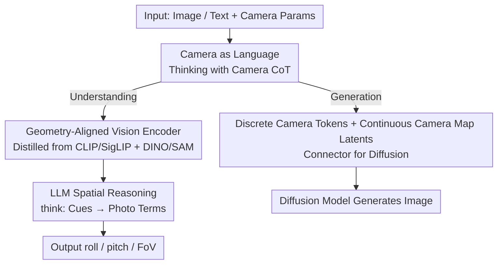

# Thinking with Camera: A Unified Multimodal Model for Camera-Centric Understanding and Generation

**Conference**: ICLR 2026  
**OpenReview**: [https://openreview.net/forum?id=5THcDkGGjt](https://openreview.net/forum?id=5THcDkGGjt)  
**Code**: https://kangliao929.github.io/projects/puffin (Available)  
**Area**: Multimodal VLM  
**Keywords**: Camera Geometry, Unified Multimodal Model, Spatial Intelligence, Chain-of-Thought, Controllable Generation

## TL;DR
This paper proposes Puffin, which treats "camera parameters" as a language within a Large Multimodal Model (LMM). By utilizing a shared "thinking with camera" Chain-of-Thought (CoT), it simultaneously performs camera understanding (estimating roll/pitch/FoV from images) and camera-controllable generation (generating images from specific viewpoints), outperforming specialized models in both domains.

## Background & Motivation

**Background**: Camera geometry understanding (estimating camera orientation and field of view from a single image) and camera-controllable generation (generating images of corresponding views based on specified intrinsic/extrinsic parameters) are two pillars of spatial intelligence. However, they have long been studied as two unrelated problems—calibration methods like GeoCalib or UVP on one side, and controllable generation methods like PreciseCam on the other.

**Limitations of Prior Work**: Merging these into a single LMM encounters a "modality gap." Camera parameters differ from text and images: they are abstract numerical values (FoV, rotation angles) without semantic content. Consequently, during generation, models often ignore or misunderstand terms like "20° roll" or "35mm lens," focusing on semantic alignment while losing precise spatial control. During understanding, LMMs collapse geometric details into coarse descriptions, leading to spatial inconsistency. Directly feeding camera values as auxiliary labels fails both tasks.

**Key Challenge**: Camera parameters are low/mid-level geometric quantities, whereas LMMs excel at high-level semantics; a bridge is missing between them. Pure visual representations (geometric structures or semantic features with confidence) excel at extracting local cues in feature-rich scenes but fail to grasp global, coherent spatial concepts, leading to poor generalization.

**Goal**: (1) Perform both camera understanding and generation within a unified framework; (2) Make camera values "language-interpretable" to enable explicit spatial reasoning by the model.

**Key Insight**: The authors observe that textureless regions like the sky, ceilings, and floors—though lacking local features—encode vertical regularities critical for pitch. FoV estimation relies on compositional cues such as foreground/background ratios and object scales. These are precisely the knowledge priors that LMMs possess implicitly but are difficult to extract from pure visual representations.

**Core Idea**: "Camera as language." Professional photographic terms (e.g., close-up, tilt-up, Dutch angle) serve as "quantitative abstractions" of camera values. By binding these to spatial cues in images, the model is prompted to "think with the camera" before providing answers, sharing the same CoT for both understanding and generation.

## Method

### Overall Architecture

Puffin is a unified camera-centric multimodal model based on a Qwen LLM backbone with two distinct mechanisms. On the understanding side, it couples the LLM with a geometric-fidelity-preserving vision encoder to estimate roll/pitch/FoV from images. On the generation side, it connects the LLM via a connector to a diffusion model to generate images based on text and camera conditions. The "thinking with camera" shared CoT glues both sides: whether for understanding or generation, the model first translates camera values into photographic terms and reasons about spatial cues (`<think>...</think>`) before producing the final result.

For understanding, the image enters the LLM via the geometrically aligned vision encoder. The LLM reasons step-by-step in the `<think>` block (e.g., "large sky area → significant upward tilt → large tilt-up") before outputting roll/pitch/FoV values in the `<answer>` block through next-token prediction. For generation, input camera parameters are encoded via two paths: numerical parameters become discrete camera tokens via a tokenizer, and pixel-level camera maps become continuous latent variables. The LLM performs semantic planning with the caption, and a connector (learnable queries) organizes hidden states into conditioning signals for the diffusion model.

### Key Designs

**1. Camera as Language: Thinking with Camera Shared CoT**

This is the core of the work, addressing the modality gap. Instead of learning a better geometric representation, camera parameters are "translated" into language the LMM understands. It consists of three elements: **spatially grounded visual cues**—incorporating regions like the sky or floor (which encode vertical/compositional rules) into the thinking caption for explicit reasoning; **professional photographic terms**—using terms like close-up or Dutch angle as quantitative abstractions of camera values to serve as intermediate supervision, mapped as $f: p \mapsto t$ (value $p$ to term $t$); and **geometric context decoupling**—breaking camera parameters into roll/pitch/FoV dimensions, each aligned to specific spatial cues (roll ↔ tilted roads, pitch ↔ sky ratio, FoV ↔ composition breadth). Crucially, this CoT is **shared**: it maps image cues to values during understanding and maps values to spatial cues (e.g., "high pitch → indoor chandeliers and empty ceiling") during semantic planning for generation. This shared CoT is the realization of "unification."

**2. Geometry-Aligned Vision Encoder + Progressive Alignment**

Standard LMMs perform poorly at camera calibration because their vision encoders are designed for recognition, compressing features and losing geometric details. Direct fine-tuning of Qwen2.5-VL or InternVL3 often underperforms pure visual calibration networks. The solution uses a vision encoder distilled from both semantic teachers (CLIP, SigLIP) and vision-centric teachers (DINO, SAM), maintaining both geometric fidelity and strong semantics. A progressive unfreezing and joint fine-tuning strategy aligns this encoder with the Qwen LLM, establishing spatial perception from mid-level structural cues to high-level language reasoning.

**3. Discrete Camera Tokens + Continuous Camera Map + Connector**

To address the abstract nature of numerical parameters in generation, the paper introduces a pixel-level **camera map** as a **continuous latent variable**. This dense map encodes local geometric context (orientation, displacement) for every pixel. Fed into the diffusion model, it maintains global camera settings while adapting to subtle geometric changes, ensuring precise control over spatial layout. A **connector** (learnable queries) extracts and reorganizes LLM hidden states (semantic/geometric understanding) into conditioning signals readable by the diffusion model.

**4. Puffin-4M: Data Foundation for Camera-Centric Training**

The authors constructed Puffin-4M, consisting of 4 million vision-language-camera triplets. It includes single-view images, precise camera parameters, captions, pixel-level camera maps, and spatial reasoning annotations. The pipeline involves panoramic data collection, perspective view generation, and scene/spatial reasoning captioning. This "thinking" annotation enables the supervision signals for the CoT. The paper also introduces Puffin-Und (1,000 difficult understanding samples) and Puffin-Gen (650 caption–camera pairs for generation) as benchmarks.

### Loss & Training

Understanding utilizes next-token prediction on multimodal sequences (autoregressive within the `<think>`/`<answer>` structure). Generation uses diffusion modeling. The framework can be extended to cross-view tasks (spatial imagination, world exploration, photography guidance) via instruction tuning by switching prompts and introducing additional yaw parameters and target camera map conditions.

## Key Experimental Results

### Main Results

Camera Understanding (Median Error in degrees, lower is better):

| Dataset | Metrics | Puffin | GeoCalib (Prev. SOTA) |
|--------|------|--------|------|
| MegaDepth | Roll / Pitch / FoV | 0.32 / 1.08 / 2.42 | 0.36 / 1.94 / 4.46 |
| Puffin-Und | Roll / Pitch / FoV | 0.41 / 0.74 / 1.21 | 0.92 / 2.18 / 5.04 |
| LaMAR | Roll / Pitch / FoV | 0.38 / 0.71 / 3.62 | 0.28 / 0.87 / 3.03 |

Puffin leads significantly on MegaDepth and the difficult Puffin-Und set, where pitch/FoV errors are nearly halved. On LaMAR, it is slightly behind GeoCalib in roll/FoV, which the authors attribute to center-cropping non-square images to the fixed 512×512 training resolution.

Camera Controllable Generation (Puffin-Gen, lower is better):

| Method | Gravity Median Error | FID |
|------|------|------|
| GPT-4o | 26.32 | 94.43 |
| Qwen-Image | 26.45 | 83.37 |
| PreciseCam | 15.34 | 90.91 |
| Puffin | **3.43** | **69.46** |

Puffin significantly outperforms baselines in generation. General multimodal models fail to maintain camera configurations, and PreciseCam struggles with large tilts and limited style diversity.

### Ablation Study

| Configuration | Roll | Pitch | FoV | Description |
|------|------|-------|-----|------|
| Direct FT Qwen2.5-VL | 0.79 | 1.61 | 2.91 | Standard LMM fails calibration |
| Geometry Encoder Only | 0.55 | 1.00 | 1.87 | Encoder replacement |
| Ours (Encoder+LLM Align) | 0.47 | 0.91 | 1.48 | Phased alignment |
| Ours w/ Thinking | **0.41** | **0.74** | **1.21** | With Thinking CoT |

(Median Error in degrees)

### Key Findings
- Direct fine-tuning of mainstream VLMs for camera calibration hits a performance ceiling, performing worse than pure vision networks; the geometry-aligned encoder is the largest single-point gain.
- The "Thinking with Camera" CoT improves pitch and FoV more than roll, as these depend on broader context priors (sky ratio, composition) suitable for explicit spatial reasoning.
- Continuous camera maps are crucial for geometric consistency in difficult views; without them, large-angle configurations suffer from distortion and spatial hallucinations.

## Highlights & Insights
- **"Camera as Language" is an effective bridge**: Instead of learning new geometric representations, it translates numbers into professional terms the LMM already implicitly understands, crossing the modality gap with minimal structural overhead.
- **Shared CoT for understanding and generation** ensures unification is not just about parameter sharing but about the reuse of the reasoning process.
- **Discrete (global) + Continuous (local) dual representations** represent a universal recipe for handling tasks requiring both global constraints and fine local control.

## Limitations & Future Work
- Fixed 512×512 resolution requires center-cropping for non-square images, which loses semantic content and affects understanding accuracy.
- Primarily focused on single-view calibration and controllable generation; cross-view capabilities are added via instruction tuning rather than end-to-end unified training.
- Benchmarks like Puffin-Und/Gen are author-constructed; distribution shifts across different datasets might affect relative performance comparisons.

## Related Work & Insights
- **vs. GeoCalib / UVP**: These use geometric structures/features for direct regression, excelling in feature-rich scenes but showing weak generalization. Puffin uses LMMs for explicit spatial reasoning, providing advantages in pitch/FoV on difficult cases.
- **vs. PreciseCam**: While PreciseCam allows control, it has monotonous styles and fails on large tilts. Puffin remains stable across diverse scenes.
- **vs. Direct VLM Fine-tuning**: General models treat camera values as simple numbers, failing to either control generation or estimate parameters accurately. Puffin treats camera as a first-class modality.

## Rating
- Novelty: ⭐⭐⭐⭐⭐ First to unify camera geometry as a first-class modality using an ingenious "Camera as Language" CoT.
- Experimental Thoroughness: ⭐⭐⭐⭐ Extensive tasks and ablations, though cross-view tasks are more qualitative.
- Writing Quality: ⭐⭐⭐⭐⭐ Clear motivation and methodology.
- Value: ⭐⭐⭐⭐⭐ Open-sourcing code, models, data pipelines, and benchmarks provides clear value for spatial intelligence research.

<!-- RELATED:START -->

## Related Papers

- [\[ICLR 2026\] UniF2ace: A Unified Fine-grained Face Understanding and Generation Model](unif2ace_a_underlineunified_underlinefine-grained_underlineface_understanding_an.md)
- [\[ICLR 2026\] Omni-Weather: A Unified Multimodal Model for Weather Radar Understanding and Generation](omni-weather_a_unified_multimodal_model_for_weather_radar_understanding_and_gene.md)
- [\[ICLR 2026\] ORION: Decoupling and Alignment for Unified Autoregressive Understanding and Generation](orion_decoupling_and_alignment_for_unified_autoregressive_understanding_and_gene.md)
- [\[ICCV 2025\] GenDoP: Auto-regressive Camera Trajectory Generation as a Director of Photography](../../ICCV2025/multimodal_vlm/gendop_auto-regressive_camera_trajectory_generation_as_a_director_of_photography.md)
- [\[ICLR 2026\] Manzano: A Simple and Scalable Unified Multimodal Model with a Hybrid Vision Tokenizer](manzano_a_simple_and_scalable_unified_multimodal_model_with_a_hybrid_vision_toke.md)

<!-- RELATED:END -->
