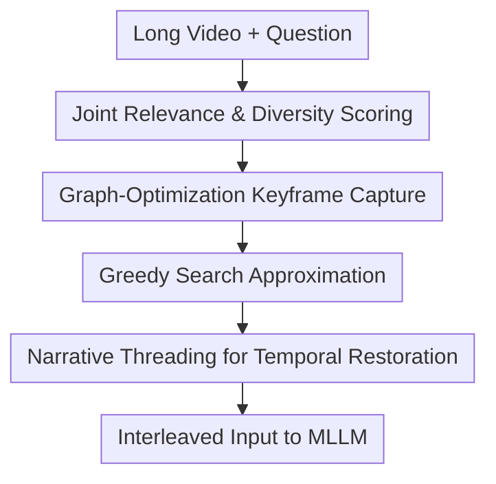

# Threading Keyframe with Narratives: MLLMs as Strong Long Video Comprehenders

**Conference**: ICLR 2026  
**OpenReview**: [https://openreview.net/forum?id=kyLS9EhPhY](https://openreview.net/forum?id=kyLS9EhPhY)  
**Code**: https://github.com/bofang98/Nar-KFC  
**Area**: Multimodal VLM / Long Video Understanding  
**Keywords**: Long Video Understanding, Keyframe Selection, MLLM, VideoQA, Training-free Inference

## TL;DR
Nar-KFC compresses long video inputs into "query-relevant and diverse keyframes + non-keyframe narratives inserted in real-time order," significantly enhancing performance in various long-video question-answering and open-ended generation tasks without retraining the MLLM.

## Background & Motivation
**Background**: Multimodal Large Language Models (MLLMs) can handle images and short videos, but long videos amplify problems to a new magnitude: a one-hour video contains thousands of frames even at $1$ fps, which exceeds context and memory budgets if fed directly into an MLLM. Existing approaches generally follow two paths: training specialized VideoLLMs to accommodate more visual tokens through long context, frame compression, or token merging; or converting videos into text descriptions for LLM reasoning over long text.

**Limitations of Prior Work**: The former is costly, usually requiring additional post-training, and more frames do not equate to more useful information, as redundant and irrelevant segments interfere with reasoning. The latter saves tokens but loses critical visual details (e.g., character actions, object states, spatial relationships) by entirely translating visual frames into short captions.

**Key Challenge**: Long video understanding requires both "few high-value visual evidences" and "sufficient continuous temporal context." Uniform sampling often misses query-relevant moments, while top-$K$ selection based only on query relevance tends to select redundant frames from the same short window. Keeping only captions collapses visual details into textual bias.

**Goal**: The authors aim to enable off-the-shelf MLLMs to better understand long videos without retraining. Specifically, the method must: 1) select a set of $K$ keyframes that are both relevant to the query and distinct from each other; 2) bridge the temporal gaps between sparse keyframes; and 3) ensure the final input is compact enough to serve as a plug-and-play module for mainstream MLLMs like InternVL, Qwen-VL, and LLaVA.

**Key Insight**: Keyframe selection is treated as a subgraph selection problem on a graph, rather than an empirical sampling rule. Each frame is a node, and the edge weights between frames encode both "how relevant a frame is to the query" and "how non-redundant the frames are relative to each other." This way, selection is not just ranking, but finding a set of complementary evidences within a limited budget.

**Core Idea**: Nar-KFC first uses graph-optimization-based KFC (KeyFrame Capture) to select query-relevant and diverse keyframes, then uses a lightweight captioner to generate short narratives for non-keyframes between them, threading visual frames and textual narratives according to their original temporal order.

## Method

### Overall Architecture
The input to Nar-KFC is a long video $V=\{f_i\}_{i=1}^N$ and a question $q$. The output is an interleaved context optimized for MLLM consumption rather than new model parameters. It first uses CLIP-like vision-language models to extract embeddings for each frame and the query to construct keyframe selection scores; then uses KFC to select $K$ keyframes from $N$ frames; finally, it extracts brief captions for unselected intermediate frames and inserts these narratives between adjacent keyframes to provide the MLLM with a continuous representation of "key visuals + intermediate stories."

The primary contributions lie in four areas: joint scoring of relevance and diversity, graph-optimization-based keyframe capture, greedy search approximation, and narrative threading. The first two determine "what visual evidence to select," the third ensures scalability for long videos, and the fourth resolves the lack of context caused by sparse keyframes.

Formally, standard video QA is written as $M(\{f_i\}_{i=1}^K, q) \rightarrow Answer$, where $K \ll N$. Nar-KFC modifies the source and arrangement of $\{f_i\}_{i=1}^K$: instead of uniform sampling, it uses $\{f_{y_1}, c_{y_1+\Delta}, \ldots, c_{y_2-\Delta}, f_{y_2}, \ldots, f_{y_K}\}$ as an interleaved context, where $f_{y_i}$ represents keyframes selected by KFC, $c_j$ are short-text narratives for non-keyframes, and $\Delta$ controls the narrative insertion interval.

### Key Designs
**1. Joint Relevance & Diversity Scoring: Avoiding Top-$K$ Clustering**

A common instinct for video QA is to find frames most similar to the query. however, adjacent frames are often semantically and visually redundant. Selecting the top $K$ by query-frame similarity often results in frames from a single continuous shot. The authors integrate query-relevance and frame-diversity into a single score: for frame $i$, relevance is $S_{QR}(i)=sim(f_i,q)$; for frames $i,j$, diversity is $S_{FD}(i,j)=\exp(-sim(f_i,f_j))$. The edge weight is defined as $S(i,j)=S_{QR}(i)+S_{FD}(i,j)$.

The intuition is that a good set of keyframes should not just be "individually relevant" but also "provide different evidence." $\exp(-sim(f_i,f_j))$ assigns lower diversity scores to similar frames while rewarding differences; retaining $S_{QR}$ prevents diversity from leading the model to completely irrelevant segments.

**2. Graph-Optimization Keyframe Capture: Frame Selection as Subgraph Selection**

KFC constructs a graph where frames are nodes and weights are the joint scores. Selecting $K$ keyframes is equivalent to finding a $K$-node subgraph in $N$ nodes that maximizes the total internal edge weights. Let $Y=\{y_1,\ldots,y_K\}$ be the set of selected frame indices; the goal is to maximize the sum of $S(i,j)$ for all selected frame pairs.

The authors formulate this as an Integer Quadratic Programming (IQP) problem:

$$
\max_x x^T Sx \quad
\text{s.t. } \mathbf{1}^T x=K,\; x_i\in\{0,1\}.
$$

Here, $x_i=1$ if frame $i$ is selected. This formulation defines the objective of a "good set of keyframes": it explains that a frame's value depends on its complementarity with other selected evidence.

**3. Greedy Search Approximation: Practical Module via Low-Rank Denoising and Refinement**

Solving IQP exactly requires searching $C(N,K)$, which is infeasible for long videos. Nar-KFC employs a practical greedy search: it first uses SVD for low-rank approximation of the score matrix to reduce noise; then downsamples the matrix to a fixed size; starts selection from the frame most relevant to the query, iteratively adding frames that maximize the cumulative score with the current set; finally, it performs refinement within a window of $k$ neighbors for each selected frame. The complexity is roughly $O(NK)$, making it a training-free preprocessing module.

**4. Narrative Threading: Bridging Gaps with Short Text**

While KFC solves "what to look at," long video understanding also requires "what happened in between." When keyframes are irregularly distributed, MLLMs see distant snapshots and may misunderstand action chains, event sequences, or causal relationships. Nar-KFC uses a lightweight captioner (defaulting to Qwen2-VL-2B) to generate short descriptions (max 15 words) for non-keyframes, inserted chronologically between keyframes.

This interleaving preserves the temporal structure of the video: keyframes provide high-fidelity visual evidence, while narratives provide low-cost continuous context. This is analogous to a dual-stream compression: keyframes act as a "slow branch" for important visual info, and captions act as a "fast branch" to sweep across a wider temporal range with fewer tokens.

### Loss & Training
Nar-KFC involves no additional training loss or fine-tuning of the target MLLM. Its "strategy" is an inference-time configuration: CLIP-ViT-L-336px is used for embeddings; candidate frames are sampled at $1$ fps; Greedy Search uses the top $N/4$ singular values for low-rank approximation, downsamples to $128 \times 128$, and uses a refinement window $k=2$. The captioner defaults to Qwen2-VL-2B with a prompt restricting captions to 15 words.

The default evaluation uses $8$ keyframes. The number of narratives is controlled by interval $\Delta$; approximately $210$ narratives are inserted in the main setup. This design balances coverage with redundancy.

## Key Experimental Results

### Main Results
Evaluation on Video-MME, LongVideoBench, and MLVU demonstrates consistent improvements across various MLLMs with the $8$-frame setting.

| Model / Method | Video-MME no sub. | Video-MME sub. | LongVideoBench | MLVU |
|--------|------|------|------|------|
| InternVL2-8B | 51.9 | 52.5 | 52.3 | 54.3 |
| InternVL2-8B + KFC | 53.5 | 55.0 | 53.3 | 62.2 |
| InternVL2-8B + Nar-KFC | 56.3 | 58.1 | 53.9 | 64.4 |
| Qwen2.5-VL-7B | 55.4 | 55.9 | 52.7 | 55.8 |
| Qwen2.5-VL-7B + Nar-KFC | 57.9 | 58.6 | 55.3 | 64.4 |
| LLaVA-Video-7B | 55.9 | 56.7 | 54.2 | 60.5 |
| LLaVA-Video-7B + Nar-KFC | 61.6 | 63.0 | 57.7 | 67.7 |
| InternVL3-8B | 59.0 | 60.0 | 53.6 | 60.9 |
| InternVL3-8B + Nar-KFC | 63.8 | 64.1 | 54.8 | 68.4 |

On Video-MME (no-subtitle), Nar-KFC improves baseline MLLMs by an average of $4.38\%$. Notably, InternVL3-8B + Nar-KFC reaches $63.8\%$, outperforming larger models like VILA-34B ($58.3\%$) and high-frame models like Video-XL ($55.5\%$ with 256 frames), proving that smart selection and threading can be more important than brute-force frame counts.

### Ablation Study
| Configuration | Video-MME sub. Overall | MLVU | Description |
|------|---------|------|------|
| Uniform | 52.5 | 54.3 | Default baseline |
| Uniform + Narratives | 55.4 | 59.4 | Adding narratives alone helps |
| KFC (IQP) | 55.1 | 62.0 | Theoretical optimization upper bound |
| KFC (GS) | 55.0 | 62.2 | Greedy Search matches IQP performance |
| w/o $S_{QR}$ | 51.8 | 57.3 | Removing query relevance causes significant drop |
| w/o $S_{FD}$ | 52.5 | 60.9 | Removing diversity degrades results back toward baseline |
| Nar-KFC | 58.1 | 64.4 | Best performance with both components |

### Key Findings
- **$S_{QR}$ is critical**: Removing query relevance leads to an drop from $55.0$ to $51.8$ on Video-MME, as keyframes must anchor around the question.
- **$S_{FD}$ suppresses shot redundancy**: Its removal scales Video-MME back to baseline levels, showing that coverage across different evidences is essential.
- **GS is an effective approximation**: GS results ($55.0/62.2$) are virtually identical to IQP ($55.1/62.0$), reducing exponential search to practical $O(NK)$.
- **Interleaving structure is vital**: Placing narratives before or after keyframes results in lower performance ($55.5$/$55.3$) compared to interleaved threading ($56.3$).

## Highlights & Insights
- **Mechanism Insight**: KFC formalizes the selection goal as finding a set of complementary evidences rather than just individual relevance. The subgraph perspective is more extensible than empirical rules.
- **Dual-Stream Positioning**: Nar-KFC uses captions as "temporal glue" rather than evidence replacement. This avoids the information loss of text-only methods while leveraging cheap tokens to expand the temporal field.
- **Engineering Value**: It is training-free and plug-and-play. It serves as an optimized input orchestration layer for any existing MLLM.

## Limitations & Future Work
- **Captioner Dependency**: While lightweight models suffice, the system is still vulnerable to captioning errors (e.g., missed fine-grained actions or attributes).
- **Embedding Limits**: Reliance on single-frame CLIP embeddings may struggle with complex temporal causality or audio-dependent evidence.
- **Multi-modality Expansion**: Currently focuses on visual and text; incorporating audio, transcript (ASR), and OCR would provide a more complete narrative for complex genres like documentaries or movies.

## Related Work & Insights
- **vs Uniform / High-frame**: Uniform sampling ignores query intent, and more frames increase noise. Nar-KFC maintains temporal coverage with text while focusing visuals on the query.
- **vs Caption-only**: Narrative-only methods lose visual nuance; Nar-KFC preserves high-fidelity anchors.
- **vs DPP/BOLT**: Unlike heuristic diversity rules, KFC optimizes a clear subgraph objective with an efficient approximation.

## Rating
- **Novelty**: ⭐⭐⭐⭐☆ Solid formalization of frame selection combined with pragmatic narrative threading.
- **Experimental Thoroughness**: ⭐⭐⭐⭐⭐ Extensive evaluation across models and benchmarks with thorough component ablations.
- **Writing Quality**: ⭐⭐⭐⭐☆ Clear and well-supported; some preprocessing and surgical details are dense but clarify the implementation.
- **Value**: ⭐⭐⭐⭐⭐ Highly practical for real-world long-video MLLM systems as a training-free boost.

<!-- RELATED:START -->

## Related Papers

- [\[ICLR 2026\] VideoChat-Flash: Hierarchical Compression for Long-Context Video Modeling](videochat-flash_hierarchical_compression_for_long-context_video_modeling.md)
- [\[ICLR 2026\] BaseReward: A Strong Baseline for Multimodal Reward Model](basereward_a_strong_baseline_for_multimodal_reward_model.md)
- [\[CVPR 2025\] Video-XL: Extra-Long Vision Language Model for Hour-Scale Video Understanding](../../CVPR2025/multimodal_vlm/video-xl_extra-long_vision_language_model_for_hour-scale_video_understanding.md)
- [\[ICLR 2026\] MMDuet2: Enhancing Proactive Interaction of Video MLLMs with Multi-Turn Reinforcement Learning](mmduet2_enhancing_proactive_interaction_of_video_mllms_with_multi-turn_reinforce.md)
- [\[CVPR 2026\] Scaling the Long Video Understanding of Multimodal Large Language Models via Visual Memory Mechanism](../../CVPR2026/multimodal_vlm/scaling_the_long_video_understanding_of_multimodal_large_language_models_via_vis.md)

<!-- RELATED:END -->
## Related Papers

- [\[ICLR 2026\] VideoChat-Flash: Hierarchical Compression for Long-Context Video Modeling](videochat-flash_hierarchical_compression_for_long-context_video_modeling.md)
- [\[ICLR 2026\] BaseReward: A Strong Baseline for Multimodal Reward Model](basereward_a_strong_baseline_for_multimodal_reward_model.md)
- [\[CVPR 2026\] MSJoE: Jointly Evolving MLLM and Sampler for Efficient Long-Form Video Understanding](../../CVPR2026/multimodal_vlm/msjoe_jointly_evolving_mllm_and_sampler_for_efficient_long-form_video_understand.md)
- [\[CVPR 2025\] Video-XL: Extra-Long Vision Language Model for Hour-Scale Video Understanding](../../CVPR2025/multimodal_vlm/video-xl_extra-long_vision_language_model_for_hour-scale_video_understanding.md)
- [\[ICLR 2026\] MMDuet2: Enhancing Proactive Interaction of Video MLLMs with Multi-Turn Reinforcement Learning](mmduet2_enhancing_proactive_interaction_of_video_mllms_with_multi-turn_reinforce.md)

<!-- RELATED:END -->
