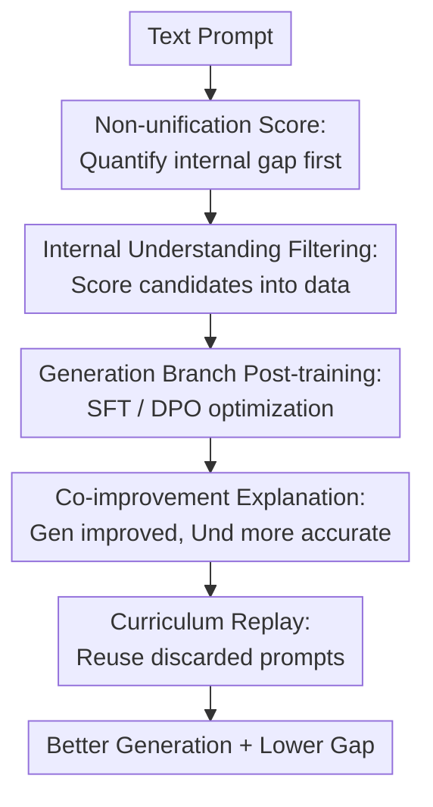

# Turning Internal Gap into Self-Improvement: Promoting the Generation-Understanding Unification in MLLMs

**Conference**: ICLR2026  
**OpenReview**: [https://openreview.net/forum?id=tVnml9Q4XW](https://openreview.net/forum?id=tVnml9Q4XW)  
**Code**: Not yet public  
**Area**: Multimodal VLM  
**Keywords**: Unified Multimodal Models, Text-to-Image Generation, Generation-Understanding Unification, Self-Improvement, Curriculum Learning

## TL;DR
This paper first validates that the generation branch of unified MLLMs is often weaker than the understanding branch using a "non-unification score" system. It then transforms this internal gap into a self-improvement signal without external reward models: the understanding branch filters generation candidates to construct SFT/DPO data, and curriculum replay is used to further exploit hard samples, simultaneously improving generation quality, understanding discriminative ability, and generation-understanding consistency.

## Background & Motivation
**Background**: Unified Multimodal Large Language Models (unified MLLMs) aim to enable a single model to both answer questions based on images and generate images from text. Models such as Janus-Pro, Show-o, EMU3, VILA-U, BAGEL, and BLIP3-o attempt to place visual understanding and visual generation into the same or coupled architectures, so that "understanding" and "creation" are no longer two completely separate systems.

**Limitations of Prior Work**: Nominal unification does not equate to actual functional unification. Many models can identify details and logical errors when viewing images but commit the same errors when generating them. For example, if a prompt requires "a plush lion in front of a mirror," the generation branch might produce an image violating physical reflection laws; however, the same model's understanding branch can point out that the mirror should not show the front view. This indicates an awkward misalignment within the model: it knows what is correct but cannot generate it.

**Key Challenge**: Previous methods to mitigate this misalignment often relied on external reward models, additional supervised data, or specialized generation evaluators. While these improve generation, they fail to address a fundamental question: if unified MLLMs inherently possess stronger understanding capabilities, can these be used directly as free supervisory signals to train the weaker generation branch? In other words, the internal gap is not just a defect but also a potential entry point for self-improvement.

**Goal**: The authors decompose the problem into four steps: first, define an internal consistency metric independent of external evaluators to confirm whether unified MLLMs are generally non-unified; second, determine if non-unification stems from weak generation or misunderstanding; third, use the stronger understanding branch to filter generation candidates and construct post-training data; fourth, explain why training only for generation objectives also improves understanding, and leverage this synergistic improvement for curriculum-based data expansion.

**Key Insight**: The crucial observation is that the understanding branch of a unified MLLM is often more reliable than its generation branch. Instead of treating this merely as an evaluation conclusion, the authors transform it into a training mechanism: the generation branch produces multiple candidates, and the understanding branch judges which ones align with the prompt. Aligned samples serve as positive data, while unaligned ones serve as negative data or are temporarily stored. Thus, the model obtains training signals from its own internal inconsistency without an external reward model.

**Core Idea**: Use the model's own stronger understanding branch to provide candidate filtering and preference supervision for the weaker generation branch, converting the internal generation-understanding gap into self-improvement data, and utilizing curriculum replay to allow the progressively enhanced model to exploit hard samples that were initially unusable.

## Method

### Overall Architecture
The method consists of three levels: "discovering the gap, utilizing the gap, and exploiting hard samples." First, the model performs discriminative understanding of its own generation results, using a non-unification score to measure consistency. Next, during training, the generation branch samples multiple candidates for each prompt, and the understanding branch scores them to construct SFT or DPO data. Finally, as the model improves, it revisits prompts that initially failed to yield qualified candidates, adding samples that can now be generated and recognized by the understanding branch into the training set.

The core of this pipeline is that external models are used only for analysis and evaluation, not for the core self-improvement data construction. The training signal originates from the model's own understanding branch, termed "internal gap-based self-improvement."

Specifically, given a prompt $y$, the generation branch produces $N$ candidates $\{x_i\}_{i=1}^N=\pi_\theta^{gen}(y)$. The understanding branch receives the candidate image and the question $q(y)$, i.e., "Does this image describe prompt $y$?", and outputs a binary judgment or corresponding probability. Aligned images enter the chosen set, while unaligned ones are used as rejected samples. SFT uses only chosen images for supervision, while DPO uses chosen/rejected pairs for preference optimization.

### Key Designs
**1. Non-unification Score: Quantifying internal gap without external judges**

The authors define a non-unification score to measure whether generation results pass the model's own understanding check. Given a text prompt $y$, the model generates an image $x=\pi_\theta^{gen}(y)$; it then constructs a question $q(y)$ for the understanding branch: "Does image $x$ describe $y$?". If the output is 0, internal generation-understanding inconsistency is detected. The metric is: $\mathbb{E}_{(x,y)}\mathbb{I}[\pi_\theta^{und}(x,q(y))=0]$.

This metric evaluates internal consistency rather than absolute quality as perceived by external models. The authors controlled for task difficulty: simple tasks might lead to an underestimated gap, while difficult tasks might cause understanding failure, overestimating the gap. Tasks from GenEval, T2I-CompBench++, and Science-T2I were categorized into easy/medium/hard. Results indicated that non-unification is prevalent, with VILA-U reaching a non-unification score near 60% on hard tasks.

**2. Internal Understanding Filtering: Converting "understanding is stronger than generation" into post-training data**

After confirming the gap, the authors determined whether it arose from "generation failure" or "understanding misjudgment." Using Qwen2.5-VL-72B-Instruct and human verification, they found that the understanding branch's rejections were justified in most cases, with weak generation exceeding 50% and reaching nearly 100% in some tasks. This is critical: if understanding were unreliable, it would amplify errors; since the primary issue is weak generation, the understanding branch serves as a valid internal filter.

For each prompt, $N$ candidates are generated. The understanding branch scores them: "Does this original image describe {prompt}? ... score 1 or 0". SFT adds $(y,x_{chosen})$ pairs (score 1) to the supervision set. DPO selects the most positive-like chosen image and most negative-like rejected image to form $(y,x_{chosen},x_{rejected})$. Prompts with no qualified candidates are moved to a discard pool $B$ for curriculum replay.

**3. Updating Only the Shared LLM: Linking generation training to understanding capability**

The authors updated only the shared LLM components of Janus-Pro and Show-o. This choice addresses the nature of unified MLLMs: if both branches share a language backbone or representation channel, updates to the generation likelihood will alter the joint dynamics of processing vision-language conditions. Ablations showed that for Janus-Pro, training only the LLM significantly improved generation, understanding, and unification; updating the projector or vision tower provided no stable gains and sometimes harmed understanding.

The co-improvement is explained via learning dynamics. For SFT, updates to generation $\Delta G_t$ and understanding $\Delta U_t$ are influenced by a similar empirical neural tangent kernel (eNTK). When an old image $(y_0,x_0)$ misjudged as "aligned" is similar to a post-training sample $(y_u,x_u)$, the understanding update is dominated by the shared eNTK. Reducing the probability of the erroneous generation $\pi_\theta(x_0\mid y_0)$ also reduces the probability of the understanding branch misaligning $x_0$ with $y_0$.

**4. Curriculum Replay: Re-integrating hard prompts**

Standard self-improvement is limited if the initial model fails to generate any qualified candidates for a prompt. The authors maintain a discard pool $B$. As the model strengthens over several epochs, it regenerates and rescores candidates for prompts in $B$. If qualified images appear, they are added to the SFT data and removed from $B$.

This curriculum replay is determined by the model's evolving capability rather than manual difficulty labels. In Janus-Pro SFT experiments, approximately 1,091 additional samples were recovered via curriculum replay from an original set of 2,265, significantly expanding the usable data pool compared to single-branch enhancement.

### Loss & Training
The SFT version uses standard negative log-likelihood (NLL) on images selected by the understanding branch. If $D_{SFT}$ is the set of chosen samples, the objective is to maximize $\log \pi_\theta(x_{chosen}\mid y)$. The DPO version uses chosen/rejected pairs to optimize preference probability, incorporating an NLL term for the preferred response to enhance stability.

For Janus-Pro-7B and Show-o, ~6,000 training prompts from T2I-CompBench++ were used, with $N=10$ candidates per prompt. Only the LLM was updated. SFT/DPO epochs were 20/30 for Janus-Pro and Show-o. Curriculum replay was triggered at epoch 10. Training took 7-8 hours on 4 A800 GPUs. The curriculum versions are denoted as C-SFT and C-DPO.

## Key Experimental Results

### Main Results
The authors evaluated generation quality (Gen.), understanding win rate (Und.), and the non-unification score (Non.). Results on T2I-CompBench++ show significant absolute gains for Janus-Pro.

| Model / Method | Gen. Overall ↑ | Und. Overall ↑ | Non. Overall ↓ | Description |
|--------|------|------|------|------|
| Janus-Pro-7B | 35.21 | 50.00 | 26.22 | Original unified MLLM |
| Janus-Pro-7B + SFT | 43.29 | 58.39 | 16.98 | Internal filtering; Gen +8, Non -9 |
| Janus-Pro-7B + C-SFT | 44.18 | 61.13 | 16.92 | Curriculum replay gains |
| Janus-Pro-7B + DPO | 35.44 | 55.62 | 25.97 | DPO helps Und. more than Gen. |
| T2I-R1 (Ext. Reward) | 42.22 | 55.67 | 18.33 | Strong external reward baseline |
| Show-o | 49.66 | 50.00 | 0.95 | Low initial non-unification score |
| Show-o + SFT | 52.67 | 66.67 | 0.11 | Gen +3, Non near 0 |
| Show-o + C-SFT | 52.82 | 66.67 | 0.06 | Further reduced gap |
| HermesFlow (Ext. Reward)| 49.65 | 41.67 | 0.83 | Show-o external baseline |

On GenEval, Janus-Pro's Gen. improved from 79.36 to 80.87 (C-SFT). On Science-T2I-S, Janus-Pro improved from 24.49 to 25.18 (C-SFT).

### Ablation Study
| Config | Key Metric | Description |
|------|---------|------|
| Janus-Pro-7B baseline | Gen. 35.21 / Und. 50.00 / Non. 26.22 | No self-improvement |
| + LLM only | Gen. 43.29 / Und. 58.39 / Non. 16.98 | Primary gains achieved |
| + LLM and Projector | Gen. 42.10 / Und. 51.42 / Non. 18.82 | Understanding and unification degraded |
| + LLM, Proj, and Vision Tower | Gen. 43.18 / Und. 55.64 / Non. 17.02 | Not significantly better than LLM only |
| Janus-Pro SFT, $N=2$ | 254 samples constructed | Too few qualified candidates |
| Janus-Pro SFT, $N=10$ | 2,265 samples constructed | Data volume saturated |
| C-SFT at epoch 10 | Gen. 44.18 / Und. 61.13 / Non. 16.92 | Replay after capability gain is better |

### Key Findings
- Models and tasks with larger internal gaps benefit more. Texture, Shape, and Spatial tasks contributed more post-training samples and saw larger gains.
- Generation objectives lead to co-improvement in understanding. Janus-Pro + SFT improved its understanding win rate from 50.00 to 58.39, with stable gains on POPE, MMB, SEED, and MMMU (32.86 to 35.24).
- Curriculum replay value lies in "dynamic data expansion." It converts prompts that the initial model could not handle into learnable data.
- External reward models still provide a performance ceiling, but the proposed method reaches similar performance levels without external signals.

## Highlights & Insights
- Converting a defect into a training signal is the paper's most elegant contribution. Instead of external reward models, it leverages the model's own ability to "realize" its generation errors.
- The non-unification score is a simple yet powerful diagnostic tool for studying the internal consistency of unified models.
- Curriculum replay transforms co-improvement into an operational algorithm, enabling the model to learn from "hard" samples as it evolves.
- The theoretical explanation using eNTK provides a mechanistic view of why generation training corrects false positive understanding.

## Limitations & Future Work
- The experiments mostly focus on Janus-Pro and Show-o. Models with Mojo-like or decoupled architectures (like BAGEL) show that the benefit is sensitive to the degree of shared parameters.
- The understanding branch is treated as the judge, but it is not infallible. Systemic biases in the understanding branch could be reinforced.
- Evaluation is centered on text-to-image compositionality. Validation in open-ended creation, video generation, or long-context generation is needed.
- Curriculum replay is currently based on fixed epochs; future work could explore adaptive triggers based on confidence or entropy.

## Related Work & Insights
- **vs HermesFlow**: Unlike HermesFlow, which relies on external BERT/QA signals, this method uses pure internal signals.
- **vs T2I-R1**: T2I-R1 uses external reward models for high quality. This method achieves competitive results using only internal understanding, suggesting internal signals are highly valuable.
- **Inspiration**: This paradigm can be extended to video generation-understanding or robot action-state understanding. Wherever an asymmetry exists between discriminative and generative capabilities, internal discriminative power can be converted into self-improvement data.

## Rating
- Novelty: ⭐⭐⭐⭐☆ Leveraging internal gaps for training without external signals is a clear insight; the combination of the non-unification score and curriculum learning is distinctive.
- Experimental Thoroughness: ⭐⭐⭐⭐☆ Solid coverage across six models for gap verification and multiple benchmarks for SFT/DPO/Curriculum variants.
- Writing Quality: ⭐⭐⭐⭐☆ Logical and complete flow from phenomenon to theory and application.
- Value: ⭐⭐⭐⭐⭐ Provides a reusable paradigm for multimodal self-training without external rewards by treating "strong understanding, weak generation" as a resource.

<!-- RELATED:START -->

## Related Papers

- [\[ICLR 2026\] Understanding vs. Generation: Navigating Optimization Dilemma in Multimodal Models](understanding_vs_generation_navigating_optimization_dilemma_in_multimodal_models.md)
- [\[NeurIPS 2025\] HermesFlow: Seamlessly Closing the Gap in Multimodal Understanding and Generation](../../NeurIPS2025/multimodal_vlm/hermesflow_seamlessly_closing_the_gap_in_multimodal_understanding_and_generation.md)
- [\[ICLR 2026\] ChartGalaxy: A Dataset for Infographic Chart Understanding and Generation](chartgalaxy_a_dataset_for_infographic_chart_understanding_and_generation.md)
- [\[CVPR 2026\] DuetSVG: Unified Multimodal SVG Generation with Internal Visual Guidance](../../CVPR2026/multimodal_vlm/duetsvg_unified_multimodal_svg_generation_with_internal_visual_guidance.md)
- [\[ICLR 2026\] UniLIP: Revamping CLIP to Unify Multimodal Understanding, Generation, and Editing](unilip_adapting_clip_for_unified_multimodal_understanding_generation_and_editing.md)

<!-- RELATED:END -->
