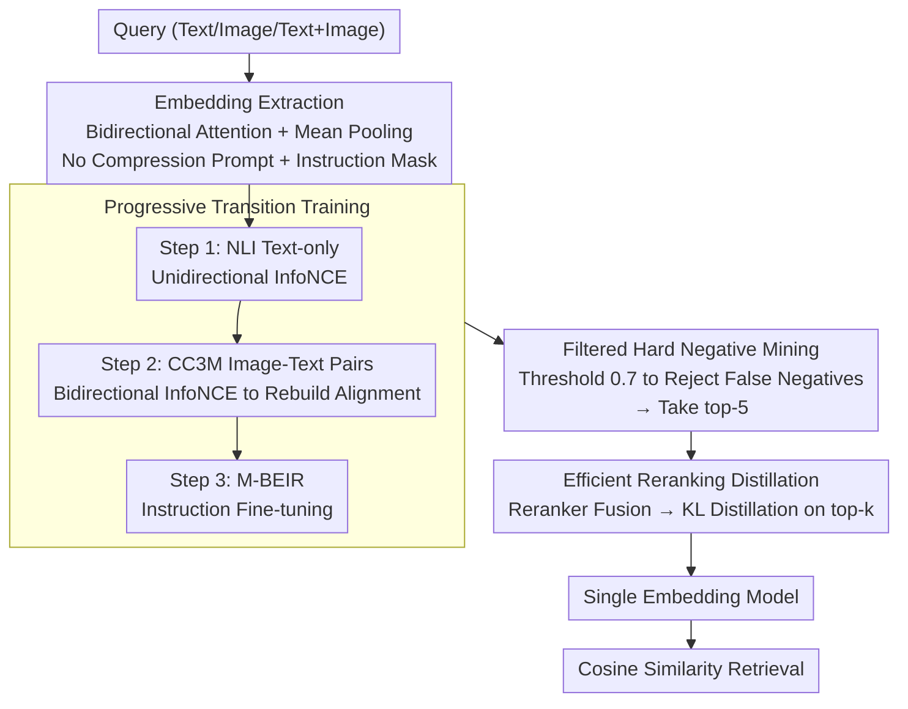

# U-MARVEL: Unveiling Key Factors for Universal Multimodal Retrieval via Embedding Learning

**Conference**: ICLR 2026  
**arXiv**: [2507.14902](https://arxiv.org/abs/2507.14902)  
**Code**: [GitHub](https://github.com/chaxjli/U-MARVEL)  
**Area**: Multimodal VLM  
**Keywords**: Universal Multimodal Retrieval, MLLM Embedding Learning, Contrastive Learning, Progressive Training, Reranking Distillation

## TL;DR

The authors systematically ablate the design space of MLLM embedding learning, revealing that bidirectional attention + mean pooling outperforms the mainstream last token approach, and learnable temperature is a significantly undervalued key factor. Based on these findings, the U-MARVEL three-stage framework (progressive transition → filtered hard negatives → reranking distillation) is constructed. It achieves a 63.2% Avg on M-BEIR, substantially surpassing existing SOTA as a single model, and leads in zero-shot transfer for CIR and T2V.

## Background & Motivation

**Background**: Universal Multimodal Retrieval (UMR) requires a single retriever to handle complex retrieval scenarios where queries and candidates span text, images, and their combinations. Recent methods like LamRA, MM-Embed, GME, and UniME are based on MLLM + contrastive learning, but their architectural choices (embedding extraction, training hyperparameters, negative sampling strategies) vary significantly, lacking a unified study to answer "which design decisions truly matter."

**Limitations of Prior Work**: Decoder-only MLLMs are naturally served for autoregressive generation, and numerous unexplored design choices exist regarding how to adapt them into embedding models. Existing methods almost exclusively follow the paradigm of last token + causal attention + compressed prompts, but whether this practice is optimal has never been systematically verified. Furthermore, while recall-then-rerank improves accuracy, it doubles inference overhead, and an efficient single-model alternative is lacking.

**Key Challenge**: Multiple seemingly insignificant details (attention direction, pooling strategies, temperature parameters) may have a decisive impact on performance, but the community lacks a systematic understanding of them.

**Goal**: (1) Embedding extraction: What is the optimal adaptation method from decoder-only to embedder? (2) Training strategy: How do InfoNCE batch size, learning rate (LR), and temperature interact? How to avoid collapse in hard negative sampling? (3) Efficiency: Can recall+rerank be distilled into a single model while maintaining accuracy?

**Key Insight**: Instead of directly proposing a method, the authors first implement a general pipeline and then systematically ablate along three axes. Every design decision is derived from experimental evidence, finally assembling them into a unified framework. This "understand before construct" paradigm ensures each decision is data-backed.

**Core Idea**: Through systematic ablation, neglected key factors (bidirectional + mean pooling, learnable temperature, filtered hard negatives) are discovered and integrated into a three-stage progressive training framework with efficient distillation to achieve single-model SOTA.

## Method

### Overall Architecture

U-MARVEL aims to answer a question ignored by the community: when transforming a decoder-only MLLM meant for autoregressive generation into a universal multimodal retriever, which design decisions actually matter? The approach is "understand before construct"—implementing a general contrastive learning pipeline and ablating three axes: how embeddings are extracted from token sequences, how contrastive objective hyperparameters are tuned, and how to compress a recall+rerank dual-model into a single model. Only configurations that win on each axis are assembled into the final framework.

The resulting U-MARVEL uses Qwen2-VL-7B-Instruct as the backbone and is fine-tuned via LoRA. It can be viewed in two layers: "Extraction" and "Training." The bottom layer is the **embedding extraction architecture** (bidirectional attention + mean pooling + removing compression prompt + instruction masking), which determines how a query of any modality is compressed into a retrieval vector. The upper layer is **three-stage progressive training**—transitioning the model smoothly from pure text retrieval to multimodal instruction retrieval in three steps, followed by filtered hard negative mining to further separate difficult candidates, and finally distilling the recall+rerank dual-model into a single model. During inference, a query (text/image/text+image) is processed by the extraction layer to obtain a unified vector for candidate retrieval via cosine similarity.

### Key Designs

**1. Embedding Extraction: Bidirectional Attention + Mean Pooling + No Compression Prompt**

This is the most core discovery of the paper. The community's mainstream approach is almost identical—causal attention + a compression prompt ("Summarize above image and sentence in one word: emb") + taking the last token as the embedding. The authors ablated 5 combinations of attention direction, pooling methods, and compression prompts. The conclusion is that **bidirectional attention + mean pooling + no compression prompt** is optimal (Local 57.2 vs mainstream 56.6). The key insight is that compression prompts and mean pooling essentially conflict: the prompt forces the model to squeeze all information into the last token, while mean pooling requires information to be spread uniformly across all tokens. In ablations, replacing the last token with the mean token without removing the prompt caused performance to plummet by 22.9%/27.2%, reflecting this conflict. Only after removing the prompt can mean pooling properly aggregate global information. Combined with bidirectional attention, every token can see the full context, eliminating the recency bias inherent in the last token. This conclusion directly challenges the community's default last token paradigm—agreeing with NV-Embed in the text domain but contradicting GME, which is also based on Qwen2-VL.

Switching to bidirectional attention also introduced **instruction masking**. Under bidirectional self-attention, instruction tokens already permeate their semantics into every query token during the forward pass. If instruction tokens are included during mean pooling, it results in redundant calculation. Thus, instruction tokens are masked during the pooling stage, and only the query part is averaged. Although the numerical gain is small (+0.1%/+0.3%), it theoretically eliminates instruction bias, allowing the embedding to reflect the semantic match between query and candidate more purely.

**2. Progressive Transition Training: Smoothly Transforming Decoder-only into Embedding Models**

Directly fine-tuning an MLLM designed for generation on multimodal retrieval data involves a task gap that is too large, leading to sub-optimal results. The authors split the adaptation into three steps of increasing difficulty: Step 1 uses unidirectional InfoNCE on NLI text to establish the semantic retrieval capability of the text encoder; Step 2 switches to bidirectional InfoNCE on CC3M image-text pairs to rebuild the cross-modal alignment between text and visual encoders—since switching to bidirectional attention breaks previous alignment in the MLLM, it must be explicitly reconstructed; Step 3 performs instruction fine-tuning on M-BEIR multimodal retrieval data. An interesting detail is that the concise text in CC3M is better for retrieval than the detailed descriptions in ShareGPT4V in Step 2, suggesting that alignment requires clean image-text correspondence rather than long-winded descriptions. Each step builds on the previous one, ensuring the adaptation path converges smoothly and providing the basis for zero-shot generalization to CIR and video retrieval.

**3. Filtered Hard Negative Mining: Rejecting False Negatives before Mining**

Training with hard negatives on the transition-trained model further separates queries from confusing candidates. However, directly taking top-k hard negatives can cause collapse—retrieval data often has missing labels, and the highest similarity "hard negatives" are often actual positives (false negatives). Treating them as negatives provides contradictory gradients. The authors' approach is to first set a similarity threshold of 0.7 to filter out high-similarity candidates (suspected unlabelled positives) and then take the top-5 from the remainder as hard negatives, mixed with in-batch negatives. This filtering improved performance from 60.6 to 61.7, indicating that the key to hard negative mining is not "how hard" it is, but "cleaning the false negatives first."

**4. Efficient Reranking Distillation: Distilling Recall+Rerank into a Single Model**

Recall-then-rerank improves accuracy but doubles inference cost. U-MARVEL aims to bring single-model performance close to dual-model results. The authors first train a generative reranker (outputting YES/NO for each query-candidate pair), fuse its scores with the recall model ($\alpha=0.5$) as the teacher, and then distill the teacher into a single student using KL divergence. The clever part is the distillation range: while traditional methods distill on the entire $O(n^2)$ similarity matrix, U-MARVEL only distills on the top-k hard negatives ($O(nk)$) for each query. This reduces computation to 4.1% of traditional methods (14h vs 340h) while increasing training feature diversity by 26 times. The distilled single model (63.2%) closely approaches the dual model (63.7%), with a gap of only 0.5%.

### Loss & Training

The contrastive learning objective is InfoNCE:

$$\mathcal{L}_{\text{InfoNCE}}=-\log\frac{\exp(\text{sim}(e_q,e_{c^+})/\tau)}{\sum_i\exp(\text{sim}(e_q,e_{c_i})/\tau)}$$

The authors found that two often-neglected hyperparameters have strong interactions with training scale:

- **Batch size must be scaled linearly with learning rate**: Increasing batch size without adjusting LR is almost ineffective (480→1920 only yields +0.2%); only with linear LR scaling is the gain significant (+1.7%), consistent with the LR scaling rule in vision training.
- **Learnable temperature ≫ fixed temperature**: Changing $\tau$ from a fixed 0.05 to a learnable parameter improves results by 1.2~1.4% at the same batch size—this gain even exceeds the effect of expanding the batch size from 480 to 3840. Learnable temperature adaptively adjusts the sharpness of the softmax distribution and is a significantly undervalued key factor.

## Key Experimental Results

### Main Results — M-BEIR Benchmark (Local Pool)

| Method | Type | $q^t→c^i$ | $q^t→c^t$ | $q^i→c^t$ | $(q^i,q^t)→c^i$ | Avg |
|------|------|-----------|-----------|-----------|-----------------|-----|
| UniIR-CLIP | Single Model | 30.3 | 82.9 | 45.5 | 46.3 | 50.6 |
| LamRA-Ret | Single Model | 35.2 | 83.9 | 54.1 | 64.8 | 56.6 |
| GME-Qwen2VL-7B | Single Model | 37.7 | 83.3 | 55.2 | 67.5 | 58.6 |
| UniME | Single Model | 39.1 | 84.6 | 55.0 | 68.3 | 59.5 |
| **Ours (U-MARVEL)** | **Single Model** | **40.2** | **85.0** | **58.3** | **72.1** | **63.2** |
| LamRA(+reranker) | Dual Model | 41.6 | 85.6 | 59.2 | 73.8 | 63.7 |
| **Ours⁺ (U-MARVEL⁺)**(+reranker) | Dual Model | **41.8** | **85.6** | **63.7** | **73.9** | **64.8** |

U-MARVEL's single model (63.2%) is already close to LamRA's dual model (63.7%), validating the efficiency of the distillation strategy. With a reranker, U-MARVEL⁺ reaches 64.8%, leading overall.

### Ablation Study — Component Contributions

| Configuration | Local Avg | Global Avg | Description |
|------|-----------|------------|------|
| Baseline (causal + last token) | 56.6 | 54.8 | Default mainstream scheme |
| + Bidir+Mean+No Prompt | 57.2 | 55.2 | Embedding extraction optimization, +0.6 |
| + Instruction Mask | 57.3 | 55.5 | Eliminating instruction bias |
| + Progressive Transition (NLI+CC3M) | 57.7 | 55.8 | Progressive pre-training, cumulative +1.1 |
| + Batch/LR/Temp Optimization | 60.1 | — | Interaction of training params, +2.4 |
| + Filtered Hard Negatives | 61.7 | 59.9 | Hard negative mining, +1.6 |
| + Reranking Distillation | **63.2** | **60.7** | Distillation, +1.5 |

### Key Findings

- **Bidir+Mean is an undervalued optimal embedding scheme**: The community's mainstream Last token + causal + prompt approach is not the optimal solution. The core reason is that last tokens suffer from recency bias, while mean pooling + bidirectional attention allows each token to aggregate context more comprehensively.
- **Learnable temperature is the most neglected key factor**: At batch = 3840, the gap between learnable vs fixed temperature is 1.2%, an improvement greater than increasing batch size from 480 to 3840.
- **Hard negatives must filter false negatives**: Directly using top-k hard negatives inevitably leads to collapse; threshold filtering is an essential tool.
- **Improved distillation brings single models close to dual models**: With only 4.1% of the traditional distillation computational cost, the single model accuracy gap is reduced to only 0.5%.

## Highlights & Insights

- **"Understand before construct" research paradigm**: Instead of directly proposing a method, the authors understand the influence of each design decision through systematic ablation before assembly. This makes every choice experimental-backed and more reliable/reproducible.
- **Unifying three neglected factors**: Bidirectional+mean pooling, learnable temperature, and filtered hard negatives seem like minor changes, but they cumulatively bring a 6.6% absolute gain (56.6→63.2), showing that for MLLM embedding learning, "the devil is in the details."
- **Ingenious efficient distillation**: Reducing the distillation range from $O(n^2)$ of the full similarity matrix to $O(nk)$ of the top-k range reduces computation to 4.1% while increasing feature diversity 26 times. This idea is transferable to knowledge distillation in any recall-then-rerank system.

## Limitations & Future Work

- **Limited modality coverage**: Only supports text and images, and has not extended to audio or video (while zero-shot video retrieval is decent, temporal modeling is lacking, and the reranker even degrades on video).
- **Model scale constraints**: Validated only on 7B models; performance on larger (70B+) or smaller (1B) models is unknown.
- **RAG scenarios unverified**: End-to-end effectiveness as a retriever in a RAG pipeline has not been evaluated.
- **Hard negative threshold of 0.7 is manual**: Optimal thresholds under different data distributions may vary, and adaptive threshold strategies could be considered.
- **Progressive transition data selection**: The comparison between CC3M and ShareGPT4V may be confounded by data scale and quality; stricter controlled experiments are needed.

## Related Work & Insights

- **vs GME**: GME also uses Qwen2-VL for universal multimodal retrieval but follows the last token + causal attention scheme. U-MARVEL's ablation directly challenges GME's conclusion that "last token is superior to mean pooling," suggesting GME's conclusion may be limited by its experimental design which didn't remove compression prompts.
- **vs LamRA**: LamRA reaches 63.7% using a recall+rerank dual-model, while U-MARVEL reaches 63.2% with a single model via distillation, significantly improving inference efficiency. U-MARVEL adopts the generative reranker design from LamRA but adds fused distillation.
- **vs NV-Embed**: NV-Embed also found that bidir + mean pooling outperforms last token in the pure text embedding domain. U-MARVEL extends this to multimodal scenarios and further decouples the conflict between compression prompts and pooling methods.

## Rating

- Novelty: ⭐⭐⭐⭐ (Core contribution is in systematic ablation rather than a brand-new architecture, but revealed insights are highly valuable)
- Experimental Thoroughness: ⭐⭐⭐⭐⭐ (Ablation is extremely detailed; every decision has comparative experiments; M-BEIR + zero-shot CIR + T2V are fully covered)
- Writing Quality: ⭐⭐⭐⭐⭐ (Clear structure; narrative logic from ablation to framework is very smooth)
- Value: ⭐⭐⭐⭐ (Significant reference value for the MLLM embedding learning community; multiple neglected factors can be directly reused)

<!-- RELATED:START -->

## Related Papers

- [\[NeurIPS 2025\] Generalized Contrastive Learning for Universal Multimodal Retrieval](../../NeurIPS2025/multimodal_vlm/generalized_contrastive_learning_for_universal_multimodal_re.md)
- [\[ICML 2025\] Universal Retrieval for Multimodal Trajectory Modeling](../../ICML2025/multimodal_vlm/universal_retrieval_for_multimodal_trajectory_modeling.md)
- [\[ICLR 2026\] PHyCLIP: $\ell_1$-Product of Hyperbolic Factors Unifies Hierarchy and Compositionality in Vision-Language Representation Learning](phyclip_ell_1-product_of_hyperbolic_factors_unifies_hierarchy_and_compositionali.md)
- [\[CVPR 2026\] MuCo: Multi-turn Contrastive Learning for Multimodal Embedding Model](../../CVPR2026/multimodal_vlm/muco_multi-turn_contrastive_learning_for_multimodal_embedding_model.md)
- [\[ACL 2025\] MegaPairs: Massive Data Synthesis For Universal Multimodal Retrieval](../../ACL2025/multimodal_vlm/megapairs_massive_data_synthesis_for_universal_multimodal_retrieval.md)

<!-- RELATED:END -->
