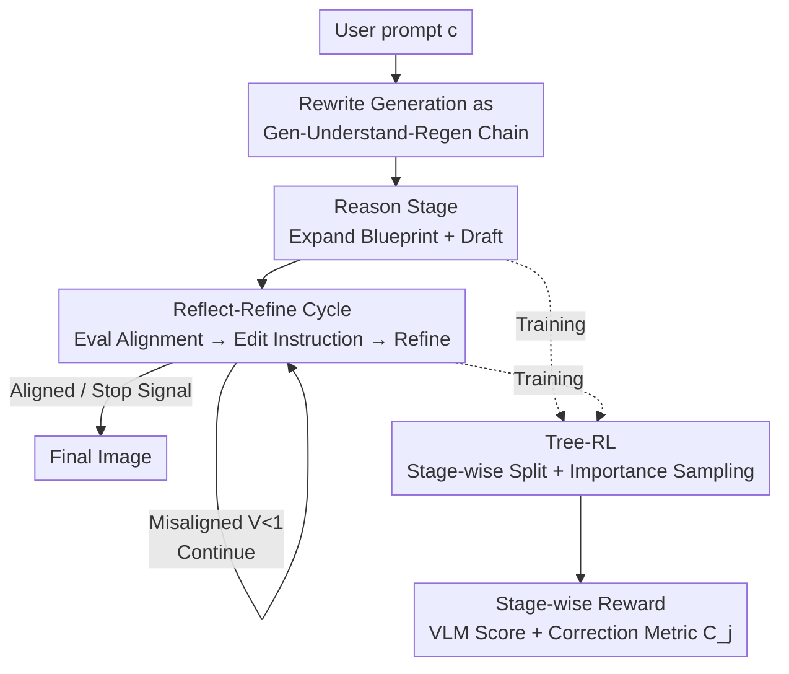

# Understanding vs. Generation: Navigating Optimization Dilemma in Multimodal Models

**Conference**: ICLR2026  
**OpenReview**: [https://openreview.net/forum?id=1smez00sCm](https://openreview.net/forum?id=1smez00sCm)  
**Code**: https://github.com/sen-ye/R3  
**Area**: Multimodal VLM / Unified Understanding and Generation Models  
**Keywords**: Unified Multimodal Models, Understanding-Generation Trade-off, Generative Chain-of-Thought, Reinforcement Learning, Self-Reflection

## TL;DR
To address the optimization dilemma in unified multimodal models where "enhancing generation degrades understanding and vice versa," this paper proposes the Reason-Reflect-Refine (R3) framework. It reformulates single-step image generation into a multi-step chain process of "Reason → Generate → Reflect → Refine," making generation inherently dependent on the model's understanding capabilities. Combined with Tree-structured Reinforcement Learning, the method significantly improves both generation (GenEval++ 0.371 → 0.689) and understanding (ITA 60.6 → 73.4) on BAGEL.

## Background & Motivation
**Background**: Unified multimodal models aim to equip a single model with both visual understanding (VQA, dense captioning) and visual generation (text-to-image) capabilities, which is regarded as a key step towards AGI. Models like BAGEL, Janus-Pro, and Chameleon represent this direction.

**Limitations of Prior Work**: It is difficult to enhance understanding and generation simultaneously. Models fine-tuned specifically for high-fidelity image synthesis (e.g., diffusion architectures) often perform poorly on tasks requiring precise visual understanding, such as object counting or spatial reasoning. Conversely, models optimized for VQA/dense captioning significantly lag in creativity and generation quality. Controlled experiments on BAGEL (Figure 1) confirm this: fine-tuning only on generation degrades understanding; fine-tuning only on understanding degrades generation; and simple naive co-training yields negligible improvements.

**Key Challenge**: The authors argue that the root cause lies in the **inconsistent training objectives between the two tasks**. The objective of generation is typically to maximize the likelihood of samples under the data distribution, which **can be optimized without any reliance on understanding capabilities**. Consequently, in a shared-parameter model, generation "monopolizes" model capacity and competes with the robust representations required for understanding. Previous attempts to unify tokenizers or assign independent capacity through decoupled architectures only mitigate rather than address the fundamental objective conflict.

**Goal**: Is it possible to **align** the optimization objectives of generation and understanding so they no longer conflict when trained within the same model?

**Key Insight**: The authors pose a fundamental question: **Should the generation process actively invoke the model's underlying semantic understanding?** Analogous to a painter: they first conceptualize (understand intent), sketch, scrutinize errors, and finally refine. If understanding is embedded into every step of generation, then "stronger generation" inherently requires "stronger understanding," naturally transforming competition into synergy.

**Core Idea**: Rewrite image generation from a "single-step mapping" to a **multi-step chain process of "Reasoning-Reflection-Refinement."** This makes understanding an indispensable link in the generative chain-of-thought—using understanding to drive generation rather than competing for capacity.

## Method

### Overall Architecture
R3 (Reason-Reflect-Refine) is built upon the unified multimodal model BAGEL (parameters $\theta$), which supports understanding, generation, and editing. The original one-shot text-to-image $\pi_\theta(I|c)$ is rewritten as a sequence of alternating text/image generation steps $t_1, I_1, \dots, t_n, I_n \sim \pi_\theta(\cdot|c)$, where text $t_i$ is generated autoregressively and image $I_i$ is generated via progressive denoising. Under the Markov assumption, this trajectory is split into three alternating specialized tasks:

- **Reason**: The model first expands the user prompt $c$ into a detailed "<think>plan</think>" blueprint $t_1$ before synthesizing the initial sketch $I_1$, modeled as $\pi_\theta(I_1, t_1|c)=\pi_\theta(I_1|t_1,c)\pi_\theta(t_1|c)$.
- **Reflect**: Upon receiving the sketch, the model evaluates its alignment with the original intent $c$ via $\pi_\theta(t_{i+1}|I_i,c)$. If satisfied, it outputs a termination signal "No further edit needed"; otherwise, it identifies discrepancies and generates a modification instruction $e_{i+1}$, strictly constrained to the format "<think>reflection</think>editing instruction."
- **Refine**: The model executes the modification instruction $e_{i+1}$ to edit $I_i$ into a improved $I_{i+1}$, modeled as $\pi_\theta(I_{i+1}|e_{i+1},I_i)$.

Reflect-Refine forms an iterative loop that repeats until the model judges that the image satisfies all requirements. The entire pipeline is trained end-to-end using outcome rewards based on final image quality, supported by a Tree-RL strategy and stage-wise rewards to stabilize optimization.

### Key Designs

**1. Reason-Reflect-Refine: Embedding Understanding into the Generative Chain-of-Thought**

To address the core contradiction that "generation objectives can be optimized without understanding, thus monopolizing capacity," R3 stops treating understanding and generation as competing objectives. Instead, it **embeds understanding as a mandatory step within the generation loop**. In the Reason stage, the model must comprehend user intent to expand a brief prompt into a fine-grained blueprint, which itself is an act of understanding. In the Reflect stage, the model compares the current image with the original prompt to identify mismatches—this step $\pi_\theta(t_{i+1}|I_i,c)$ **strongly depends on multimodal understanding**. Stronger understanding leads to more accurate reflection and better modification instructions, resulting in a superior final image. Thus, "improving generation" is structurally bound to "improving understanding": understanding is no longer a passive evaluation task but an active component of generation. This is key to resolving the dilemma—not by allocating more capacity, but by changing the dependency structure of optimization to allow for co-evolution.

**2. Tree-RL: Taming Long-Chain Generation with Tree-Structured Stage-wise RL**

Optimizing the entire Reason→Reflect→Refine sequence end-to-end as a generative chain-of-thought via RL faces two problems: error accumulation in long trajectories leading to instability, and inefficient advantage assignment due to lack of explicit intermediate supervision. The authors therefore **split the trajectory into a Reason stage and several Reflect-Refine stages**. Each stage feeds its resultant image $I_i$ and current reward as initial conditions for the next stage (Figure 3). During training, **importance sampling** is used to select results from the previous stage—sampling instances with "larger reward differences" more frequently to focus learning on error correction. All policies are optimized using GRPO loss, with standard GRPO for text and FlowGRPO for the diffusion side. Figure 4 shows that compared to full-trajectory RL, the training reward curve for Tree-RL is significantly higher, as full-trajectory schemes struggle with high variance and noise in long-chain advantage assignment.

**3. Stage-wise Reward: Tailored Rewards for Each Stage, Especially the Correction Metric**

Evaluation criteria must vary across stages. The Reason stage involves two policies: the image policy $\pi_\theta(I_1|t_1,c)$ is directly scored by a pre-trained VLM $V_j=V(I_1^j,c)\in[0,1]$ (image-text alignment), with reward $r_{j,\text{diffusion}}=V_j$; the text policy $\pi_\theta(t_1|c)$ includes an additional format reward, $r_{j,\text{text}}=V_j+r_{j,\text{format}}$. The core of the Reflect-Refine stage is a **correction metric** $C_j$:

$$
C_j=\begin{cases} V_j-\hat{V} & \text{if } \hat{V}<1 \\ \mathbb{I}(e_j=\text{"No further edit needed"}) & \text{if } \hat{V}=1 \end{cases}
$$

where $\hat{V}$ is the reward of the previous image and $V_j$ is the reward of the newly refined image. This metric rewards two correct behaviors: for flawed images, it rewards **measurable improvement** $V_j>\hat{V}$; for images already satisfying the prompt ($\hat{V}=1$), it rewards **correct termination** (outputting "No further edit needed"). Final rewards for reflection and refinement steps are based on this: $r_{j,\text{reflection}}=C_j+r_{j,\text{format}}$, $r_{j,\text{refinement}}=C_j$. Notably, the RL objective **never directly optimizes the understanding task**, but the model passively develops robust visual understanding capabilities to accurately assess alignment and earn reflection rewards—this is the mechanism behind why "understanding grows with generation."

### A Full Example
Taking the prompt "A photo of four cats" as an example: In the Reason stage, the model thinks "I should generate..." and expands a detailed blueprint to draw the initial sketch. Entering the Reflect stage, it asks itself "The target description is..., the current image shows..., how should I edit further?" Finding only two cats in the current image, it reflects via "<think>...</think>" and issues the instruction "Add two more cats." In the Refine stage, it executes the instruction to modify the image to four cats. In the next Reflect step, the model judges "Current image matches the target description. No further edit needed." and terminates. The model independently decides the number of cycles and when to stop; compositional attributes like counting are corrected step-by-step through this "Draw-See-Edit" loop.

### Loss & Training
All policies are unified under GRPO optimization: standard GRPO for text generation (reasoning blueprints, reflection instructions) and FlowGRPO for diffusion-based image generation (applying GRPO to denoising SDE sequences). Training alternates between Reason and Reflect-Refine policies, with results from the Reason stage stored in a replay buffer as on-policy data for subsequent stages. Qwen-2.5-VL-72B is used as the reward model. The default configuration is 1 Reason stage + 4 Reflect-Refine stages. Ablations show that a trajectory length of 2 (Reason + 1×RR) during training offers the best balance between computation and performance.

## Key Experimental Results

### Main Results
Instruction-following generation capabilities evaluated on GenEval++ (GPT-4.1 Judge, ↑ represents Gain over BAGEL baseline):

| Method | Count | Multi-Count | Overall |
|------|-------|-------------|---------|
| BAGEL (Baseline) | 0.600 | 0.375 | 0.371 |
| Echo-4o (Prev. SOTA, fine-tuned on related data) | 0.575 | 0.625 | 0.679 |
| BAGEL + Ours† (Reasoning stage only) | 0.650 | 0.600 | 0.593 ↑0.22 |
| **BAGEL + Ours (Full R3)** | **0.725** | **0.800** | **0.689 ↑0.32** |

Full R3 outperforms the fine-tuned SOTA Echo-4o by approximately 1 point in overall score, with a particularly significant advantage in complex compositional scenarios like Multi-Count (0.800 vs 0.625).

For understanding, the authors established ITA (Image-Text Alignment) and VQA (perception of compositional elements in self-generated images) protocols:

| Task | BAGEL | + Ours† (Reasoning only) | + Ours (Full) |
|------|-------|------------------|---------------|
| ITA Overall (%) | 60.60 | 61.76 ↑1.16 | **73.37 ↑12.77** |
| VQA Overall (%) | 86.48 | 86.72 ↑0.24 | **89.63 ↑3.15** |

### Ablation Study

| Configuration | GenEval++ | ITA (%) | Description |
|------|-----------|---------|------|
| Reason Only | 0.654 | 62.83 | Only the reasoning expansion stage |
| Reason + 1× RR | 0.729 | 74.49 | Adds one reflect-refine cycle; both rise sharply |
| Reason + 2× RR | 0.732 | 74.76 | Further additions reach near saturation |

### Key Findings
- **The Reflect-Refine stage is crucial**: The Reasoning stage alone contributes little to understanding (ITA +1.16, VQA +0.24). Adding Reflect-Refine causes understanding to surge (ITA +12.77, VQA +3.15). This indicates that the act of "evaluating one's own output" unlocks understanding, rather than simple prompt expansion.
- **Inference-time scaling**: Increasing the limit of Reflect-Refine cycles improves GenEval/GenEval++/TIIF across the board. The largest gain occurs in the first cycle, with saturation around 4-5 cycles.
- **Co-evolution of understanding and generation**: In the first 150 training steps, generation accuracy and VQA remain similar to the baseline. Beyond 150 steps, the reflection mechanism takes effect; understanding rises first, followed by accelerated generation growth surpassing the baseline—direct evidence that improved understanding drives generation.
- **Acquisition of domain-specific understanding**: Cross-subject experiments (Table 5) show that training on "counting" only improves understanding for counting, with limited transfer to color/position. The framework currently learns domain-specific understanding, with generalization to universal understanding remaining an open question.
- **Generalization to general domains**: On the TIIF general benchmark, BAGEL+Ours scores 82.02, far exceeding the BAGEL baseline of 70.97, suggesting gains transfer to general generation scenarios.

## Highlights & Insights
- **Transforming "Competition" to "Dependency"**: While others try to "stop the bleeding" by allocating independent capacity for understanding and generation, this paper does the opposite by making generation **structurally dependent** on understanding (reflection necessitates "seeing" the image). This aligns the optimization directions of the two objectives at the root—a highly transferable concept for any multi-task scenario where capabilities compete for capacity.
- **Understanding is learned "for free"**: The RL objective never explicitly optimizes understanding. Understanding is acquired passively to earn reflection rewards through accurate image-text alignment assessment. This suggests that rather than creating separate understanding data, one should design generation tasks where understanding is mandatory for high performance.
- **Engineering value of Tree-RL for long chains**: Splitting long trajectories into stages and using stage-wise rewards with importance sampling (focusing on large reward deltas) provides a solution for advantage assignment in long-chain RL, applicable to agents or long-chain reasoning.
- **Elegant design of $C_j$**: A piecewise function that simultaneously encodes "correct errors that should be fixed" and "stop correctly when satisfied," preventing models from infinite editing or premature termination.

## Limitations & Future Work
- **Domain-specific understanding**: As admitted by the authors (Table 5), cross-subject generalization is limited; the model learns domain-specific understanding. Cultivating more universal understanding is a clear future direction.
- **Dependency on external VLM as reward model**: Using Qwen-2.5-VL-72B for scoring limits reward quality to the VLM's capabilities, introducing risks of reward noise or bias. The evaluation relies on GPT-4.1/Gemini-2.5-Flash for ground truth, creating a heavy pipeline.
- **Increased inference cost**: Transforming single-step generation into multi-round "Draw-See-Edit" increases latency and compute linearly with the number of rounds.
- **Validated only on BAGEL**: The framework is built on the specific BAGEL architecture; its effectiveness on other architectures (pure discrete or pure continuous token paths) remains unverified.
- **Customized understanding benchmarks (ITA/VQA)**: Gains in understanding rely on the authors' new protocols. While validated with human alignment, their comparability with community-standard benchmarks remains to be seen.

## Related Work & Insights
- **vs. Unified Tokenizer path (Chameleon / Janus-Pro)**: These attempt to bridge the gap at the representation layer using unified discrete tokens. This paper argues the conflict is in training objectives rather than representation, solving it by making understanding a sub-task of generation—a task-oriented rather than representation-oriented solution.
- **vs. Decoupled Architectures**: Decoupling physically isolates functions to avoid competition. This paper promotes synergy, where understanding drives generation and they grow together.
- **vs. Multimodal RL (T2I-R1 / FlowGRPO / GoT-R1)**: While using optimization tools like GRPO and FlowGRPO, this paper's core contribution is reshaping understanding as a component of generation and composing complex chains, rather than just using RL to improve single-step generation quality.

## Rating
- Novelty: ⭐⭐⭐⭐⭐ Restructuring "understanding vs. generation" competition into structural dependency is highly original.
- Experimental Thoroughness: ⭐⭐⭐⭐ Covers dual-track generation/understanding, co-evolution analysis, and scaling, but only validated on BAGEL with custom benchmarks.
- Writing Quality: ⭐⭐⭐⭐⭐ Clear derivation of motivation with apt analogies and persuasive visualizations (co-evolution curves, Tree-RL comparisons).
- Value: ⭐⭐⭐⭐⭐ Provides a practical "understanding-driven generation" paradigm for next-generation unified models with high transferable value.

<!-- RELATED:START -->

## Related Papers

- [\[ICLR 2026\] MME-Unify: A Comprehensive Benchmark for Unified Multimodal Understanding and Generation Models](mme-unify_a_comprehensive_benchmark_for_unified_multimodal_understanding_and_gen.md)
- [\[ICLR 2026\] On Discriminative vs. Generative Classifiers: Rethinking MLLMs for Action Understanding](on_discriminative_vs_generative_classifiers_rethinking_mllms_for_action_understa.md)
- [\[ICLR 2026\] UniLIP: Revamping CLIP to Unify Multimodal Understanding, Generation, and Editing](unilip_adapting_clip_for_unified_multimodal_understanding_generation_and_editing.md)
- [\[ICLR 2026\] Turning Internal Gap into Self-Improvement: Promoting the Generation-Understanding Unification in MLLMs](turning_internal_gap_into_self-improvement_promoting_the_generation-understandin.md)
- [\[ICLR 2026\] ChartGalaxy: A Dataset for Infographic Chart Understanding and Generation](chartgalaxy_a_dataset_for_infographic_chart_understanding_and_generation.md)

<!-- RELATED:END -->
