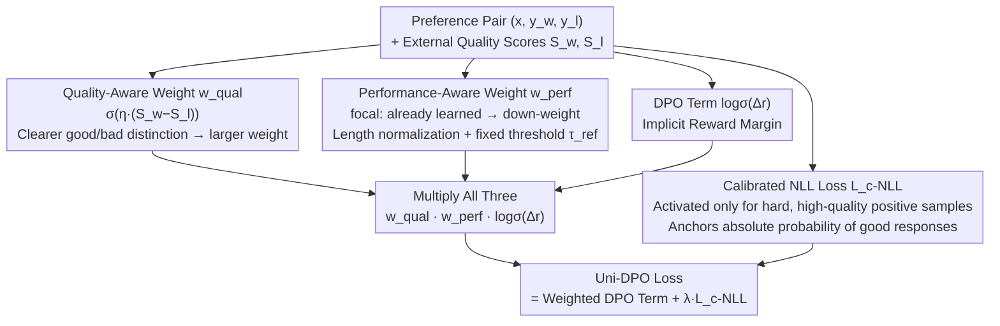

# Uni-DPO: A Unified Paradigm for Dynamic Preference Optimization of LLMs

**Conference**: ICLR 2026  
**arXiv**: [2506.10054](https://arxiv.org/abs/2506.10054)  
**Code**: [https://github.com/pspdada/Uni-DPO](https://github.com/pspdada/Uni-DPO)  
**Area**: Alignment RLHF / DPO  
**Keywords**: DPO improvement, dynamic weights, quality-aware, focal loss, preference optimization

## TL;DR
The paper proposes Uni-DPO, which introduces a unified adjustment of preference pair weights through quality-aware weighting (prioritizing pairs with high score differences), performance-aware weighting (utilizing focal loss to focus on underfit samples), and a calibrated NLL loss component. Uni-DPO consistently outperforms DPO and SimPO on text understanding and mathematical reasoning benchmarks. Notably, Gemma-2-9B achieves 67.1% on Arena-Hard, surpassing Claude 3 Opus (60.4%).

## Background & Motivation

**Background**: DPO has become the standard method for LLM alignment by optimizing policies directly from preference data through implicit rewards. SimPO further simplifies this by removing the reference model.

**Limitations of Prior Work**:
   - Standard DPO treats all preference pairs with equal weight, despite significant variance in data quality—high-quality pairs have clear distinctions, while low-quality pairs are noisy or ambiguous.
   - There is a mismatch between data quality and model performance: High-quality pairs may already be well-learned, and over-emphasizing them can lead to overfitting.
   - DPO lacks fine-grained external reward signals compared to PPO or GRPO.

**Key Challenge**: How to dynamically adjust weights by simultaneously accounting for both intrinsic data quality and the current learning state of the model?

**Key Insight**: Utilize quality weights to distinguish data noise, performance weights to focus on difficult samples, and calibrated NLL to prevent the collapse of high-probability responses.

## Method

### Overall Architecture

The core problem Uni-DPO addresses is that standard DPO treats all preference pairs equally, ignoring both the distinctness of the data and the current learning progress of the model. Uni-DPO applies two dynamic weights to each preference pair and adds an extra calibrated NLL term to form the final loss:

$$\mathcal{L}_{\text{Uni-DPO}} = -\mathbb{E}[w_{\text{qual}}(y_w, y_l) \cdot w_{\text{perf}}(\pi_\theta) \cdot \log\sigma(\Delta_r)] + \lambda\mathcal{L}_{\text{c-NLL}}$$

Here, $w_{\text{qual}}$ measures the intrinsic quality of the preference pair (off-policy external signal), while $w_{\text{perf}}$ measures the model's current mastery of the sample (on-policy internal dynamics). Their product modulates the standard DPO term $\log\sigma(\Delta_r)$, while $\mathcal{L}_{\text{c-NLL}}$ ensures the absolute probability of good responses is maintained under specific conditions.

The following diagram illustrates the relationship between the two weighting paths and the final loss construction:

### Key Designs

**1. Quality-aware weight $w_{\text{qual}}$: Amplifying high signal-to-noise ratio pairs**

This component addresses the inconsistency in data quality. Uni-DPO quantifies the distinctness of a pair using the difference in external scores:

$$w_{\text{qual}}(y_w, y_l) = \sigma(\eta \cdot (S_w - S_l))$$

$S_w$ and $S_l$ represent external scores for chosen and rejected responses (from human labels, GPT-4, or Reward Models like ArmoRM), and $\eta$ controls the mapping steepness. Larger score differences result in weights closer to 1, while ambiguous pairs with small differences are down-weighted. This effectively filters noise and ambiguous preferences softly during training.

**2. Performance-aware weight $w_{\text{perf}}$: Focusing on difficult samples**

High-quality pairs that the model has already mastered can lead to overfitting if over-emphasized. $w_{\text{perf}}$ adopts a focal loss approach to down-weight easy samples and up-weight difficult ones:

$$w_{\text{perf}} = \Big[1 - \sigma\big(\tfrac{\beta}{|y_w|}\log\pi_\theta(y_w|x) - \tfrac{\beta}{|y_l|}\log\pi_\theta(y_l|x) - \tau_{\text{ref}}\big)\Big]^\gamma$$

The bracketed term represents the current implicit margin. Two improvements are made: using a fixed threshold $\tau_{\text{ref}}$ instead of per-sample reference model dependence to stabilize training, and applying length normalization ($|y_w|, |y_l|$) to prevent length bias.

**3. Calibrated NLL loss $\mathcal{L}_{\text{c-NLL}}$: Preventing divergence of good responses**

DPO training can sometimes decrease the absolute probability of chosen responses while optimizing relative margins. $\mathcal{L}_{\text{c-NLL}}$ stabilizes this by adding a length-normalized NLL for $y_w$, gated by two conditions: $\mathbf{1}(\log\pi_{\text{ref}}(y_w|x) > \log\pi_\theta(y_w|x))$ (likelihood is lower than the reference) and $\mathbf{1}(S_w \ge \tau_{\text{good}})$ (response quality is high). This focuses reinforcement on high-quality positive samples that are currently difficult for the model.

### Loss & Training
- Parameters: $\eta = 0.7$, $\lambda = 0.001$, $\gamma = 3.0$, $\tau_{\text{ref}} \in [0.5, 2.0]$
- Supports various quality scoring sources (Human, GPT-4, ArmoRM, etc.)

## Key Experimental Results

### Main Results: Text Understanding

| Model | Method | AlpacaEval2 LC | Arena-Hard | IFEval Loose | SedarEval |
|------|------|---------------|-----------|-------------|-----------|
| Llama3-8B-Base | DPO | 15.5 | 15.9 | 45.5 | 31.80 |
| | SimPO | 19.4 | 23.4 | 45.7 | 32.43 |
| | **Ours** | **23.8** | **23.9** | **47.9** | **38.49** |
| Gemma-2-9B-IT | SimPO | 53.2 | 59.1 | 67.7 | 57.7 |
| | **Ours** | **54.7** | **67.1** | **72.8** | 57.5 |

### Main Results: Mathematical Reasoning (Qwen2.5-Math-7B)

| Method | GSM8K | MATH | AIME24 | AMC23 | Avg |
|------|-------|------|--------|-------|-----|
| Baseline | 64.3 | 65.8 | 23.3 | 47.5 | 39.11 |
| DPO | 83.2 | 75.8 | 26.7 | 57.5 | 51.55 |
| SimPO | 85.7 | 76.4 | 26.7 | 57.5 | 53.73 |
| **Ours** | **88.9** | **78.2** | **26.7** | **67.5** | **56.80** |

### Ablation Study

| Configuration | AlpacaEval2 WR | Arena-Hard | SedarEval |
|------|---------------|-----------|-----------|
| Full Uni-DPO | **20.5** | **23.9** | **38.49** |
| w/o $w_{\text{qual}}$ | 15.9 | 22.8 | 37.43 |
| w/o $w_{\text{perf}}$ | 18.5 | 21.4 | 40.46 |
| w/o LN | 3.8 | 2.7 | 28.18 |
| w/o $\mathcal{L}_{\text{c-NLL}}$ | 19.4 | 23.3 | 37.73 |

### Key Findings
- **Length Normalization (LN) is critical**: Performance drops sharply without it (e.g., -10.31 on SedarEval), leading to training instability.
- **Quality weights impact AlpacaEval most**: Removing it reduces WR from 20.5 to 15.9 (-4.6).
- **Gemma-2-9B with Uni-DPO surpasses Claude 3 Opus**: 67.1 vs 60.4 on Arena-Hard.
- **Significant gains in math reasoning**: Qwen2.5-Math-7B shows a +3.07 average Gain over SimPO.

## Highlights & Insights
- **Unified dual-perspective weighting**: Combining data quality (external signal) and learning difficulty (internal dynamics) is more effective than either alone.
- **Improved focal loss design**: Replacing reference model dependency with a fixed threshold and using length normalization solves the instability issues found in vanilla focal DPO.
- **Cross-domain generalization**: The framework is not limited to dialogue but significantly benefits mathematical reasoning tasks.

## Limitations & Future Work
- **Dependency on external scoring**: Quality weights require reward models or GPT-4, increasing data preparation costs.
- **Hyperparameter sensitivity**: Multiple parameters like $\eta, \gamma, \tau_{\text{ref}}, \lambda, \tau_{\text{good}}$ require fine-tuning.
- **Potential improvements**: Exploring self-rewarding mechanisms to replace external scores and integrating null-space constraints (NSPO) for safety dimensions.

## Related Work & Insights
- **Comparison with DPO**: Standard DPO uses equal weights; Uni-DPO introduces dual-dimension dynamic weighting for consistent gains.
- **Comparison with SimPO**: Uni-DPO builds on SimPO's reference-free architecture by adding quality and performance weights for additive gains.
- **Comparison with standard focal loss**: While direct focal DPO is often unstable, Uni-DPO's calibrated version (fixed threshold + LN) resolves these stability issues.

## Rating
- Novelty: ⭐⭐⭐⭐ Dual-perspective weights are intuitive but not a fundamental break from existing paradigms.
- Experimental Thoroughness: ⭐⭐⭐⭐⭐ Tested across 4 models, multiple benchmarks, and math tasks with extensive ablations.
- Writing Quality: ⭐⭐⭐⭐ Methodological motivations are clearly stated.
- Value: ⭐⭐⭐⭐ A practical improvement for DPO that is easy to integrate into existing pipelines.

<!-- RELATED:START -->

## Related Papers

- [\[ICML 2026\] TUR-DPO: Topology- and Uncertainty-Aware Direct Preference Optimization](../../ICML2026/multimodal_vlm/tur-dpo_topology-_and_uncertainty-aware_direct_preference_optimization.md)
- [\[ICLR 2026\] Importance Sampling for Multi-Negative Multimodal Direct Preference Optimization](importance_sampling_for_multi-negative_multimodal_direct_preference_optimization.md)
- [\[CVPR 2026\] Dynamics-Aware Preference Optimization for Vision-Language Models](../../CVPR2026/multimodal_vlm/dynamics-aware_preference_optimization_for_vision-language_models.md)
- [\[ICLR 2026\] When MLLMs Meet Compression Distortion: A Coding Paradigm Tailored to MLLMs](when_mllms_meet_compression_distortion_a_coding_paradigm_tailored_to_mllms.md)
- [\[ICLR 2026\] Visual Self-Refine: A Pixel-Guided Paradigm for Accurate Chart Parsing](visual_self-refine_a_pixel-guided_paradigm_for_accurate_chart_parsing.md)

<!-- RELATED:END -->
