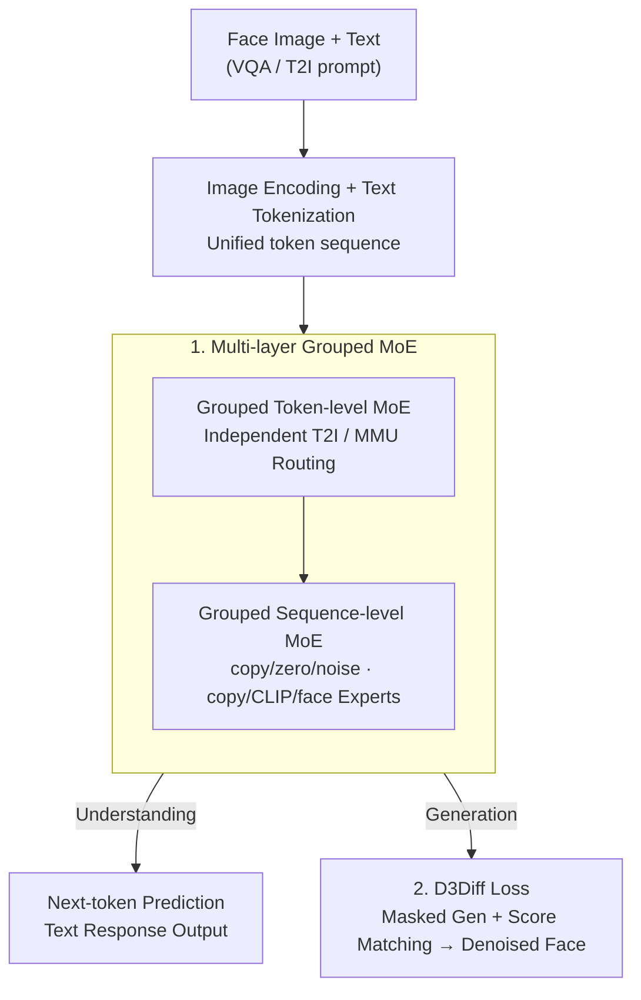

# UniF2ace: A Unified Fine-grained Face Understanding and Generation Model

**Conference**: ICLR 2026  
**OpenReview**: [https://openreview.net/forum?id=LV01JdxARe](https://openreview.net/forum?id=LV01JdxARe)  
**Code**: Yes (Authors state code and datasets are open-sourced; see original link)  
**Area**: Multimodal VLM / Unified Multimodal / Face Understanding and Generation  
**Keywords**: Unified Multimodal Model, Discrete Diffusion, Score Matching, Mixture-of-Experts, Fine-grained Faces

## TL;DR
UniF2ace is the first Unified Multimodal Model (UMM) to unify facial "understanding" (VQA / description) and "generation" (text-to-face) within a single framework. It enhances fine-grained generation fidelity through a D3Diff loss that unifies masked generation with discrete score matching. To combat "attribute forgetting," it employs a grouped token-level + sequence-level MoE architecture to reinject semantic and identity features. Additionally, it introduces the UniF2aceD-1M dataset containing 130K image-text pairs and 1M VQA samples. At the 1.8B scale, its Desc-GPT and VQA-score outperform models of similar magnitude by 7.1% and 6.6%, respectively.

## Background & Motivation

**Background**: Unified Multimodal Models (UMM) have recently become a hot spot, enabling "any-to-any" understanding and generation within a single framework—a step toward AGI. However, in the "face" domain (crucial for identity verification, HCI, and digital humans), this unified paradigm remained largely unexplored.

**Limitations of Prior Work**: Research in face modeling is fragmented and lacks fine-grained detail. First, **tasks are isolated**: understanding models are typically MLLMs fine-tuned on coarse text, while generation models are often diffusion models guided by semantic masks or sketches. These workflows cannot directly "generate faces from detailed descriptions," leading to inefficiency and limited functionality. Second, there is a **general lack of fine-grained information**: (a) existing discrete diffusion in UMMs relies primarily on masked generation without integration with precise score matching, making it difficult to generate fine details; (b) fine-grained attribute representations are often discarded during multimodal feature evolution ("attribute forgetting"); (c) there is a shortage of cross-modal face data with fine-grained attributes—existing text-face data is either low-resolution from web crawls or limited to 2-7 attributes per description, with almost no VQA support.

**Key Challenge**: To achieve "unified understanding and generation for fine-grained faces," three major obstacles must be addressed: how to precisely approximate maximum likelihood for detailed synthesis on the generation side, how the network can prevent the loss of identity and semantic attributes in a unified representation, and how to source high-quality training data. These issues are deeply intertwined.

**Goal**: To build a single model capable of simultaneous fine-grained face understanding and generation while effectively capturing fine-grained attributes.

**Key Insight**: The authors argue that face generation is more difficult than understanding (due to high detail and fidelity requirements). Thus, the generation component requires a redesigned training objective—introducing score matching theory into discrete diffusion to provide a tighter upper bound on negative log-likelihood (NLL). Architecturally, expert routing for generation and understanding should be designed to "selectively" reinject external semantic and identity features.

**Core Idea**: A three-pronged approach: the "D3Diff loss unifying masked generation and score matching + a grouped multi-layer MoE architecture + a large-scale fine-grained face VQA dataset." This allows a 1.8B UMM to outperform specialized models of similar size in both face understanding and generation.

## Method

### Overall Architecture
UniF2ace is a hybrid AR + Diffusion unified Transformer. Inputs (face images and text) are processed via an image encoder and text tokenizer into a unified token sequence, which is then fed into an $L$-layer Transformer with MoE components. Understanding tasks (Und/MMU) use autoregressive next-token prediction, while generation tasks (Gen/T2I) add noise to image tokens and perform discrete diffusion denoising via the D3Diff loss. Two core innovations reside in the backbone: (1) each Transformer block features **Grouped Token-level MoE** followed by **Grouped Sequence-level MoE**, combining token-specific routing with instance-level (global image, face embedding) feature injection; (2) the generation side utilizes the **D3Diff loss** to optimize masked generation and score matching jointly. The UniF2aceD-1M dataset was constructed specifically to train this framework.

### Key Designs

**1. Multi-layer Grouped MoE: Task-specific experts and selective feature reinjection**

This design addresses "attribute forgetting" and the limitations of existing UMM architectures (either purely dense or limited to token-level MoE) in selectively injecting instance features. UniF2ace stacks two MoE layers per block, grouped by task. The **Token-level MoE** splits the FFN into multiple small experts using Top-K activation. Crucially, experts are partitioned into T2I and MMU groups, each with shared and routing experts. An independent balance loss is calculated for each group: $L_{\text{Balance}} = \lambda_{t2i}\sum_{i=1}^{N_{t2i}} f_i P_i + \lambda_{mmu}\sum_{j=1}^{N_{mmu}} f_j P_j$, where $f$ and $P$ denote selection frequency and probability. This prevents routing interference between generation and understanding. The **Sequence-level MoE** processes the full image feature sequence: the T2I group includes copy ($E_{\text{copy}}(x)=x$), zero ($E_{\text{zero}}(x)=0$), and noise experts; the MMU group includes copy, CLIP, and face experts. The noise/CLIP/face experts use "gated weighting + resampler" to inject external features (e.g., the face expert $E_{\text{face}}(x) = w_{\text{face}} x + (1-w_{\text{face}}) S(F(X))$, where $F$ is a face encoder like AntelopeV2 and $S$ is a resampler). This allow the model to "on-demand" reintegrate CLIP semantics and InsightFace identity embeddings, recovering fine-grained attributes lost in latent evolution.

**2. D3Diff Loss: Unifying masked generation and score matching for a tighter NLL bound**

To address the limitations of masked generation in discrete diffusion (which often lacks precise score matching), the authors analyze the negative log-likelihood (NLL). They identify two computable proxy bounds: one involving score loss $L_1 = L_{\text{score}}(s_\theta) + D_{KL}(q_{T|0}\,\|\,p_{\text{base}})$, and one standard masked token prediction loss $L_2$. Theorem 1 proves $-\log p_\theta(x_0) \le L_1 \le L_2$, indicating $L_1$ is a tighter bound providing more precise NLL approximation. By leveraging the Bayesian relationship in masked generation where the posterior $p_\theta(x_0|x_t) \approx q_t(x_t|x_0)\,s_\theta(x_t)$, the authors propose the D3Diff training loss:

$$L_{D3Diff} = -\sum_{t=1}^{T} \mathbb{E}_{q(x_0)q(x_t|x_0)}\big[\log p_\theta(x_0|x_t)\big] + \alpha\, L_{\text{score}}\big(p_\theta(x_0|x_t)/q_t(x_t|x_0)\big)$$

The first term is the standard masked generation likelihood, while the second is the score matching term (weighted by $\alpha=0.01$). This objective captures the stability of masked generation while using score matching to tighten the bound, specifically improving text-alignment for attributes like "rosy cheeks" or "hoop earrings."

**3. UniF2aceD-1M: Filling the data gap for fine-grained face tasks**

The authors constructed UniF2aceD-1M to support these architectural innovations. It contains ~130K high-fidelity face images, each with detailed descriptions covering 46 attribute categories (appearance, action, emotion). Each description averages **17.7 attributes** (vs. 6.2 in MM-CelebA) and 120 tokens. Crucially, an automated pipeline generated **1M face-specific VQA pairs** probing appearance, emotion, and action reasoning—features missing from standard datasets.

### Loss & Training
Two objectives are optimized jointly: $L_{MMU} = \sum_{i=1}^{M}\log P(Y_i\mid Y_{<i}, X)$ for understanding and $L_{D3Diff}$ for generation. The total loss is $L_{total} = L_{MMU} + L_{D3Diff}$. Grouped MoE includes balance losses, and the score matching weight is set to $\alpha=0.01$.

## Key Experimental Results

### Main Results
Face Generation (UniF2aceD-1M test set, FID lower is better): At 1.8B, UniF2ace achieves SOTA among similar UMMs across FID, VQA-score, and VLM-score, notably surpassing the 12B Flux.1-dev in VLM-score.

| Model | Type | Params | VQAscore-CF5↑ | FID↓ | VLM-score↑ |
|-------|------|--------|---------------|------|------------|
| Show-o | AR+Diff | 1.3B | 0.855 | 142.557 | 75.618 |
| JanusFlow | AR+Diff | 1.3B | 0.881 | 72.825 | 61.593 |
| Flux.1-dev | Diff | 12B | 0.893 | 76.427 | 84.513 |
| **Ours** | AR+Diff | 1.8B | **0.894** | **66.005** | **88.049** |

Face Understanding (UniF2aceD-1M score by GPT-4o / DeepSeek): SOTA across all metrics, even outperforming larger specialized models like InternVL2.5 (8B).

| Model | Params | Desc-GPT↑ | Conv-GPT↑ | Desc-DS↑ | Conv-DS↑ |
|-------|--------|-----------|-----------|----------|----------|
| InternVL2.5| 8B | 5.62 | 5.89 | 6.30 | 6.55 |
| JanusFlow | 1.3B | 4.88 | 6.06 | 5.42 | 6.77 |
| Show-o | 1.3B | 3.88 | 4.17 | 5.24 | 4.90 |
| **Ours** | 1.8B | **6.02** | **6.53** | **7.38** | **7.29** |

### Ablation Study

| Config | VQAscore-CF5↑ / Desc-GPT↑ | Description |
|--------|---------------------------|-------------|
| Only Mask (α=0) | 0.879 | Only masked generation loss |
| Only Score (α=0.01) | 0.886 | Only score matching loss (already better than pure mask) |
| **D3Diff (α=0.01)** | **0.894** | Full loss; lowest FID (66.005) |
| Token+Seq MoE Both | 6.023 (Desc-GPT) | Full architecture |
| w/o Two-level MoE | 4.988 (Desc-GPT) | Removing MoE drops Und score by ~1 pt |
| w/o Face & CLIP | 5.21 (Desc-GPT) | Removing experts drops Und performance significantly |

### Key Findings
- **Synergy in D3Diff**: Using either mask or score loss alone is less effective than the combination. The fact that "score only" beats "mask only" empirically validates the theoretical $L_1 \le L_2$.
- **Complementary MoE**: Both token-level and sequence-level MoE improve performance individually, but the combination is best. Top-K=2 for the sequence level provides the best balance.
- **Expert Specialization**: Face and CLIP experts serve distinct roles; removing either results in performance degradation. Activation analysis shows these experts are more active in deeper layers, indicating a reliance on visual embeddings for high-level semantic decoding.

## Highlights & Insights
- **Theoretical Grounding of Loss**: D3Diff is not just a combination of losses; it is driven by NLL bound tightness (Theorem 1). This "theory-first" approach provides a template for optimizing discrete diffusion in other domains.
- **MoE as Feature Reinjection**: Using MoE as a channel to "拌" (mix) external specialized encoder outputs (CLIP/InsightFace) into the backbone backbone addresses attribute forgetting.
- **Data Density Strategy**: By pushing attribute density to 17.7 per description, the authors demonstrate that the bottleneck for vertical UMMs often lies in data granularity.

## Limitations & Future Work
- **Single-image Reasoning**: Currently does not support multi-image face reasoning (e.g., identity comparison across different photos).
- **Theoretical Approximations**: D3Diff relies on token independence assumptions and Bayesian approximations; benefits are empirically stabilized via $\alpha$.
- **Dependency on External Encoders**: Relies on specific biases of CLIP and AntelopeV2; performance on non-celebrities or low-quality images remains a challenge.

## Related Work & Insights
- **Vs. specialized MLLMs (Qwen2-VL / InternVL2.5)**: UniF2ace achieves unified generation and outperforms InternVL2.5 (8B) in fine-grained facial understanding despite its smaller (1.8B) size.
- **Vs. specialized Diffusion (SD3 / Flux)**: UniF2ace provides integrated understanding and higher VLM-scores at a fraction of the parameter count.
- **Vs. other UMMs (Show-o / JanusFlow)**: Unlike task-agnostic UMMs, UniF2ace's grouped MoE and D3Diff loss specifically target fine-grained facial fidelity.

## Rating
- Novelty: ⭐⭐⭐⭐⭐ 
- Experimental Thoroughness: ⭐⭐⭐⭐⭐ 
- Writing Quality: ⭐⭐⭐⭐ 
- Value: ⭐⭐⭐⭐⭐ 

<!-- RELATED:START -->

## Related Papers

- [\[ICLR 2026\] Thinking with Camera: A Unified Multimodal Model for Camera-Centric Understanding and Generation](thinking_with_camera_a_unified_multimodal_model_for_camera-centric_understanding.md)
- [\[ICLR 2026\] Omni-Weather: A Unified Multimodal Model for Weather Radar Understanding and Generation](omni-weather_a_unified_multimodal_model_for_weather_radar_understanding_and_gene.md)
- [\[ICLR 2026\] P2P: Automated Paper-to-Poster Generation and Fine-Grained Benchmark](p2p_automated_paper-to-poster_generation_and_fine-grained_benchmark.md)
- [\[ICLR 2026\] MotionSight: Boosting Fine-Grained Motion Understanding in Multimodal LLMs](motionsight_boosting_fine-grained_motion_understanding_in_multimodal_llms.md)
- [\[ICLR 2026\] ORION: Decoupling and Alignment for Unified Autoregressive Understanding and Generation](orion_decoupling_and_alignment_for_unified_autoregressive_understanding_and_gene.md)

<!-- RELATED:END -->
