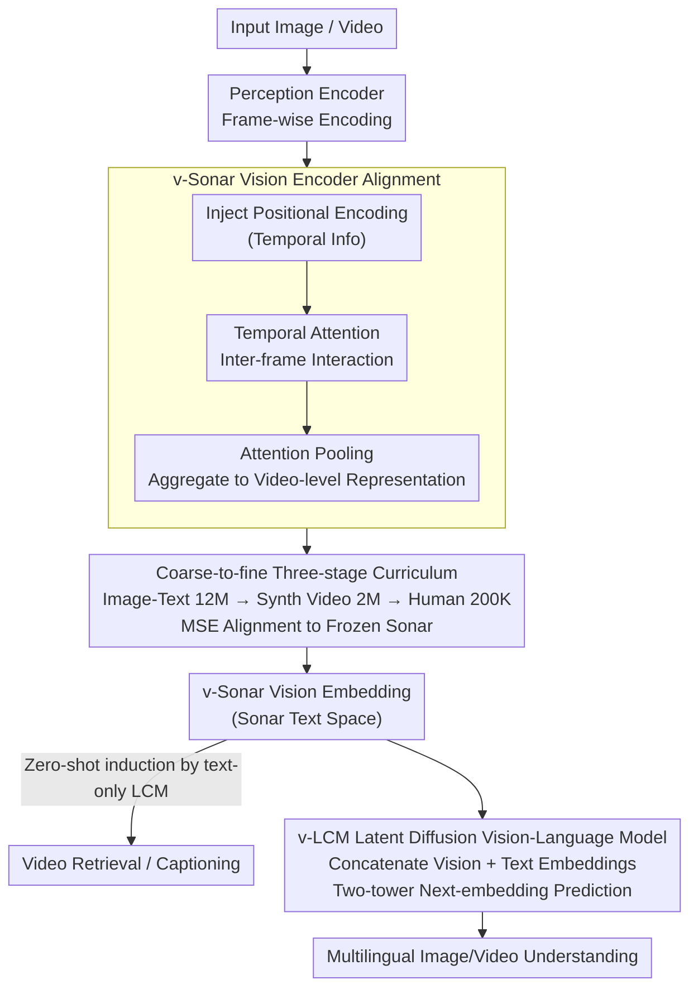

# Unified Vision-Language Modeling via Concept Space Alignment

**Conference**: ICLR 2026  
**arXiv**: [2603.01096](https://arxiv.org/abs/2603.01096)  
**Code**: None  
**Area**: Multi-modal VLM  
**Keywords**: Vision-language embedding space, Latent Diffusion Models, Multilingual, Video captioning, Large Concept Model

## TL;DR

This paper proposes v-Sonar, which aligns vision encoders post-hoc to the Sonar text embedding space. This alignment enables the Large Concept Model (LCM), trained solely on Sonar space, to process visual inputs zero-shot. Further extension via instruction tuning yields v-LCM, which outperforms existing VLMs in 61 out of 62 languages.

## Background & Motivation

Existing language- and modality-agnostic embedding spaces (e.g., SONAR, supporting 1,500 text languages and 177 speech languages) have achieved excellent performance in text and speech tasks but remain limited to those modalities. The Large Concept Model (LCM) demonstrates the feasibility of language modeling on continuous embedding spaces rather than discrete tokens by using a diffusion objective for next-embedding prediction in Sonar space.

The core motivation of this study is: Can the visual modality be aligned to the Sonar space so that LCM can understand visual input without any visual data training? Furthermore, can LCM be enhanced through vision-language instruction tuning?

## Method

### Overall Architecture

The core of the method is to integrate vision as a "new modality" into the pre-trained Sonar text/speech embedding space, thereby reusing the Large Concept Model pre-trained on that space for free. The process involves three steps: first, aligning the output of a Perception Encoder to Sonar text embeddings via v-Sonar; second, verifying that the text-only trained LCM can zero-shot interpret these visual embeddings; and finally, performing vision-language instruction tuning on the unified space shared by v-Sonar and Sonar to obtain v-LCM.

### Key Designs

**1. v-Sonar Vision Encoder Alignment: Mapping visual embeddings into the text space.** The challenge is that frame-wise features from the Perception Encoder (PE) lack temporal structure and do not reside in the target Sonar space. Instead of retraining the encoder, a lightweight projector is stacked on top of the PE: positional encodings are injected for temporal information, a temporal attention layer facilitates inter-frame interaction, and attention pooling aggregates frames into a single video-level representation. Alignment uses a simple MSE loss to pull visual embeddings toward frozen Sonar text embeddings: $\mathcal{L}_{\text{align}} = \frac{1}{N}\sum_{i=1}^{N}\|f_\theta(V_i) - g(T_i)\|_2^2$. The Sonar encoder $g$ remains frozen as an "anchor," while only the projector and vision encoder are updated. Since the target space is already high-quality and modality-agnostic, alignment transitions semantics rather than reconstructing them, making zero-shot transfer possible via regression loss.

**2. Coarse-to-fine Three-stage Curriculum: Transitioning from image-text priors to video temporality.** Training directly on scarce human video captions is insufficient for convergence. The authors decompose alignment into three stages: Stage 1 uses 12M image-text pairs to establish a base mapping from pixels to Sonar space; Stage 2 introduces 2M synthetic video captions to adapt the model to temporal dynamics; Stage 3 uses 200K high-quality human-annotated video captions for refined alignment. This sequence reduces dependence on expensive annotations; removing the synthetic stage (w/o Stage 2) dropped the Bleu score from 40.1 to 39.6, confirming its utility.

**3. v-LCM Latent Diffusion Vision-Language Model: Generative modeling in a unified space.** Once vision and text reside in the same continuous embedding space, they can be concatenated into a latent embedding sequence. Generative training uses the same latent diffusion objective as LCM text pre-training, avoiding discrete tokens. The model uses a two-tower architecture: a contextualizer encodes prefix embeddings as a condition $c$, and a denoiser iteratively reconstructs the next embedding. Forward noise is defined as $x_t = \alpha_t x^0 + \sigma_t \epsilon$, and training minimizes $\mathcal{L}(\theta) = \mathbb{E}\|x^0 - \mu_\theta(\alpha_t x^0 + \sigma_t \epsilon, t, c)\|_2$, predicting the clean embedding $x^0$ at various noise levels. v-LCM naturally inherits the 1,500-language support of Sonar.

### Loss & Training

The v-Sonar phase utilizes the MSE alignment loss with the three-stage curriculum. To handle the discrepancy between the newly initialized projector and the pre-trained PE, asynchronous learning rates are applied. Ablations show that adding asynchronous learning rates increased the Bleu score from 38.0 to 39.7. When combined with normalized initialization and attention pooling, the Cos.Sim reached 0.716. The v-LCM phase performs instruction tuning on M3IT multi-modal multilingual data using the latent diffusion objective.

## Key Experimental Results

### Main Results

| Dataset | Metric | v-Sonar | PECoreG | SigLIP2-G-OPT |
|--------|------|---------|---------|---------------|
| PE-Video | R@1 | **73.03** | 63.91 | 47.55 |
| Vatex | R@1 | **40.75** | 18.90 | 27.52 |
| Dream-1k | R@1 | 63.30 | **72.10** | 61.50 |

| Dataset | Metric | v-Sonar+OmniSONAR Decoder | PLM-3B | Qwen2.5-VL-3B |
|--------|------|---------------------------|--------|---------------|
| PE-Video | Bleu | **39.0** | 21.1 | 30.0 |
| Dream-1k | Bleu | **23.9** | 19.6 | 16.1 |
| Vatex-zh | R-L | **26.9** | - | - |

| M3IT Multilingual Eval | v-LCM | InternVL | Qwen-VL |
|---------------|-------|----------|---------|
| Languages Outperformed | **61/62** | - | - |

### Ablation Study

| Configuration | MSE↓ | Cos.Sim↑ | Bleu↑ | Description |
|------|------|----------|-------|------|
| Linear Proj. | 1.45e-3 | 0.694 | 38.0 | Frozen PE Baseline |
| Full PE | 1.54e-3 | 0.672 | 37.1 | Full fine-tuning degradation |
| + Async. LR | 1.43e-3 | 0.700 | 39.7 | Async LR effectiveness |
| + Norm. Init. | 1.39e-3 | 0.708 | 39.8 | Normalized Initialization |
| + Attn. Pooling | 1.39e-3 | 0.708 | 39.8 | Attention Pooling |
| Full Pipeline (3-stage) | **1.36e-3** | **0.716** | **40.1** | Optimal 3-stage pipeline |
| w/o Stage2 (SV) | 1.39e-3 | 0.710 | 39.6 | Omitting synthetic video |
| w/o Stage1&2 | 1.39e-3 | 0.708 | 39.8 | Human annotation only |

### Key Findings

- v-Sonar improves retrieval R@1 on PE-Video and Vatex by 9.12 and 21.85, respectively, compared to the original PE.
- Text-only trained LCM can process v-Sonar visual embeddings zero-shot, showing competitive performance in video captioning.
- Alignment is easier with OmniSONAR than Sonar1 (embedding norm 1.69 vs 0.264, covariance trace 1.83 vs 0.049), as Sonar1 suffers from space collapse.
- v-LCM matches SOTA VLM capabilities in image/video understanding while significantly leading in 61 non-English languages.

## Highlights & Insights

- Proposes a new paradigm: unifying vision and language in a modality-agnostic continuous embedding space using diffusion objectives instead of discrete tokens.
- The success of the post-hoc alignment strategy proves that high-quality text embedding spaces can "freely" accommodate new modalities.
- The zero-shot visual understanding capability of LCM is impressive, validating the cross-modal transfer potential of shared embedding spaces.
- Multilingual capability is an inherent advantage: Sonar natively supports 1,500 languages, which v-LCM automatically inherits.

## Limitations & Future Work

- Retrieval on Dream-1k is lower for v-Sonar than the original PE (63.3 vs 72.1), suggesting alignment may lose specific features.
- Performance on Vatex short captions lags behind InternVL, likely due to training data bias towards detailed captions.
- Current v-LCM scale is small; direct comparison with large-scale VLMs (7B+) remains to be fully verified.
- Space collapse issues in Sonar1 require better solutions (currently relying on the OmniSONAR variant).

## Related Work & Insights

- Provides an alternative to token-based multi-modal models like Chameleon by using continuous embedding spaces.
- The coarse-to-fine curriculum training strategy is applicable to other cross-modal alignment tasks.
- Highly valuable for developing multi-modal models for low-resource languages.

## Rating

- Novelty: ⭐⭐⭐⭐⭐ Extremely innovative paradigm aligning vision to a modality-agnostic space with latent diffusion.
- Experimental Thoroughness: ⭐⭐⭐⭐ Comprehensive retrieval, captioning, and multilingual evaluation; however, large-scale comparisons are limited.
- Writing Quality: ⭐⭐⭐⭐ Clear structure and method description.
- Value: ⭐⭐⭐⭐⭐ Highly promising direction for multi-modal multilingual AI, especially given the 61/62 language lead.

<!-- RELATED:START -->

## Related Papers

- [\[CVPR 2026\] Modeling Cross-vision Synergy for Unified Large Vision Model](../../CVPR2026/multimodal_vlm/modeling_cross-vision_synergy_for_unified_large_vision_model.md)
- [\[ICLR 2026\] ORION: Decoupling and Alignment for Unified Autoregressive Understanding and Generation](orion_decoupling_and_alignment_for_unified_autoregressive_understanding_and_gene.md)
- [\[ICLR 2026\] Memory-Free Continual Learning with Null Space Adaptation for Zero-Shot Vision-Language Models](memory-free_continual_learning_with_null_space_adaptation_for_zero-shot_vision-l.md)
- [\[ICLR 2026\] UniHM: Unified Dexterous Hand Manipulation with Vision Language Model](unihm_unified_dexterous_hand_manipulation_with_vision_language_model.md)
- [\[ICLR 2026\] Reversible Primitive–Composition Alignment for Continual Vision–Language Learning](reversible_primitivecomposition_alignment_for_continual_visionlanguage_learning.md)

<!-- RELATED:END -->
