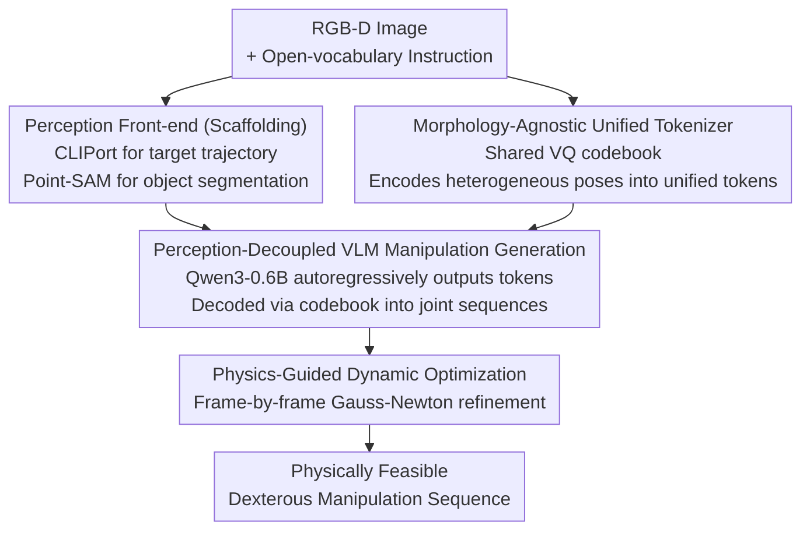

# UniHM: Unified Dexterous Hand Manipulation with Vision Language Model

**Conference**: ICLR 2026  
**arXiv**: [2603.00732](https://arxiv.org/abs/2603.00732)  
**Code**: [GitHub](https://unihm.github.io/)  
**Area**: Multi-modal VLM  
**Keywords**: Dexterous hand manipulation, VLM, unified tokenizer, physical dynamics optimization, cross-morphology generalization

## TL;DR

UniHM is proposed as the first unified language-conditioned dexterous hand manipulation framework. It maps heterogeneous robotic hands to a shared discrete space via a morphology-agnostic VQ codebook, combines a VLM for instruction-driven sequence generation, and ensures physical feasibility through physics-guided dynamic optimization.

## Background & Motivation

Dexterous manipulation requires perceiving, grasping, and reconfiguring objects in complex environments. Generating diverse, long-horizon, and physically feasible manipulation sequences is key to advancing humanoid robot applications.

Limitations of Prior Work:
- **Object-centric methods** (UniDexGrasp, DexGraspNet, etc.): Lack open-vocabulary instruction guidance and only handle fixed sequences.
- **Language-guided grasping methods** (SemGrasp, AffordDexGrasp, etc.): Primarily generate static grasp poses, ignoring temporal structure and failing to produce smooth continuous manipulation sequences.
- **Existing VLM manipulation methods** (MotionGPT, HOIGPT, etc.): Mainly target digital hands or low-DOF grippers, lacking cross-hand generalization and physical feasibility guarantees.

Goal: Directly generate dynamic dexterous manipulation sequences from images and open-vocabulary instructions, supporting multiple hand types without reliance on teleoperation data.

## Method

### Overall Architecture

UniHM decomposes the "image + open-vocabulary instruction → dynamic dexterous manipulation sequence" pipeline into three concatenated stages: first, a morphology-agnostic VQ-VAE compresses heterogeneous robotic hand poses into unified discrete tokens; second, a small-scale VLM autoregressively generates these tokens conditioned on perception cues; finally, physics-guided refinement applies frame-by-frame optimization to ensure physical feasibility. These stages are trained independently and connected end-to-end during inference, leveraging human video data while avoiding dependence on teleoperation data.

### Key Designs

**1. Morphology-Agnostic Unified Tokenizer: Mapping five hand types into a single codebook.** Different robotic hands (5 types including MANO, Shadow, Allegro) vary in degrees of freedom and structure. UniHM assigns a pair of specialized encoders $E_h$ and decoders $D_h$ to each hand type while sharing a single VQ-VAE codebook $\mathcal{Z} = \{\mathbf{e}_k\}_{k=1}^K$. Quantization maps the encoding result to the nearest codeword $c = \arg\min_k \|E_h(\mathbf{x}^{(h)}) - \mathbf{e}_k\|_2^2$. This projects heterogeneous hands into the same discrete space, making cross-hand translation a "plug-and-play" process: $\hat{\mathbf{x}}^{(j)} = D_j(\mathbf{e}_{Q(E_i(\mathbf{x}^{(i)}))})$. When adding new hand types, knowledge distillation is used to align the new encoder with a reference hand type $\mathcal{L}_{\text{distill}} = \|E_{\text{new}}(\mathbf{x}_{\text{new}}) - E_{\text{ref}}(\mathbf{x}_{\text{ref}})\|_2^2$, bypassing non-differentiable quantization.

**2. Perception-Decoupled VLM Manipulation Generation: Separating scene understanding from action generation.** End-to-end generation from raw RGB-D is data-hungry and hard to converge. UniHM decouples perception: a CLIPort module infers the target trajectory $\mathcal{T}_{\text{tar}}$ from RGB-D and instructions, and Point-SAM segments the target object point cloud $\mathcal{P}_{\text{obj}}$. Using a Qwen3-0.6B base as the generator, the sequence of initial hand pose encodings, target trajectory, object point clouds, and text tokens are processed to autoregressively output manipulation tokens. A progressive masking curriculum is used during training to alleviate exposure bias, transitioning from teacher forcing to pure autoregression.

**3. Physics-Guided Dynamic Optimization: Refinement for physical feasibility.** Sequences generated by the VLM can exhibit physical flaws like penetration or jitter. UniHM performs frame-by-frame Gauss-Newton optimization with Levenberg-Marquardt damping, optimizing three energy terms: contact energy $\mathcal{E}_{\text{contact}}$ uses a smooth penalty on point-to-plane distances to encourage proper contact without penetration; generation prior $\mathcal{E}_{\text{gen}}$ penalizes deviation from the original VLM output; and temporal prior $\mathcal{E}_{\text{time}}$ regularizes first-order (velocity) and second-order (acceleration) differences to suppress jitter. The joint angles $\Delta q_t$ are updated by solving:

$$(J_t^T J_t + \mathbf{W}_{\text{gen}} + \mathbf{W}_{\text{vel}} + \mathbf{W}_{\text{acc}} + \lambda I)\Delta q_t = -J_t^T r_{\text{contact}}(q_t) - \tilde{\mathbf{W}}$$

where $\mathbf{W}_*$ are weight matrices and $\lambda I$ is the LM damping term. This post-processing step ensures physical feasibility—removing it increases MPJPE from 61.40 to 65.78 in ablation studies.

### Loss & Training

The VQ-VAE is trained using reconstruction and codebook losses: $\mathcal{L}_{\text{vq}} = \|\text{sg}[\mathbf{z}_e] - \mathbf{z}_q\|_2^2 + \beta\|\mathbf{z}_e - \text{sg}[\mathbf{z}_q]\|_2^2$, where $\text{sg}[\cdot]$ is the stop-gradient operator and $\beta$ is the commitment weight. Training data is automatically labeled through two steps: GPT-4o generates open-vocabulary instructions for keyframes, and Dex-Retargeting maps MANO poses to five robot hand types.

## Key Experimental Results

### Main Results

| Method | DexYCB Seen MPJPE↓ | FID↓ | Diversity(GT=125.53) | DexYCB Unseen MPJPE↓ | FID↓ |
|------|-------------------|------|------|---------------------|------|
| TM2T | 85.33 | 54.83 | 37.12 | 94.22 | 55.94 |
| MDM | 88.06 | 52.33 | 33.95 | 93.05 | 55.13 |
| FlowMDM | 82.75 | 48.05 | 61.25 | 86.13 | 51.33 |
| MotionGPT3 | 74.80 | 43.35 | 72.51 | 77.93 | 46.14 |
| **Ours** | **61.40** | **31.24** | 39.62 | **63.56** | **41.03** |

| Real-world Success Rate | Grab | Pick&Place | Pull&Push | Open&Close |
|--------------|------|------------|-----------|------------|
| MDM+Retarget (Seen) | 20% | 10% | 0% | 5% |
| MotionGPT3+Retarget (Seen) | 30% | 15% | 25% | 25% |
| **Ours (Seen)** | **65%** | **50%** | **60%** | **55%** |
| **Ours (Unseen)** | **60%** | **35%** | **55%** | **45%** |

### Ablation Study

| Configuration | DexYCB Seen MPJPE↓ | FID↓ | DexYCB Unseen MPJPE↓ | FID↓ | Description |
|------|-------------------|------|---------------------|------|------|
| w/o Depth Input | 85.47 | 56.36 | 90.12 | 77.38 | Significant degradation with RGB only |
| w/o Masked Training | 73.41 | 44.87 | 74.63 | 43.09 | Progressive masking is crucial |
| w/o Physical Refinement | 65.78 | 33.57 | 65.39 | 45.06 | Refinement improves feasibility |
| **Full UniHM** | **61.40** | **31.24** | **63.56** | **41.03** | All modules are indispensable |

### Key Findings

- UniHM outperforms SOTA methods on DexYCB and OakInk, reducing MPJPE by 18% in both Seen and Unseen scenarios.
- Real-world success rates significantly exceed baselines (Grab: 65% vs 30%), generalizing well to unseen objects.
- Depth input is critical for 3D scene understanding; removing it increases MPJPE by approximately 40%.
- Physical optimization effectively reduces penetration and enhances stability.
- The unified codebook enables plug-and-play transfer across five hand types.

## Highlights & Insights

- First completely unified language-conditioned dexterous manipulation framework, extending from static poses to dynamic sequences.
- Elegant morphology-agnostic codebook design: Knowledge distillation bypasses VQ non-differentiability, requiring only new encoders/decoders for new hand types.
- Trained solely on human video data without expensive teleoperation data collection.
- Physics-guided optimization unifies generative priors, temporal priors, and contact constraints in a single framework.

## Limitations & Future Work

- Relies on RGB-D input, lacking tactile and force feedback.
- Contact and friction energy terms are simplified.
- Does not cover bimanual collaboration or tool-use scenarios.
- Qwen3-0.6B is a small base; larger models may yield further improvements.
- CLIPort requires fine-tuning for new scenes; end-to-end unified perception and generation is a future direction.

## Related Work & Insights

- Extending VQ-VAE tokenization from human motion generation to multi-hand manipulation demonstrates the broad applicability of codebook sharing strategies.
- Progressive masking curriculum is an effective solution for exposure bias in autoregressive generation.
- Physics-guided post-processing balances generative flexibility with physical feasibility.

## Rating

- Novelty: ⭐⭐⭐⭐⭐ First unified language-conditioned dexterous manipulation framework with several pioneering designs.
- Experimental Thoroughness: ⭐⭐⭐⭐ Extensive evaluation on DexYCB, OakInk, and real-world; complete ablation studies; however, quantitative evaluation of cross-hand generalization is limited.
- Writing Quality: ⭐⭐⭐⭐ Detailed methodology and clear derivation of physical optimization formulas.
- Value: ⭐⭐⭐⭐⭐ Addresses core challenges in dexterous hand manipulation with high potential for practical application.

<!-- RELATED:START -->

## Related Papers

- [\[ICLR 2026\] Manzano: A Simple and Scalable Unified Multimodal Model with a Hybrid Vision Tokenizer](manzano_a_simple_and_scalable_unified_multimodal_model_with_a_hybrid_vision_toke.md)
- [\[ICLR 2026\] Mordal: Automated Pretrained Model Selection for Vision Language Models](mordal_automated_pretrained_model_selection_for_vision_language_models.md)
- [\[ICLR 2026\] EgoHandICL: Egocentric 3D Hand Reconstruction with In-Context Learning](egohandicl_egocentric_3d_hand_reconstruction_with_in-context_learning.md)
- [\[ICLR 2026\] Unified Vision-Language Modeling via Concept Space Alignment](unified_vision-language_modeling_via_concept_space_alignment.md)
- [\[ICLR 2026\] UniF2ace: A Unified Fine-grained Face Understanding and Generation Model](unif2ace_a_underlineunified_underlinefine-grained_underlineface_understanding_an.md)

<!-- RELATED:END -->
