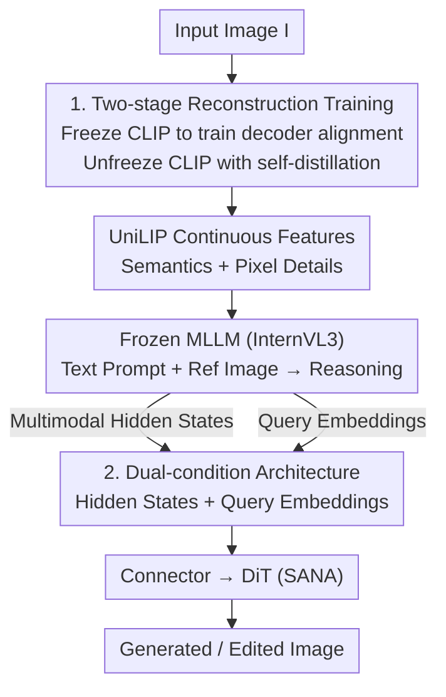

# UniLIP: Revamping CLIP to Unify Multimodal Understanding, Generation, and Editing

**Conference**: ICLR 2026  
**OpenReview**: [https://openreview.net/forum?id=6tx4BGjwJP](https://openreview.net/forum?id=6tx4BGjwJP)  
**Code**: https://github.com/nnnth/UniLIP  
**Area**: Multimodal VLM  
**Keywords**: Unified Multimodal Models, CLIP, Image Reconstruction, Self-distillation, Image Editing

## TL;DR
UniLIP utilizes "two-stage + self-distillation" training to transform CLIP, originally proficient only in understanding, into a unified visual encoder capable of high-fidelity pixel reconstruction while preserving semantic integrity. Coupled with a "multimodal hidden states + query embeddings" dual-condition architecture bridging MLLMs and Diffusion models, the 1B/3B small models outperform larger unified models such as BAGEL (7B) and UniWorld-V1 (12B) on GenEval (0.90), WISE (0.63), and ImgEdit (3.94).

## Background & Motivation
**Background**: Unified multimodal models aim to perform "understanding" and "generation" simultaneously. The mainstream approach for understanding involves aligning semantic encoders like CLIP with LLMs; for generation, it involves either diffusion modeling in VAE latent spaces or autoregressive modeling with VQVAE discrete tokens. These two technical routes are naturally disconnected, leading to the search for a "unified visual tokenizer."

**Limitations of Prior Work**: CLIP features are semantically rich and well-aligned with text, making them optimal for understanding tasks. However, they **lack pixel details**, preventing direct image reconstruction. Existing CLIP-based unified methods struggle to balance "understanding" and "reconstruction": VILA-U / TokenFlow **quantize** CLIP features into discrete tokens, achieving reasonable reconstruction but at the cost of semantic degradation (understanding performance becomes inferior to original CLIP); Emu2 freezes CLIP and trains a separate diffusion decoder to recover images from CLIP features, which preserves semantics but leads to **inconsistent reconstruction** (e.g., incorrect positions or counts of objects), causing failure in editing tasks.

**Key Challenge**: Directly training CLIP for reconstruction leads to **catastrophic forgetting** of understanding capabilities; conversely, relying on external diffusion decoders to "fill in details" leads to mismatches with the original image because CLIP features lack sufficient pixel information. Reconstruction quality and semantic retention form a fundamental trade-off.

**Goal**: (1) Enable CLIP to learn reconstruction without damaging its existing understanding capabilities; (2) Efficiently integrate such a CLIP encoder into generation and editing pipelines, particularly for editing tasks requiring high consistency.

**Key Insight**: The authors conducted a probing experiment: reconstructing images directly from **frozen** CLIP features. Although the results were blurry, they **still recovered basic contours**, suggesting that CLIP harbors latent pixel cues. This implies that instead of forcing details from scratch, one should "locate and amplify" CLIP's existing reconstruction potential.

**Core Idea**: A two-stage training process with self-distillation constraints is used to progressively grant CLIP high-fidelity reconstruction capabilities while locking the semantic distribution (yielding the UniLIP encoder). A dual-condition architecture then feeds both MLLM reasoning results (query embeddings) and contextual details (multimodal hidden states) to a diffusion transformer, preventing information loss during editing.

## Method

### Overall Architecture
UniLIP decouples the goal of "making CLIP understand and draw" into two components. First, **Encoder Revamping**: Through two-stage reconstruction training, InternViT (the CLIP encoder) from InternVL3 is upgraded into the UniLIP encoder, which preserves semantics and allows high-fidelity recovery by a lightweight decoder, secured by self-distillation. Second, **Generation/Editing Pipeline**: Following the "query embedding bridging MLLM and DiT" approach from MetaQuery, it incorporates MLLM multimodal hidden states as an additional condition, forming a dual-condition system to solve information insufficiency in fixed-length queries during editing. The MLLM (InternVL3) remains frozen to preserve understanding performance, while only the connector and DiT (SANA) are trained.

### Key Designs

**1. Two-stage Self-distillation Reconstruction Training: Injecting Pixel Details without Semantic Forgetting**

This design addresses the conflict between CLIP's lack of detail and potential catastrophic forgetting. Structurally, it is an autoencoder: CLIP is paired with a pixel decoder $D_{pix}$, using a projection layer $h_\phi$ for dimension alignment. The reconstruction is defined as $\hat{I} = D_{pix}(h_\phi(\mathrm{CLIP}(I)))$.

Training proceeds in two stages. **Stage One freezes CLIP and only trains the pixel decoder and projection**, with the objective $L_{stage1} = L_{MSE} + L_{LPIPS}$ (pixel reconstruction + LPIPS perceptual loss). During this stage, CLIP remains unchanged; the model mines information from existing features to align the decoder, producing stable though blurry outputs. **Stage Two unfreezes CLIP for joint training** but introduces a self-distillation loss to constrain feature distribution drift:

$$L_{stage2} = L_{MSE} + L_{LPIPS} + \lambda\lVert F_{orig} - F_{ft}\rVert_2^2$$

Where $F_{orig}$ denotes the original (frozen teacher) CLIP features and $F_{ft}$ denotes the fine-tuned features, with $\lambda=1$. The intuition is that CLIP acts as its own teacher, pulling updated features back toward the original distribution, thereby adding details without destroying semantics. The CLIP learning rate is set to 0.1x of the global learning rate to further limit parameter updates.

Effectiveness: "Pre-aligning" the decoder and CLIP in Stage One is critical—otherwise, the mismatch between unfrozen CLIP and randomly initialized projection layers in Stage Two leads to gradient instability. Ablations show that removing the two-stage approach doubles the initial distillation loss spike (0.0939 vs 0.0497), slows convergence by 3x, and slows understanding recovery by 4x. Ultimately, UniLIP significantly leads in reconstruction (rFID 0.31, PSNR 24.62 at 448 resolution, surpassing Emu2's 3.27/13.49) while understanding performance **increases** (Table 1), as the reconstruction task forces the model to capture more image details.

**2. Dual-condition Architecture: Query Embeddings for Reasoning and Hidden States for Details**

With the UniLIP encoder, the generation/editing pipeline follows the DreamLLM / MetaQuery paradigm: using a fixed number of query embeddings to bridge the MLLM and the diffusion transformer. While sufficient for text-to-image generation (where prompts are short and easily compressed), the **bottleneck is the fixed query length** (e.g., 64 in DreamLLM, 256 in MetaQuery). During editing, queries must preserve details from reference images; fixed tokens inevitably lead to information loss and inconsistency.

The dual-condition architecture addresses this by **concatenating MLLM multimodal hidden states with query embeddings** as conditions for DiT cross-attention. This decouples generation/editing into two complementary parts: the MLLM extracts rich context and reasons "what to draw," while the DiT synthesizes the image. The dual-condition ensures **lossless information transfer**, recovering reference details that query embeddings cannot compress. Ablations (Table 7) confirm this division: on WISE (knowledge-driven generation), using queries alone outperforms hidden states alone (0.52 vs 0.47) due to MLLM reasoning; however, in editing, queries alone perform worst (ImgEdit 3.38) as they fail to preserve reference details. The dual-condition achieves the best of both (WISE 0.56, ImgEdit 3.81).

### Loss & Training
Beyond reconstruction training, the unified model follows a **three-stage training** process, keeping the MLLM frozen throughout and only training the connector and DiT: Stage One trains the connector to align MLLM output features with the DiT condition space (generation only); Stage Two trains general generation and editing using large-scale data (connector + DiT); Stage Three uses high-quality instruction data for SFT to enhance fidelity and prompt alignment. Training steps for the three stages are 50k / 200k / 30k respectively, with a batch size of 512 and a cosine decay learning rate of 1e-4 → 1e-5. Versions include UniLIP-1B (InternVL3-1B + SANA-0.6B) and UniLIP-3B (InternVL3-2B + SANA-1.6B), with query count $N=256$ and a 6-layer connector.

## Key Experimental Results

### Main Results

**Reconstruction + Understanding (Replacing InternViT in InternVL3 with UniLIP)**:

| Model | rFID↓ | PSNR↑ | SSIM↑ | MME-P↑ | MMBench↑ | MMVP↑ |
|------|-------|-------|-------|--------|----------|-------|
| Frozen CLIP (InternViT) | 6.14 | 16.26 | 0.572 | 1492 | 72.6 | 67.3 |
| UniLIP | 0.31 | 24.62 | 0.788 | 1499 | 72.6 | 68.7 |

Reconstruction quality improves dramatically while understanding performance remains stable or increases. Compared to other CLIP-based tokenizers, UniLIP (448 res, 32× downsampling) achieves rFID 0.31 / PSNR 24.62, far exceeding Emu2 (3.27 / 13.49).

**Generation and Editing (Small models surpassing large models)**:

| Benchmark | Metric | UniLIP-1B | UniLIP-3B | BAGEL (7B+7B) | UniWorld-V1 (7B+12B) | BLIP3-o-8B |
|------|------|-----------|-----------|--------------|---------------------|-----------|
| GenEval | Overall | 0.88 | **0.90** | 0.82 | - | 0.84 |
| WISE | Overall | 0.56 | **0.63** | 0.52 | - | 0.62 |
| ImgEdit | Overall | 3.81 | **3.94** | 3.20 | 3.26 | - |

The 3B model achieves SOTA across all three benchmarks, with an ImgEdit score of 3.94 significantly outperforming OmniGen2 (3.44) and UniWorld-V1 (3.26).

### Ablation Study

| Configuration | rFID↓ | MME-P↑ | MMBench↑ | Description |
|------|-------|--------|----------|------|
| Direct Fine-tuning | 0.43 | 124 | 0 | Best PSNR but understanding drops to zero |
| +Two-stage +LR Decay (No Distillation) | 0.29 | 709 | 18.4 | Without distillation, MMBench drops 54.2 pts |
| Full UniLIP | 0.31 | 1499 | 72.6 | All strategies; understanding nearly lossless |

| Condition Config | WISE | ImgEdit | Description |
|---------|------|---------|------|
| Hidden States Only | 0.47 | 3.62 | Weak reasoning |
| Query Embeddings Only | 0.52 | 3.38 | Information loss in editing details |
| Dual-condition (Full) | 0.56 | 3.81 | Combines strengths of both |

### Key Findings
- **Self-distillation is the most critical component of reconstruction training**: Removing it causes a 54.2 pt drop on MMBench. Direct fine-tuning achieves the highest PSNR but zero understanding, confirming "catastrophic forgetting."
- **Two-stage training ensures stability**: Pre-aligning the decoder in Stage One allows Stage Two to converge 3x faster and recover understanding 4x faster; single-stage training is unstable due to CLIP/projection mismatches.
- **Division of labor in dual-condition architecture**: Query embeddings facilitate reasoning (benefiting knowledge-based generation like WISE), while hidden states preserve reference details (benefiting editing consistency).
- **UniLIP is superior to VAE as a target encoder**: Table 8 shows that replacing the target image encoder from UniLIP to VAE (DC-AE) drops WISE from 0.56 to 0.48, indicating better prompt alignment with UniLIP.

## Highlights & Insights
- **The probing observation that "pixel cues are already hidden in CLIP" is insightful**: It reframes the problem from "stuffing details into CLIP" to "locating and amplifying existing potential," leading to the two-stage self-distillation design.
- **Self-distillation using the model as its own teacher** to constrain distribution drift is a lightweight yet effective anti-forgetting mechanism, applicable to any scenario where new capabilities are added to pre-trained encoders.
- **The essence of the dual-condition is functional decoupling**: Fixed-length tokens suffice for compressing text but fail for images. This simple insight, overlooked by prior query-based methods, solves editing consistency by adding a hidden state path.
- **Small models surpassing large models** suggests that the bottleneck for unified models is often not parameter count, but whether the visual representation is simultaneously "discriminative and reconstructible."

## Limitations & Future Work
- The paper does not deeply discuss the scalability of the UniLIP encoder at much higher resolutions or complex multi-reference image editing; training data (40M) and compute costs remain high.
- Hyperparameters like $\lambda=1$ and the 0.1x learning rate are empirically determined; their universality across different backbones (non-InternViT) is not fully verified.
- While understanding performance increased, the gain is relatively small (MMVP 67.3 → 68.7); the qualitative explanation for these gains requires more quantitative rigor.
- Editing evaluation is primarily on ImgEdit-Bench; robustness for fine-grained local editing or text-in-image editing warrants further investigation.

## Related Work & Insights
- **vs VILA-U / TokenFlow (Quantized CLIP)**: These discretize CLIP for reconstruction at the cost of information loss and semantic decay (worse than original CLIP); UniLIP uses continuous features and locks semantics via distillation, improving understanding.
- **vs Emu2 (Diffusion Decoder)**: Emu2 freezes CLIP and uses a diffusion decoder to fill details, but since CLIP loses pixel info, the reconstruction is inconsistent; UniLIP enables CLIP to learn reconstruction directly for better consistency.
- **vs MetaQuery / BLIP3-o (Query Bridging)**: These use learnable queries to connect MLLM and DiT but suffer from information bottlenecks in editing; UniLIP's dual-condition adds multimodal hidden states to solve this.
- **vs UniWorld-V1 (SigLIP-Conditioned Editing)**: UniWorld relies on SigLIP for consistency but is limited by resolution and depends on VAE features mismatched with SigLIP; UniLIP uses the same feature set throughout, removing VAE dependencies and resolution constraints.

## Rating
- Novelty: ⭐⭐⭐⭐⭐ "CLIP latent cues discovery + self-distillation for anti-forgetting + dual-condition for consistency" form a cohesive and innovative framework.
- Experimental Thoroughness: ⭐⭐⭐⭐⭐ Comprehensive coverage across reconstruction, understanding, generation, and editing, with clear ablations.
- Writing Quality: ⭐⭐⭐⭐ Strong motivation and diagrams; concise methodology.
- Value: ⭐⭐⭐⭐⭐ 1B/3B models surpassing 7B-12B models provides a reusable direction for "unified visual representations."

<!-- RELATED:START -->

## Related Papers

- [\[ICLR 2026\] MME-Unify: A Comprehensive Benchmark for Unified Multimodal Understanding and Generation Models](mme-unify_a_comprehensive_benchmark_for_unified_multimodal_understanding_and_gen.md)
- [\[ICLR 2026\] Lavida-O: Elastic Large Masked Diffusion Models for Unified Multimodal Understanding and Generation](lavida-o_elastic_large_masked_diffusion_models_for_unified_multimodal_understand.md)
- [\[ICLR 2026\] CLIP-FMoE: Scalable CLIP via Fused Mixture-of-Experts with Enforced Specialization](clip-fmoe_scalable_clip_via_fused_mixture-of-experts_with_enforced_specializatio.md)
- [\[ICLR 2026\] Understanding vs. Generation: Navigating Optimization Dilemma in Multimodal Models](understanding_vs_generation_navigating_optimization_dilemma_in_multimodal_models.md)
- [\[ICLR 2026\] Thinking with Camera: A Unified Multimodal Model for Camera-Centric Understanding and Generation](thinking_with_camera_a_unified_multimodal_model_for_camera-centric_understanding.md)

<!-- RELATED:END -->
